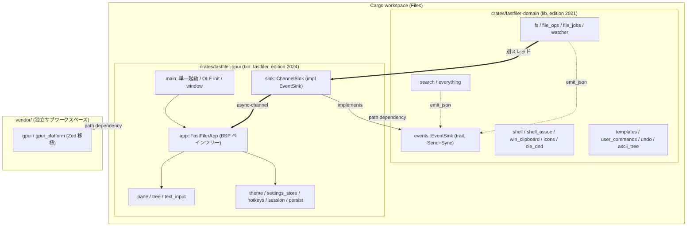

<!-- meta: Overview - what FastFiler is, core identity, scope, non-goals, crate split -->

# 第1章: 概要

## Sources Read
- `README.md` (lines 1-113)
- `CONTEXT.md` (lines 1-99)
- `Cargo.toml` (lines 1-27)
- `rust-toolchain.toml` (lines 1-5)
- `crates/fastfiler-domain/src/lib.rs` (lines 1-35)
- `crates/fastfiler-domain/Cargo.toml` (lines 1-50)
- `crates/fastfiler-gpui/src/main.rs` (lines 1-109)
- `crates/fastfiler-gpui/Cargo.toml` (lines 1-50)
- `crates/fastfiler-domain/src/events.rs` (lines 1-36)
- `crates/fastfiler-gpui/src/sink.rs` (lines 1-34)

---

## 1.1 FastFiler とは何か

FastFiler は、Windows 向けのデスクトップ・ファイルマネージャ (ファイラ) である。
README.md の冒頭は、本プロジェクトを「縦タブ + 任意分割ペイン を備えた Windows 向け高速ファイラ」と定義している [REF: README.md:1-5]。
GUI は Zed エディタが開発した GPUI フレームワークを基盤としており、その GPUI とその依存クレート群はリポジトリ内の `vendor/` に「完全移植・自己完結」の形で取り込まれている [REF: README.md:1-5]。

このプロジェクトの来歴は、README.md の引用ブロックに明記されている [REF: README.md:7-10]。
当初は Tauri 2 + Solid.js で実装されていたが、2026-05 のリファクタで削除された。
その後 floem ベースの実装に移行したものの、タブ/ペインの開閉でメモリが増殖する構造的問題を抱えていた。
最終的に 2026-06 に GPUI へ全面移植され、これが現行実装である (ADR 0012 を参照)。
したがって、現在のコードベースは「GPUI 版」という第三世代の実装にあたる [CONFIDENCE: HIGH]。

開発の動機は README.md に率直に書かれている。
「Windows エクスプローラの遅さに耐えられず AI に作ってもらいました」とあり、速度に対する不満が出発点であったことが分かる [REF: README.md:1-5]。
この「速度」という価値観は、後述する中核アイデンティティの第 2 項として明示的に位置づけられている。

## 1.2 中核アイデンティティと非目標

FastFiler が「何を目指し、何を捨てているか」は、リポジトリ直下の `CONTEXT.md` に集約されている。
README.md からも CONTEXT.md が参照されており、中核アイデンティティの所在として案内されている [REF: README.md:12-23]。

CONTEXT.md は、FastFiler が提供する価値を優先度順に 4 項目で定義する [REF: CONTEXT.md:9-23]。
第 1 は「縦タブ + 任意分割ペイン」であり、多数のフォルダを同時に開いて行き来する作業効率を最重要に置く。
CONTEXT.md はこれを「FastFiler の存在意義の中心」と明言している。
第 2 は「速度」で、`C:\Windows\System32` のような大量ファイルのフォルダでも瞬時に開けることを指す。
これは第 1 を快適に使うための前提条件と位置づけられている。
第 3 は「Windows との深い統合」で、シェル拡張・OLE D&D・既定ハンドラなどによりエクスプローラの置き換えとして機能することを狙う。
第 4 は「拡張性」で、プラグインではなくホットキー・テーマ・ユーザーコマンドの範囲でユーザーが育てられることを指す。

重要なのは、この優先順位が「機能取捨選択の判断軸」として明示的に使われている点である [REF: CONTEXT.md:9-23]。
たとえば「クイックアクセス (お気に入り)」がタブで代替可能なら採用しない、といった判断がこの軸から導かれると CONTEXT.md は述べる。
README.md の「中核アイデンティティ」節も同じ 4 項目を要約して列挙しており、両文書の整合が取れている [REF: README.md:12-23]。

非目標 (やらないこと) も明確である。
README.md は「写真整理用ファイラやプラグイン基盤ではありません」と断言し、何を持たないかの根拠を `doc/adr/` に委ねている [REF: README.md:12-23]。
拡張点はあくまで 3 軸に限定されている。
CONTEXT.md の「拡張点」節は、(1) ユーザーコマンド (`%APPDATA%\FastFiler\commands\commands.json`)、(2) (将来の) シェル統合、(3) テーマ/ホットキー/アイコンセット/フォント、の 3 つだけを入口とし、「アプリ内 JavaScript/WASM プラグイン機構は持たない」と明記する [REF: CONTEXT.md:90-98]。
この「持たない」判断は ADR 0003 に紐づけられている [CONFIDENCE: HIGH]。

ドメイン層のソースコード自体にも、この非目標の痕跡が残っている。
`crates/fastfiler-domain/src/lib.rs` のモジュールドキュメントは、末尾に「不採用モジュール (削除済)」として、プラグイン機構 (ADR 0003)・内蔵ターミナル (ADR 0004)・サムネイル/プレビュー (ADR 0005) を列挙している [REF: crates/fastfiler-domain/src/lib.rs:12-15]。
つまり「捨てた機能」がコメントとして意図的に保全されており、過去に検討されたが ADR で却下されたことが追跡できるようになっている [CONFIDENCE: HIGH]。

## 1.3 ワークスペース構成 (2クレート + vendor)

FastFiler は Cargo のワークスペースとして構成される。
ルートの `Cargo.toml` は resolver "2" を使い、メンバーとして `crates/fastfiler-domain` と `crates/fastfiler-gpui` の 2 つだけを列挙する [REF: Cargo.toml:1-10]。
注目すべきは `exclude` に `vendor` が指定されている点で、コメントは「GPUI の vendor は独立サブワークスペース。main workspace のメンバーにはしない」と説明する [REF: Cargo.toml:1-10]。
つまり vendor 配下の GPUI クレート群は別ワークスペースとして扱われ、本体の 2 クレートとはビルド単位が分離されている [CONFIDENCE: HIGH]。

README.md の「ディレクトリ構成」節は、この三層構造を図示している [REF: README.md:42-56]。
ルート直下に workspace の `Cargo.toml`、中核アイデンティティの `CONTEXT.md`、ツールチェイン固定の `rust-toolchain.toml` が並ぶ。
`crates/` の下に「OS/ファイル操作ライブラリ (GUI 非依存)」である `fastfiler-domain` と「GPUI GUI バイナリ」である `fastfiler-gpui` が置かれる。
`vendor/` には「GPUI とその依存 18 クレート (zed から完全移植・自己完結)」が置かれ、`doc/` にドキュメントが集約される [REF: README.md:42-56]。

この 2 クレート分割は、本仕様書全体を貫く最も基本的なアーキテクチャ境界である。
一方の `fastfiler-domain` は GUI に一切依存しないロジック層であり、もう一方の `fastfiler-gpui` がそのロジックを GPUI の上で可視化・操作可能にするフロントエンドである。
依存方向は一方向で、`fastfiler-gpui` が `fastfiler-domain` を取り込む (逆はない) [REF: crates/fastfiler-gpui/Cargo.toml:22-23]。

実際の `crates/` ディレクトリにも `fastfiler-domain/` と `fastfiler-gpui/` の 2 つだけが存在することを確認した [CONFIDENCE: HIGH]。
GUI クレートの `src/` には app.rs / hotkeys.rs / main.rs / pane.rs / persist.rs / session.rs / settings_store.rs / sink.rs / text_input.rs / theme.rs / tree.rs / win32_single_instance.rs の 12 モジュールが置かれている [ASSUMED: ディレクトリ一覧の観測に基づく。各モジュールの責務は後続章で詳述する]。

```
fastfiler/
├ Cargo.toml             # workspace
├ CONTEXT.md             # 中核アイデンティティ + 用語
├ rust-toolchain.toml    # 1.95.0 (GPUI 要求)
├ crates/
│  ├ fastfiler-domain/   # OS/ファイル操作ライブラリ (GUI 非依存)
│  └ fastfiler-gpui/     # GPUI GUI バイナリ
├ vendor/                # GPUI とその依存 18 クレート (zed から完全移植・自己完結)
└ doc/                   # ドキュメント (案内は doc/README.md)
```

## 1.4 ドメイン層 — fastfiler-domain クレート

`fastfiler-domain` は GUI 非依存のロジック層である。
そのクレートルート `lib.rs` は、ファイル冒頭のモジュールドキュメントで自らの役割を「FastFiler のドメインロジック (GUI 非依存)」と宣言している [REF: crates/fastfiler-domain/src/lib.rs:1-11]。
さらに公開モジュールを機能グループごとに整理して列挙しており、このコメントだけでドメイン層の全体像がつかめるようになっている。

ドキュメントが挙げる機能グループは以下の通りである [REF: crates/fastfiler-domain/src/lib.rs:1-11]。
`error` / `events` は共通エラー型と event sink 抽象。
`fs` / `file_ops` / `file_jobs` / `watcher` はファイルシステム操作。
`search` / `everything` は検索 (内蔵 + Everything HTTP 連携)。
`shell` / `shell_assoc` / `win_clipboard` / `icons` は Windows シェル統合。
`templates` / `user_commands` は新規ファイルテンプレートとユーザーコマンド。
`undo` は in-memory の Undo スタック (ADR 0006/0008)。
`ascii_tree` は選択フォルダの構造を ASCII (ボックス罫線) 文字列へ変換するユーティリティである。

これらは `lib.rs` の `pub mod` 宣言とも一致する。
ファイル後半では ascii_tree / error / events / everything / file_jobs / file_ops / fs / icons / ole_dnd / path_util / search / shell / shell_assoc / templates / undo / user_commands / watcher / win_clipboard の 18 モジュールが公開されている [REF: crates/fastfiler-domain/src/lib.rs:17-34]。
注意点として、ドキュメントコメントには `ole_dnd` と `path_util` が明示的に列挙されていないが、`pub mod` 宣言には存在する [CONFIDENCE: HIGH]。
この差分は、ドキュメント記述がモジュール追加に少し遅れている可能性を示唆する [ASK SME: ole_dnd / path_util がドキュメント列挙から漏れているのは意図的か、それとも更新漏れか]。

```rust
pub mod ascii_tree;
pub mod error;
pub mod events;
pub mod everything;
pub mod file_jobs;
pub mod file_ops;
pub mod fs;
pub mod icons;
pub mod ole_dnd;
pub mod path_util;
pub mod search;
pub mod shell;
pub mod shell_assoc;
pub mod templates;
pub mod undo;
pub mod user_commands;
pub mod watcher;
pub mod win_clipboard;
```

`lib.rs` には関数や構造体は定義されておらず、純粋にモジュールを束ねるクレートルートである。
ドメインロジックの実体は各サブモジュールに分散しており、それらは本仕様書の第4章〜第6章で詳細に扱う。
本章ではこのモジュール構成図が「ドメイン層の目次」であることを押さえれば十分である [CONFIDENCE: HIGH]。

## 1.5 GUI 層 — fastfiler-gpui クレート

`fastfiler-gpui` は GPUI ベースの GUI バイナリである。
そのマニフェスト `Cargo.toml` は package 名を `fastfiler-gpui` とするが、`[[bin]]` セクションで実際の実行ファイル名を `fastfiler` に上書きしている [REF: crates/fastfiler-gpui/Cargo.toml:1-13]。
コメントは「配布物の exe 名 (パッケージ名は fastfiler-gpui のまま)」と説明しており、ビルド成果物は `fastfiler.exe` になる [REF: crates/fastfiler-gpui/Cargo.toml:10-13]。
この package 名と bin 名の使い分けは、`cargo` のパッケージ識別子 (`-p fastfiler-gpui`) と最終的な実行ファイル名 (`fastfiler.exe`) を別々に管理するための定石である。

```toml
[[bin]]
# 配布物の exe 名 (パッケージ名は fastfiler-gpui のまま)。
name = "fastfiler"
path = "src/main.rs"
```

エントリポイントは `src/main.rs` である。
README.md のビルド手順も `cargo build -p fastfiler-gpui --release` の後に `.\target\release\fastfiler.exe` を起動する形になっており、この命名と整合する [REF: README.md:58-65]。

`main.rs` は、クレート内のモジュール構成も宣言している。
冒頭で app / hotkeys / pane / persist / session / settings_store / sink / text_input / theme / tree の各モジュールを宣言し、Windows 限定で `win32_single_instance` を追加する [REF: crates/fastfiler-gpui/src/main.rs:8-19]。
これらが GUI 層の構成要素であり、後続の第7章〜第10章でそれぞれ詳述される。
おおまかには、app がアプリシェルとペインツリー (BSP) の管理、pane が個々のファイル一覧ペイン、tree がワークスペースツリー、text_input が IME 対応テキスト入力、theme/settings_store/hotkeys が設定系、session/persist が状態の永続化、sink が後述するドメインイベントの橋渡しを担う [ASSUMED: モジュール名と main.rs / sink.rs のコメントからの推定。詳細責務は各章で確認する]。

GUI バイナリらしい配慮として、リリースビルドではコンソールウィンドウを抑止している。
`main.rs` 冒頭の属性 `#![cfg_attr(not(debug_assertions), windows_subsystem = "windows")]` がそれで、デバッグビルドではコンソールを残し、リリースでは GUI サブシステムとしてリンクする [REF: crates/fastfiler-gpui/src/main.rs:5-6]。

## 1.6 起動シーケンス — main の流れ

`main` 関数は、アプリ起動時の初期化手順を素直に並べている [REF: crates/fastfiler-gpui/src/main.rs:28-36]。
最初に行うのは多重起動防止である。
Windows 限定のブロックで `win32_single_instance::acquire_single_instance()` を呼び、取得に失敗 (= 既に起動中) なら `activate_existing_window()` で既存ウィンドウを前面化して静かに `return` する [REF: crates/fastfiler-gpui/src/main.rs:28-36]。
これにより、FastFiler のインスタンスは常に 1 つだけになる [CONFIDENCE: HIGH]。

次に `hotkeys::load()` でホットキー設定を読み込む (なければ既定値で生成する) [REF: crates/fastfiler-gpui/src/main.rs:38-39]。
続いて Windows 限定で `fastfiler_domain::ole_dnd::init_ole()` を呼び、OLE ドラッグ&ドロップ送信を UI スレッドで初期化する [REF: crates/fastfiler-gpui/src/main.rs:41-43]。
コメントは「gpui 側で初期化済みでも参照カウントで安全」と注記しており、二重 OLE 初期化に対する防御が意識されている。

その後、`application().run(...)` に渡したクロージャの中で本格的な UI 構築が始まる [REF: crates/fastfiler-gpui/src/main.rs:45-47]。
このクロージャは `gpui` の `App` を受け取り、まず `text_input::bind_keys(cx)` でテキスト入力コンテキスト限定のキーバインドを登録する。
次に `session::load()` で前回セッション (タブ / 分割構成 / ウィンドウ位置) を読み込み、`settings_store::load()` で設定 (テーマ等) を読み込む [REF: crates/fastfiler-gpui/src/main.rs:49-71]。
テーマ解決の順序にも工夫がある。
`theme::load_user_themes()` を先に呼んでユーザーテーマ (themes/*.json) を読み込み、その後で保存済みテーマ名を `set_by_name` で解決する。
これは「保存済みテーマ名がユーザーテーマでも解決できるように」するためだとコメントが説明している [REF: crates/fastfiler-gpui/src/main.rs:49-71]。
旧 `session.theme` から設定ファイルへの移行 (マイグレーション) もここで吸収しており、フォントサイズやスタイルもキャッシュへ反映される。

最後にウィンドウを開く。
保存済みのウィンドウ位置を復元するが、幅 400 / 高さ 300 未満は無効としてフィルタし、無効ならセンタリングした 1000x660 を既定とする [REF: crates/fastfiler-gpui/src/main.rs:73-87]。
最大化状態で終了していた場合は `WindowBounds::Maximized` で復元する。
`cx.open_window(...)` のタイトルは `"FastFiler"` に設定されており、コメントは「多重起動防止の FindWindowW (\"FastFiler\") とも対応」と注記する [REF: crates/fastfiler-gpui/src/main.rs:88-106]。
つまりタイトル文字列が単なる表示名ではなく、多重起動検知のキーとしても機能している点は見落とせない [CONFIDENCE: HIGH]。
ウィンドウのルートビューは、保存セッションがあれば `FastFilerApp::from_session(data, cx)`、なければ `FastFilerApp::new(default_start(), cx)` で生成され、最後に `cx.activate(true)` で前面化する [REF: crates/fastfiler-gpui/src/main.rs:88-106]。

セッションの保存先は README.md に明記されている。
タブ / 分割構成 / ウィンドウ位置はセッション保存され、次回起動時に `%APPDATA%\FastFiler\gpui_session.json` から復元される [REF: README.md:85-87]。

## 1.7 技術スタックと依存関係

FastFiler のビルドは Rust ツールチェインを 1.95.0 に固定している。
`rust-toolchain.toml` は channel を "1.95.0" とし、その理由を「GPUI (Zed) は Rust 1.95.0 / edition 2024 を要求するため固定」と説明する [REF: rust-toolchain.toml:1-5]。
このコメントは旧 floem 版 (edition 2021) も同じ 1.95.0 でビルド可能だったことも記録している [CONFIDENCE: HIGH]。

興味深いのは、2 つのクレートで edition が異なる点である。
`fastfiler-gpui` は `edition = "2024"` を使う [REF: crates/fastfiler-gpui/Cargo.toml:1-8]。
一方 `fastfiler-domain` は `edition = "2021"` で、さらに `rust-version = "1.77"` を宣言している [REF: crates/fastfiler-domain/Cargo.toml:1-8]。
ドメイン層は GUI から切り離されているため、より古い Rust でもコンパイル可能な水準を保っている [ASSUMED: edition/rust-version 差はドメイン層の移植性を意図したものと推定]。
domain クレートの description には「FastFiler の Tauri 非依存ドメインロジック (Phase 2B 段階移行中)」とあり、Tauri 時代からの段階移行の名残が残っている [REF: crates/fastfiler-domain/Cargo.toml:1-8] [ASK SME: "Phase 2B 段階移行中" は現状でも有効な記述か、GPUI 移行完了後の更新漏れか]。

ドメイン層の主要な外部依存は `fastfiler-domain/Cargo.toml` に列挙されている [REF: crates/fastfiler-domain/Cargo.toml:10-22]。
シリアライズに serde / serde_json、エラー定義に thiserror、遅延初期化に once_cell、ロックに parking_lot、LRU キャッシュに lru。
画像処理は image クレートを `default-features = false` で PNG のみ有効化 (アイコンの PNG 化用)。
ファイル監視に notify、ディレクトリ走査に ignore、パターンマッチに regex。
HTTP クライアントは ureq を `default-features = false` + json で使い、これは後述の Everything 連携に使われる。
URL エンコードに urlencoding を使う。
これら依存の選択は、ドメイン層が「ファイル操作・検索・監視・アイコン取得・外部検索エンジン連携」を担うことを裏づけている [CONFIDENCE: HIGH]。

Windows 固有の依存も大きい。
`fastfiler-domain` は `cfg(windows)` ターゲットで winreg (レジストリ) と windows クレート 0.58 を多数の feature 付きで使う [REF: crates/fastfiler-domain/Cargo.toml:27-49]。
有効化される feature には Win32_UI_Shell、Win32_System_Com、Win32_System_Ole、Win32_System_DataExchange、Win32_Storage_FileSystem、Win32_NetworkManagement_WNet、Win32_Graphics_Gdi などが含まれる。
これらは中核アイデンティティ第 3 項「Windows との深い統合」(シェルメニュー・OLE D&D・クリップボード・アイコン・UNC) を実装するための基盤である [CONFIDENCE: HIGH]。

GUI 層の依存は GPUI 中心である [REF: crates/fastfiler-gpui/Cargo.toml:15-23]。
`gpui` と `gpui_platform` を `vendor/crates/` 配下のパス依存として取り込み、コメントは「GPUI は Files 内 vendor/ に完全移植 (zed フォルダは参照しない)」と明記する。
同じく `fastfiler-domain` をパス依存で取り込み、「GUI 非依存のロジック層をそのまま流用」している [REF: crates/fastfiler-gpui/Cargo.toml:15-23]。
さらに async-channel 2.5 (ドメインイベントの橋渡しチャネル)、serde / serde_json、書記素境界処理用の unicode-segmentation、HWND 取得用の raw-window-handle 0.6 を使う [REF: crates/fastfiler-gpui/Cargo.toml:25-35]。
Windows 限定では windows クレート 0.61 を Win32_Foundation / Win32_System_Threading / Win32_UI_WindowsAndMessaging 等の feature で使い (多重起動防止・OLE 補助)、ビルド依存として exe アイコン埋め込み用の embed-resource 2 を持つ [REF: crates/fastfiler-gpui/Cargo.toml:38-49]。

ここで注意したいバージョン差がある。
domain は windows 0.58、gpui は windows 0.61 を使っており、2 クレートで windows クレートのメジャーバージョンが異なる [REF: crates/fastfiler-domain/Cargo.toml:27-49] [REF: crates/fastfiler-gpui/Cargo.toml:38-45]。
これは依存グラフ上で windows クレートが 2 系統コンパイルされることを意味する [CONFIDENCE: MED] [ASK SME: domain と gpui で windows のバージョン (0.58 / 0.61) を分けているのは意図的か、統一予定か]。

リリースプロファイルも `Cargo.toml` で最適化されている。
`[profile.release]` は `panic = "abort"`、`codegen-units = 1`、`lto = true`、`opt-level = "s"` (サイズ最適化)、`strip = true` を指定する [REF: Cargo.toml:12-19]。
コメントは「メモリ増殖は GPUI 移植で構造的に解決したため strip を復帰」と注記しており、旧 floem 版ではメモリ調査のため strip=false / debug=1 にしていた経緯が記録されている [REF: Cargo.toml:12-19]。
さらに `[patch.crates-io]` で async-task を移植元 (Zed) と同じ git fork の特定 rev に固定している [REF: Cargo.toml:25-26]。
このパッチはビルドルートで適用され、vendor 内の gpui にも及ぶとコメントが説明する [CONFIDENCE: HIGH]。

## 1.8 ドメイン層と GUI 層の橋渡し

2 クレートをどう繋ぐかが、本アーキテクチャの要である。
ドメイン層は GUI を知らないため、長時間タスク (検索・ファイルジョブ・ファイル監視) の進捗を直接 UI に書き込むことはできない。
その代わりにドメイン層は `EventSink` というトレイト抽象を提供する [REF: crates/fastfiler-domain/src/events.rs:7-12]。
`EventSink` は `Send + Sync` を要求し、唯一のメソッド `emit_json(&self, event: &str, payload: serde_json::Value)` を持つ。
`Send + Sync` を課す理由は、コメント曰く「長時間タスク (検索・ファイルジョブ) が別スレッドから sink を呼ぶため」である [REF: crates/fastfiler-domain/src/events.rs:7-12]。
この抽象が、ドメイン層が「誰に向かって」イベントを出すかを知らずに済む鍵になっている。

```rust
pub trait EventSink: Send + Sync {
    fn emit_json(&self, event: &str, payload: serde_json::Value);
}
```

events.rs はさらに 2 つの便宜を提供する。
任意のクロージャ `F: Fn(&str, serde_json::Value) + Send + Sync` に対して `EventSink` をブランケット実装しており、関数をそのまま sink として渡せる [REF: crates/fastfiler-domain/src/events.rs:14-21]。
また `emit<T: Serialize>` ヘルパは任意の Serialize 値を JSON へ変換して emit する [REF: crates/fastfiler-domain/src/events.rs:23-28]。
テスト・旧 floem 版用の no-op 実装として `NullSink` も用意されている [REF: crates/fastfiler-domain/src/events.rs:30-35]。

GUI 側は、この `EventSink` を `async-channel` の送信端で実装する。
それが `crates/fastfiler-gpui/src/sink.rs` の `ChannelSink` である [REF: crates/fastfiler-gpui/src/sink.rs:16-26]。
UI へ届くイベントは `type DomainEvent = (String, serde_json::Value)` という (イベント名, JSON ペイロード) のタプルで表される [REF: crates/fastfiler-gpui/src/sink.rs:10-13]。
`ChannelSink::new()` は `async_channel::unbounded()` を作り、送信端を包んだ自身と受信端を返す。
`impl EventSink for ChannelSink` は `emit_json` で `try_send` を呼び、受信側が閉じていても (= ペインを閉じた後の遅延イベント) 結果を捨てて無視する [REF: crates/fastfiler-gpui/src/sink.rs:28-33]。

この設計の狙いは sink.rs のモジュールドキュメントに書かれている [REF: crates/fastfiler-gpui/src/sink.rs:1-9]。
watcher / 検索 / ファイルジョブ等が別スレッドから emit したイベントを async-channel に流し、UI 側の `cx.spawn` ループが受けて `Entity` を更新する。
さらに「リーク防止の要」として、送信端を `PaneView` と watcher 登録が保持し、`PaneView` が drop されると両方が落ちてチャネルが閉じ、受信ループが自然終了する仕組みが説明されている。
これは旧 floem 版の `create_signal_from_channel` のようにスレッド/シグナルが残り続ける問題への、構造的な対処であると明記されている [REF: crates/fastfiler-gpui/src/sink.rs:1-9] [CONFIDENCE: HIGH]。
README.md が言及するメモリ問題の構造的解決 (`PANES_ALIVE` がベースラインに戻る) は、この sink/チャネル設計と表裏一体である [REF: README.md:88-94] [CONFIDENCE: MED]。

以下に、2 クレートと橋渡しの関係を図示する。



この図が示すように、依存方向の矢印 (`GUI --> DOMAIN`、`GUI --> GPUI`) は一方向であり、ドメイン層は GUI や GPUI を知らない。
別スレッドで動くファイル操作・検索・監視は `EventSink::emit_json` を通じてイベントを発行し、その実体である `ChannelSink` が async-channel に流し、UI スレッドの `FastFilerApp` 側が受け取る [CONFIDENCE: HIGH]。

## 1.9 ライセンスと vendor の位置づけ

FastFiler は GPL-3.0-or-later で配布される。
README.md は、その理由を「GUI に Zed の GPUI フレームワークとその依存クレート群を vendor/ に取り込んで利用しているため」と説明する [REF: README.md:95-112]。
取り込んだクレートのうち、gpui / gpui_platform / collections / util などは Apache-2.0 だが、zlog / ztracing が GPL-3.0-or-later であり、「GPL クレートをリンクした成果物全体が GPL-3.0 になる」とされる [REF: README.md:95-112]。
この事情は両クレートの `Cargo.toml` にも反映されている。
`fastfiler-gpui` と `fastfiler-domain` のいずれも `license = "GPL-3.0-or-later"` を宣言し、コメントは「GPL クレート (vendor/crates/{zlog,ztracing}) をリンクするため成果物全体が GPL-3.0」と注記する [REF: crates/fastfiler-gpui/Cargo.toml:7-8] [REF: crates/fastfiler-domain/Cargo.toml:7-8]。

README.md は最後に、FastFiler が Zed Industries とは無関係・非公式のプロジェクトであることを強調している [REF: README.md:95-112]。
GPUI フレームワークを利用しているだけであり、開発・承認・支援を受けたものではない、と明記される [CONFIDENCE: HIGH]。

なお、両クレートの `publish` 設定には差がある。
`fastfiler-gpui` は `publish = false` を明示する [REF: crates/fastfiler-gpui/Cargo.toml:1-8]。
`fastfiler-domain` の `Cargo.toml` には publish の明示がなく、デフォルト挙動になっている [REF: crates/fastfiler-domain/Cargo.toml:1-8] [ASK SME: domain クレートを将来 crates.io へ publish する想定があるか、それとも publish=false の付け忘れか]。

## 1.10 ドキュメント体系と操作モデル

FastFiler は、仕様や意思決定をコードの外に体系立てて記録している。
README.md の「ドキュメント」節は、各文書の役割を一覧化している [REF: README.md:25-40]。
中核アイデンティティと用語は CONTEXT.md、doc フォルダの案内と実装状況サマリは doc/README.md に置かれる。
使い方ガイドは doc/USAGE.md、テーマのカスタマイズは doc/THEMES.md、ユーザーコマンドの書き方は doc/COMMANDS.md、ホットキーは doc/HOTKEYS.md が担う。
クレート構成・状態モデル・拡張ポイントの詳細は doc/ARCHITECTURE.md、ビルド/開発/リリース手順は doc/BUILD.md にまとまる [REF: README.md:25-40]。
特筆すべきは doc/adr/ の存在で、README は「何を捨てたか・なぜか」を記録する場として ADR を位置づけている。
本仕様書が随所で参照する ADR 番号 (0001〜0012 など) は、この doc/adr/ 配下の意思決定記録に対応する [CONFIDENCE: HIGH]。

ビルドと起動の手順も README に明示されている。
リリースビルドは `cargo build -p fastfiler-gpui --release` で行い、生成された `.\target\release\fastfiler.exe` を起動する [REF: README.md:58-65]。
開発時は `cargo run -p fastfiler-gpui` を使う。
これらのコマンドは、ワークスペースのメンバー名 (`fastfiler-gpui`) と bin 名 (`fastfiler`) の使い分けと整合している。

操作モデルの概観も、本章の文脈として押さえておく価値がある。
README の「GPUI 版の主な操作」表は、タブの追加/切替/閉じる、ペインの分割/閉じる、ペイン境界やツリー幅のドラッグリサイズ、F6 でのフォーカスペイン巡回などを列挙する [REF: README.md:67-87]。
選択は単一クリック・Ctrl+クリック・Shift+クリック・Shift+矢印・Ctrl+A、開く/親へ/更新は Enter/Backspace/F5、リネーム/新フォルダ/新ファイルは F2/F7/F8 (IME 対応入力) に割り当てられている。
コピー/切り取り/貼り付けは Ctrl+C/X/V でエクスプローラと相互運用し、削除はごみ箱送り、検索は Ctrl+F (Everything 連携)、元に戻すは Ctrl+Z (リネーム・ごみ箱送り) である [REF: README.md:67-87]。
これらの操作が、ドメイン層の file_ops / search / undo / win_clipboard と GUI 層の pane / tree / text_input にどう対応づくかは、第4章以降で具体的に追跡する [CONFIDENCE: MED]。

## 1.11 本章のまとめ

本章では FastFiler の全体像を、コードと設定ファイルに即して確認した。
要点は次の通りである。

第 1 に、FastFiler は Windows 向けの高速ファイラであり、「縦タブ + 任意分割ペイン」「速度」「Windows 統合」「(限定的な) 拡張性」の 4 軸を優先度順に掲げる [REF: CONTEXT.md:9-23]。
第 2 に、プラグイン基盤・写真整理・内蔵ターミナル・サムネイルといった機能は ADR で意図的に却下されており、その痕跡はコードコメントにも残っている [REF: crates/fastfiler-domain/src/lib.rs:12-15]。
第 3 に、実装は GUI 非依存の `fastfiler-domain` ライブラリと、GPUI ベースの `fastfiler-gpui` バイナリ (exe 名は fastfiler) の 2 クレートに分割され、vendor の GPUI は独立サブワークスペースとして分離されている [REF: Cargo.toml:1-10]。
第 4 に、2 クレートは `EventSink` トレイトと `ChannelSink` (async-channel) を介して疎結合に橋渡しされ、これがメモリリーク問題の構造的解決の核でもある [REF: crates/fastfiler-gpui/src/sink.rs:1-9]。
第 5 に、ツールチェインは GPUI の要求により 1.95.0 / edition 2024 に固定され、成果物は vendor の GPL クレートの影響で GPL-3.0-or-later となる [REF: rust-toolchain.toml:1-5] [REF: README.md:95-112]。

これらの境界とポリシーは、以降の各章 (アーキテクチャ・状態モデル・ドメイン各層・GUI 各層・テーマ/設定) を読む際の前提となる。

<!-- DETAIL_QUESTIONS
- 1. `lib.rs` のモジュールドキュメント (12-15行の不採用一覧やモジュール列挙) に `ole_dnd` と `path_util` が記載されていないのは、ドキュメント更新漏れか、それとも内部実装扱いで意図的に省いているのか。
- 2. `fastfiler-domain` の Cargo.toml description にある「Tauri 非依存ドメインロジック (Phase 2B 段階移行中)」は現状でも有効か。GPUI 全面移行完了後も "段階移行中" のままなのは更新漏れではないか。
- 3. domain は windows クレート 0.58、gpui は 0.61 と分かれているが、これは意図的な分離か、将来統一する予定か。重複コンパイルのコスト/バイナリサイズへの影響は許容されているのか。
- 4. CONTEXT.md は share ノードの永続化先を `settings.ron` と記すが、README.md はセッション保存先を `gpui_session.json` と記す。設定の永続化形式は RON と JSON が混在しているのか、CONTEXT.md の記述が旧実装由来なのか。
- 5. `fastfiler-domain` に publish 指定がない (gpui は publish=false) のは、ドメイン層を将来 crates.io 公開する想定があるためか、単なる付け忘れか。
- 6. `events.rs` のモジュールドキュメントは「Tauri アダプタ (tauri_sink) は src-tauri 側に存在する」と書くが、Tauri 実装は削除済みのはず。この記述は現存しない参照を指していないか (デッドコメント)。
-->
