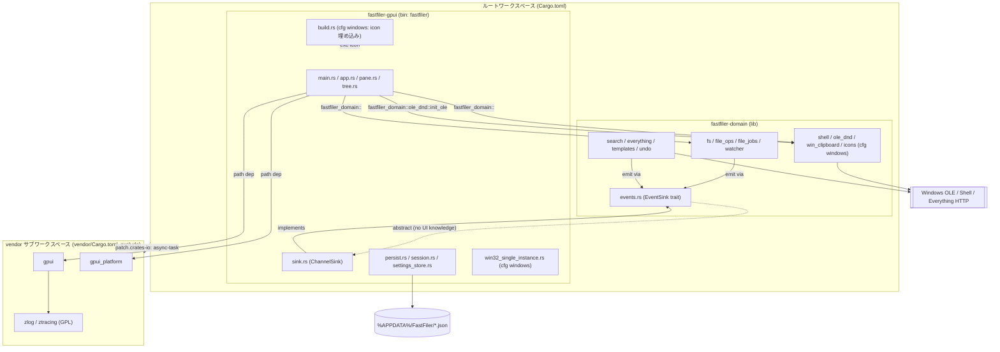

<!-- meta: Architecture - workspace/crate structure, domain/gui boundary, vendored GPUI, build -->

# 第2章: アーキテクチャ

## Sources Read
- `Cargo.toml` (lines 1-26)
- `crates/fastfiler-domain/Cargo.toml` (lines 1-50)
- `crates/fastfiler-gpui/Cargo.toml` (lines 1-50)
- `crates/fastfiler-gpui/build.rs` (lines 1-10)
- `crates/fastfiler-domain/src/lib.rs` (lines 1-35)
- `crates/fastfiler-gpui/src/main.rs` (lines 1-108)
- `crates/fastfiler-domain/src/events.rs` (lines 1-35)
- `crates/fastfiler-gpui/src/sink.rs` (lines 1-33)
- `crates/fastfiler-gpui/src/app.rs` (lines 1-34)
- `crates/fastfiler-gpui/src/session.rs` (lines 1-60)
- `crates/fastfiler-gpui/src/persist.rs` (lines 1-45)
- `crates/fastfiler-gpui/src/settings_store.rs` (lines 1-40)
- `crates/fastfiler-gpui/src/win32_single_instance.rs` (lines 1-40)
- `vendor/Cargo.toml` (lines 1-28)
- `rust-toolchain.toml` (lines 1-6)
- `README.md` (lines 42-56)

---

## 2.1 この章の狙い

この章は FastFiler の「骨格」を扱う。
個々の機能ではなく、コードがどの単位に分割され、それぞれがどの方向に依存しているかを明らかにする。
具体的には、Cargo ワークスペースの層構造、ドメインライブラリと GUI フロントエンドという二つのメンバークレートの境界、そこへ取り込まれた GPUI ベンダーの位置づけ、ビルドスクリプトの役割、そして GPUI アプリの起動経路を、実際のマニフェストとソースから跡づける。

FastFiler は単一の巨大バイナリではない。
リポジトリのルートには三つの「ワークスペース的なまとまり」が存在する。
第一にプロジェクト本体のワークスペース、第二にそのメンバーである二つのアプリクレート、第三に `vendor/` 配下に切り離された GPUI 用のサブワークスペースである。
この三層を取り違えると依存関係やビルドの理解が崩れるため、まずそこから整理する。

---

## 2.2 ルートワークスペースの構成

ルートの `Cargo.toml` は仮想ワークスペース（`[package]` を持たないワークスペース専用マニフェスト）である。
メンバーは二つだけで、`crates/fastfiler-domain` と `crates/fastfiler-gpui` が登録されている [REF: Cargo.toml:1-10]。
注目すべきは `exclude` に `vendor` が明示されている点で、`vendor/` 配下の GPUI クレート群はこのワークスペースのメンバーには含めない、と意図的に宣言している [REF: Cargo.toml:7-10]。
コメントは「GPUI の vendor は独立サブワークスペース。main workspace のメンバーにはしない」と述べており、この分離は事故ではなく設計上の決定である。

リリースプロファイルはバイナリサイズと実行性能に強く振った設定になっている。
`panic = "abort"`、`codegen-units = 1`、`lto = true`、`opt-level = "s"`、`strip = true` が並ぶ [REF: Cargo.toml:12-19]。
`opt-level = "s"` はサイズ最適化、`lto` と `codegen-units = 1` はリンク時最適化を効かせるための組み合わせである。
コメントによれば `strip = true` は一度外されていたが、メモリ増殖の問題が GPUI 移植で構造的に解決したため復帰した、という経緯が記録されている [REF: Cargo.toml:17-19]。
この一文は、旧 floem 版の調査のためにデバッグ情報を残していた時期があったことを示す歴史的痕跡でもある。

ルートマニフェストにはもう一つ重要な要素がある。
`[patch.crates-io]` で `async-task` を smol-rs の git fork の特定リビジョンに固定している [REF: Cargo.toml:25-26]。
コメントは、このパッチがビルドルート（本ワークスペース）で適用され、`vendor/` 内の GPUI にも波及することを明記している [REF: Cargo.toml:21-24]。
つまり依存解決のうえでは、ルートワークスペースが vendor の GPUI を従えてビルドする一枚岩のグラフを形成し、その共通の `async-task` バージョンをルートのパッチが揃える、という関係になっている。
`notify` / `livekit` / `calloop` などはこのアプリのグラフに現れないため、パッチ対象は `async-task` 一つに絞られている、とコメントは説明する。

ここまでの要点（メンバー二つ・`vendor` 除外・サイズ最適化プロファイル・単一パッチ）は、ルートマニフェストそのものを読むと一望できる [REF: Cargo.toml:1-26]。

```toml
[workspace]
resolver = "2"
members = [
    "crates/fastfiler-domain",
    "crates/fastfiler-gpui",
]
exclude = [
    # GPUI の vendor は独立サブワークスペース。main workspace のメンバーにはしない。
    "vendor",
]

[profile.release]
panic = "abort"
codegen-units = 1
lto = true
opt-level = "s"
strip = true

# vendor/ の gpui が直接使う async-task を、移植元と同じ git fork に固定する。
[patch.crates-io]
async-task = { git = "https://github.com/smol-rs/async-task.git", rev = "b4486cd71e4e94fbda54ce6302444de14f4d190e" }
```

`members` が二つ、`exclude` に `vendor`、`[profile.release]` がサイズ・性能寄り、`[patch.crates-io]` が `async-task` 一点という構造が、このわずか 26 行に凝縮されている。

---

## 2.3 二つのメンバークレートと役割分担

メンバーは機能で切られているのではなく、「GUI に依存するか否か」という軸で切られている。

`fastfiler-domain` は GUI 非依存のドメインロジックを担うライブラリクレートである。
マニフェストの `description` は「FastFiler の Tauri 非依存ドメインロジック（Phase 2B 段階移行中）」と説明している [REF: crates/fastfiler-domain/Cargo.toml:1-6]。
edition は 2021、`rust-version` は 1.77 と宣言されている [REF: crates/fastfiler-domain/Cargo.toml:3-5]。
依存は意図的に小さく、`serde` / `serde_json` / `thiserror` / `once_cell` / `parking_lot` / `lru` / `image` / `notify` / `ignore` / `regex` / `ureq` / `urlencoding` といった汎用クレートに限られる [REF: crates/fastfiler-domain/Cargo.toml:10-22]。
ここに GPUI も Tauri も現れないことが、この層が UI フレームワークから独立していることの何よりの証拠である。

`fastfiler-gpui` は GPUI ベースの GUI バイナリである。
`description` は「FastFiler GUI（GPUI-based）— Zed の GPUI への移植」と書かれている [REF: crates/fastfiler-gpui/Cargo.toml:1-6]。
このクレートは edition 2024 で、`publish = false` が付き、配布物の実行ファイル名はパッケージ名と切り離されている。
`[[bin]]` セクションで実行ファイル名を `fastfiler`、エントリを `src/main.rs` と指定しており、パッケージ名が `fastfiler-gpui` のままでも生成される exe は `fastfiler.exe` になる [REF: crates/fastfiler-gpui/Cargo.toml:10-13]。

二つのクレートで edition が異なる点は見落とされがちな構造的事実である。
ドメインは 2021、GUI は 2024 を使う。
GUI が 2024 を要求するのは GPUI（Zed）の要求であり、`rust-toolchain.toml` がツールチェーンを 1.95.0 に固定してこれを担保している [REF: rust-toolchain.toml:1-5]。
そのコメントは「GPUI（Zed）は Rust 1.95.0 / edition 2024 を要求するため固定」と述べ、旧 floem 版（edition 2021）も同じ 1.95.0 でビルド可能だと補足している [REF: rust-toolchain.toml:1-3]。
ドメイン側が古い edition のまま据え置かれているのは、より広いツールチェーンでも再利用しやすくしておくための余地と読める [ASSUMED: edition を揃えない理由は明示されていないが、Tauri 非依存・段階移行という description から後方互換の余地確保と推測]。

---

## 2.4 依存の方向と境界

クレート間の依存は一方向である。
`fastfiler-gpui` の `[dependencies]` に `fastfiler-domain = { path = "../fastfiler-domain" }` が現れる [REF: crates/fastfiler-gpui/Cargo.toml:22-23]。
逆方向、すなわちドメインが GUI を参照する記述は `fastfiler-domain/Cargo.toml` のどこにも存在しない [REF: crates/fastfiler-domain/Cargo.toml:10-49]。
依存グラフは GUI → ドメインの単方向であり、ドメインは自分を使う側の存在を知らない。

この境界は実際のソースの import にも表れている。
GUI 側のモジュールはドメインのシンボルを名前空間 `fastfiler_domain::` 経由で参照する。
横断的に数えると、`pane.rs` で 9 箇所、`app.rs` で 5 箇所、`tree.rs` / `sink.rs` / `main.rs` で各 1 箇所、合計 17 箇所がドメインを参照していた。
たとえば `app.rs` は冒頭でドメインではなく GPUI と自クレート内モジュールを取り込み、ドメインの個別機能はファイル中の利用箇所で呼び出す構成になっている [REF: crates/fastfiler-gpui/src/app.rs:16-31]。
import の集中ではなく利用点での参照という形は、GUI がドメインを「サービス」として薄く呼び出していることを示す。

ドメインクレートは Windows 統合を担うため、プラットフォーム条件付き依存を持つ。
`[target.'cfg(windows)'.dependencies]` に `winreg` と、多数のフィーチャを有効化した `windows` 0.58、`windows-core` 0.58 が並ぶ [REF: crates/fastfiler-domain/Cargo.toml:27-49]。
有効化されているフィーチャは `Win32_UI_Shell`、`Win32_System_Ole`、`Win32_System_Com_StructuredStorage`、`Win32_Storage_FileSystem` など、シェル統合・OLE ドラッグ＆ドロップ・クリップボードに必要なものに対応している [REF: crates/fastfiler-domain/Cargo.toml:29-48]。
このことから、Windows 固有の重い処理はドメイン層に集約され、GUI 層は薄く保たれている、という設計意図が読み取れる。

ただし GUI 側にも独自の Windows 依存がある。
`fastfiler-gpui` の `[target.'cfg(windows)'.dependencies]` は `windows` 0.61 を、より絞ったフィーチャ集合（`Win32_System_Threading`、`Win32_UI_WindowsAndMessaging` など）で取り込む [REF: crates/fastfiler-gpui/Cargo.toml:38-45]。
コメントは「多重起動防止（Named Mutex）と OLE ドラッグ補助（AttachThreadInput は System_Threading）」と用途を説明している [REF: crates/fastfiler-gpui/Cargo.toml:38-39]。
注意したいのは、ドメインが `windows` 0.58、GUI が `windows` 0.61 と異なるメジャー世代を使っている点である [REF: crates/fastfiler-domain/Cargo.toml:29-29] [REF: crates/fastfiler-gpui/Cargo.toml:40-40]。
GUI 側のコメント「domain と同じ 0.61 に揃える」は意図と実態のずれを示唆しており、ドメイン側はまだ 0.58 のままに見える [ASK SME: ドメインの windows 0.58 と GUI の 0.61 はあえて分けているのか、片方を上げ忘れているのか]。

---

## 2.5 GUI とドメインを橋渡しする依存

GUI クレートには、ドメインとの境界を「またぐ」ための専用依存がいくつかある。
`async-channel` 2.5 がそれで、コメントは「domain の EventSink（別スレッド）→ UI スレッドへの橋渡し用チャネル」と明記している [REF: crates/fastfiler-gpui/Cargo.toml:25-27]。
バージョンを vendor の GPUI と揃えることで重複コンパイルを避ける、という配慮も書かれている。
ほかに `serde` / `serde_json`、書記素境界処理用の `unicode-segmentation`、HWND 取得用の `raw-window-handle` 0.6 が並ぶ [REF: crates/fastfiler-gpui/Cargo.toml:28-35]。
`raw-window-handle` のコメント「GPUI ウィンドウから HWND を取得（シェルコンテキストメニュー用）」は、GUI がウィンドウハンドルをドメインの Windows シェル API に渡す経路の存在を示している。

この橋渡しの実体は `sink.rs` にある。
ドメインが定義する抽象 `EventSink` トレイトは `emit_json(&self, event: &str, payload: serde_json::Value)` という単一メソッドを持ち、`Send + Sync` を要求する [REF: crates/fastfiler-domain/src/events.rs:10-12]。
`Send + Sync` を課す理由はコメントに明記されていて、検索やファイルジョブなど長時間タスクが別スレッドから sink を呼ぶためである [REF: crates/fastfiler-domain/src/events.rs:7-9]。
ドメイン側はこのトレイトと、任意のクロージャをシンク化するブランケット実装、テスト用の `NullSink` までを提供する [REF: crates/fastfiler-domain/src/events.rs:14-35]。
重要なのは、ドメインは「イベントをどこへ流すか」を一切知らないという点である。

そのトレイトを GUI 側で実装したのが `ChannelSink` である。
`ChannelSink` は `async_channel::Sender<DomainEvent>` を一つだけ保持する `Clone` 可能な構造体で、`DomainEvent` は `(String, serde_json::Value)`、すなわちイベント名と JSON ペイロードの組として定義される [REF: crates/fastfiler-gpui/src/sink.rs:12-19]。
`EventSink for ChannelSink` の実装は `try_send` でチャネルへ流すだけで、受信側が閉じていても結果を無視する [REF: crates/fastfiler-gpui/src/sink.rs:28-33]。
この「閉じていても無視」は、ペインを閉じた後に届く遅延イベントを安全に捨てるための設計である。
モジュール冒頭のコメントは、この sink こそがリーク防止の要であり、`PaneView` が drop されると送信端が落ちてチャネルが閉じ、UI 側の受信ループが自然終了する、と説明している [REF: crates/fastfiler-gpui/src/sink.rs:1-8]。

この継ぎ目の設計は、章を貫く一つの原則を体現している。
ドメインは抽象（`EventSink`）だけを定義し、具体的な配線（`async-channel`、GPUI の `Entity` 更新）は GUI 側に閉じ込める。
依存方向が GUI → ドメインの一方向であることと、抽象がドメイン側・実装が GUI 側にあることは整合している。
これは依存性逆転の典型であり、ドメインを GUI から独立してテスト・再利用できるようにするための継ぎ目である。

---

## 2.6 ドメイン層のモジュール組織

ドメインの `lib.rs` は、このクレートが公開するモジュールの一覧そのものである。
`pub mod` 宣言が 18 個並び、`ascii_tree` / `error` / `events` / `everything` / `file_jobs` / `file_ops` / `fs` / `icons` / `ole_dnd` / `path_util` / `search` / `shell` / `shell_assoc` / `templates` / `undo` / `user_commands` / `watcher` / `win_clipboard` を公開する [REF: crates/fastfiler-domain/src/lib.rs:17-34]。
冒頭のドキュメントコメントはこれらを役割ごとにグルーピングして説明している。
共通エラー型とイベント抽象（`error` / `events`）、ファイルシステム操作（`fs` / `file_ops` / `file_jobs` / `watcher`）、検索（`search` / `everything`）、Windows シェル統合（`shell` / `shell_assoc` / `win_clipboard` / `icons`）、テンプレートとユーザーコマンド、Undo、ASCII ツリーである [REF: crates/fastfiler-domain/src/lib.rs:1-11]。

`lib.rs` のコメントには「不採用モジュール（削除済）」という節があり、何を持たないかが ADR 番号付きで明記されている。
プラグイン機構（ADR 0003）、内蔵ターミナル（ADR 0004）、サムネイル / プレビュー（ADR 0005）の三つが、意図的に持たない機能として列挙されている [REF: crates/fastfiler-domain/src/lib.rs:12-15]。
アーキテクチャ文書としては、この「捨てたものリスト」が公開 API の境界を読むうえで貴重な手がかりになる。

なお `lib.rs` の公開モジュール一覧には `ole_dnd` と `path_util` が含まれているが、冒頭のグルーピング解説には明示的に登場しない [REF: crates/fastfiler-domain/src/lib.rs:17-34]。
モジュール宣言と解説コメントの間に軽微なずれがある、という観察にとどめる [CONFIDENCE: HIGH]。

---

## 2.7 GUI 層のモジュール組織

GUI 側のモジュール一覧は `main.rs` の先頭に集約されている。
`mod app` / `hotkeys` / `pane` / `persist` / `session` / `settings_store` / `sink` / `text_input` / `theme` / `tree` が宣言され、`win32_single_instance` だけが `#[cfg(windows)]` 付きで Windows 限定モジュールとして宣言される [REF: crates/fastfiler-gpui/src/main.rs:8-19]。
これらは `pub mod` ではなく `mod` であり、バイナリクレート内部の私的モジュールとして閉じている。

`main.rs` 冒頭には属性が一つあり、リリースビルドではコンソールウィンドウを抑止する。
`#![cfg_attr(not(debug_assertions), windows_subsystem = "windows")]` がそれで、デバッグビルドではコンソールを残し、リリースでは GUI サブシステムとしてリンクする [REF: crates/fastfiler-gpui/src/main.rs:5-6]。
これはビルドプロファイルと UI の振る舞いを結ぶ、コンパイル時の小さな分岐である。

GUI 層のモジュールは大きく三系統に分けられる。
描画・対話を担う UI ウィジェット系（`app` / `pane` / `tree` / `text_input`）、横断的な設定・テーマ系（`hotkeys` / `settings_store` / `theme`）、そして永続化と OS 連携の基盤系（`persist` / `session` / `sink` / `win32_single_instance`）である [REF: crates/fastfiler-gpui/src/main.rs:8-19]。
この分類は本章の関心であるアーキテクチャの継ぎ目に対応しており、`sink` がドメインとの橋、`persist` / `session` / `settings_store` が永続化の継ぎ目、`win32_single_instance` が OS との継ぎ目を担う。

---

## 2.8 ベンダー化された GPUI サブワークスペース

`vendor/` は独立した Cargo ワークスペースである。
`vendor/Cargo.toml` 自身が `[workspace]` を宣言し、`crates/gpui`、`crates/gpui_platform`、`crates/gpui_windows`、`crates/scheduler`、`crates/sum_tree`、`crates/zlog`、`crates/ztracing` などを members に並べている [REF: vendor/Cargo.toml:7-28]。
冒頭コメントは、これが「FastFiler 向け GPUI vendor サブワークスペース（zed フォルダ非依存）」であり、Zed の `[workspace.package]` / `[workspace.dependencies]` / `[workspace.lints]` をミラーして GPUI 系クレートの `workspace = true` 継承を解決するために存在する、と説明する [REF: vendor/Cargo.toml:1-6]。

GUI クレートはこのベンダーを path 依存として取り込む。
`gpui = { path = "../../vendor/crates/gpui" }` と `gpui_platform = { path = "../../vendor/crates/gpui_platform" }` の二つだけを直接依存に挙げ、コメントで「GPUI は Files 内 vendor/ に完全移植（zed フォルダは参照しない）」と明言している [REF: crates/fastfiler-gpui/Cargo.toml:16-20]。
ルートワークスペースが `vendor` を `exclude` していたこと [REF: Cargo.toml:7-10] と、GUI が path でそれを参照すること [REF: crates/fastfiler-gpui/Cargo.toml:19-20] は一見矛盾するが、両立する。
`exclude` はメンバーシップ（lint やワークスペース解決の対象）からの除外であって、path 依存としての参照を禁じるものではない。
結果として、依存解決上はルートワークスペースが vendor を巻き込み、`[patch.crates-io]` の `async-task` 固定が vendor の GPUI にも効く、というルートコメントの説明と一致する [REF: Cargo.toml:21-26]。

ベンダー化はライセンスにも直結する。
vendor に取り込まれた `zlog` / `ztracing` が GPL クレートであるため、それらをリンクする成果物全体が GPL-3.0 になる、と両クレートの `license` 行とコメントが揃って述べている [REF: crates/fastfiler-domain/Cargo.toml:7-8] [REF: crates/fastfiler-gpui/Cargo.toml:7-8]。
README も同じことを、`gpui` 系は Apache-2.0、`zlog` / `ztracing` は GPL-3.0-or-later という表で裏づけている [REF: README.md:42-56]。
つまりアーキテクチャ上の「vendor を取り込む」という決定が、配布ライセンスを GPL-3.0 に固定するという法的帰結を持つ。

---

## 2.9 build.rs の責務

GUI クレートのビルドスクリプトは極端に小さい。
`build.rs` の `main` は本体が `#[cfg(target_os = "windows")]` ブロック一つだけで、Windows 以外では何もしない [REF: crates/fastfiler-gpui/build.rs:1-4]。
これがこの章に割り当てられた唯一の調査単位（INV-326）である。

Windows ビルド時には三つのことを行う。
`assets/icon.rc` と `assets/icon.ico` の変更を監視対象に登録する `cargo:rerun-if-changed` 指示を二つ出し、`embed_resource::compile("assets/icon.rc", embed_resource::NONE)` でリソースをコンパイルして exe にアイコンを埋め込む [REF: crates/fastfiler-gpui/build.rs:6-9]。
実ファイルとして `assets/icon.ico` と `assets/icon.rc` が存在することは確認した [CONFIDENCE: HIGH]。

このスクリプトはマニフェストの `build-dependencies` と対になっている。
`[target.'cfg(windows)'.build-dependencies]` に `embed-resource = "2"` が宣言され、コメントは「exe アイコン埋め込み（assets/icon.rc）」と用途を述べる [REF: crates/fastfiler-gpui/Cargo.toml:47-49]。
ビルドスクリプトの責務は「アイコン埋め込み」一点に限られており、コード生成やリンク設定の自動化といった重い処理は持たない。
非 Windows では何もしないため、build.rs はクロスプラットフォーム性を壊さない最小の Windows 専用フックとして機能する。

```rust
fn main() {
    // Windows ビルド時のみ exe にアイコンを埋め込む。
    // 他プラットフォームではこの build.rs は何もしない (cfg ガード)。
    #[cfg(target_os = "windows")]
    {
        println!("cargo:rerun-if-changed=assets/icon.rc");
        println!("cargo:rerun-if-changed=assets/icon.ico");
        embed_resource::compile("assets/icon.rc", embed_resource::NONE);
    }
}
```

---

## 2.10 GPUI アプリのブートストラップ

起動経路は `main.rs` の `main` 関数に集約されている。
処理は大きく四段階に分けられる。
第一に多重起動の抑止、第二に設定・テーマの読み込み、第三にウィンドウ位置の復元、第四に GPUI ランタイムの起動とルートビューの生成である。

第一段階では Windows 限定で多重起動を防ぐ。
`win32_single_instance::acquire_single_instance()` が `false` を返したら、既存ウィンドウを前面化して静かに終了する [REF: crates/fastfiler-gpui/src/main.rs:28-36]。
その実体は Named Mutex で、`Local\FastFiler-SingleInstance-Mutex-v1` を `CreateMutexW` で作り、`GetLastError() == ERROR_ALREADY_EXISTS` で既存インスタンスを判定する [REF: crates/fastfiler-gpui/src/win32_single_instance.rs:30-37]。
`Local\` プレフィックスにより、抑止は同一ユーザーセッション内に限定される [REF: crates/fastfiler-gpui/src/win32_single_instance.rs:16-19]。

続いてホットキー設定を読み込み、Windows では OLE D&D 送信を初期化する。
`hotkeys::load()` の後、`#[cfg(windows)]` で `fastfiler_domain::ole_dnd::init_ole()` を呼ぶ [REF: crates/fastfiler-gpui/src/main.rs:38-43]。
コメントは「gpui 側で初期化済みでも参照カウントで安全」と述べ、二重初期化を許容する設計であることを示す。
ここで初めて GUI のエントリ関数がドメインのシンボル `fastfiler_domain::ole_dnd::init_ole` を直接呼ぶ点に注目したい。
これが先に数えた `main.rs` からドメインへの 1 参照の正体である。

第三段階以降は GPUI ランタイムの中で進む。
`application().run(|cx: &mut App| { ... })` がイベントループを起こし、そのクロージャ内で初期化が続く [REF: crates/fastfiler-gpui/src/main.rs:45-47]。
`gpui_platform::application` を呼び出していることから、プラットフォーム抽象は `gpui` 本体ではなく `gpui_platform` クレートが提供していると分かる [REF: crates/fastfiler-gpui/src/main.rs:24-24]。
クロージャ内では `text_input::bind_keys(cx)` でテキスト入力のキーバインドを登録し、`session::load()` で前回セッションを、`settings_store::load()` で設定を読み込み、`theme::load_user_themes()` でユーザーテーマを先に取り込む [REF: crates/fastfiler-gpui/src/main.rs:45-56]。
テーマ名は設定優先・セッション由来をフォールバックとして解決し、旧 session 由来であれば設定ファイルへ移行保存する [REF: crates/fastfiler-gpui/src/main.rs:57-66]。

最後にウィンドウを開いてルートビューを生成する。
保存済みの window 矩形があり、かつ幅 400・高さ 300 以上であればその位置を使い、なければ画面中央に 1000×660 で開く [REF: crates/fastfiler-gpui/src/main.rs:73-81]。
最大化で終了していれば `WindowBounds::Maximized` で復元する [REF: crates/fastfiler-gpui/src/main.rs:82-87]。
`cx.open_window(...)` のビルダクロージャ内で `cx.new(...)` を呼び、保存データがあれば `FastFilerApp::from_session(data, cx)`、なければ `FastFilerApp::new(default_start(), cx)` でルートエンティティを生成する [REF: crates/fastfiler-gpui/src/main.rs:88-105]。
タイトルが `"FastFiler"` に設定されているのは、多重起動防止の `FindWindowW("FastFiler")` と対応させるためだとコメントが明示している [REF: crates/fastfiler-gpui/src/main.rs:91-95]。
起動経路の最初（mutex 判定）と最後（ウィンドウタイトル）が同じ文字列で結ばれている、というのはアーキテクチャ的に綺麗な対応である。

```rust
application().run(|cx: &mut App| {
    // テキスト入力 ("TextInput" コンテキスト限定) のキーバインドを登録。
    text_input::bind_keys(cx);

    // 前回セッション (タブ / 分割構成 / ウィンドウ位置) があれば復元。
    let saved = session::load();

    // 設定 (テーマ等)。旧バージョンの session.theme からの移行も吸収する。
    let settings = settings_store::load();
    // ...
});
```

---

## 2.11 永続化という第二の継ぎ目

アーキテクチャ上の継ぎ目はドメイン境界だけではない。
GUI とディスク（`%APPDATA%`）の間にも明確な継ぎ目があり、それは `session` / `settings_store` / `persist` の三モジュールで構成される。

`session.rs` はタブ・分割構成・ウィンドウ位置を JSON として保存・復元する責務を持つ。
保存先は `%APPDATA%\FastFiler\gpui_session.json` で、保存タイミングは構成変更後 800ms デバウンスとアプリ終了時の二系統である [REF: crates/fastfiler-gpui/src/session.rs:1-6]。
`SessionData` は `serde` 派生の構造体で、`active` / `show_tree` / `tree_width` / `tab_width` / `window` / `maximized` / `unc_shares` / `theme` / `locked` / `tabs` を持つ [REF: crates/fastfiler-gpui/src/session.rs:15-44]。
多くのフィールドに `#[serde(default = ...)]` が付いており、これは旧バージョンが書いた JSON を前方互換で読めるようにするための配慮である [REF: crates/fastfiler-gpui/src/session.rs:18-43]。

`settings_store.rs` はレイアウトとは別管理の「アプリ設定」を担う。
保存先は `%APPDATA%\FastFiler\gpui_settings.json` で、設定画面から変更して即保存し、`get()` は static 経由でどこからでも参照できる、とコメントが説明する [REF: crates/fastfiler-gpui/src/settings_store.rs:1-6]。
`AppSettings` はテーマ名・Everything ポート・タブ列数・ツリーボタン表示・フォントサイズ・フォントファミリ・スタイル名を持つ [REF: crates/fastfiler-gpui/src/settings_store.rs:12-35]。
セッション（レイアウト）と設定（環境）を別ファイルに分けているのは、関心の分離を永続化レイヤにも徹底した結果である。

この二つが共通して頼るのが `persist.rs` のクラッシュ安全な書き込みである。
`write_atomic` は、まず `*.tmp` へ書いて `sync_all` で物理ディスクまで確実に落とし、それから `rename` で本体へアトミック置換する [REF: crates/fastfiler-gpui/src/persist.rs:28-45]。
冒頭コメントは、素の `std::fs::write` が「長さ 0 へ切り詰めてから書き直す」ため、書き込み中の電源断で 0 バイト / 途中切れのファイルが残りうる、と問題を説明している [REF: crates/fastfiler-gpui/src/persist.rs:1-7]。
対策はアトミック書き込みと `*.bak` フォールバックの二段構えで、本体が壊れていれば `*.bak` を試す [REF: crates/fastfiler-gpui/src/persist.rs:8-13]。
`session.rs` のコメントもこの `persist` の仕組みに明示的に依存している、と述べている [REF: crates/fastfiler-gpui/src/session.rs:7-10]。
この継ぎ目の設計思想は、`sink` の「閉じても無視」と同じく、障害時に静かに安全側へ倒すというものである。

---

## 2.12 アーキテクチャ図

以下に、ここまでで跡づけた層・クレート・継ぎ目を一枚にまとめる。
構造（ノード・辺・サブグラフ）のみで表し、色は付けない。



図の要点は三つである。
第一に、依存の実線はすべて GUI 側からドメイン側・ベンダー側へ向かい、逆向きが存在しない [REF: crates/fastfiler-gpui/Cargo.toml:19-23] [REF: crates/fastfiler-domain/Cargo.toml:10-49]。
第二に、`EventSink` だけが破線で逆向きに描かれ、これはドメインが定義した抽象を GUI が実装する依存性逆転を表す [REF: crates/fastfiler-domain/src/events.rs:10-12] [REF: crates/fastfiler-gpui/src/sink.rs:28-33]。
第三に、ルートワークスペースは vendor を `exclude` しつつ `patch.crates-io` で `async-task` を波及させる、という破線の関係でだけ結ばれている [REF: Cargo.toml:7-10] [REF: Cargo.toml:21-26]。

---

## 2.13 確実性と未解決点

- ワークスペースが二メンバー + 除外された vendor サブワークスペースで構成されること [CONFIDENCE: HIGH]。マニフェストの members / exclude を直接確認した [REF: Cargo.toml:1-10]。
- 依存方向が GUI → ドメインの単方向であること [CONFIDENCE: HIGH]。両マニフェストと import 参照の双方から裏づけた [REF: crates/fastfiler-gpui/Cargo.toml:22-23] [REF: crates/fastfiler-domain/Cargo.toml:10-49]。
- `EventSink` / `ChannelSink` がドメイン↔UI の主要な継ぎ目であること [CONFIDENCE: HIGH]。トレイト定義と実装を両方読んだ [REF: crates/fastfiler-domain/src/events.rs:10-12] [REF: crates/fastfiler-gpui/src/sink.rs:12-33]。
- build.rs の責務がアイコン埋め込みのみであること [CONFIDENCE: HIGH] [REF: crates/fastfiler-gpui/build.rs:1-10]。
- ドメインの `windows` 0.58 と GUI の `windows` 0.61 のバージョン差が意図的か否か [ASK SME]。GUI 側コメントは「0.61 に揃える」と書くがドメインは 0.58 のままに見える [REF: crates/fastfiler-domain/Cargo.toml:29-29] [REF: crates/fastfiler-gpui/Cargo.toml:40-40]。
- ドメイン edition 2021 と GUI edition 2024 を揃えない理由 [ASSUMED: 再利用余地の確保] [REF: crates/fastfiler-domain/Cargo.toml:4-4] [REF: crates/fastfiler-gpui/Cargo.toml:4-4]。
- `lib.rs` の公開モジュール宣言と冒頭グルーピング解説の軽微な不一致（`ole_dnd` / `path_util` が解説に未登場）[CONFIDENCE: MED] [REF: crates/fastfiler-domain/src/lib.rs:1-34]。

---

<!-- DETAIL_QUESTIONS
- 1. ドメインの windows 0.58 と GUI の 0.61 のバージョン差は意図的な分離か、それともドメイン側の更新漏れか。GUI 側コメントは「domain と同じ 0.61 に揃える」と書いているが、ドメインの Cargo.toml は 0.58 のままに見える [REF: crates/fastfiler-domain/Cargo.toml:29-29]。
- 2. ルートワークスペースが vendor を exclude しつつ patch.crates-io の async-task を vendor の gpui に波及させる設計は、依存解決上「ルートが vendor を巻き込む単一グラフ」になるという理解で正しいか。vendor 単独ビルドと実ビルドで挙動が変わる前提か [REF: Cargo.toml:21-26] [REF: vendor/Cargo.toml:1-6]。
- 3. ドメイン edition 2021 / GUI edition 2024 を敢えて揃えていないのは、ドメインを別のフロントエンド (旧 floem や将来の別 UI) からも再利用するための後方互換確保が目的か。それとも単に未更新か [REF: crates/fastfiler-domain/Cargo.toml:4-4]。
- 4. EventSink → ChannelSink の継ぎ目で、ドメイン側が「どのイベント名 / JSON 形状を emit するか」の契約はどこで定義・検証されているか。現状はイベント名が文字列・ペイロードが serde_json::Value の弱い型付けに見える [REF: crates/fastfiler-gpui/src/sink.rs:12-13]。
- 5. build.rs がアイコン埋め込み以外のビルド時責務 (バージョン埋め込み・マニフェスト・コード生成等) を将来持つ計画はあるか、それともビルドフックは最小に保つ方針か [REF: crates/fastfiler-gpui/build.rs:1-10]。
-->
