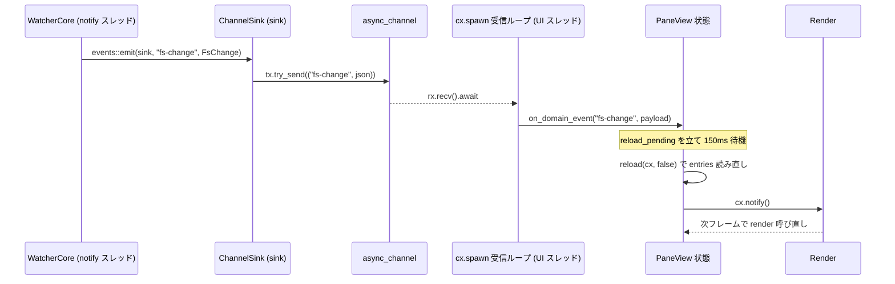

# 第3章: 状態モデルとリアクティビティ

## Sources Read
- `crates/fastfiler-domain/src/events.rs` (lines 1-36)
- `crates/fastfiler-gpui/src/sink.rs` (lines 1-34)
- `crates/fastfiler-gpui/src/app.rs` (lines 1-1200)
- `crates/fastfiler-gpui/src/pane.rs` (lines 224-401, 2920-3108, 3320-3334)
- `crates/fastfiler-gpui/src/tree.rs` (lines 1-130, 188-360)
- `crates/fastfiler-domain/src/watcher.rs` (lines 1-62)

## この章で追うもの

fastfiler の状態は、GPUI の `Entity<T>` という単位に分かれて置かれている。

アプリ全体は単一のルート状態 `FastFilerApp` を持ち、その下にタブ・分割ペイン・ワークスペースツリーがぶら下がる。
ファイル一覧や選択といった、ユーザーが日々触る状態は各ペインの `PaneView` に集まる。

状態を変える経路は、性質の異なる二系統に分かれている。
ひとつは UI 内部の親子間で型付きイベントを送る GPUI ネイティブの仕組み（`EventEmitter` と `cx.subscribe`）であり、もうひとつはドメイン層の別スレッドから来る通知を UI スレッドへ流すブリッジ（`EventSink` とチャネル）である。
この章は、二系統がどこで分かれ、どこで合流して再描画につながるのかを、実際のコードに沿って追う。

最後に、ツリーのクリックから始まる一連の状態変化と、ファイル監視から始まる自動更新の二つを、具体的なコードパスとして辿る。

## GPUI の状態モデル: Entity とコンテキスト

fastfiler が依存する GPUI では、可変状態は `Entity<T>` という所有ハンドルの内側に閉じ込められる。
`Entity<T>` を直接書き換えることはできず、状態へ触れるには `entity.update(cx, |state, cx| ...)` か `entity.read(cx)` を通す。

状態を更新するクロージャには、その型専用の `Context<T>`（コード中の `cx`）が渡される。
`Context<T>` は二つの役割を持つ。
描画の起点になる `cx.notify()` を呼ぶ口であり、同時に新しい `Entity` を生み、購読や非同期タスクを張る口でもある。

再描画は `cx.notify()` が起点になる。
状態を書き換えただけでは画面は変わらず、`cx.notify()` を呼んだエンティティだけが「汚れた」とマークされ、次のフレームで `Render::render` を呼び直される。
この章で `cx.notify()` がどこで呼ばれるかを丹念に見るのは、それが再描画の引き金だからである。

エンティティ間の連携には、さらに二つの口がある。
`cx.subscribe(&other, handler)` は、`other` が `EventEmitter<E>` で `cx.emit(E)` した型付きイベントを受ける。
`cx.observe(&other, handler)` は、`other` が `cx.notify()` したという事実だけを受ける（イベントの中身は伴わない）。
どちらも `Subscription` 値を返し、その値を保持し続けるあいだだけ購読が生きる。
購読を保持する `Subscription` を drop すると、購読は自動的に外れる。

## ルート状態: FastFilerApp

ウィンドウのルートに座るのが `FastFilerApp` である。
このひとつの構造体が、タブ列・アクティブタブ番号・ワークスペースツリー・設定画面の開閉といった、アプリ全体の状態を抱える。

```rust
pub struct FastFilerApp {
    tabs: Vec<TabState>,
    active: usize,
    next_split_id: u64,
    /// セッション保存のデバウンスフラグ。
    save_pending: bool,
    /// ワークスペースツリー (ドライブ起点)。クリックでフォーカスペインに開く。
    tree: Entity<TreeView>,
    _tree_sub: Subscription,
    show_tree: bool,
    tree_width: f32,
    tab_width: f32,
    window_bounds: Option<[f32; 4]>,
    window_maximized: bool,
    pending_focus: Option<EntityId>,
    last_revealed: Option<PathBuf>,
    settings_open: Option<Entity<TextInput>>,
    // ... 設定画面まわりのフィールドが続く
}
```

`tabs` と `active` がタブ機能の中心で、画面に出すのは `active` 番のタブだけである [REF: crates/fastfiler-gpui/src/app.rs:116-151]。
`tree` は別エンティティの `TreeView` をハンドルで握り、`_tree_sub` はそのツリーからのイベント購読を保持する。
フィールド名が `_` で始まるのは、値として読まれることはなく、生かしておくこと自体が目的だからである。

`settings_open: Option<Entity<TextInput>>` のように、UI の開閉状態を `Option` で表すのがこの構造体の流儀である。
`Some` なら設定画面が開いており、その中の入力欄エンティティも一緒に保持している。
`last_revealed: Option<PathBuf>` や `pending_focus: Option<EntityId>` は、再描画やフォーカス移動を「次の機会に一度だけ」起こすための覚え書きとして使われる。

### タブとペインツリー

各タブは `TabState` で表され、タブの中身はペインの二分木 `PaneNode` になっている。

```rust
/// タブ内のペイン配置を表す BSP ツリー。
enum PaneNode {
    Leaf(Entity<PaneView>),
    Split {
        id: u64,
        dir: SplitDir,
        ratios: Vec<f32>,
        children: Vec<PaneNode>,
    },
}

/// 1 タブ: ペインツリー + フォーカス中ペイン + 各ペインの購読。
struct TabState {
    root: PaneNode,
    focused: Option<EntityId>,
    subs: HashMap<EntityId, (Subscription, Subscription)>,
    locked: bool,
}
```

`PaneNode` は葉が `Entity<PaneView>`、内部ノードが分割（`Split`）という再帰構造である [REF: crates/fastfiler-gpui/src/app.rs:72-82]。
画面分割は、この木に `Split` ノードを挿す操作として表現される。
`ratios` が各子の面積比を持ち、リサイズハンドルのドラッグはこの比率を書き換える操作になる。

`TabState` で注目すべきは `subs` の型である [REF: crates/fastfiler-gpui/src/app.rs:85-93]。
`HashMap<EntityId, (Subscription, Subscription)>` は、ペインごとに二本の購読（後述する `PaneEvent` 購読と変化観測）をまとめて持つ。
購読を `TabState` に置く設計には意味がある。
タブを閉じて `TabState` を drop すると、その木の `Entity<PaneView>` 群と、対応する購読が同時に落ちる。
所有とライフサイクルを一箇所に集めることで、閉じたときに何が解放されるかが追いやすくなっている。

`focused` は現在フォーカス中ペインの `EntityId` を覚える。
`focused_pane()` は、覚えている id のペインを木から探し、見つからなければ木の先頭ペインへ落とす [REF: crates/fastfiler-gpui/src/app.rs:96-101]。
フォーカスを「ペインの実体」ではなく「id」で持つのは、木の再構成でペインの位置が変わっても参照が壊れないようにするためだと読み取れる。

## ペイン状態: PaneView

ユーザーが最も多く触る状態は、各ペインの `PaneView` に集まる。
表示中フォルダ、ファイル一覧、カーソル位置、複数選択、ソート列、列幅、ナビゲーション履歴、各種モーダルの開閉などである。

```rust
pub struct PaneView {
    cur_path: PathBuf,
    entries: Vec<FileEntry>,
    row_icons: Vec<Option<Arc<Image>>>,
    cursor: Option<usize>,
    selected: BTreeSet<usize>,
    anchor: Option<usize>,
    // ... 中略 ...
    // --- domain 連携 (watcher / ファイルジョブ) ---
    watcher: Arc<WatcherCore>,
    sink: Arc<dyn EventSink>,
    watched: Option<String>,
    jobs: Arc<JobRegistry>,
    next_job_id: u64,
    job_status: Option<SharedString>,
    active_job: Option<u64>,
}
```

`entries` がドメイン層の `FileEntry` をそのまま並べたファイル一覧で、`selected` は選択中の行番号集合である [REF: crates/fastfiler-gpui/src/pane.rs:262-332]。
選択を行インデックスの `BTreeSet` で持つため、一覧を読み直すと選択は一旦失われる。
後述する自動更新では、これを名前で記憶し直して復元する処理が入る。

末尾の「domain 連携」ブロックが、この章の主題に直結する。
`watcher: Arc<WatcherCore>` がフォルダ監視の本体、`sink: Arc<dyn EventSink>` がドメイン層へ渡す通知口、`jobs: Arc<JobRegistry>` がコピー・移動ジョブの管理である。
いずれも `Arc` で持つのは、別スレッドへ複製して渡す必要があるからである。
`job_status` と `active_job` は、実行中ジョブの進捗表示とキャンセル対象を覚えるための UI 側の状態である。

`PANES_ALIVE` という静的なカウンタが、生存中の `PaneView` 数を数えている [REF: crates/fastfiler-gpui/src/pane.rs:250]。
`new` で加算し `Drop` で減算する作りで、タブやペインを閉じたときにカウントがベースラインへ戻るかを確認できる。
コメントは、移植元の floem 版でまさにこのライフサイクルが漏れていたと述べており、状態モデルの設計目標がリーク防止にあることをうかがわせる。

## 親子間の型付きイベント: EventEmitter

UI の内側で、子ビューが親へ要求を伝える経路が GPUI ネイティブのイベントである。
fastfiler では `PaneView` と `TreeView` がそれぞれイベントを emit する側になる。

```rust
/// PaneView がコンテナ (タブ) へ送るイベント。
pub enum PaneEvent {
    Activated,
    SplitRequested(SplitDir),
    CloseRequested,
    FocusNextPane,
    SwitchTab(i32),
    OpenInNewTab(PathBuf),
}

impl EventEmitter<PaneEvent> for PaneView {}
```

`PaneEvent` は、ペインが自分では決められない要求を親へ上げるためのものである [REF: crates/fastfiler-gpui/src/pane.rs:230-243]。
分割（`SplitRequested`）や自身を閉じる（`CloseRequested`）は木の構造を変える操作で、木を持つのは親の `FastFilerApp` だから、ペインは要求だけを emit する。
`impl EventEmitter<PaneEvent> for PaneView {}` という空実装が、`PaneView` が `PaneEvent` を `cx.emit` できる権限を与える [REF: crates/fastfiler-gpui/src/pane.rs:245]。

ペイン内では、たとえばロック中タブでフォルダへ入ろうとしたとき、移動の代わりに `cx.emit(PaneEvent::OpenInNewTab(path))` で親へ依頼する [REF: crates/fastfiler-gpui/src/pane.rs:405-416]。
ロック中は自分のフォルダを変えてはならず、新しいタブを作るのは親の仕事だからである。

親側の購読は `make_pane` で張られる。

```rust
fn make_pane(
    start: PathBuf,
    cx: &mut Context<Self>,
) -> (Entity<PaneView>, Subscription, Subscription) {
    let pane = cx.new(|cx| PaneView::new(start, cx));
    let ev = cx.subscribe(&pane, |this, emitter, event: &PaneEvent, cx| {
        let id = emitter.entity_id();
        match event {
            PaneEvent::Activated => {
                this.close_other_menus(Some(id), cx);
                this.set_focus(id, cx);
            }
            PaneEvent::SplitRequested(dir) => this.split_pane(id, *dir, cx),
            PaneEvent::CloseRequested => this.close_pane(id, cx),
            PaneEvent::FocusNextPane => this.cycle_focus(cx),
            PaneEvent::SwitchTab(delta) => this.switch_tab_relative(*delta, cx),
            PaneEvent::OpenInNewTab(path) => this.add_tab_at(path.clone(), cx),
        }
    });
    let ob = cx.observe(&pane, |this, pane, cx| {
        cx.notify();
        // ... UNC 自動登録 / セッション保存 / ツリー追従
    });
    (pane, ev, ob)
}
```

`cx.subscribe` の戻り値 `ev` は、`make_pane` の呼び出し元（`add_tab_at` や `build_node`）で `TabState.subs` に格納される [REF: crates/fastfiler-gpui/src/app.rs:1002-1038]。
購読ハンドラは emit 元の `entity_id` を取り、どのペインからの要求かを id で識別してから木を操作する。
イベントの種類ごとに `split_pane` / `close_pane` / `set_focus` といった親のメソッドへ振り分ける、素直なディスパッチである。

`TreeView` も同じ仕組みで親へ話しかける。

```rust
/// ツリーからコンテナへのイベント。
pub enum TreeEvent {
    OpenDir(PathBuf),
    UncChanged,
}

impl EventEmitter<TreeEvent> for TreeView {}
```

`TreeEvent::OpenDir` は「このフォルダをフォーカスペインで開いてほしい」という要求である [REF: crates/fastfiler-gpui/src/tree.rs:23-30]。
ツリーのノードをクリックすると `cx.emit(TreeEvent::OpenDir(path.clone()))` が走る [REF: crates/fastfiler-gpui/src/tree.rs:319-320]。
親はコンストラクタで `make_tree` を呼び、`OpenDir` を受けたら `open_in_focused_pane` でフォーカス中ペインに開く [REF: crates/fastfiler-gpui/src/app.rs:155-167]。
ツリー自身はどのペインがフォーカスされているかを知らないので、開く先の決定は親へ委ねている。

## ドメインイベントのブリッジ: EventSink とチャネル

もうひとつの経路が、ドメイン層からの通知である。
ファイル監視・検索・コピー/移動ジョブは、いずれも UI スレッドとは別のスレッドで動き、進捗や結果を非同期に返す。
ドメイン層は GPUI を知らないので、通知先を抽象トレイト `EventSink` で受け取る。

```rust
/// 任意のイベントを emit するための抽象。
/// Send + Sync を要求するのは、長時間タスク (検索・ファイルジョブ) が
/// 別スレッドから sink を呼ぶため。
pub trait EventSink: Send + Sync {
    fn emit_json(&self, event: &str, payload: serde_json::Value);
}

impl<F> EventSink for F
where
    F: Fn(&str, serde_json::Value) + Send + Sync,
{
    fn emit_json(&self, event: &str, payload: serde_json::Value) {
        (self)(event, payload)
    }
}

/// 任意の Serialize 値を JSON に変換して emit するヘルパ。
pub fn emit<T: Serialize>(sink: &dyn EventSink, event: &str, payload: &T) {
    if let Ok(v) = serde_json::to_value(payload) {
        sink.emit_json(event, v);
    }
}
```

`EventSink` の口はイベント名（`&str`）と JSON ペイロード（`serde_json::Value`）の二つだけである [REF: crates/fastfiler-domain/src/events.rs:10-12]。
イベントの種類を文字列で表す、いわゆる文字列型付けで、型付きの `PaneEvent` とは対照的である。
ドメイン層と UI 層がコンパイル時に型を共有せずに通知を受け渡せるのは、この緩い契約のおかげである。

`Send + Sync` を課しているのは、検索やファイルジョブが別スレッドから `sink` を呼ぶためだとコメントが明記する。
ブランケット実装により、`Fn(&str, serde_json::Value)` を満たすクロージャはそのまま `EventSink` になる [REF: crates/fastfiler-domain/src/events.rs:14-21]。
`emit` ヘルパは `Serialize` な値を JSON へ変換してから `emit_json` を呼ぶ薄い包みで、ドメイン側は構造体を渡すだけで済む [REF: crates/fastfiler-domain/src/events.rs:24-28]。
テストや代替フロントエンド向けには、何もしない `NullSink` が用意されている [REF: crates/fastfiler-domain/src/events.rs:32-35]。

UI 層が用意する実装が `ChannelSink` である。

```rust
/// UI へ届くドメインイベント: (イベント名, JSON ペイロード)。
pub type DomainEvent = (String, serde_json::Value);

/// `EventSink` 実装。clone して watcher 等へ渡す。
#[derive(Clone)]
pub struct ChannelSink {
    tx: async_channel::Sender<DomainEvent>,
}

impl ChannelSink {
    pub fn new() -> (Self, async_channel::Receiver<DomainEvent>) {
        let (tx, rx) = async_channel::unbounded();
        (Self { tx }, rx)
    }
}

impl EventSink for ChannelSink {
    fn emit_json(&self, event: &str, payload: serde_json::Value) {
        let _ = self.tx.try_send((event.to_string(), payload));
    }
}
```

`DomainEvent` は `(String, serde_json::Value)` の組で、UI 側でやり取りするイベントの型である [REF: crates/fastfiler-gpui/src/sink.rs:13]。
`ChannelSink` は送信端 `tx` だけを持ち、`new()` で送受信のペアを作って受信端 `rx` を呼び出し元へ返す [REF: crates/fastfiler-gpui/src/sink.rs:16-26]。
`emit_json` の実装は `try_send` 一行で、戻り値を捨てている [REF: crates/fastfiler-gpui/src/sink.rs:28-33]。
受信端が閉じていても無視するためで、ペインを閉じた後に届く遅延イベントを安全に捨てられる。

`ChannelSink` は `Clone` で、複製して watcher やジョブへ渡される。
送信端の複製がすべて drop されるとチャネルが閉じ、受信ループが自然終了する。
ファイルヘッダのコメントは、この点が floem 版より優れていると述べる。
floem 版ではスレッドとシグナルが残り続けたが、`ChannelSink` 方式なら送信端の所有者が消えれば受信側も止まる [REF: crates/fastfiler-gpui/src/sink.rs:6-8]。

### 受信ループ: チャネルから UI スレッドへ

送受信のペアを結ぶのが、`PaneView::new` の中で張られる受信ループである。

```rust
pub fn new(path: PathBuf, cx: &mut Context<Self>) -> Self {
    PANES_ALIVE.fetch_add(1, std::sync::atomic::Ordering::Relaxed);
    let (sink, rx) = ChannelSink::new();
    let sink: Arc<dyn EventSink> = Arc::new(sink);

    // domain イベントを UI スレッドへ流す drain ループ。
    cx.spawn(async move |this, cx| {
        while let Ok((event, payload)) = rx.recv().await {
            if this
                .update(cx, |pane, cx| pane.on_domain_event(&event, payload, cx))
                .is_err()
            {
                break; // entity が既に drop 済み
            }
        }
    })
    .detach();
    // ... フィールド初期化が続く
}
```

`ChannelSink::new()` で作った受信端 `rx` を、`cx.spawn` のループが読み続ける [REF: crates/fastfiler-gpui/src/pane.rs:343-359]。
`cx.spawn` は UI スレッドのタスクを起こし、クロージャには弱参照の `this` と `cx` が渡る。
`rx.recv().await` で次の `DomainEvent` を待ち、届くたびに `this.update(cx, ...)` でペインの状態を触る。
更新の中身が `on_domain_event` で、ここがドメインイベントを UI 状態へ翻訳する場所である。

`this.update(...)` が `Err` を返したらループを抜ける。
ペインのエンティティが既に drop されている合図で、これ以上更新先がないからである。
別の終了経路として、送信端がすべて落ちて `rx.recv()` が `Err` になればループ条件が偽になり、やはりループは終わる。
このループはチャネル越しに UI スレッドへ戻ってくる点が肝で、ドメインの別スレッドが直接 `PaneView` を触ることはない。

## on_domain_event: 文字列イベントの分岐

受信ループが呼ぶ `on_domain_event` は、イベント名の文字列で分岐する大きな `match` である。

```rust
fn on_domain_event(&mut self, event: &str, payload: serde_json::Value, cx: &mut Context<Self>) {
    match event {
        "ole-drag-done" => self.on_ole_drag_done(&payload, cx),
        "fs-change" => {
            // notify はバーストするため 150ms デバウンスでまとめて reload。
            if !self.reload_pending {
                self.reload_pending = true;
                cx.spawn(async move |this, cx| {
                    cx.background_executor()
                        .timer(std::time::Duration::from_millis(150))
                        .await;
                    let _ = this.update(cx, |pane, cx| {
                        pane.reload_pending = false;
                        pane.reload(cx, false);
                    });
                })
                .detach();
            }
        }
        "fs:job:progress" => { /* job_status を組み立てて cx.notify() */ }
        "search-hit" => { /* search_ui.results へ push して cx.notify() */ }
        "search-done" => { /* search_ui.info を確定して cx.notify() */ }
        "fs:job:done" => { /* Undo 記録・status 確定・reload */ }
        _ => {}
    }
}
```

分岐の鍵が `event` の文字列で、`"fs-change"`・`"fs:job:progress"`・`"search-hit"` などの名前が、ドメイン側の emit と一対一で対応する [REF: crates/fastfiler-gpui/src/pane.rs:2973-3108]。
ペイロードは `serde_json::Value` なので、各分岐は `payload.get("done_files").and_then(|v| v.as_u64())` のように、必要なフィールドを名前で取り出す。
取り出しは `unwrap_or(0)` などで失敗時の既定値を与えており、欠けたフィールドがあってもパニックしない作りになっている [REF: crates/fastfiler-gpui/src/pane.rs:2992-3012]。

`"fs:job:done"` の分岐は、状態変化が一段込み入っている [REF: crates/fastfiler-gpui/src/pane.rs:3072-3105]。
移動ジョブの完了であれば、`pending_move_undo` に控えていた移動アイテムをグローバル Undo 履歴へ積む。
ただし全件成功（`ok` かつ非キャンセル）のときに限り、失敗やキャンセルは記録しない。
そのうえで `job_status` と `active_job` をクリアし、`status` に結果文を入れ、最後に `reload(cx, false)` で一覧を読み直す。
`reload` の内側で `cx.notify()` が呼ばれ、再描画につながる。

ここで注意したいのは、`"fs-change"` の分岐がさらに 150ms のデバウンスを挟む点である。
ファイル監視の通知はバーストしやすく、一回ごとに読み直すと無駄が多い。
そこで `reload_pending` フラグを立て、待機タイマーの後でまとめて `reload` する。
状態変化が来てもすぐに再描画せず、UI 状態（`reload_pending`）を一段かませて流量を絞っている。

## 変化観測 (observe) による波及

`make_pane` がもう一本張るのが、`cx.observe` による変化観測である [REF: crates/fastfiler-gpui/src/app.rs:1025-1036]。
`cx.subscribe` が型付きイベントを受けるのに対し、`cx.observe` は「ペインが `cx.notify()` した」という事実だけを受ける。
観測ハンドラは、ペインで何かが変わるたびに親側で副作用を起こすために使われる。

ハンドラの中身は三つの仕事をする。
まず親自身を `cx.notify()` して、タブ見出しなどペインに連動する表示を更新する。
次に開いたパスが UNC（`\\` 始まり）なら、ツリーへ自動登録する。
最後に `schedule_save` でセッション保存を予約し、`reveal_in_tree` でツリーの選択を現在フォルダへ追従させる。

`reveal_in_tree` は、フォーカスペインの現在パスを取り、前回と同じならツリー更新を省く [REF: crates/fastfiler-gpui/src/app.rs:1143-1160]。
`last_revealed` に直近の reveal 先を覚えておき、重複した追従を抑える。
同じ場所への reveal を繰り返してツリーを無駄に再描画しないための覚え書きである。

`schedule_save` は 800ms のデバウンス付きでセッション保存を予約する [REF: crates/fastfiler-gpui/src/app.rs:984-999]。
`save_pending` が立っていれば二重には予約せず、`cx.spawn` で待ってから保存する。
ここでも、頻繁な状態変化を一段のフラグで束ねてから重い処理（ディスク書き込み）へ渡す形が繰り返し現れる。

テーマやフォントを変えたときの波及は、`refresh_all` が引き受ける [REF: crates/fastfiler-gpui/src/app.rs:947-957]。
全タブの全ペインを集め、それぞれ `p.update(cx, |_, cx| cx.notify())` で個別に汚し、ツリーと自分自身も `cx.notify()` する。
テーマは各エンティティが描画時にグローバルから読むだけなので、状態を配り直す必要はなく、再描画さえ促せばよい。
一斉に `cx.notify()` を撒くことで、まとめて描き直す形になっている。

## トレース1: ツリーのクリックからフォルダ移動まで

ここで、ひとつの操作が状態変化として伝わる様子を辿る。
ワークスペースツリーでフォルダ名をクリックする場面である。

クリックすると、ツリーのノード要素のハンドラが `cx.emit(TreeEvent::OpenDir(path))` を発火する [REF: crates/fastfiler-gpui/src/tree.rs:319-320]。
これは GPUI 型付きイベントなので、`TreeView` と同じスレッドで同期的に親へ届く。

親 `FastFilerApp` は `make_tree` で張った購読でこれを受け、`open_in_focused_pane(path)` を呼ぶ [REF: crates/fastfiler-gpui/src/app.rs:155-167]。
`open_in_focused_pane` はアクティブタブのフォーカスペインを取り、`pane.update(cx, |p, cx| p.open_dir(path, cx))` でペインへ移動を依頼する [REF: crates/fastfiler-gpui/src/app.rs:960-970]。

ペイン側の移動は `open_inner` に入り、旧フォルダの監視を外し、`cur_path` を更新し、新フォルダの監視を張り直してから `reload` する [REF: crates/fastfiler-gpui/src/pane.rs:446-460]。
`reload` の中で `entries` を読み直し、`cx.notify()` を呼ぶことでペインが再描画される。

`cur_path` が変わると、`make_pane` で張った `cx.observe` のハンドラも発火する。
親はタブ見出しを更新し、セッション保存を予約し、`reveal_in_tree` でツリーの選択を新しいフォルダへ合わせる。
クリック一回が、型付きイベント（親へ）と変化観測（親の副作用）の二経路を通り、ペインとツリーの両方の再描画に行き着く。

## トレース2: ファイル監視からの自動更新

二つ目は、別スレッド由来の状態変化である。
表示中フォルダの中身が外部で変わったときの自動更新を辿る。

監視は `open_inner` の中で `self.watcher.watch_with_sink(p, self.sink.clone())` として張られる [REF: crates/fastfiler-gpui/src/pane.rs:446-460]。
ペインの `sink`（`ChannelSink`）を複製して `WatcherCore` へ渡すのが要点である。

`WatcherCore::watch_with_sink` は `notify` クレートのウォッチャを作り、ファイルイベントが来るたびに `events::emit(sink.as_ref(), "fs-change", &payload)` を呼ぶ [REF: crates/fastfiler-domain/src/watcher.rs:28-56]。
ペイロードは `FsChange { path, kind }` という構造体で、`emit` ヘルパが JSON へ変換する [REF: crates/fastfiler-domain/src/watcher.rs:15-19]。
このコールバックは `notify` の監視スレッドで動くので、`EventSink` が `Send + Sync` を要求していた理由がここで効く。

`emit_json` は `ChannelSink` の `tx.try_send` を呼び、`("fs-change", payload)` をチャネルへ流す。
受信端は `PaneView::new` の `cx.spawn` ループにあり、UI スレッドで `rx.recv().await` が値を受け取る。
ループは `on_domain_event("fs-change", payload, cx)` を呼び、`"fs-change"` 分岐が 150ms のデバウンス後に `reload(cx, false)` する。

`reload(cx, false)` の第二引数 `false` は、選択とスクロールを保つ自動更新モードを意味する [REF: crates/fastfiler-gpui/src/pane.rs:462-472]。
更新前にカーソルと選択を「名前」で記憶し、読み直したあと同じ名前の行へ復元する。
行インデックスで持つ選択が読み直しで失われるのを、名前を介して埋め合わせている。
最後に `cx.notify()` で再描画され、外部のファイル変更が画面へ反映される。

二つのトレースを並べると、経路の違いがはっきりする。
トレース1 は UI 内の型付きイベントが同期で親へ届く流れで、トレース2 は別スレッドの通知が文字列イベントとチャネルを通って UI スレッドへ戻る流れである。
合流点はどちらも `cx.notify()` で、そこから先の再描画機構は共通である。

## イベントフローのシーケンス

トレース2 のファイル監視から再描画までを、登場人物ごとに並べると次のようになる。



図の縦線が、ドメインの監視スレッドから始まり、チャネルを越えて UI スレッドへ戻り、最後に `cx.notify()` で描画へ合流するまでを表す。
スレッドの境界はチャネルの一点だけで、ペインの状態を実際に書き換えるのは UI スレッド上の受信ループに限られる。

## コピー/移動ジョブの進捗

進捗付きのジョブも、トレース2 と同じブリッジを使う。
`run_transfer_now` はジョブ id を採番し、`sink` と `jobs` レジストリを複製して `std::thread::spawn` で別スレッドへジョブを投げる [REF: crates/fastfiler-gpui/src/pane.rs:2926-2960]。
UI スレッドでブロックしないよう、コピーや削除の実体は専用スレッドで回す。

ジョブスレッドは進捗を `"fs:job:progress"`、完了を `"fs:job:done"` として `sink` 経由で送る。
UI 側は `on_domain_event` の対応分岐で `job_status` を組み立てて表示し、完了時には Undo 記録・status 確定・`reload` を行う。
キャンセルは `cancel_job` がレジストリのフラグを立てるだけで、実際の停止はジョブスレッドがフラグを見て行い、`"fs:job:done"`（canceled）が後から届く [REF: crates/fastfiler-gpui/src/pane.rs:2962-2970]。
キャンセルという状態変化が、共有フラグとイベントの往復で表現されている。

## ライフサイクルとリーク防止

状態モデルの設計目標がリーク防止にあることは、解放の連鎖に表れている。
タブを閉じる `close_tab` は `self.tabs.remove(ix)` で `TabState` を落とすだけである [REF: crates/fastfiler-gpui/src/app.rs:1066-1081]。

`TabState` が落ちると、その `root`（`PaneNode` の木）と `subs`（購読の `HashMap`）が同時に drop される。
木が落ちると葉の `Entity<PaneView>` の参照が外れ、ペインの実体が解放される。
`subs` が落ちると `PaneEvent` 購読と変化観測が外れる。

`PaneView` の `Drop` 実装自体はカウンタを減らすだけだが、フィールドの drop が連鎖を起こす [REF: crates/fastfiler-gpui/src/pane.rs:3320-3326]。
`watcher`（`Arc<WatcherCore>`）と `sink`（`Arc<dyn EventSink>`）が落ち、`ChannelSink` の送信端がすべて消える。
送信端が消えるとチャネルが閉じ、`PaneView::new` で起こした受信ループの `rx.recv()` が `Err` を返してループが終わる。
タブを一枚閉じれば、ペイン・購読・監視・受信タスクまでが一筆書きで解放される。

この連鎖を可視化するのが先述の `PANES_ALIVE` カウンタで、閉じたあとカウントがベースラインへ戻れば漏れがないと判断できる。
状態を `Entity` の所有木に素直に対応づけ、購読と非同期タスクの寿命をその木へ結びつけたことが、この性質を支えている。

## 再描画の起点

再描画の起点は一貫して `cx.notify()` である。
`Render::render` は状態を読んで要素木を組み立て、`cx.notify()` で汚れたエンティティだけが次フレームで描き直される。
`PaneView::render` の冒頭には、初回描画時に一度だけキーボードフォーカスを取る小さな状態遷移があり、`focused_once` フラグでそれを一回に限っている [REF: crates/fastfiler-gpui/src/pane.rs:3328-3334]。
描画中に状態（フォーカス）を進めるこの形は、`pending_focus` や `last_revealed` と同じく、「次の機会に一度だけ」を実現する手筋である。

## イベント二系統の対比

最後に、二つのイベント系統を表で整理する。

| 観点 | GPUI 型付きイベント | ドメインイベント |
| --- | --- | --- |
| 仕組み | `EventEmitter` + `cx.emit` + `cx.subscribe` | `EventSink` + `emit_json` + チャネル + `on_domain_event` |
| 型 | `PaneEvent` / `TreeEvent`（列挙型） | イベント名 `String` + `serde_json::Value` |
| 方向 | 子ビュー → 親（UI 内） | 別スレッド（ドメイン） → UI スレッド |
| スレッド | 同一スレッド・同期 | スレッドをまたぐ・非同期 |
| 主な用途 | 分割・閉じ・フォーカス・タブ操作 | 監視・検索・ジョブ進捗・OLE D&D 完了 |

二系統が分かれているのは、解く問題が違うからである。
親子間の構造操作はコンパイル時に型を共有できるので列挙型が向き、ドメインからの通知はスレッドと層をまたぐので緩い文字列契約が向く。
どちらの経路を通っても最終的には `cx.notify()` に合流し、そこから先は GPUI の再描画に委ねられる。

## Uncertainty markers

[CONFIDENCE: HIGH] `PaneEvent` / `TreeEvent` は GPUI ネイティブの型付きイベント、`EventSink` 系は別スレッドからの文字列イベントという二系統に分かれている。両者のコードは読んだとおりで、合流点が `cx.notify()` である点も実コードで確認した。

[CONFIDENCE: HIGH] `ChannelSink` の送信端が drop されると受信ループが終了するリーク防止の連鎖は、`sink.rs` と `pane.rs` の `Drop`・`new` のコメントおよびコードから読み取れる。

[CONFIDENCE: MED] `on_domain_event` が分岐する文字列名（`"fs-change"`、`"fs:job:progress"` など）は、ドメイン側の emit と一対一で対応していると推定する。`watcher.rs` の `"fs-change"` は確認したが、`"fs:job:progress"` / `"fs:job:done"` / `"search-hit"` / `"search-done"` の発火元は本章の対象ファイル外（`file_jobs.rs` / `search.rs`）にあり、名前の一致は突き合わせきれていない。[ASK SME]

[ASSUMED: フォーカスを `EntityId` で保持するのは、木の再構成でペインの位置が変わっても参照が壊れないようにするためと推定した。コメントに明記はなく、`focused_pane()` のフォールバック実装からの推論である。]

[ASSUMED: `cur_path` が UNC のときツリーへ自動登録する `cx.observe` の副作用は、CONTEXT.md の仕様に基づくとコメントが述べる。CONTEXT.md 本体は未読のため、仕様の正確な範囲は確認していない。] [ASK SME]

[CONFIDENCE: LOW] `reload(cx, false)` の「名前で選択を復元」する挙動は `reload` 冒頭の `keep` 変数の組み立てまでを読んで推定した。復元の適用側（読み直し後に名前で選択を戻す処理）は本章では全文を追っていない。

<!-- DETAIL_QUESTIONS
- 1. on_domain_event が分岐する文字列イベント名は、ドメイン側 (file_jobs.rs / search.rs / ole_dnd.rs) の emit と完全に一致しているか。名前の typo やバージョン差で握り損ねる経路はないか。型付き enum ではなく文字列契約にしている理由は、Tauri 版との互換維持か、それとも別の意図か。
- 2. ChannelSink は async_channel::unbounded を使っている。長時間のジョブや大量の fs-change バーストでチャネルが無制限に積み上がる懸念はないか。bounded にしない判断の根拠は何か。
- 3. fs-change は 150ms、schedule_save は 800ms とデバウンス値が散在している。これらの数値は計測に基づくチューニング結果か、経験則か。設定可能にすべき項目か。
- 4. cx.observe ハンドラ内で UNC 自動登録・セッション保存予約・ツリー追従の三つを同時に行っている。これらは独立した関心事に見えるが、一つの観測点に束ねている理由（順序依存や性能上の都合）はあるか。
- 5. フォーカスを EntityId で保持し、見つからなければ先頭ペインへ落とす設計は、木の再構成中に「フォーカスが一瞬先頭へ飛ぶ」挙動を許容しているように見える。これは意図された仕様か、許容された副作用か。
-->
