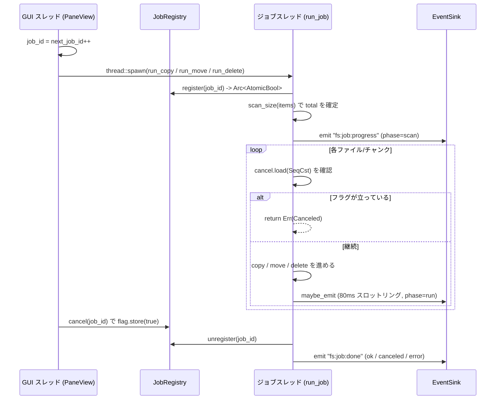

<!-- meta: Domain: filesystem & file ops - fs/file_ops/file_jobs/watcher -->

# 第4章: ドメイン層 — ファイルシステムとファイル操作

## Sources Read
- `crates/fastfiler-domain/src/fs.rs` (lines 1-306)
- `crates/fastfiler-domain/src/file_ops.rs` (lines 1-509)
- `crates/fastfiler-domain/src/file_jobs.rs` (lines 1-376)
- `crates/fastfiler-domain/src/watcher.rs` (lines 1-61)
- `crates/fastfiler-domain/src/events.rs` (lines 1-36)
- `crates/fastfiler-domain/src/error.rs` (lines 1-55)
- `crates/fastfiler-domain/src/undo.rs` (lines 1-90)
- `crates/fastfiler-gpui/src/pane.rs` (lines 2926-2969, 446-459)

---

## 4.0 この章の位置づけ

本章は `fastfiler-domain` クレートのうち、ファイルシステムに直接触れる 4 つのモジュールを扱う。
すなわち、ディレクトリ列挙と stat を担う `fs.rs`、同期的な基本ファイル操作を担う `file_ops.rs`、進捗付き・キャンセル可能な長時間ジョブを担う `file_jobs.rs`、そしてディレクトリ監視を担う `watcher.rs` である。

これら 4 モジュールに共通する設計上の方針が 2 つある。
1 つは「**UI フレームワーク非依存**」であること。
各ファイルの冒頭コメントが繰り返し述べているとおり、これらは Tauri / GPUI といった上位レイヤに直接依存せず、純粋なロジックと `EventSink` 抽象だけを使う。
たとえば `fs.rs` 冒頭は「`#[tauri::command]` シムは `src-tauri/src/fs_service.rs` 側にあり、本モジュールの関数を呼ぶだけ」と明言している [REF: crates/fastfiler-domain/src/fs.rs:1-4]。
`file_jobs.rs` も「AppHandle/State は持たず、純粋に EventSink へ emit する」と記す [REF: crates/fastfiler-domain/src/file_jobs.rs:1-8]。

もう 1 つは「**エラーは `AppResult<T>` に集約**」されること。
`AppResult<T>` は `Result<T, AppError>` の別名で、`AppError` は `thiserror` で定義された列挙型である [REF: crates/fastfiler-domain/src/error.rs:4-26]。
`std::io::Error` は `#[from]` により `AppError::Io` へ自動変換されるため、本章の関数群は `?` 演算子だけで I/O 失敗を伝播できる [REF: crates/fastfiler-domain/src/error.rs:6-7]。
`AppError` をフロントへシリアライズすると、互換性のため Display 文字列のみを返す（`kind()` タグは別経路）[REF: crates/fastfiler-domain/src/error.rs:46-52]。

イベント発火は `events.rs` の `EventSink` トレイトを介す。
`EventSink` は `emit_json(&self, event, payload)` 1 メソッドのみを要求し、`Send + Sync` 境界を持つ [REF: crates/fastfiler-domain/src/events.rs:10-21]。
この境界が要求される理由はコメントに明記されており、「長時間タスク（検索・ファイルジョブ）が別スレッドから sink を呼ぶため」である [REF: crates/fastfiler-domain/src/events.rs:7-9]。
ヘルパ関数 `emit::<T: Serialize>` が任意の Serialize 値を `serde_json::Value` に変換して投げ、変換失敗時は黙って捨てる（`if let Ok(v)`）[REF: crates/fastfiler-domain/src/events.rs:23-28]。

以降、モジュールごとに実際のコードの挙動を追う。

---

## 4.1 `fs.rs` — ディレクトリ列挙・stat・ドライブ列挙

### 4.1.1 データ型: FileEntry / DriveInfo / DiskInfo

列挙結果の基本単位は `FileEntry` である [REF: crates/fastfiler-domain/src/fs.rs:12-21]。
フィールドは `name`、`kind`（`&'static str` で `"dir" | "file" | "symlink"`）、`size`（u64）、`modified`（i64, unix 秒）、`ext`（`Option<String>`）、`hidden`（bool）、`readonly`（bool）の 7 つである。
`kind` を enum ではなく `&'static str` の固定文字列にしている点が特徴で、これはそのまま JSON へ載るフロント互換の表現になっている。
`FileEntry` は `Serialize` 派生だが `serde(rename_all)` を持たないため、フィールド名はそのまま snake_case でシリアライズされる。

ドライブ一覧は `DriveInfo` で表す [REF: crates/fastfiler-domain/src/fs.rs:23-30]。
`letter`、`label`、`kind`（"fixed" / "removable" / "network" / "cdrom" / "ram" / "unknown"）、`remote_path`（ネットワークドライブの UNC パス）を持つ。
`DriveInfo` と `DiskInfo` は `#[serde(rename_all = "camelCase")]` を付けており、`remote_path` は JSON 上 `remotePath` となる [REF: crates/fastfiler-domain/src/fs.rs:24-24]。
`DiskInfo` は空き容量問い合わせの返り値で、`total` / `free` / `available` の 3 つの u64 を持つ [REF: crates/fastfiler-domain/src/fs.rs:32-38]。
`free` と `available` を分けているのは、クォータ等で「ボリューム全体の空き」と「呼び出しユーザーが使える空き」が異なりうるためである。

時刻は `to_unix_secs` で `SystemTime` から i64 の unix 秒へ落とす [REF: crates/fastfiler-domain/src/fs.rs:40-44]。
注目すべきは、エポックより前など `duration_since` が失敗した場合に `unwrap_or(0)` で 0 を返す防御的な実装である。
つまり時刻取得に失敗しても列挙自体は止まらず、modified=0 として扱われる。

隠しファイル判定 `is_hidden` は Windows と非 Windows で 2 つの実装を持つ。
Windows 版は `MetadataExt::file_attributes()` を読み、`FILE_ATTRIBUTE_HIDDEN`（0x2）ビットが立っているかで判定する [REF: crates/fastfiler-domain/src/fs.rs:46-51]。
非 Windows 版は常に `false` を返すスタブである [REF: crates/fastfiler-domain/src/fs.rs:52-55]。
ドットファイル（`.bashrc` 等）を隠し扱いしない点に注意。本実装の「隠し」はあくまで Windows の属性ビットに基づく。

### 4.1.2 list_dir — 全エントリ列挙

`list_dir(path: String) -> AppResult<Vec<FileEntry>>` がメインの列挙 API である [REF: crates/fastfiler-domain/src/fs.rs:57-94]。
処理の流れは次のとおり。
まず `path` が存在しなければ早期に `AppError::NotFound(path)` を返す [REF: crates/fastfiler-domain/src/fs.rs:59-61]。
次に `fs::read_dir` を呼び（失敗は `?` で `AppError::Io` 伝播）、容量 64 の `Vec` を確保する。
ループは `read.flatten()` を使うため、`DirEntry` 取得に失敗したエントリは黙ってスキップされる [REF: crates/fastfiler-domain/src/fs.rs:64-64]。
さらに各エントリで `ent.metadata()` が失敗した場合も `let Ok(meta) = ... else { continue }` でスキップする [REF: crates/fastfiler-domain/src/fs.rs:65-65]。
このため、アクセス権のないエントリがあっても列挙全体は失敗せず、可能な範囲を返す堅牢な挙動になっている。

`kind` の決定順序は重要である [REF: crates/fastfiler-domain/src/fs.rs:67-73]。
まず `meta.is_dir()` なら `"dir"`、次に `meta.file_type().is_symlink()` なら `"symlink"`、それ以外を `"file"` とする。
ディレクトリ判定がシンボリックリンク判定より先に来るため、「ディレクトリへのシンボリックリンク」は `"dir"` に分類される点に注意したい。
拡張子 `ext` は `kind == "file"` のときだけ計算し、`Path::extension()` を取り `to_lowercase()` で小文字化する [REF: crates/fastfiler-domain/src/fs.rs:75-82]。
ディレクトリやシンボリックリンクの `ext` は常に `None` である。
`size` はファイルのときだけ `meta.len()`、それ以外は 0 とする [REF: crates/fastfiler-domain/src/fs.rs:86-86]。
`readonly` は `meta.permissions().readonly()` をそのまま採用する [REF: crates/fastfiler-domain/src/fs.rs:90-90]。
ここで `list_dir` はソートを一切行わず、`read_dir` が返した順序のまま返す。
表示順の決定は上位（GUI 層 `pane.rs` の `SortCol`）に委ねられている。[CONFIDENCE: HIGH]

### 4.1.3 stat_path / list_dirs

`stat_path(path) -> AppResult<FileEntry>` は単一パスのメタデータを取る [REF: crates/fastfiler-domain/src/fs.rs:96-116]。
`list_dir` と違い `fs::metadata`（シンボリックリンクを追う）を使うため、リンク先の情報を返す。
`kind` 判定も `list_dir` より単純で、`"dir"` か `"file"` の 2 値のみ。シンボリックリンクを別扱いしない [REF: crates/fastfiler-domain/src/fs.rs:103-103]。
`name` は `file_name()` が取れないとき（ルート等）パス文字列そのものをフォールバックに使う [REF: crates/fastfiler-domain/src/fs.rs:99-102]。

`list_dirs(path, include_hidden: Option<bool>)` はサブディレクトリだけを列挙する [REF: crates/fastfiler-domain/src/fs.rs:118-148]。
これはワークスペースツリー（第9章）の展開に使う想定の API である。
`meta.is_dir()` でないエントリは `continue` でスキップし、ファイルを除外する [REF: crates/fastfiler-domain/src/fs.rs:128-130]。
`include_hidden` は `unwrap_or(true)` で、未指定時は隠しディレクトリも含める。`false` 指定時のみ隠しを除外する [REF: crates/fastfiler-domain/src/fs.rs:124-134]。
`list_dir` と決定的に違うのは、`list_dirs` は最後に名前の小文字比較でソートして返す点である [REF: crates/fastfiler-domain/src/fs.rs:146-146]。
ツリー表示は安定した順序が必要なので、ここでソートを内蔵していると考えられる。[CONFIDENCE: MED] [ASSUMED: ツリー用途はモジュールコメントとフィールド構成からの推測]

### 4.1.4 home_dir / list_drives / disk_free

`home_dir()` は環境変数 `USERPROFILE` を最優先で読み、なければ `HOME` を試し、どちらも無ければ `AppError::EnvMissing("USERPROFILE")` を返す [REF: crates/fastfiler-domain/src/fs.rs:150-155]。
Windows を主、Unix を従とするフォールバック順になっている。

`list_drives()` は Windows / 非 Windows で完全に分岐する `cfg` 実装である [REF: crates/fastfiler-domain/src/fs.rs:157-271]。
Windows 版は `GetLogicalDrives()` のビットマスクを A..Z の 26 文字でループし、立っているビットのドライブだけを処理する [REF: crates/fastfiler-domain/src/fs.rs:181-188]。
ドライブ種別は `GetDriveTypeW` の戻り値（DRIVE_FIXED=3 等の定数）を文字列にマップする [REF: crates/fastfiler-domain/src/fs.rs:190-198]。
ボリュームラベルは `GetVolumeInformationW` で取得し、失敗時は空文字にフォールバックする [REF: crates/fastfiler-domain/src/fs.rs:200-216]。
ネットワークドライブ（kind == "network"）の場合のみ `WNetGetConnectionW` で UNC リモートパスを引く [REF: crates/fastfiler-domain/src/fs.rs:218-251]。
ここはバッファ拡張処理が丁寧で、`ERROR_MORE_DATA` が返ったら `size` 分にバッファを `resize` して再呼び出しする 2 段構えになっている [REF: crates/fastfiler-domain/src/fs.rs:230-248]。
非 Windows 版は単一のルート `/` を fixed ドライブとして返すスタブである [REF: crates/fastfiler-domain/src/fs.rs:262-270]。

`disk_free(path)` は `GetDiskFreeSpaceExW` で `available` / `total` / `free` を一括取得する [REF: crates/fastfiler-domain/src/fs.rs:273-295]。
Win32 呼び出しが失敗したときは `AppError::Win32` に整形して返す [REF: crates/fastfiler-domain/src/fs.rs:288-288]。
非 Windows 版は全て 0 のダミーを返す [REF: crates/fastfiler-domain/src/fs.rs:296-304]。
`fs.rs` の Windows 依存はすべて `unsafe` ブロックに閉じ込められ、API 境界（戻り値）では安全な Rust 型に変換されている。

---

## 4.2 `file_ops.rs` — 同期的な基本ファイル操作

`file_ops.rs` は「進捗を出さない・同期的な」基本操作群である。
長時間化しうるコピー/移動/削除は `file_jobs.rs` 側にあり、こちらは単発の `create_dir` / `rename` / `delete` や、Undo 経路専用の上書き禁止操作・ゴミ箱送り・ゴミ箱復元を担う。

### 4.2.1 基本 4 操作

`create_dir(path)` は `fs::create_dir_all` を呼ぶだけで、中間ディレクトリも作る [REF: crates/fastfiler-domain/src/file_ops.rs:12-15]。
`rename_path(from, to)` は `fs::rename` の薄いラッパで、**上書きを許す**（OS の rename 意味論に従う）[REF: crates/fastfiler-domain/src/file_ops.rs:17-20]。
`delete_path(path, recursive)` はまず `fs::metadata` で種別を見て分岐する [REF: crates/fastfiler-domain/src/file_ops.rs:22-34]。
ディレクトリかつ `recursive == true` なら `remove_dir_all`、`recursive == false` なら `remove_dir`（空でないと失敗）、ファイルなら `remove_file` である [REF: crates/fastfiler-domain/src/file_ops.rs:24-32]。
この削除は **ゴミ箱を経由しない物理削除**である点に注意。ゴミ箱送りは後述の `delete_to_trash` が担当する。

`copy_path(from, to)` はソースの種別で分岐する [REF: crates/fastfiler-domain/src/file_ops.rs:36-47]。
ディレクトリなら `copy_dir_recursive` へ委譲し、ファイルなら宛先の親ディレクトリを `create_dir_all` で用意してから `fs::copy` する [REF: crates/fastfiler-domain/src/file_ops.rs:38-45]。
`move_path(from, to)` は「rename ファースト + フォールバック」戦略を取る [REF: crates/fastfiler-domain/src/file_ops.rs:49-67]。
まず宛先親を作り、`fs::rename` を試す。成功すれば終わり（高速・同一ボリューム内）[REF: crates/fastfiler-domain/src/file_ops.rs:50-54]。
`rename` が失敗した場合（典型的にはドライブ跨ぎ）、ソースがディレクトリなら `copy_dir_recursive` 後に `remove_dir_all`、ファイルなら `fs::copy` 後に `remove_file` で擬似 move を行う [REF: crates/fastfiler-domain/src/file_ops.rs:55-65]。
`copy_dir_recursive(src, dst)` は宛先を `create_dir_all` し、`read_dir` で各エントリを再帰的にコピーする標準的な実装である [REF: crates/fastfiler-domain/src/file_ops.rs:69-83]。
これら（`rename_path` / `copy_path` / `move_path`）はいずれも**宛先が既存なら上書きする**ことを許容する設計になっている。

### 4.2.2 delete_to_trash — Windows ゴミ箱送り

`delete_to_trash(paths: Vec<String>) -> AppResult<()>` は複数パスを一括でゴミ箱へ送る [REF: crates/fastfiler-domain/src/file_ops.rs:86-98]。
非 Windows では `AppError::NotSupported` を返すスタブで、機能は Windows 専用である [REF: crates/fastfiler-domain/src/file_ops.rs:91-97]。
Windows 実装は `SHFileOperationW`（`FO_DELETE`）を使う [REF: crates/fastfiler-domain/src/file_ops.rs:205-242]。
入力文字列は「`/` を `\` へ正規化」したうえで**ダブル NUL 終端の wide リスト**に組み立てる [REF: crates/fastfiler-domain/src/file_ops.rs:208-217]。
フラグは `FOF_ALLOWUNDO | FOF_NOCONFIRMATION | FOF_NOERRORUI | FOF_SILENT` を立て、ゴミ箱送り（Undo 可能）かつ UI 無しのサイレント動作にしている [REF: crates/fastfiler-domain/src/file_ops.rs:227-228]。
呼び出しは `std::panic::catch_unwind` で囲まれ、Rust の panic を捕捉してエラー化する。返り値 0 を成功、非 0 を `AppError::Win32(code)`、panic を専用メッセージにマッピングする [REF: crates/fastfiler-domain/src/file_ops.rs:221-241]。
コメントによれば `SHFileOperationW` は呼び出しスレッドの COM 状態に依存しない安定 API なので、ここでは `CoInitialize` を行っていない [REF: crates/fastfiler-domain/src/file_ops.rs:206-207]。

### 4.2.3 Undo 経路用の上書き禁止操作

`file_ops.rs` には Undo（ADR 0008）専用の「上書きしない」操作群がある。
`rename_path_no_overwrite(from, to)` は冒頭で `to.exists()` をチェックし、既存なら `AppError::Other("destination exists: ...")` で失敗する [REF: crates/fastfiler-domain/src/file_ops.rs:106-115]。
これは「Undo の逆 rename / 逆 move」で使われ、巻き戻しの過程で他者のファイルを潰さないことを保証する。
`move_path_no_overwrite(from, to)` も同様に先頭で宛先存在チェックを行い、その後 `rename` を試し、失敗時はドライブ跨ぎフォールバックへ進む [REF: crates/fastfiler-domain/src/file_ops.rs:119-143]。
フォールバック側は通常版と違って `copy_dir_no_overwrite` を使い、上書きしない経路を維持する [REF: crates/fastfiler-domain/src/file_ops.rs:135-141]。
`copy_dir_no_overwrite(src, dst)` は宛先存在チェック後に `fs::create_dir`（`_all` ではない）でディレクトリを作り、再帰コピーする [REF: crates/fastfiler-domain/src/file_ops.rs:145-166]。
コメントが明示するとおり、再帰内のファイル `fs::copy` は「親フォルダが直前に dst として作られたばかりなので衝突しない」前提に立っている [REF: crates/fastfiler-domain/src/file_ops.rs:161-162]。

### 4.2.4 restore_from_trash — ゴミ箱からの復元

`restore_from_trash(item: &TrashedItem)` は Undo で「ゴミ箱送り」を巻き戻すための復元処理である [REF: crates/fastfiler-domain/src/file_ops.rs:170-182]。
非 Windows ではやはり `NotSupported` を返す [REF: crates/fastfiler-domain/src/file_ops.rs:175-181]。
入力の `TrashedItem` は `undo.rs` で定義され、`original_path` / `file_name` / `size` / `modified` / `is_dir` / `deleted_at` を識別キーとして持つ [REF: crates/fastfiler-domain/src/undo.rs:25-33]。

Windows 実装の方針はコメントに段階的に記されている [REF: crates/fastfiler-domain/src/file_ops.rs:244-257]。
(1) 復元先 `original_path` が既に存在すれば失敗、(2) ゴミ箱を列挙して DeletedFrom（親フォルダ）と表示名で一致を集める、(3) 1 件のときのみ復元、(4) 0 件/複数件は失敗、(5) `IFileOperation::MoveItem` で元の親フォルダへ戻す、という流れである。
実装はまず `original_path.exists()` を見て既存なら拒否する [REF: crates/fastfiler-domain/src/file_ops.rs:260-265]。
COM は `CoInitializeEx(COINIT_APARTMENTTHREADED)` で初期化し、`ComGuard` の `Drop` で `CoUninitialize` を必ず呼ぶ RAII にしている [REF: crates/fastfiler-domain/src/file_ops.rs:273-283]。
ゴミ箱は `SHGetKnownFolderItem(FOLDERID_RecycleBinFolder)` で開き、`BHID_EnumItems` で列挙する [REF: crates/fastfiler-domain/src/file_ops.rs:298-303]。
各エントリは `IPropertyStore` から `System.Recycle.DeletedFrom`（親パス）と `System.Recycle.DateDeleted`（削除日時）を読み、親パス一致＋表示名一致のものを `matches` に集める [REF: crates/fastfiler-domain/src/file_ops.rs:342-365]。
一部エントリ（WIC が絡む画像など）でプロパティ取得に失敗しても `continue` でスキップし、ゴミ箱本体の列挙は止めない [REF: crates/fastfiler-domain/src/file_ops.rs:343-349]。

複数一致時の選択ロジックが秀逸である [REF: crates/fastfiler-domain/src/file_ops.rs:378-400]。
同じ元パスのファイルを過去に複数回削除しているケースに備え、`TrashedItem.deleted_at` を 100ns FILETIME に変換した値と、各エントリの `DateDeleted` の差（`abs_diff`）が最小のものを選ぶ [REF: crates/fastfiler-domain/src/file_ops.rs:323-323]。
`DateDeleted` が取れないエントリは比較不能とし、全件取れなかった場合は「最後に列挙されたもの（最新削除）」を採る [REF: crates/fastfiler-domain/src/file_ops.rs:392-397]。
復元の実体は `IFileOperation` を生成し、`SetOperationFlags`（NOCONFIRMATION/NOERRORUI/SILENT）を立て、`NewName` に元のファイル名を指定して `MoveItem` → `PerformOperations` する [REF: crates/fastfiler-domain/src/file_ops.rs:403-423]。
`NewName` を明示するのは「ゴミ箱内のリネームされた実体ではなく、元のファイル名で戻したい」ためである [REF: crates/fastfiler-domain/src/file_ops.rs:413-419]。

---

## 4.3 `file_jobs.rs` — 進捗付き・キャンセル可能なジョブ実行モデル

`file_jobs.rs` は本章の中核で、コピー・移動・削除を「進捗イベントを出しつつ途中キャンセルできる長時間ジョブ」として実行する仕組みを与える。
冒頭コメントが実行モデルを端的に説明している [REF: crates/fastfiler-domain/src/file_jobs.rs:1-8]。
すなわち「frontend が job_id を採番して invoke する。操作中は `fs:job:progress` を、完了時に `fs:job:done` を emit する。cancel(job_id) を呼ぶと `AtomicBool` が立ち、ループが中断され `Cancelled` を返す」。

### 4.3.1 JobRegistry — キャンセルフラグの管理

`JobRegistry` は `Mutex<HashMap<u64, Arc<AtomicBool>>>` を内側に持つ `Default` 構造体である [REF: crates/fastfiler-domain/src/file_jobs.rs:20-23]。
キーは job_id、値はそのジョブのキャンセルフラグ（`AtomicBool`）である。
3 つの管理メソッドがある [REF: crates/fastfiler-domain/src/file_jobs.rs:25-41]。
`register(id)` は新しい `Arc<AtomicBool>(false)` を作って map に入れ、クローンを返す（private）。
`unregister(id)` は map からエントリを除く（private）。
`cancel(id)` は public で、対象 id のフラグがあれば `store(true, SeqCst)` して `true`、無ければ `false` を返す [REF: crates/fastfiler-domain/src/file_jobs.rs:34-41]。
この `cancel` は別スレッド（GUI スレッド）から呼ばれ、ジョブスレッドが回しているループがフラグを `load` して中断する、という疎結合なキャンセル機構になっている。

```rust
#[derive(Default)]
pub struct JobRegistry {
    inner: Mutex<HashMap<u64, Arc<AtomicBool>>>,
}

impl JobRegistry {
    pub fn cancel(&self, id: u64) -> bool {
        if let Some(f) = self.inner.lock().unwrap().get(&id) {
            f.store(true, Ordering::SeqCst);
            true
        } else {
            false
        }
    }
}
```

### 4.3.2 ジョブのペイロード型

`JobItem` は移動/コピー 1 件の `from` / `to` を持つ入力 DTO で、`Deserialize` 派生である（frontend から渡される）[REF: crates/fastfiler-domain/src/file_jobs.rs:129-133]。
`JobProgress` は進捗イベントのペイロードで、`job_id` / `kind` / `phase` / `total_files` / `done_files` / `total_bytes` / `done_bytes` / `current` を持つ [REF: crates/fastfiler-domain/src/file_jobs.rs:135-145]。
`phase` は文字列で `"scan"`（事前スキャン中）または `"run"`（実行中）を取る。
`JobDone` は完了イベントのペイロードで、`ok` / `canceled` / `error: Option<String>` に加え、最終的な件数・バイト数を持つ [REF: crates/fastfiler-domain/src/file_jobs.rs:147-158]。
`ok` と `canceled` を別フィールドにしているため、フロントは「成功」「キャンセル」「エラー」の 3 状態を区別できる。

### 4.3.3 サイズスキャンと進捗スロットリング

`scan_size(path, &mut total_files, &mut total_bytes)` は再帰的に総ファイル数と総バイト数を数える [REF: crates/fastfiler-domain/src/file_jobs.rs:160-173]。
`fs::symlink_metadata` を使う（リンクを追わない）点が重要で、ディレクトリなら子を再帰、ファイルなら件数 +1・サイズ加算する。
メタデータ取得に失敗したパスは黙って無視する（`if let Ok(meta)`）ため、スキャンは部分的でも止まらない。

進捗の発火は `emit_progress`（`fs:job:progress` を emit する薄いラッパ）と `maybe_emit` の 2 段である [REF: crates/fastfiler-domain/src/file_jobs.rs:175-177]。
`Counters` は進捗状態をまとめた struct で、総数・完了数・総バイト・完了バイトに加え `last_emit: Instant` を持つ [REF: crates/fastfiler-domain/src/file_jobs.rs:179-185]。
`maybe_emit(sink, kind, job_id, c, current, force)` は**スロットリング**を行う [REF: crates/fastfiler-domain/src/file_jobs.rs:187-212]。
`force == false` かつ前回 emit から 80ms 未満なら即 return し、イベントを間引く [REF: crates/fastfiler-domain/src/file_jobs.rs:195-197]。
それ以外は `last_emit` を更新して `JobProgress`（phase="run"）を emit する。
80ms という閾値は「毎バイト emit するとフロントが詰まる」のを避ける UI 配慮であり、`force=true` の節目（フォルダ rename 完了時など）では必ず出す設計になっている。[CONFIDENCE: HIGH]

### 4.3.4 進捗付きコピー / 再帰コピー / 再帰削除

`copy_file_with_progress(src, dst, cancel, sink, job_id, kind, c)` がコピーの最小単位である [REF: crates/fastfiler-domain/src/file_jobs.rs:214-245]。
宛先親を `create_dir_all` で作り、256KiB のバッファでストリームコピーする [REF: crates/fastfiler-domain/src/file_jobs.rs:224-229]。
ループの**先頭**で毎回 `cancel.load(SeqCst)` を確認し、立っていれば `AppError::Canceled` を返す [REF: crates/fastfiler-domain/src/file_jobs.rs:230-233]。
1 チャンク書くごとに `done_bytes` を進め、`maybe_emit`（force=false）でスロットリングしながら進捗を出す [REF: crates/fastfiler-domain/src/file_jobs.rs:238-240]。
最後に `flush` し `done_files += 1` する [REF: crates/fastfiler-domain/src/file_jobs.rs:242-244]。
大きな 1 ファイルでもチャンク単位でキャンセル・進捗が効くのがこの実装の利点である。

`copy_recursive` はディレクトリ木をたどり、ディレクトリは `create_dir_all` してから子を再帰、ファイルは `copy_file_with_progress` へ委譲する [REF: crates/fastfiler-domain/src/file_jobs.rs:247-272]。
ここでも入口で `cancel` を確認し、`symlink_metadata` で種別判定する（リンクを追わない）[REF: crates/fastfiler-domain/src/file_jobs.rs:256-259]。
`delete_recursive` も同様の骨格で、ディレクトリは子を全削除してから `remove_dir`、ファイルは `remove_file` 後にサイズ・件数を加算して `maybe_emit` する [REF: crates/fastfiler-domain/src/file_jobs.rs:274-306]。
削除では「子→親」の順で消すため、空になったディレクトリだけ `remove_dir` できる。

```rust
fn copy_file_with_progress(
    src: &Path, dst: &Path, cancel: &AtomicBool,
    sink: &dyn EventSink, job_id: u64, kind: &str, c: &mut Counters,
) -> AppResult<()> {
    use std::io::{Read, Write};
    if let Some(parent) = dst.parent() { fs::create_dir_all(parent)?; }
    let mut sf = fs::File::open(src)?;
    let mut df = fs::File::create(dst)?;
    let mut buf = vec![0u8; 256 * 1024];
    loop {
        if cancel.load(Ordering::SeqCst) { return Err(AppError::Canceled); }
        let n = sf.read(&mut buf)?;
        if n == 0 { break; }
        df.write_all(&buf[..n])?;
        c.done_bytes += n as u64;
        maybe_emit(sink, kind, job_id, c, &src.display().to_string(), false);
    }
    df.flush()?;
    c.done_files += 1;
    Ok(())
}
```

### 4.3.5 run_job — ジョブのライフサイクル

`run_job<F>` がライフサイクルの中枢で、すべての種別（copy/move/delete）がこれを通る [REF: crates/fastfiler-domain/src/file_jobs.rs:308-375]。
シグネチャは「`reg`, `sink`, `job_id`, `kind`, `items_for_scan: Vec<PathBuf>`, `body: FnOnce(&Arc<AtomicBool>, &dyn EventSink, &mut Counters) -> AppResult<()>`」である [REF: crates/fastfiler-domain/src/file_jobs.rs:308-318]。
実行手順は次のとおり。

1. **register**: `reg.register(job_id)` でキャンセルフラグを登録し、`cancel` ハンドルを得る [REF: crates/fastfiler-domain/src/file_jobs.rs:319-319]。
2. **scan**: `items_for_scan` を `scan_size` で走査し、総ファイル数・総バイト数を確定する [REF: crates/fastfiler-domain/src/file_jobs.rs:321-325]。
3. **scan 進捗発火**: `phase="scan"` の `JobProgress` を 1 回 emit して、フロントに「総量が分かった」ことを知らせる [REF: crates/fastfiler-domain/src/file_jobs.rs:333-345]。
4. **body 実行**: `body(&cancel, sink, &mut c)` を呼び、実コピー/移動/削除を行う [REF: crates/fastfiler-domain/src/file_jobs.rs:347-347]。
5. **canceled 判定 + unregister**: body 後に `cancel.load(SeqCst)` を読み、`reg.unregister(job_id)` でフラグを片付ける [REF: crates/fastfiler-domain/src/file_jobs.rs:349-350]。
6. **done 発火**: 結果から `(ok, err)` を作り、`fs:job:done`（`JobDone`）を必ず emit する [REF: crates/fastfiler-domain/src/file_jobs.rs:352-370]。
7. **戻り値**: `canceled` なら `AppError::Canceled` を、そうでなければ `result` をそのまま返す [REF: crates/fastfiler-domain/src/file_jobs.rs:371-374]。

設計上の要点は、**成功でもエラーでもキャンセルでも必ず `fs:job:done` を 1 回出す**ことである。
これによりフロント側の進捗 UI は確実に終端イベントを受け取れる。
ただし `unregister` は `run_job` の正常フロー内にあるため、`body` が panic した場合はフラグが残留しうる点に注意が必要である。[CONFIDENCE: MED] [ASK SME: body の panic 時に JobRegistry エントリがリークする可能性は許容済みか]

### 4.3.6 run_copy / run_move / run_delete

3 つの public エントリはいずれも scan 対象パスを作って `run_job` にクロージャを渡す薄い構造である。
`run_copy` は各 `JobItem` について `copy_recursive` を呼ぶだけ [REF: crates/fastfiler-domain/src/file_jobs.rs:43-64]。
`run_delete` は各パスについて `delete_recursive` を呼ぶ [REF: crates/fastfiler-domain/src/file_jobs.rs:106-127]。
`run_move` は最適化が効いている [REF: crates/fastfiler-domain/src/file_jobs.rs:66-104]。
まず宛先親を作り `fs::rename` を試す高速パスを持ち、成功時は実バイトコピーを省く [REF: crates/fastfiler-domain/src/file_jobs.rs:80-94]。
rename 成功時は宛先の `symlink_metadata` を見て、ファイルなら 1 件分、ディレクトリなら `scan_size` で件数・バイトを一気に `done` へ加算し、`maybe_emit(force=true)` で節目を出す [REF: crates/fastfiler-domain/src/file_jobs.rs:81-92]。
rename が失敗した場合のみ `copy_recursive` でコピーしてから元を削除する（ドライブ跨ぎフォールバック）[REF: crates/fastfiler-domain/src/file_jobs.rs:95-100]。
このため同一ボリューム内の移動は瞬時に完了し、進捗バーは一気に 100% へ進む。

### 4.3.7 スレッディング: ジョブはどう起動されるか

ジョブの「別スレッド実行」は domain 側ではなく GUI 側（`pane.rs`）で行われる。
`run_transfer_now` が job_id を採番（`next_job_id`）し、`std::thread::spawn` で `registry.run_move` / `run_copy` を呼ぶ [REF: crates/fastfiler-gpui/src/pane.rs:2926-2949]。
`JobRegistry` と `sink` は `Arc` なのでスレッドへ move clone できる。
キャンセルは `cancel_job` が `self.jobs.cancel(id)` を呼ぶだけで、実際の停止はジョブスレッドがフラグを見て行い、`fs:job:done`（canceled）が届く [REF: crates/fastfiler-gpui/src/pane.rs:2964-2969]。
つまり「GUI スレッドが cancel フラグを立てる」「ジョブスレッドが各ループ先頭で load して中断する」という、共有 `AtomicBool` を介した協調キャンセルである。
domain 側 `file_jobs.rs` 自体はスレッドを生成しない（同期関数として書かれ、呼び出し側がスレッドに載せる）点が重要な責務分離である。[CONFIDENCE: HIGH]

### 4.3.8 ジョブライフサイクル図



---

## 4.4 `watcher.rs` — ディレクトリ監視

`watcher.rs` は `notify` クレート（内部で `ReadDirectoryChangesW`）を使ったディレクトリ監視の純粋部分である [REF: crates/fastfiler-domain/src/watcher.rs:1-4]。
監視イベントのペイロードは `FsChange` で、`path`（監視中ディレクトリ）と `kind`（`&'static str`）を持つ [REF: crates/fastfiler-domain/src/watcher.rs:15-19]。
`WatcherCore` は `parking_lot::Mutex<HashMap<String, RecommendedWatcher>>` を内側に持つ `Default` 構造体で、パスごとに 1 つの watcher を保持する [REF: crates/fastfiler-domain/src/watcher.rs:21-25]。

`watch_with_sink(path, sink: Arc<dyn EventSink>)` が監視を開始する [REF: crates/fastfiler-domain/src/watcher.rs:27-56]。
処理は次のとおり。
まず map をロックし、既に同じ path を監視中なら**何もせず `Ok(())`** を返す（冪等）[REF: crates/fastfiler-domain/src/watcher.rs:29-32]。
次に `notify::recommended_watcher` にクロージャを渡して watcher を作る [REF: crates/fastfiler-domain/src/watcher.rs:34-50]。
このクロージャは `notify::Event` を受け、`EventKind` を `"create"` / `"modify"` / `"remove"` / その他は `"any"` の固定文字列へマップし、`FsChange` を組んで `fs-change` イベントとして emit する [REF: crates/fastfiler-domain/src/watcher.rs:36-48]。
注目すべきは、`FsChange.path` に**変更されたファイルのパスではなく、監視対象ディレクトリのパス**（`path_for_event`）を入れている点である [REF: crates/fastfiler-domain/src/watcher.rs:33-46]。
つまりこのイベントは「このフォルダで何かが変わった」というシグナルであり、フロント側は該当フォルダを再列挙して差分を反映する想定だと読める。[CONFIDENCE: MED] [ASSUMED: 個別パスでなくディレクトリパスを送る設計から、フロントは全体 reload する想定と推測]
監視は `RecursiveMode::NonRecursive` で開始し、サブディレクトリは追わない [REF: crates/fastfiler-domain/src/watcher.rs:51-53]。
watcher の生成・watch のいずれも失敗時は `AppError::Watch(e.to_string())` に整形する [REF: crates/fastfiler-domain/src/watcher.rs:50-53]。
成功すれば watcher を map に挿入して所有権を保持する（drop すると監視が止まるため保持が必須）[REF: crates/fastfiler-domain/src/watcher.rs:54-54]。

`unwatch(path)` は map から該当 watcher を `remove` するだけで、`RecommendedWatcher` の `Drop` により実際の監視が停止する [REF: crates/fastfiler-domain/src/watcher.rs:58-60]。
GUI 側 `pane.rs` の `open_inner` は、フォルダ移動のたびに古い path を `unwatch` し、新しい path を `watch_with_sink` する [REF: crates/fastfiler-gpui/src/pane.rs:451-458]。
`PaneView` が drop されると `Arc<WatcherCore>` と `sink` も連鎖で落ち、チャネルが閉じて受信ループも終わるため、リークしない設計になっている。

```rust
pub fn watch_with_sink(&self, path: String, sink: Arc<dyn EventSink>) -> AppResult<()> {
    let mut g = self.inner.lock();
    if g.contains_key(&path) { return Ok(()); }          // 冪等
    let path_for_event = path.clone();
    let mut watcher: RecommendedWatcher =
        notify::recommended_watcher(move |res: notify::Result<Event>| {
            if let Ok(ev) = res {
                let kind = match ev.kind {
                    EventKind::Create(_) => "create",
                    EventKind::Modify(_) => "modify",
                    EventKind::Remove(_) => "remove",
                    _ => "any",
                };
                let payload = FsChange { path: path_for_event.clone(), kind };
                events::emit(sink.as_ref(), "fs-change", &payload);
            }
        })
        .map_err(|e| AppError::Watch(e.to_string()))?;
    watcher
        .watch(&PathBuf::from(&path), RecursiveMode::NonRecursive)
        .map_err(|e| AppError::Watch(e.to_string()))?;
    g.insert(path, watcher);
    Ok(())
}
```

---

## 4.5 横断的な観察: エラー処理・上書きポリシー・リンク扱い

ここまでの読解から、本章の 4 モジュールに通底する規約を抽出する。

**エラー処理**。
すべての関数が `AppResult<T>` を返し、`std::io::Error` は `?` で `AppError::Io` に自動変換される [REF: crates/fastfiler-domain/src/error.rs:6-7]。
ただし「列挙系」は失敗に寛容で、`list_dir` のエントリ単位スキップ [REF: crates/fastfiler-domain/src/fs.rs:64-65] や `scan_size` の `if let Ok` [REF: crates/fastfiler-domain/src/file_jobs.rs:161-161] のように、部分的失敗で全体を止めない。
一方「操作系」（copy/move/delete）は `?` で即時中断するため、途中まで進んだ状態が残りうる（トランザクションではない）。[CONFIDENCE: HIGH]

**上書きポリシー**は 2 系統に明確に分かれる。
通常操作（`rename_path` / `copy_path` / `move_path` / file_jobs の copy/move）は OS の意味論に従い**上書きを許す**。
Undo 経路（`*_no_overwrite` / `restore_from_trash`）は冒頭で `exists()` を確認し、**絶対に上書きしない** [REF: crates/fastfiler-domain/src/file_ops.rs:106-112]。
これは undo.rs のモジュールコメントが掲げる ADR 0008「上書きは絶対にしない」方針の実装上の現れである [REF: crates/fastfiler-domain/src/undo.rs:1-13]。
なお同名衝突回避のリネーム（「名前 (2)」生成）は domain 側ではなく GUI 側で行われている（`pane.rs` 参照）。[CONFIDENCE: MED] [ASSUMED: pane.rs:2930 の "resolve_transfer 後なので to は衝突リネーム済み" コメントから]

**シンボリックリンク/リンク扱い**にも一貫性がある。
ジョブ系（`scan_size` / `copy_recursive` / `delete_recursive`）と `list_dir` は `symlink_metadata`/`file_type().is_symlink()` を使い、リンクをリンクとして扱う [REF: crates/fastfiler-domain/src/file_jobs.rs:160-161]。
一方 `stat_path` は `fs::metadata` でリンクを追う [REF: crates/fastfiler-domain/src/fs.rs:98-98]。
用途（一覧 vs 単体問い合わせ）で使い分けている。

**Windows 依存の閉じ込め**。
ゴミ箱送り・復元・ドライブ列挙・空き容量はすべて `#[cfg(windows)]` で囲み、非 Windows では `NotSupported`／ダミー値を返す。
unsafe FFI は内部に閉じ、公開 API は安全な Rust 型と `AppResult` で表現される。
これにより上位レイヤは OS 差を意識せずに呼べる。[CONFIDENCE: HIGH]

---

## 4.6 まとめ

- `fs.rs` は読み取り専用の列挙・stat・ドライブ/容量問い合わせを提供し、隠し属性・時刻・拡張子を `FileEntry` に正規化する。列挙は失敗に寛容、`list_dirs` のみソート内蔵。
- `file_ops.rs` は同期的な基本操作（mkdir/rename/copy/move/delete）と、Undo 専用の上書き禁止操作・ゴミ箱送り（`SHFileOperationW`）・ゴミ箱復元（`IFileOperation` + プロパティ照合）を提供する。
- `file_jobs.rs` は `JobRegistry` の `AtomicBool` による協調キャンセル、80ms スロットリングの進捗 emit、`run_job` の scan→run→done ライフサイクルを定義する。スレッド生成は呼び出し側（GUI）の責務。
- `watcher.rs` は `notify` ベースの非再帰監視で、変更を「ディレクトリ単位の `fs-change` シグナル」として emit し、map への保持/除去で監視寿命を管理する。

これら全体が `EventSink`（events.rs）と `AppResult`（error.rs）という 2 つの抽象の上に構築され、UI フレームワークから独立した「ドメイン層のファイルシステム能力」を成している。

<!-- DETAIL_QUESTIONS
- 1. run_job は body 内で panic した場合、unregister が呼ばれず JobRegistry に AtomicBool エントリがリークしうる。これは許容済みか、それとも catch_unwind/Drop ガードを足すべき仕様か。
- 2. watcher.rs は変更ファイルの個別パスではなく監視ディレクトリのパスを fs-change に載せている。フロントは常にディレクトリ全体を再列挙する設計で確定か、将来的に個別パス通知へ拡張する余地はあるか。
- 3. file_jobs の copy/move（通常ジョブ）は宛先既存時に上書きする。GUI 側の衝突リネーム（unique_dest）を必ず通る前提か、それとも domain 単体で呼ばれると無警告上書きが起こりうる仕様か。
- 4. list_dir はソートしないが list_dirs は名前順ソートを内蔵する。この非対称は意図的（一覧は UI 側ソート、ツリーは安定順が必要）か、それとも歴史的経緯か。
- 5. restore_from_trash の複数一致時に deleted_at 最近傍を選ぶロジックは、DateDeleted が全件取得不能のとき「最後の列挙＝最新削除」を採るが、列挙順が最新削除順である保証はあるか。
- 6. delete_path（file_ops）はゴミ箱を経由しない物理削除である。GUI の通常削除はどちらの経路（delete_to_trash / delete_path / file_jobs の run_delete）を使うのが既定仕様か。
-->
