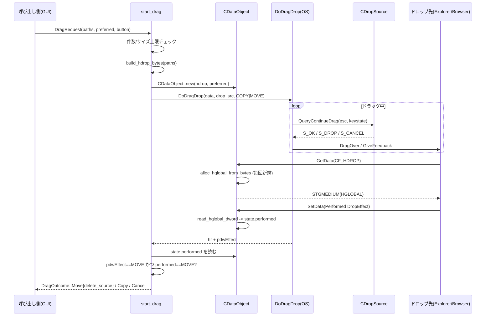

<!-- meta: Domain: Windows shell integration - shell/shell_assoc/win_clipboard/icons/ole_dnd -->

# 第5章: ドメイン層 — Windows シェル統合

## Sources Read
- `crates/fastfiler-domain/src/shell.rs` (lines 1-362)
- `crates/fastfiler-domain/src/shell_assoc.rs` (lines 1-167)
- `crates/fastfiler-domain/src/win_clipboard.rs` (lines 1-279)
- `crates/fastfiler-domain/src/icons.rs` (lines 1-276)
- `crates/fastfiler-domain/src/ole_dnd.rs` (lines 1-849)

## 5.1 この章が扱う範囲

この章は、`fastfiler-domain` クレートのうち Windows シェルとの統合を担う 5 ファイルを対象にする。
いずれも `windows` クレート（Win32 / COM バインディング）を直接呼び出し、本文のほぼ全域が `unsafe` で書かれている。
扱う機能は次の 5 つに分けられる。

- シェル操作とコンテキストメニュー：`shell.rs`（`ShellExecuteW`、`IContextMenu`、`SHObjectProperties`）
- ファイルタイプ関連付け：`shell_assoc.rs`（`HKCU` レジストリへの ProgID 書き込み）
- ファイルのクリップボード切り取り／コピー／貼り付け：`win_clipboard.rs`（`CF_HDROP` と Preferred DropEffect）
- アイコン抽出：`icons.rs`（`SHGetFileInfoW` と `HICON` から PNG への変換）
- OLE ドラッグアンドドロップ：`ole_dnd.rs`（`IDataObject` / `IDropSource` / `IDropTarget` 実装）

この章のインベントリは 69 ユニットで、本仕様書の中で最大の章である。
量の大半を `ole_dnd.rs`（送信側と受信側の COM 実装）が占める。
COM のオブジェクト寿命、HGLOBAL の所有権、STA スレッドの制約という 3 つの主題が全ファイルを貫いている。
以下では機能ごとに、実際に呼んでいる COM インタフェースと、コードが守ろうとしている安全性の不変条件を読み解いていく。

各ファイルは `#[cfg(windows)]` と `#[cfg(not(windows))]` で二重化されており、非 Windows では `AppError::NotSupported` 等を返すスタブになっている。
`ole_dnd.rs` はファイル先頭で `#![cfg(windows)]` を宣言し、ファイルごと Windows 専用としている [REF: crates/fastfiler-domain/src/ole_dnd.rs:21-46]。
この章では Windows 側の実装だけを読む。

## 5.2 ShellExecuteW による既定アプリ起動とエクスプローラ表示

`shell.rs` の中核は `win::shell_exec` で、`ShellExecuteW` を 1 回呼ぶだけの薄いラッパである [REF: crates/fastfiler-domain/src/shell.rs:268-303]。
引数 `op`（verb）、`file`、`args`、`cwd` をそれぞれ `wide()` でワイド文字列化し、`None` のものは `PCWSTR::null()` に落として渡す。
戻り値 `hinst` の整数値が 32 以下なら失敗とみなし、`AppError::Win32` を返す [REF: crates/fastfiler-domain/src/shell.rs:296-301]。
これは `ShellExecuteW` の歴史的な API 仕様（成功時は 32 より大きい疑似 HINSTANCE を返す）に従った判定である。

`open_with_shell` は、起動前に拡張子を見て verb を選び分ける点に意味がある [REF: crates/fastfiler-domain/src/shell.rs:130-157]。
ディスクイメージ（`iso` / `img` / `vhd` / `vhdx`）には `"mount"` verb を、Office テンプレート（`xltx` / `dotx` / `potx` など）には `None`（レジストリ既定 verb）を、それ以外には `"open"` を割り当てる。
テンプレートに `"open"` を明示するとテンプレート自体が編集モードで開いてしまうため、既定 verb（通常は "new"）に委ねている、とコメントが説明している。

作業ディレクトリの扱いにも、エクスプローラのダブルクリック挙動を再現する意図がある [REF: crates/fastfiler-domain/src/shell.rs:149-156]。
通常はファイルの親フォルダを `cwd` に渡し、`.bat` 等が相対パスを期待どおりに解決できるようにする。
ただし `.lnk` / `.url`（ショートカット自身が作業フォルダを持つ）とディレクトリ（`explorer` 起動で cwd が無意味）は例外として `cwd` を `None` にする。

`reveal_in_explorer` は `explorer.exe /select,"<path>"` を `shell_exec` で起動し、対象を選択状態にしてフォルダを開く [REF: crates/fastfiler-domain/src/shell.rs:207-219]。
`show_properties` は `SHObjectProperties` でプロパティダイアログを開く [REF: crates/fastfiler-domain/src/shell.rs:335-354]。
`SHOP_FILEPATH` を指定し、戻り値が `FALSE` のときだけエラーにする。

### STA スレッドへの隔離（UI スレッド再入の回避）

`shell.rs` の設計上の要点は、`ShellExecuteW` と `SHObjectProperties` を UI スレッドで直接呼ばないことである。
`open_with_shell_async` / `show_properties_async` は専用スレッドを立て、その中で `CoInitializeEx(COINIT_APARTMENTTHREADED | COINIT_DISABLE_OLE1DDE)` を呼んで STA を作る [REF: crates/fastfiler-domain/src/shell.rs:306-332]。
処理後は `CoUninitialize` で対になって解放する。

なぜ別スレッドかという理由が、`open_with_shell_async` のドキュメントコメントに明記されている [REF: crates/fastfiler-domain/src/shell.rs:165-180]。
`ShellExecuteW` は関連付け先（Office の DDE 起動など）の都合でメッセージポンプを回すことがあり、GUI の update サイクル中に直接呼ぶと wndproc が再入して "RefCell already borrowed" の panic を引き起こす。
これは後述の `DoDragDrop` と同種の再入問題であり、シェル API をすべて別スレッドに隔離するという一貫した方針につながっている。

`launch_with_shell` は任意の実行ファイルを STA スレッドで起動し、`join` して結果を返す [REF: crates/fastfiler-domain/src/shell.rs:189-205]。
`CreateProcess` 直接起動ではなく `ShellExecuteW` を経由する理由は、コンソールアプリ（powershell 等）が自分の新しいコンソールへ正しく接続されるようにするためだ、とコメントが述べている。
`CreateProcess` 直接起動では親の標準ハンドルが継承され、新しいウィンドウは開くが入出力は親側に残り、開いた直後に閉じてしまうという症状が出る。

文字列変換の `wide()` ヘルパは `OsStr::encode_wide` に NUL を 1 つ追加するだけの定型で、`shell.rs` の各所で使い回される [REF: crates/fastfiler-domain/src/shell.rs:261-266]。
`shell_exec` は `op` / `args` / `cwd` の `Option` をそれぞれ `map(wide)` で一時バッファに保持し、その参照から `PCWSTR` を作る。
一時バッファを関数スコープに束縛してから `PCWSTR` を渡すことで、`ShellExecuteW` 呼び出し中にバッファが解放される危険を避けている。

[CONFIDENCE: HIGH] STA 隔離の動機（wndproc 再入による RefCell panic）はコメントに明示されており、コード構造とも整合している。

## 5.3 シェルコンテキストメニュー（IContextMenu）と PIDL のライフサイクル

`show_shell_context_menu` は、Windows 標準の右クリックメニューをカーソル位置に出し、選んだコマンドを実行する [REF: crates/fastfiler-domain/src/shell.rs:19-29]。
GUI 非依存にするため `HWND` を `isize` で受け取り、内部で `HWND(hwnd_raw as *mut c_void)` に復元している [REF: crates/fastfiler-domain/src/shell.rs:32-48]。

この関数の難所は PIDL（`ITEMIDLIST`）の確保と解放である。
各パスを `SHParseDisplayName` で絶対 PIDL に変換し、`abs_pidls` に積む [REF: crates/fastfiler-domain/src/shell.rs:54-71]。
途中で 1 つでも失敗したら、そこまでに確保済みの PIDL を `free_all`（`ILFree` のループ）で解放してからエラーを返す。
これは Rust の RAII ではなく手書きのクリーンアップであり、`free_all` を成功経路・失敗経路の両方で呼ぶことで漏れを防いでいる [REF: crates/fastfiler-domain/src/shell.rs:73-118]。

メニュー本体の取得は、先頭項目の親フォルダへ `SHBindToParent` でバインドして `IShellFolder` を得るところから始まる [REF: crates/fastfiler-domain/src/shell.rs:74-87]。
複数選択は同一フォルダ前提であり、各項目の相対 PIDL を `ILFindLastID` で取り出して `GetUIObjectOf` に渡し、`IContextMenu` を得る。
`CreatePopupMenu` で空メニューを作り、`QueryContextMenu(menu, 0, 1, 0x7fff, CMF_NORMAL)` でシェル項目を流し込む [REF: crates/fastfiler-domain/src/shell.rs:89-92]。
コマンド ID の範囲を 1 始まり `0x7fff` までとしている点に注意する。

選択結果の取得と実行は `TrackPopupMenuEx` と `InvokeCommand` で行う [REF: crates/fastfiler-domain/src/shell.rs:94-110]。
`TPM_RETURNCMD` を指定してメニューの戻り値としてコマンド ID を受け取り、ID が正なら `CMINVOKECOMMANDINFO` を組んで実行する。
`lpVerb` には `(id - 1)` を `MAKEINTRESOURCE` 相当のポインタとして詰めている（`QueryContextMenu` の idCmdFirst を 1 にしたため、ゼロ始まりのオフセットへ戻す補正）。
メニューは `DestroyMenu` で必ず破棄され、最後に `free_all(&abs_pidls)` で全 PIDL を解放する。

`show_shell_context_menu` のドキュメントには既知の制限も書かれている [REF: crates/fastfiler-domain/src/shell.rs:11-18]。
`IContextMenu2` / `IContextMenu3` のメッセージ転送を実装していないため、「新規作成」などの動的サブメニューは表示されないことがある。

```rust
// shell.rs: QueryContextMenu → TrackPopupMenuEx → InvokeCommand
pcm.QueryContextMenu(menu, 0, 1, 0x7fff, CMF_NORMAL)
    .map_err(|e| AppError::Win32(format!("QueryContextMenu: {e}")))?;

let mut pt = POINT::default();
let _ = GetCursorPos(&mut pt);
let cmd =
    TrackPopupMenuEx(menu, (TPM_RETURNCMD | TPM_RIGHTBUTTON).0, pt.x, pt.y, hwnd, None);

let id = cmd.0;
if id > 0 {
    let info = CMINVOKECOMMANDINFO {
        cbSize: std::mem::size_of::<CMINVOKECOMMANDINFO>() as u32,
        lpVerb: PCSTR((id as usize - 1) as *const u8), // MAKEINTRESOURCE
        nShow: SW_SHOWNORMAL.0,
        hwnd,
        ..Default::default()
    };
    pcm.InvokeCommand(&info)?;
}
```

[CONFIDENCE: MED] `0x7fff` という ID 上限と `id - 1` 補正の対応は読み取れるが、`IContextMenu2/3` 未実装による副作用の全範囲（どの verb が壊れるか）はコードからは確定できない。
[ASK SME] 動的サブメニュー非対応は許容範囲の制限か、将来 `IContextMenu3` を実装する予定があるか。

## 5.4 ファイルタイプ関連付け（shell_assoc.rs）

`shell_assoc.rs` は COM ではなくレジストリ操作で、フォルダのオープンハンドラを `fastfiler.exe` に差し替える [REF: crates/fastfiler-domain/src/shell_assoc.rs:1-8]。
`winreg` クレートを使い、書き込み先を `HKEY_CURRENT_USER`（HKCU）に限定するため管理者権限を要しない。
HKCU の `Software\Classes` は HKCR より優先されるので、HKCU 側のキーを消すだけで既定が復帰するという設計になっている。

`shell_assoc_enable` は `Folder` と `Directory` の 2 つの ProgID について、`shell\open` ツリーを書き換える [REF: crates/fastfiler-domain/src/shell_assoc.rs:27-75]。
コマンド値は `build_command_value` が組み立てる `"<exe>" "%1"` 形式である [REF: crates/fastfiler-domain/src/shell_assoc.rs:22-24]。
ここで実装上の肝になるのが、`DelegateExecute` と `ddeexec` を空文字で上書きする処理である [REF: crates/fastfiler-domain/src/shell_assoc.rs:49-72]。
HKCR 側の既定ハンドラ（CLSID デリゲートと DDE 起動）を空文字で打ち消さないと、フォルダのダブルクリックや Excel のリンクが Explorer に流れてしまう、とコメントが述べている。

状態判定の `shell_assoc_status` は、各 ProgID の `shell\open\command` の既定値が現在の exe の期待コマンドと一致するかを `eq_ignore_ascii_case` で照合する [REF: crates/fastfiler-domain/src/shell_assoc.rs:78-94]。
どちらか一方でも不一致なら `false` を返す（両方一致して初めて有効とみなす）。

`shell_assoc_disable` は `delete_subkey_all` で `shell\open` ツリーを根こそぎ削除し、続けて親キー（`shell`、ProgID 本体）を段階的に削除する [REF: crates/fastfiler-domain/src/shell_assoc.rs:112-128]。
親が空でなければ削除は失敗するが、その失敗は `let _ =` で握りつぶして他キーを温存する。
`shell_assoc_diagnose` は 3 つのサブキー（`shell\open`、`shell\open\command`、`shell\open\ddeexec`）の既定値と `DelegateExecute` を文字列に整形して返す診断用関数である [REF: crates/fastfiler-domain/src/shell_assoc.rs:131-161]。

なお、このファイルには `shell_assoc_enable` という同名関数が `cfg(not(windows))` 版を含めて複数定義されている [REF: crates/fastfiler-domain/src/shell_assoc.rs:96-109]。
インベントリ上 INV-128 / INV-130 として現れる 2 つの非 Windows スタブは、いずれも `Err("Windows only")` を返す重複定義である。
これはおそらく編集の名残であり、`cfg` で 1 つしか有効化されないため実害はないが、ソース上は冗長である。

[CONFIDENCE: HIGH] レジストリのキー構造と空文字オーバーライドの意図はコメントとコードで一致している。
[ASSUMED: 非 Windows スタブの重複は意図的な仕様ではなく編集の残骸]
[ASK SME] HKCU の `Software\Classes` 優先が、ターゲットとする全 Windows バージョン（10/11）で同じ挙動を取る前提でよいか。

## 5.5 クリップボードによるファイルの切り取り／コピー／貼り付け（win_clipboard.rs）

`win_clipboard.rs` は、エクスプローラと相互運用できる形でファイルパスをクリップボードへ載せる。
書き込みの単位は 2 つのフォーマットの組である [REF: crates/fastfiler-domain/src/win_clipboard.rs:1-12]。

- `CF_HDROP`：`DROPFILES` ヘッダの後ろにワイド文字のパス群をダブル NUL 終端で連結したもの
- "Preferred DropEffect"（`RegisterClipboardFormatW` で登録する文字列フォーマット）：DWORD 1 = COPY、2 = MOVE

### CF_HDROP の組み立てと HGLOBAL 確保

`write_paths_win` はまず各パスのスラッシュをバックスラッシュへ正規化し、`encode_utf16` で連結したうえで末尾にダブル NUL を置く [REF: crates/fastfiler-domain/src/win_clipboard.rs:43-56]。
`DROPFILES` のサイズ + ペイロードのバイト数で `GlobalAlloc(GHND, total)` を呼び、`GlobalLock` でロックした先頭に `DROPFILES` を書き込む [REF: crates/fastfiler-domain/src/win_clipboard.rs:58-82]。
`pFiles` にヘッダサイズ（ワイド配列の開始オフセット）、`fWide` に `true` を設定し、ヘッダ直後へワイド配列を `copy_nonoverlapping` でコピーする。

```rust
// win_clipboard.rs: DROPFILES ヘッダの書き込み（unsafe ブロック内）
let df = p as *mut DROPFILES;
(*df).pFiles = dropfiles_size as u32;
(*df).pt = std::mem::zeroed();
(*df).fNC = false.into();
(*df).fWide = true.into();
// ワイド文字配列をコピー
let dst = p.add(dropfiles_size) as *mut u16;
std::ptr::copy_nonoverlapping(wide_paths.as_ptr(), dst, wide_paths.len());
let _ = GlobalUnlock(h_drop);
```

Preferred DropEffect 用の DWORD は別の `GlobalAlloc` で確保し、`op` が `"cut"` または `"move"` なら 2、それ以外なら 1 を書き込む [REF: crates/fastfiler-domain/src/win_clipboard.rs:84-100]。
クリップボードへの登録は `OpenClipboard` → `EmptyClipboard` → `SetClipboardData` の順で、`CF_HDROP` と `RegisterClipboardFormatW("Preferred DropEffect")` の 2 回行う [REF: crates/fastfiler-domain/src/win_clipboard.rs:102-126]。
`SetClipboardData` 成功後の HGLOBAL の所有権はクリップボード（OS）へ移るため、ここでは解放しない。
`OpenClipboard` から `CloseClipboard` までをクロージャで囲み、内部のエラーに関わらず最後に必ず `CloseClipboard` する構造になっている。

ロック失敗時の HGLOBAL 解放については、コードがあえて省略していると明記している [REF: crates/fastfiler-domain/src/win_clipboard.rs:66-71]。
`GlobalLock` 失敗は極めて稀であり、`SetClipboardData` 成功までの一時的なリークは許容する、という判断である。

### 貼り付け側の読み出し

`clipboard_read_paths` は `CF_HDROP` が利用可能かを `IsClipboardFormatAvailable` で確認してから読む [REF: crates/fastfiler-domain/src/win_clipboard.rs:163-176]。
`GetClipboardData` で得た `HDROP` に対し `DragQueryFileW(hdrop, 0xFFFFFFFF, None)` で件数を取り、各インデックスについて必要長を問い合わせてからバッファを確保して書き出す [REF: crates/fastfiler-domain/src/win_clipboard.rs:177-191]。
続いて Preferred DropEffect を読み、値が 2 なら `op = "cut"`、それ以外は既定の `"copy"` とする [REF: crates/fastfiler-domain/src/win_clipboard.rs:193-211]。
戻り値の `ClipboardPaths` は `serde::Serialize` 可能な struct で、`paths` と `op`（"copy" | "cut"）を持つ [REF: crates/fastfiler-domain/src/win_clipboard.rs:133-138]。

`clipboard_write_text` / `write_text_win` はプレーンテキストを `CF_UNICODETEXT` で書き込む補助で、改行を CRLF に正規化してから NUL 終端し、`GlobalAlloc` → `SetClipboardData` する [REF: crates/fastfiler-domain/src/win_clipboard.rs:247-277]。
読み出しの `GlobalLock` / `GlobalUnlock` は、ロックしてポインタを使い終えたら必ず `GlobalUnlock` する対で書かれている。

クリップボードの所有権モデルは、書き込みと読み出しで非対称である。
書き込み側は `SetClipboardData` 成功後に HGLOBAL の所有権を OS へ手放すため、自分で解放しない。
読み出し側は `GetClipboardData` で得たハンドルの所有権を受け取らないため、解放してはならず、`GlobalLock` / `GlobalUnlock` でロック区間だけを管理する。
この区別を取り違えると、書き込み側では二重解放、読み出し側では他プロセスのデータ破壊につながる。

[CONFIDENCE: HIGH] CF_HDROP と Preferred DropEffect の組み合わせはコメントと実装が一致している。
[CONFIDENCE: MED] ロック失敗時のリーク許容は意図的だが、長期稼働でのリーク総量はコードからは評価できない。

## 5.6 アイコン抽出（icons.rs）

`icons.rs` は `SHGetFileInfoW` でエクスプローラと同じアイコンを取り、PNG バイト列に変換する [REF: crates/fastfiler-domain/src/icons.rs:1-7]。
公開 API は `system_icon_png`（パスまたは拡張子から）と `folder_icon_png`（フォルダ用）の 2 つで、いずれも `Arc<Vec<u8>>` を返す [REF: crates/fastfiler-domain/src/icons.rs:250-275]。

結果は `LruCache`（容量 256、`once_cell::Lazy<Mutex<_>>`）でキャッシュされる [REF: crates/fastfiler-domain/src/icons.rs:34-53]。
キャッシュキーは `ext_only` のとき拡張子（小文字化）、そうでなければパス（小文字化）に、大小（`+` / `-`）とフォルダ印（`d`）を付ける。
拡張子モードでは同じ拡張子のファイルが 1 エントリを共有できるので、ディレクトリ一覧のアイコン解決が安価になる。

`do_get` は `SHGFI_ICON` に大小フラグ（`SHGFI_LARGEICON` / `SHGFI_SMALLICON`）を合わせて指定する [REF: crates/fastfiler-domain/src/icons.rs:90-128]。
`ext_only` のときは `SHGFI_USEFILEATTRIBUTES` を加え、実ファイルなしで拡張子（またはディレクトリ属性）からアイコンを解決する。
`SHGetFileInfoW` の戻り値が 0 か `hIcon` が null ならエラー、成功なら `hicon_to_png` で変換した後 `DestroyIcon` で `HICON` を解放する。

```rust
// icons.rs: SHGetFileInfoW 呼び出し（ext_only で実ファイル不要）
let r = SHGetFileInfoW(
    PCWSTR(wpath.as_ptr()),
    windows::Win32::Storage::FileSystem::FILE_FLAGS_AND_ATTRIBUTES(attrs),
    Some(&mut info as *mut _),
    std::mem::size_of::<SHFILEINFOW>() as u32,
    flags,
);
if r == 0 || info.hIcon.0.is_null() {
    return Err(AppError::Other(format!("SHGetFileInfoW failed for {}", path)));
}
let png = hicon_to_png(info.hIcon)?;
let _ = DestroyIcon(info.hIcon);
```

### HICON から PNG への変換と GDI リソースの RAII

`hicon_to_png` は GDI を直接叩いてビットマップを取り出す [REF: crates/fastfiler-domain/src/icons.rs:130-175]。
まず `GetIconInfo` で `ICONINFO` を取り、カラービットマップ（`hbmColor`）とマスクビットマップ（`hbmMask`）を得る。
`GetDC` で画面 DC を取り、`GetDIBits` を 2 段階で呼ぶ。
1 回目はサイズ問い合わせ（高さ 0、バッファ None）、2 回目は 32bit BGRA・トップダウン（`biHeight = -(h)`）でピクセルを読む。

DC の解放は、このファイル末尾で定義する自前の `ScopeGuard` で RAII 化している [REF: crates/fastfiler-domain/src/icons.rs:234-246]。
`ScopeGuard::new(closure)` を変数に束縛し、スコープ離脱時の `Drop` で `ReleaseDC` を呼ばせる [REF: crates/fastfiler-domain/src/icons.rs:142-145]。
カラー／マスクのビットマップは、変換クロージャの結果を受け取った後に `DeleteObject` で解放する [REF: crates/fastfiler-domain/src/icons.rs:225-231]。

アルファ合成の補正にも実用上の工夫がある [REF: crates/fastfiler-domain/src/icons.rs:176-208]。
カラービットマップのアルファが全画素 0（アルファ未設定の古いアイコン）で、かつマスクが有効なら、マスクビットマップを別途読み、マスク値 0 の画素を不透明（255）、それ以外を透明（0）に設定する。
最後に BGRA を RGBA へスワップし（`px.swap(0, 2)`）、`image::RgbaImage::from_raw` 経由で PNG にエンコードする [REF: crates/fastfiler-domain/src/icons.rs:209-222]。

[CONFIDENCE: HIGH] GDI ハンドルの解放（`DestroyIcon` / `DeleteObject` / `ReleaseDC`）はそれぞれ対応する確保に対して漏れなく書かれている。
[CONFIDENCE: MED] 全アルファ 0 をマスク適用のトリガにするヒューリスティックは、正規の半透明アイコンを誤判定しうるが、実際の頻度はコードからは不明。

## 5.7 OLE ドラッグアンドドロップ（ole_dnd.rs）

`ole_dnd.rs` はこの章の中心で、FastFiler から外部アプリ（エクスプローラ、ブラウザ等）へのドラッグ送信と、外部からの受信の両方を COM で実装している。
ファイル冒頭のコメントが設計の核を述べている [REF: crates/fastfiler-domain/src/ole_dnd.rs:1-19]。
送信側が提供するのは `CF_HDROP`（パス一覧）と `CFSTR_PREFERREDDROPEFFECT`（推奨効果）であり、移動後の元削除は厳格な二条件でのみ行う。

### 送信側のデータ構造と HGLOBAL ヘルパ

`build_hdrop_bytes` は `CF_HDROP` のバイト列を作る [REF: crates/fastfiler-domain/src/ole_dnd.rs:90-117]。
`win_clipboard.rs` と同じく、スラッシュ正規化・ワイド連結・ダブル NUL 終端の後、`DROPFILES` ヘッダ（`fWide=1`）を先頭に書く。
クリップボード版との違いは、これがクリップボードではなく `IDataObject::GetData` の戻り値として都度生成される点である。

HGLOBAL の確保は `alloc_hglobal_from_bytes` に集約されている [REF: crates/fastfiler-domain/src/ole_dnd.rs:123-136]。
`GlobalAlloc(GHND, len)` → `GlobalLock` → `copy_nonoverlapping` → `GlobalUnlock` という定型を踏み、新しい `HANDLE` を返す。
コメントが「毎回新規 alloc。use-after-free 回避」と明記しているとおり、`GetData` を呼ばれるたびに別の HGLOBAL を返すことで、消費側の解放と送信側の所有が衝突しないようにしている [REF: crates/fastfiler-domain/src/ole_dnd.rs:119-122]。

`read_hglobal_dword` は受信した HGLOBAL から DWORD を読むが、その前に `GlobalSize(h) < 4` を検査する [REF: crates/fastfiler-domain/src/ole_dnd.rs:143-161]。
規約違反やなりすましのドロップ先が 4 バイト未満の HGLOBAL を渡してきた場合に、範囲外読み取りを起こさないための防御である。
これは「相手の COM 実装を信用しない」という、この章を通じた一貫した姿勢の一例である。

### CDataObject（IDataObject 実装）

`CDataObject` は `#[implement(IDataObject)]` で COM オブジェクトとして実装される [REF: crates/fastfiler-domain/src/ole_dnd.rs:291-312]。
内部状態 `DataState`（`hdrop_bytes`、`preferred`、受信した `performed` / `logical_performed`）を `Arc<Mutex<_>>` で保持する [REF: crates/fastfiler-domain/src/ole_dnd.rs:282-289]。
`Mutex` で包むのは、ドロップ先が `SetData` で書き込む値（Performed DropEffect）を、送信スレッドが `DoDragDrop` 後に読むという、別経路からのアクセスがあるためである。

`GetData` は要求された `FORMATETC` を検証し、`CF_HDROP` ならパス列、Preferred フォーマットなら `preferred` の DWORD を返す [REF: crates/fastfiler-domain/src/ole_dnd.rs:334-361]。
`dwAspect` が `DVASPECT_CONTENT` でない、または `tymed` に `TYMED_HGLOBAL` が立っていなければ `DV_E_FORMATETC` を返す。
返す `STGMEDIUM` は `alloc_hglobal_from_bytes` で都度確保し、`pUnkForRelease` を `None` にして消費側に解放を委ねる。

```rust
// ole_dnd.rs: IDataObject::GetData の STGMEDIUM 構築
unsafe {
    let h = alloc_hglobal_from_bytes(&bytes).map_err(|e| {
        windows::core::Error::new(E_OUTOFMEMORY, e.to_string())
    })?;
    let mut medium: STGMEDIUM = std::mem::zeroed();
    medium.tymed = TYMED_HGLOBAL.0 as u32;
    medium.u = STGMEDIUM_0 {
        hGlobal: windows::Win32::Foundation::HGLOBAL(h.0),
    };
    medium.pUnkForRelease = std::mem::ManuallyDrop::new(None);
    Ok(medium)
}
```

`SetData` は、ドロップ先からの Performed / LogicalPerformed DropEffect を受け取って状態に格納する [REF: crates/fastfiler-domain/src/ole_dnd.rs:396-419]。
`read_hglobal_dword` で安全に DWORD を取り出し、フォーマット ID（`cf_perf` / `cf_log_perf`）に応じて `state.performed` / `state.logical_performed` を更新する。
これらフォーマット ID は `RegisterClipboardFormatA` で遅延登録される 3 つの文字列フォーマット（"Preferred DropEffect"、"Performed DropEffect"、"Logical Performed DropEffect"）から得る [REF: crates/fastfiler-domain/src/ole_dnd.rs:266-276]。
残りのメソッド（`GetDataHere`、`DAdvise` 等）は `E_NOTIMPL` / `OLE_E_ADVISENOTSUPPORTED` を返す最小実装で、`EnumFormatEtc` だけは `SHCreateStdEnumFmtEtc` に委譲する [REF: crates/fastfiler-domain/src/ole_dnd.rs:421-445]。

### CDropSource（IDropSource 実装）

`CDropSource` はドラッグ継続判定を担い、`button_mask`（`MK_LBUTTON` か `MK_RBUTTON`）だけを持つ [REF: crates/fastfiler-domain/src/ole_dnd.rs:451-455]。
`QueryContinueDrag` は、ESC が押されたら `DRAGDROP_S_CANCEL`、対象ボタンが離れたら（`grfkeystate & button_mask == 0`）`DRAGDROP_S_DROP`、それ以外は `S_OK` を返す [REF: crates/fastfiler-domain/src/ole_dnd.rs:457-476]。
`GiveFeedback` は `DRAGDROP_S_USEDEFAULTCURSORS` を返し、カーソル描画を OS に任せる。
右ボタンドラッグ（`DragButton::Right`）に対応しているのは、ドロップ時にコピー／移動メニューを出す Windows 標準 UX を実現するためである [REF: crates/fastfiler-domain/src/ole_dnd.rs:71-77]。

### start_drag と DoDragDrop、そして「移動なら元を消す」の二条件

`start_drag` がドラッグループの入口である [REF: crates/fastfiler-domain/src/ole_dnd.rs:487-530]。
最初に件数（`MAX_PATHS = 10_000`）とペイロードサイズ（`MAX_PAYLOAD_BYTES = 16MiB`）の上限を検査し、超過時はエラーを返して UI フリーズと OOM を防ぐ [REF: crates/fastfiler-domain/src/ole_dnd.rs:482-505]。
`CDataObject` と `CDropSource` を生成して COM インタフェースに変換し、状態への参照 `state_handle` を `Arc::clone` で別途握ってから `DoDragDrop` を呼ぶ。
許可効果は `DROPEFFECT_COPY | DROPEFFECT_MOVE` である。

`DoDragDrop` の戻り値 `hr` で結果を分岐する [REF: crates/fastfiler-domain/src/ole_dnd.rs:531-552]。
`DRAGDROP_S_CANCEL` なら `DragOutcome::Cancel`、エラーなら `DragOutcome::Error`、ドロップ成功なら `pdwEffect`（`effect`）と Performed DropEffect の両方を見て最終判定に入る。

この最終判定が、ファイル全体で最も注意深く書かれた部分である [REF: crates/fastfiler-domain/src/ole_dnd.rs:554-571]。
`pdwEffect` に `DROPEFFECT_MOVE` が立っていても、元を削除してよいのはドロップ先が `CFSTR_PERFORMEDDROPEFFECT` で MOVE を明示したときだけとする。
理由はファイル冒頭にも書かれている [REF: crates/fastfiler-domain/src/ole_dnd.rs:10-17]。
Chrome 系や Firefox は AI チャットへの添付時に、こちらの推奨効果（MOVE）を `pdwEffect` にそのまま反響させてくるが、実際には移動していないため Performed DropEffect を送ってこない。
これを移動と信用して元を消すと「添付しただけでファイルが消える」というデータ損失になる。

```rust
// ole_dnd.rs: pdwEffect==MOVE かつ Performed==MOVE のときだけ delete_source=true
if (effect.0 & DROPEFFECT_MOVE.0) != 0 {
    let delete = matches!(performed, Some(p) if (p & DROPEFFECT_MOVE.0) != 0);
    Ok(DragOutcome::Move { delete_source: delete })
} else if (effect.0 & DROPEFFECT_COPY.0) != 0 {
    Ok(DragOutcome::Copy)
} else {
    Ok(DragOutcome::None)
}
```

`performed` は `state.performed.or(state.logical_performed)` で取り、どちらかが MOVE を示せば削除を許す [REF: crates/fastfiler-domain/src/ole_dnd.rs:540-543]。
判定結果は `DragOutcome::Move { delete_source }` として呼び出し側へ返り、呼び出し側はこのフラグが `true` のときだけ元を削除する責務を負う [REF: crates/fastfiler-domain/src/ole_dnd.rs:55-69]。

[CONFIDENCE: HIGH] 二条件削除の意図と実装はコメント・コードで強く裏付けられている。これはデータ損失防止の中核仕様である。

### OLE 初期化とドロップ時の修飾キー読み取り

OLE の初期化状態はプロセスグローバルの `AtomicBool OLE_AVAILABLE` で管理する [REF: crates/fastfiler-domain/src/ole_dnd.rs:580-627]。
`init_ole` は UI スレッドで一度だけ `OleInitialize(None)` を呼び、成功時のみ `OLE_AVAILABLE` を `true`（`Ordering::Release`）にする。
失敗時（別 apartment で初期化済みの `RPC_E_CHANGED_MODE` など）は `false` のままで、`is_ole_available` 経由で `start_drag` 呼び出しが抑止される。
`shutdown_ole` は `swap(false, AcqRel)` で一度だけ `OleUninitialize` する。

`drop_modifiers` は `GetKeyState(VK_CONTROL)` / `GetKeyState(VK_SHIFT)` で物理修飾キー状態を読む [REF: crates/fastfiler-domain/src/ole_dnd.rs:589-596]。
外部からのドラッグ中はキーボードフォーカスが相手側にあり、GUI フレームワークのイベント追跡では Ctrl/Shift が更新されない。
ドロップ処理は OLE の Drop コールバック中に同期実行されるため、この時点の物理状態をドロップ瞬間のキー状態とみなせる、とコメントが根拠を述べている。

### 受信側：CDropTarget（IDropTarget 実装）

受信側は `CDropTarget` が `#[implement(IDropTarget)]` で実装する [REF: crates/fastfiler-domain/src/ole_dnd.rs:657-681]。
`DropTargetCallbacks`（`on_enter` / `on_over` / `on_leave` / `on_drop`）を `Arc` で保持し、`cached_paths` を `Mutex<Vec<PathBuf>>` でキャッシュする [REF: crates/fastfiler-domain/src/ole_dnd.rs:644-662]。
生成時に `GetCurrentThreadId` を記録し、各メソッド先頭の `assert_thread` で UI スレッド以外からの呼び出しを `debug_assert` で検出する [REF: crates/fastfiler-domain/src/ole_dnd.rs:664-681]。

`DragEnter` は `IDataObject` から `extract_hdrop_paths` でパスを抽出し、空または `CF_HDROP` 非対応なら `*pdweffect = DROPEFFECT_NONE` を書いて受け付けない [REF: crates/fastfiler-domain/src/ole_dnd.rs:683-721]。
抽出できたパスは `cached_paths` に保存し、`on_enter` コールバックを `catch_unwind` で囲んで呼ぶ。
コールバックが返す希望効果 `desired` を `desired & allowed`（OS が渡した許可マスク）でマスクして `*pdweffect` に書き戻す。
`DragOver` は `cached_paths` を使って同様に処理し、`DragLeave` はキャッシュをクリアして `on_leave` を呼ぶ [REF: crates/fastfiler-domain/src/ole_dnd.rs:723-755]。

`Drop` は、`cached_paths` が空でも `IDataObject` から再抽出を試みる [REF: crates/fastfiler-domain/src/ole_dnd.rs:757-793]。
一部の送信側は Drop で初めてパスを確定させるため、という理由がコメントにある。
コールバックは全て `catch_unwind(AssertUnwindSafe(...))` で囲まれており、コールバック内 panic が COM 境界を越えて UB になるのを防いでいる。
panic 時は `DROPEFFECT_NONE` にフォールバックする。

### STGMEDIUM と登録の RAII

`extract_hdrop_paths` は `GetData(CF_HDROP)` の戻り値 `STGMEDIUM` を `StgMediumGuard` で包む [REF: crates/fastfiler-domain/src/ole_dnd.rs:182-218]。
`StgMediumGuard` の `Drop` が `ReleaseStgMedium` を呼ぶため、`tymed` 不一致や `GlobalLock` 失敗で早期 return しても解放漏れが起きない [REF: crates/fastfiler-domain/src/ole_dnd.rs:169-175]。
ロックした HGLOBAL から `DROPFILES` を読み、`fWide` に応じて `parse_paths_w`（UTF-16）または `parse_paths_a`（ANSI fallback）でダブル NUL 終端の文字列群をパスへ分解する [REF: crates/fastfiler-domain/src/ole_dnd.rs:221-260]。

ドロップターゲットの登録は `register_drop_target` が行う [REF: crates/fastfiler-domain/src/ole_dnd.rs:832-848]。
winit（floem-winit）が既に登録した `IDropTarget` を `RevokeDragDrop` で外し（未登録なら `DRAGDROP_E_NOTREGISTERED` を無視）、自前の `CDropTarget` を `RegisterDragDrop` で登録する。
戻り値の `DropTargetRegistration` は `_target: IDropTarget` を keep-alive として抱え込み、`Drop` 時に `IsWindow(hwnd)` を確認してから `RevokeDragDrop` する [REF: crates/fastfiler-domain/src/ole_dnd.rs:801-824]。
winit が WM_DESTROY 側で二重に Revoke しても `DRAGDROP_E_NOTREGISTERED` で無視されるため実害はない、とコメントが補足している。

[CONFIDENCE: HIGH] RAII（`StgMediumGuard`、`DropTargetRegistration`、`ScopeGuard`）はいずれも確保と解放が対応している。
[CONFIDENCE: MED] `assert_thread` は `debug_assert` のためリリースビルドでは無効化され、非 UI スレッドからの呼び出しは検出されない。
[ASK SME] 受信側コールバックが UI スレッドで同期実行される前提は、winit / floem の将来バージョンでも保証されるか。

## 5.8 OLE 送信ドラッグのデータフロー

送信側の流れを、`start_drag` から `DoDragDrop` のループ、ドロップ先の `SetData`、最終判定までの順に示す。



この図が示すとおり、削除可否の判定材料は 2 つの非同期な経路から集まる。
1 つは `DoDragDrop` の戻り値 `pdwEffect`、もう 1 つはドロップ先が `SetData` で `CDataObject` 内に書き込む Performed DropEffect である。
両者が揃って MOVE を示したときに限り `delete_source = true` になる。
この設計が、ブラウザ添付時のデータ損失を防ぐ中心的な仕組みである。

## 5.9 この章の安全性に関するまとめ

5 ファイルに共通する安全性の不変条件は次の 3 つに整理できる。

第一に、COM オブジェクトに渡す HGLOBAL は要求のたびに新規確保し、所有権を消費側へ明示的に委ねる [REF: crates/fastfiler-domain/src/ole_dnd.rs:119-136]。
これにより、同じメモリを複数の消費側が解放する二重解放と、解放後参照を避けている。

第二に、外部の COM 実装を信用せず、受信データは必ずサイズと型を検証してから読む [REF: crates/fastfiler-domain/src/ole_dnd.rs:143-161]。
`GlobalSize < 4` の検査や `tymed` の照合がその具体例である。

第三に、解放を要するハンドル（PIDL、HICON、GDI ビットマップ、DC、STGMEDIUM、ドロップ登録）は、RAII か成功・失敗両経路のクリーンアップで漏れなく解放する。
RAII を使う箇所（`StgMediumGuard`、`DropTargetRegistration`、`ScopeGuard`）と、手書きクリーンアップを使う箇所（`shell.rs` の PIDL `free_all`）が混在している。

UI スレッドとの関係も全ファイルを貫く制約である。
シェル API（`ShellExecuteW` / `SHObjectProperties`）は再入回避のため STA スレッドへ隔離し、OLE は UI スレッドで初期化して受信コールバックも UI スレッドで同期実行する前提を置いている。

<!-- DETAIL_QUESTIONS
- 1. shell.rs の show_shell_context_menu は IContextMenu2/3 のメッセージ転送を未実装としているが、「新規作成」等の動的サブメニュー非対応は許容仕様か、将来 IContextMenu3 を実装する計画があるか。
- 2. ole_dnd.rs の「移動なら元を削除」二条件（pdwEffect==MOVE かつ Performed DropEffect==MOVE）は、Explorer の最適化ムーブ（既に元を移動済みで performed=MOVE を返す）と通常移動を区別しないが、二重削除の空振りに依存する設計で十分か。呼び出し側の「元が既に存在しない」確認が必須前提という理解で正しいか。
- 3. CDropTarget の assert_thread は debug_assert のためリリースでは無効。受信コールバックが UI スレッドで同期実行される前提が winit / floem の更新で崩れた場合、検出手段がない。これはリスク受容か、ランタイム保証を追加すべきか。
- 4. shell_assoc.rs の Folder/Directory 関連付けは HKCU の Software\Classes 優先に依存する。Windows 10/11 双方および将来更新で同じ優先順位が保たれる前提でよいか。
- 5. icons.rs のアルファ全 0 判定でマスクを適用するヒューリスティックは、正規の完全透明アイコンを誤って不透明化しうる。実運用での誤判定頻度と許容範囲を確認したい。
- 6. win_clipboard.rs は GlobalLock 失敗時の HGLOBAL 解放を意図的に省略している。長期稼働でのリーク総量は無視できる前提か。
-->
