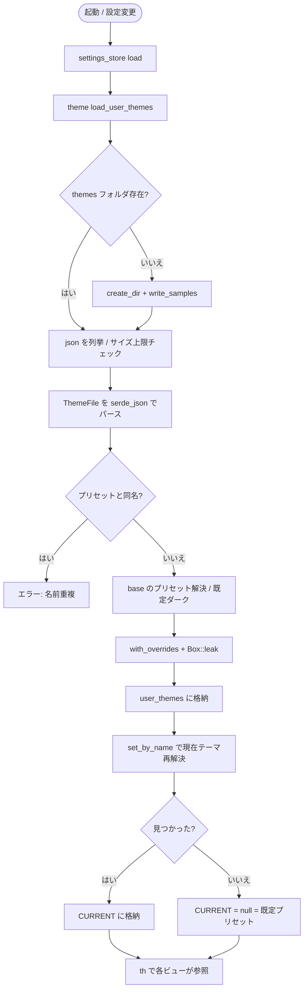
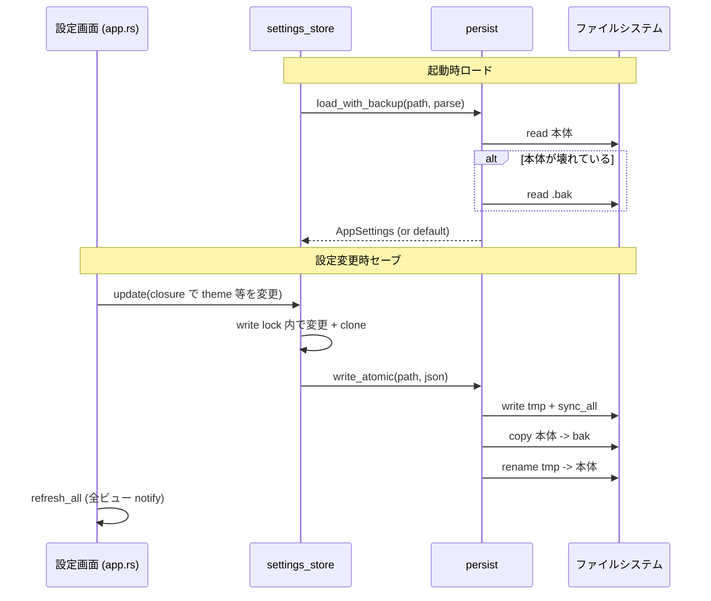

# 第10章: テーマと設定

本章は fastfiler の GUI 層 (`fastfiler-gpui` クレート) のうち、利用者が見た目と操作感をカスタマイズするための 3 つの仕組みを扱う。
すなわち、配色を司る **テーマシステム** (`theme.rs`)、アプリ全体の選好を永続化する **設定ストア** (`settings_store.rs`)、コマンド系キー割り当てを差し替える **ホットキー設定** (`hotkeys.rs`) である。
これら 3 つはいずれも `%APPDATA%\FastFiler\` 配下の JSON ファイルにユーザー設定を保存し、プロセス内では `static` 変数を介してどこからでも参照できるという共通構造を持つ。
本章では各ファイルの実コードを読み、スキーマ・デフォルト値・ロード/セーブ処理・テーマ解決アルゴリズム・変更伝播の流れを具体的に説明する。

割り当てられた棚卸し単位は 54 件 (INV-197〜INV-206 がホットキー、INV-256〜INV-266 が設定ストア、INV-281〜INV-313 がテーマ) で、いずれも上記 3 ファイルの公開面に対応する。
ロード/セーブの実体は別モジュール `persist.rs` のクラッシュ安全な書き込みユーティリティに委譲されているため、本章ではその連携部分も併せて読む (詳細仕様は第11章)。

## Sources Read
- `crates/fastfiler-gpui/src/theme.rs` (lines 1-646)
- `crates/fastfiler-gpui/src/settings_store.rs` (lines 1-112)
- `crates/fastfiler-gpui/src/hotkeys.rs` (lines 1-183)
- `crates/fastfiler-gpui/src/persist.rs` (lines 1-130)
- `crates/fastfiler-gpui/src/main.rs` (lines 28-87)
- `crates/fastfiler-gpui/src/app.rs` (lines 420-466, 947-957)
- `crates/fastfiler-gpui/src/pane.rs` (lines 940-979)

---

## 10.1 設定ストア (settings_store.rs)

### 10.1.1 設定の役割と保存先

設定ストアはアプリ全体の選好値を 1 つの構造体 `AppSettings` にまとめ、`%APPDATA%\FastFiler\gpui_settings.json` に保存する。
モジュール冒頭のコメントは、この設定が「セッション (レイアウト = `gpui_session.json`) とは別管理」であることを明言している。
つまり、どのフォルダをどのタブ・分割で開いていたかという揮発的な作業状態 (第11章) と、テーマやフォントサイズといった恒久的な選好値を、別ファイルに分離して持つ設計である。
これは「作業状態は頻繁に書き換わるが、選好値は設定画面 (⚙) からのみ変わる」という更新頻度の違いに対応した分割と読める。

### 10.1.2 スキーマと既定値

`AppSettings` は `Serialize` / `Deserialize` / `Clone` を導出する素直なフラット構造体である [REF: crates/fastfiler-gpui/src/settings_store.rs:12-35]。
各フィールドには `#[serde(default = ...)]` が付与され、JSON に該当キーが無くてもデフォルト値が補われる。
これにより、旧バージョンで書かれた設定ファイル (新フィールドを持たない) を読んでも欠損キーが既定値で埋まり、前方互換を保てる。

```rust
#[derive(Serialize, Deserialize, Clone)]
pub struct AppSettings {
    /// テーマ名 (プリセット)。None なら既定 (ダーク)。
    #[serde(default)]
    pub theme: Option<String>,
    /// Everything HTTP サーバのポート (検索連携)。
    #[serde(default = "default_port")]
    pub everything_port: u16,
    /// タブバーの列数 (1〜4)。並びは行優先 (1,2 / 3,4 / …)。
    #[serde(default = "default_tab_columns")]
    pub tab_columns: u8,
    /// タブバーに「ツリー」トグルボタンを表示するか。
    #[serde(default = "default_true")]
    pub show_tree_button: bool,
    /// UI フォントサイズ (px)。既定 16 (= 従来の見た目)。
    #[serde(default = "default_font_size")]
    pub font_size: f32,
    /// UI フォントファミリー。None ならシステム既定。
    #[serde(default)]
    pub font_family: Option<String>,
    /// UI スタイル名 (形状プリセット)。None なら既定 (モダン)。
    #[serde(default)]
    pub style: Option<String>,
}
```

各フィールドの意味は次のとおりである。

- `theme`: 選択中のテーマ名。`None` のときは既定のダークが使われる。テーマの解決自体は `theme.rs` 側で行われ、ここは名前文字列を保持するだけである。
- `everything_port`: 外部検索ツール Everything の HTTP サーバへ接続するポート番号。既定は 80 (`default_port`)。
- `tab_columns`: タブバーの列数 (1〜4)。並びは行優先と注記される。
- `show_tree_button`: タブバーにワークスペースツリーの開閉ボタンを出すか。既定 true。
- `font_size`: UI フォントサイズ (px)。既定 16。
- `font_family`: UI フォントファミリー。`None` でシステム既定。
- `style`: 形状プリセット (角丸の強さ) の名前。`None` で既定「モダン」。

既定値はフィールドごとに小さな関数として定義される [REF: crates/fastfiler-gpui/src/settings_store.rs:37-51]。
`default_true` が `true`、`default_port` が `80`、`default_tab_columns` が `1`、`default_font_size` が `16.0` を返す。
`#[serde(default = "...")]` 属性は関数名を文字列で受け取るため、これらは serde のための named-default 関数である。

`Default` トレイトの手書き実装は、これらの関数を呼んで初期値を組み立てる [REF: crates/fastfiler-gpui/src/settings_store.rs:53-65]。
`theme` / `font_family` / `style` は `None`、`show_tree_button` は `true` リテラル直書きで、残りは前述の default 関数を呼ぶ。
このため `AppSettings::default()` と「空 JSON をデシリアライズした結果」は一致する。
[CONFIDENCE: HIGH] スキーマとデフォルト値は単一ファイル内で完結しており、外部依存はない。

### 10.1.3 static ストアとアクセサ

設定値はプロセス内で 1 つの `RwLock<AppSettings>` に保持される [REF: crates/fastfiler-gpui/src/settings_store.rs:76-79]。
`store()` は `OnceLock` で遅延初期化される `static STORE` を返し、初期値は `AppSettings::default()` である。
この static 経由のアクセスにより、設定値は UI のどのコンポーネントからでも `settings_store::get()` で読める。
モジュールコメントが挙げる「検索の Everything ポート」がその好例で、ペイン側が `settings_store::get().everything_port` を直接引いている [REF: crates/fastfiler-gpui/src/pane.rs:940-979] のと同じパターンである。

保存先パスは `config_path()` が組み立てる [REF: crates/fastfiler-gpui/src/settings_store.rs:67-74]。
`APPDATA` 環境変数を起点に `FastFiler\gpui_settings.json` を連結し、環境変数が取れなければ `None` を返す。
このパス組み立ては `theme.rs` の `themes_dir()` や `hotkeys.rs` の `config_path()` と同型で、3 モジュールが同じ `%APPDATA%\FastFiler\` ディレクトリ規約を共有していることがわかる。

公開 API は 3 つに集約される。

- `load()`: 起動時に 1 回だけ呼び、ファイルから読み込んで static に格納し、その値を返す [REF: crates/fastfiler-gpui/src/settings_store.rs:82-91]。
- `get()`: 現在の設定のコピー (`clone`) を返す [REF: crates/fastfiler-gpui/src/settings_store.rs:94-96]。
- `update(f)`: クロージャで設定を書き換え、即座にファイルへ保存する [REF: crates/fastfiler-gpui/src/settings_store.rs:99-111]。

### 10.1.4 ロード処理 — クラッシュ安全な読み込み

`load()` は `config_path()` を取得したのち、`persist::load_with_backup` にパース関数を渡して読み込む。

```rust
pub fn load() -> AppSettings {
    let s = config_path()
        // 本体が壊れていれば .bak から復元する (電源断対策)。
        .and_then(|p| {
            crate::persist::load_with_backup(&p, |t| serde_json::from_str::<AppSettings>(t).ok())
        })
        .unwrap_or_default();
    *store().write().unwrap() = s.clone();
    s
}
```

ここで `load_with_backup` は本体ファイル → `.bak` の順にパースを試し、最初に成功した値を返す [REF: crates/fastfiler-gpui/src/persist.rs:62-71]。
本体が空 (0 バイト) や途中切れで `serde_json::from_str` が失敗した場合、直前の正常版である `.bak` を試す。
両方とも読めなければ `None` となり、呼び出し側の `.unwrap_or_default()` で既定設定にフォールバックする。
読み込んだ値は static ストアへ書き込んだうえで、コピーを返す (起動時に main 側で直接使うため)。
[CONFIDENCE: HIGH] この二段フォールバックは電源断時にタブ/設定が消える事故を防ぐためのものと、persist.rs 冒頭コメントが説明している。

### 10.1.5 セーブ処理 — read-modify-write とアトミック書き込み

`update()` は read-modify-write を 1 つの書き込みロック下で行い、ロックを離してからディスクへ書く [REF: crates/fastfiler-gpui/src/settings_store.rs:99-111]。

```rust
pub fn update(f: impl FnOnce(&mut AppSettings)) {
    let snapshot = {
        let mut s = store().write().unwrap();
        f(&mut s);
        s.clone()
    };
    if let Some(p) = config_path() {
        if let Ok(text) = serde_json::to_string_pretty(&snapshot) {
            // アトミック書き込み + .bak 退避 (電源断対策)。
            let _ = crate::persist::write_atomic(&p, &text);
        }
    }
}
```

注目すべき点は、ファイル I/O をロックスコープの外で行っていることである。
クロージャ `f` で state を更新し、その場でスナップショットを `clone` してロックを解放したのち、シリアライズとディスク書き込みを行う。
これにより、低速なディスク I/O 中に他スレッドが `get()` でブロックされることを避けている。
[CONFIDENCE: MED] ロックを早期解放する意図は明示コメントこそ無いが、スコープを限定したブロック式と `clone` の配置からそう読める。[ASSUMED: clone のコストよりロック保持時間短縮を優先した設計]

実際のディスク書き込みは `persist::write_atomic` が担う [REF: crates/fastfiler-gpui/src/persist.rs:28-56]。
この関数は (1) `*.tmp` へ書いて `sync_all` で物理ディスクまでフラッシュ、(2) 既存本体を `*.bak` へ複製、(3) `rename` で tmp を本体へアトミック置換、という 3 段で耐久性を確保する。
書き込み失敗は `let _ =` で握り潰され、設定保存はベストエフォート扱いになっている。
[CONFIDENCE: HIGH] 保存失敗を致命的に扱わない方針は write_atomic のドキュメントコメントとも一致する。

---

## 10.2 テーマシステム (theme.rs)

### 10.2.1 設計方針 — lock-free な現在テーマ

`theme.rs` のモジュールコメントは設計意図を明確に述べる。
`th()` で現在テーマを取得でき、static ベースなので「どこからでも (hover クロージャや TextElement の paint 内からでも) 参照できる」。
描画中に大量に呼ばれるため、現在テーマの参照は lock-free を維持する設計である。
テーマ (色) は (1) 組み込みプリセット 3 種、(2) `%APPDATA%\FastFiler\themes\*.json` のユーザーテーマ、の 2 系統からなる。
さらに「スタイル (形 = 角丸の強さ)」と「UI フォントサイズ」も同ファイルで管理され、これらは色とは直交する独立した選択として扱われる。

### 10.2.2 色トークンの単一情報源 — theme_colors! マクロ

配色パレットのフィールド一覧は `theme_colors!` マクロで 1 か所に定義される [REF: crates/fastfiler-gpui/src/theme.rs:24-59]。
このマクロは同じフィールド名リストから 3 つの成果物をまとめて生成する。

```rust
macro_rules! theme_colors {
    ($($field:ident),+ $(,)?) => {
        /// アプリ全体の配色パレット。
        #[derive(Clone)]
        pub struct Theme {
            pub name: &'static str,
            $(pub $field: Rgba,)+
        }

        /// テーマ JSON の色上書き (全フィールド任意、hex 文字列)。
        #[derive(Serialize, Deserialize, Default)]
        pub struct ThemeColors {
            $(
                #[serde(default, skip_serializing_if = "Option::is_none")]
                pub $field: Option<Rgba>,
            )+
        }

        impl Theme {
            fn with_overrides(&self, name: &'static str, c: &ThemeColors) -> Theme {
                Theme {
                    name,
                    $($field: c.$field.unwrap_or(self.$field),)+
                }
            }
            fn to_colors(&self) -> ThemeColors {
                ThemeColors {
                    $($field: Some(self.$field),)+
                }
            }
        }
    };
}
```

生成物は 3 つある。
第一に `Theme` 構造体 — 各色フィールドを `Rgba` 型 (不透明/半透明色) で持つ。
第二に `ThemeColors` 構造体 — JSON 上書き用に各フィールドを `Option<Rgba>` にした版で、`skip_serializing_if = "Option::is_none"` により未指定フィールドは書き出されない。
第三に `Theme::with_overrides` と `Theme::to_colors` — それぞれ「ベース色に上書きを適用」「全色を Some で書き出す」変換である。
コメントが述べるとおり、フィールドを増やすときはマクロ呼び出しに 1 行足すだけで、構造体・JSON 上書き・マージ・書き出しがすべて連動する。
[CONFIDENCE: HIGH] これは DRY を強制する典型的な declarative macro の使い方である。

実際の色フィールド一覧は背景・選択/インタラクション・アクセント・テキスト・半透明の 5 グループに分けて列挙される [REF: crates/fastfiler-gpui/src/theme.rs:61-75]。
`app_bg` / `pane_bg` / `row_even` / `row_odd` といった面の背景色、`sel_bg` / `hover_bg` / `drop_bg` といった状態色、`accent` / `accent_file` のアクセント、`text` 系 6 段階の文字色、`sel_translucent` / `overlay_bg` の半透明色などが含まれる。
合計でおおよそ 40 個前後の色トークンがあり、UI の各部品はこれらを名前で参照することで配色から具体的な hex を切り離している。

### 10.2.3 組み込みプリセット 3 種

プリセットは `dark()` / `light()` / `midnight()` の 3 関数が `Theme` リテラルを構築する [REF: crates/fastfiler-gpui/src/theme.rs:77-118]。
たとえばダークテーマは `app_bg: rgb(0x111111)` のような具体的 hex を全フィールドに与え、`name: "ダーク"` を持つ。
色値の生成には gpui の `rgb()` (不透明) と `rgba()` (アルファ付き) ヘルパを使う。

これら 3 つは `presets()` から `OnceLock<Vec<Theme>>` として初期化される [REF: crates/fastfiler-gpui/src/theme.rs:206-210]。
順序は `vec![dark(), light(), midnight()]` で、先頭のダークが既定テーマとなる。
ライト (`light()`) は反転した明色パレット、ミッドナイト (`midnight()`) は青みの強い暗色パレットで、いずれも同じ色トークン集合を別の hex で埋めたものである。

### 10.2.4 現在テーマの保持と解決 — th() / CURRENT / set_by_name

現在選択中のテーマは `AtomicPtr<Theme>` で保持される [REF: crates/fastfiler-gpui/src/theme.rs:217-228]。

```rust
static CURRENT: AtomicPtr<Theme> = AtomicPtr::new(std::ptr::null_mut());

/// 現在のテーマ。
pub fn th() -> &'static Theme {
    let p = CURRENT.load(Ordering::Relaxed);
    if p.is_null() {
        &presets()[0]
    } else {
        // SAFETY: CURRENT には presets() の要素か Box::leak した Theme しか入らない。
        unsafe { &*p }
    }
}
```

`th()` はポインタを `Ordering::Relaxed` でロードするだけの lock-free な読み出しである。
ポインタが null (未設定) なら先頭プリセット (ダーク) を返し、そうでなければ unsafe 参照で `Theme` を返す。
ここで unsafe が健全 (safe) なのは、`CURRENT` には「`presets()` の要素」か「`Box::leak` した `'static` なユーザーテーマ」しか格納しないという不変条件があるためである。
いずれも `'static` 寿命を持つので、参照を `&'static Theme` として返してもダングリングしない。
[CONFIDENCE: HIGH] SAFETY コメントが不変条件を明記しており、書き込み側 (`set_by_name` / `load_user_themes`) もそれを守っている。

テーマの選択は `set_by_name(name)` で行う [REF: crates/fastfiler-gpui/src/theme.rs:232-251]。
検索順は「プリセット → ユーザーテーマ」で、名前が重複した場合はプリセットが優先される (`or_else` の連鎖)。
見つかればそのポインタを `CURRENT.store(...)` で格納して `true` を、見つからなければ `false` を返す。
設定画面のコンボボックスに出す一覧は `all_themes()` が組み立て、プリセットの後にユーザーテーマを連結して返す [REF: crates/fastfiler-gpui/src/theme.rs:254-258]。

### 10.2.5 ユーザーテーマ — JSON ファイルからの読み込み

ユーザーテーマのファイル形式は `ThemeFile` 構造体で表される [REF: crates/fastfiler-gpui/src/theme.rs:263-273]。

```rust
/// テーマ JSON ファイルの形式。
#[derive(Serialize, Deserialize)]
struct ThemeFile {
    /// テーマ名 (コンボに表示)。
    name: String,
    /// ベースにするプリセット名 (省略時「ダーク」)。
    #[serde(default)]
    base: Option<String>,
    /// 上書きする色 (書いたものだけ反映)。
    #[serde(default)]
    colors: ThemeColors,
}
```

JSON は「`base` で指定したプリセットを土台に、`colors` で書いた色だけを上書きする」差分形式である。
`base` 省略時はダークが土台になる。
このため利用者は全色を書く必要がなく、変えたい数色だけを記述すればよい。

読み込みの本体は `load_user_themes()` である [REF: crates/fastfiler-gpui/src/theme.rs:289-358]。
処理の流れは次のとおりである。

1. `themes_dir()` (`%APPDATA%\FastFiler\themes`) を取得。ディレクトリが無ければ作成し、`write_samples()` でサンプルを生成する。
2. DoS 対策として上限を設ける。ファイル数 `MAX_THEME_FILES = 256`、1 ファイルあたり `MAX_THEME_BYTES = 256 KiB` [REF: crates/fastfiler-gpui/src/theme.rs:299-300]。
3. `*.json` を拡張子で抽出してソートし、件数を 256 件に切り詰める。
4. 各ファイルについて、サイズ超過なら読まずに「サイズ超過」エラーとして記録する。
5. 読めたものは `serde_json::from_str::<ThemeFile>` でパースし、失敗ならファイル名をエラーに積む。

パース成功後の解決ロジックが重要である [REF: crates/fastfiler-gpui/src/theme.rs:337-345]。
まずプリセットと同名のテーマは「名前重複」として弾く (プリセットが勝つため混乱防止)。
次に `base` 名でプリセットを引き当て、見つからなければ先頭プリセット (ダーク) を土台にする。
そして名前と `Theme` 本体をそれぞれ `Box::leak` で `'static` 化し、`base.with_overrides(name, &tf.colors)` で差分適用した最終テーマを得る。
`Box::leak` を使うのは、`th()` が `&'static Theme` を返すために寿命を `'static` まで延ばす必要があるからである。
コメントは「再読み込みのたびに旧テーマが微小リークするが、サイズ・頻度ともに許容」と、意図的なリークであることを認めている。
[CONFIDENCE: HIGH] リークは設計上の妥協として明記されている。[ASK SME] テーマ再読み込みを多数回繰り返すワークフローが想定されるなら、リーク量の上限について確認が要る。

読み込みの最後に、現在テーマを名前で引き直す [REF: crates/fastfiler-gpui/src/theme.rs:351-356]。
読み込み前に `th().name` を控えておき、新しいユーザーテーマ集合で `set_by_name(&current_name)` を試す。
これにより、JSON を編集して再読み込みした場合は新しい色が即反映され、現在テーマが削除されていた場合は `CURRENT` を null に戻して既定 (先頭プリセット) へフォールバックする。
戻り値は `(読込数, エラーのファイル名リスト)` で、設定画面がステータス表示に使う。

サンプル生成 `write_samples()` は themes フォルダの新規作成時のみ呼ばれる [REF: crates/fastfiler-gpui/src/theme.rs:362-403]。
「カスタム例」(ダークの全色入り、どのキーが弄れるか一覧になる)、「ノルド風」「ハイコントラスト」「セピア」の 4 サンプルを `serde_json::to_string_pretty` で書き出す。
利用者が削除したファイルは復活しない (フォルダが既に存在する場合は呼ばれないため)。
サンプルの色定義は `sample_nord()` / `sample_high_contrast()` / `sample_sepia()` がそれぞれ完全な `Theme` を返し、`to_colors()` で全色 Some の `ThemeColors` に変換してから書き出される。

### 10.2.6 スタイル (形状プリセット)

色とは独立した「形」の選択が `UiStyle` である [REF: crates/fastfiler-gpui/src/theme.rs:542-583]。

```rust
/// UI スタイル (形状プリセット)。
#[derive(Clone)]
pub struct UiStyle {
    pub name: &'static str,
    /// ボタン / パネル / ダイアログの角丸 (px)。
    pub radius_md: f32,
    /// メニュー項目 / 行ハイライトの角丸 (px)。
    pub radius_sm: f32,
}
```

現状は角丸の強さのみを持ち、`style_presets()` が「モダン」(md=6 / sm=4)、「シャープ」(0 / 0)、「ソフト」(10 / 6) の 3 種を返す。
現在のスタイルは `STYLE_IX: AtomicUsize` でインデックス管理され、`ui_style()` が範囲内に丸めて参照する。
テーマがポインタ (`AtomicPtr`) なのに対しスタイルはインデックス (`AtomicUsize`) で持つのは、スタイルが固定 3 プリセットでユーザー拡張を持たないためと考えられる。[ASSUMED: ユーザー定義スタイルの仕組みが無いのでインデックスで十分]

スタイル選択は `set_style_by_name(name)` がプリセット位置を `position` で探して `STYLE_IX` に格納する [REF: crates/fastfiler-gpui/src/theme.rs:586-593]。
角丸の実値は `radius_md()` / `radius_sm()` が現在スタイルから取り出して `Pixels` に変換して返す。
コメントにあるとおり、形は文字サイズと直交させ、フォントサイズには連動させない方針である。

### 10.2.7 UI フォントサイズのキャッシュ

フォントサイズは設定ストア (`RwLock`) ではなく `AtomicU32` に f32 のビット表現で持つ [REF: crates/fastfiler-gpui/src/theme.rs:611-630]。

```rust
pub const FONT_MIN: f32 = 10.0;
pub const FONT_MAX: f32 = 24.0;

static FONT_PX: AtomicU32 = AtomicU32::new(16.0f32.to_bits());

pub fn font_px() -> f32 {
    f32::from_bits(FONT_PX.load(Ordering::Relaxed))
}

pub fn set_font_px(size: f32) {
    let v = if size.is_finite() {
        size.clamp(FONT_MIN, FONT_MAX)
    } else {
        16.0
    };
    FONT_PX.store(v.to_bits(), Ordering::Relaxed);
}
```

これは描画ごとに大量参照される値を lock-free に読むための最適化で、テーマ (`AtomicPtr`) と同じ動機である。
`set_font_px` は非有限値 (NaN/Inf) を 16.0 に、範囲外を `FONT_MIN`..`FONT_MAX` (10〜24 px) にクランプしてから格納する。
このフォントサイズに連動して行高 `row_h()` (font + 8)、見出し高 `header_h()` (font + 6)、バー高 `bar_h()` (font + 18) が派生計算される [REF: crates/fastfiler-gpui/src/theme.rs:633-645]。
既定 16 px のとき従来の 24/22/34 px に一致するよう係数が決められている。

---

## 10.3 ホットキー (hotkeys.rs)

### 10.3.1 カスタマイズ可能なアクション

ホットキーは「コマンド系キー割り当て」のカスタマイズを担う。
設定ファイルは `%APPDATA%\FastFiler\gpui_hotkeys.json`、形式は `{ "action": "combo", ... }` で、combo は `ctrl+shift+n` / `f2` / `alt+left` のような文字列である。
モジュールコメントは、矢印などの移動系 (Shift で範囲選択拡張) とモーダル内の Enter/Esc は固定で、カスタマイズ対象外と明言する。

カスタマイズ可能なコマンドは `HotAction` enum で列挙される [REF: crates/fastfiler-gpui/src/hotkeys.rs:16-36]。

```rust
/// カスタマイズ可能なコマンド。
#[derive(Clone, Copy, PartialEq, Eq)]
pub enum HotAction {
    Open, Parent, Delete, Rename, NewFolder, NewFile, Refresh,
    Search, Undo, Copy, Cut, Paste, SelectAll,
    Back, Forward, NextPane, NextTab, PrevTab,
}
```

`Clone, Copy` を導出している点が示すとおり、これは軽量な値型として扱われる (`lookup` で `copied()` できる)。

### 10.3.2 既定割り当てテーブル

アクション名・enum・既定 combo の対応は `ACTIONS` 定数テーブルで一元管理される [REF: crates/fastfiler-gpui/src/hotkeys.rs:39-58]。

```rust
/// (設定キー名, アクション, 既定 combo)
const ACTIONS: &[(&str, HotAction, &str)] = &[
    ("open", HotAction::Open, "enter"),
    ("parent", HotAction::Parent, "backspace"),
    ("delete", HotAction::Delete, "delete"),
    ("rename", HotAction::Rename, "f2"),
    ("new-folder", HotAction::NewFolder, "f7"),
    ("new-file", HotAction::NewFile, "f8"),
    ("refresh", HotAction::Refresh, "f5"),
    ("search", HotAction::Search, "ctrl+f"),
    ("undo", HotAction::Undo, "ctrl+z"),
    ("copy", HotAction::Copy, "ctrl+c"),
    ("cut", HotAction::Cut, "ctrl+x"),
    ("paste", HotAction::Paste, "ctrl+v"),
    ("select-all", HotAction::SelectAll, "ctrl+a"),
    ("back", HotAction::Back, "alt+left"),
    ("forward", HotAction::Forward, "alt+right"),
    ("next-pane", HotAction::NextPane, "f6"),
    ("next-tab", HotAction::NextTab, "ctrl+tab"),
    ("prev-tab", HotAction::PrevTab, "ctrl+shift+tab"),
];
```

このテーブルが「JSON のキー名」「内部アクション」「既定値」の単一情報源で、サンプル生成・読み込み・フォールバックのすべてが同じテーブルを走査する。
既定値は Windows のファイラとして一般的な割り当て (F2 でリネーム、F5 で更新、Ctrl+C/X/V でクリップボード操作など) になっている。

### 10.3.3 combo 文字列の正規化

ユーザーが書く combo 文字列は表記揺れを許容するため `normalize()` で正規化される [REF: crates/fastfiler-gpui/src/hotkeys.rs:76-100]。
`"Ctrl + Shift+N"` のような入力を `+` で分割し、各トークンを trim して小文字化したうえで、`ctrl` (または `control`)・`alt`・`shift` を修飾フラグへ、それ以外を非修飾キーへ振り分ける。
非修飾キーが 2 つ以上あれば不正として `None`、修飾だけでキーが無くても `None` を返す。
正規化済み文字列は `combo_key()` が生成し、修飾を `ctrl+` → `alt+` → `shift+` の固定順で連結してからキー名を付ける [REF: crates/fastfiler-gpui/src/hotkeys.rs:102-115]。
この固定順により、`shift+ctrl+a` と `ctrl+shift+a` が同じキー `ctrl+shift+a` に正規化され、辞書のルックアップ時に表記順に左右されない。

### 10.3.4 読み込みとフォールバック生成

`load()` は設定を読み込んで対応表 (`HashMap<String, HotAction>`) を構築する [REF: crates/fastfiler-gpui/src/hotkeys.rs:119-162]。
処理は次のとおりである。

1. `config_path()` のファイルを `read_to_string` で読む [REF: crates/fastfiler-gpui/src/hotkeys.rs:60-73]。
2. 読めれば `HashMap<String, String>` (action→combo) としてパースし、`user` に格納する。
3. 読めなければ (ファイルが無い等) 既定値でファイルを生成する。`_help` キーに書式の説明文を入れ、`ACTIONS` の全アクションを既定 combo で書き出して `serde_json::to_string_pretty` で保存する。
4. 最後に `ACTIONS` を走査し、各アクションについて「ユーザー指定 combo → 既定 combo」の順に `normalize` を試み、正規化できた combo をキーに `HotAction` を `MAP` へ登録する。

ここで `normalize(combo).or_else(|| normalize(def))` という二段構えにより、ユーザーが不正な combo を書いたアクションだけが既定値へフォールバックし、他のアクションは影響を受けない。
対応表は `MAP: OnceLock<RwLock<HashMap<...>>>` に格納され、`load()` のたびに丸ごと差し替えられる [REF: crates/fastfiler-gpui/src/hotkeys.rs:60-64]。
なお `load()` が JSON を `HashMap<String, String>` としてパースする結果、設定ファイルに混入する `_help` キー (説明文) は対応するアクションが無いため自然に無視される。

### 10.3.5 キーストロークの解決と消費

実行時には gpui の `Keystroke` から `lookup()` でアクションを引く [REF: crates/fastfiler-gpui/src/hotkeys.rs:165-173]。
`ks.modifiers` の control/alt/shift と `ks.key` を小文字化したものを `combo_key` で正規化し、`MAP` から `HotAction` を `copied()` で取り出す。
登録順 (固定順) で正規化されているため、入力イベント側のキー表記によらず一致する。

消費側はペインのキーハンドラである [REF: crates/fastfiler-gpui/src/pane.rs:943-971]。
`hotkeys::lookup(ks)` がアクションを返したら `match` で対応する自メソッド (`activate_selected`/`go_up`/`delete_selected`/`start_rename` など) や `cx.emit(PaneEvent::...)` へ振り分ける。
たとえば `A::NextPane` は `PaneEvent::FocusNextPane`、`A::NextTab` は `PaneEvent::SwitchTab(1)` を emit してアプリ層へ委譲する。
ホットキーでマッチしなかった場合のみ、その後の固定の移動系キー (`up`/`down`/`pageup`/`pagedown` など) の処理へ進む。
[CONFIDENCE: HIGH] ホットキー優先・移動系後置という優先順位は pane.rs の制御フロー (lookup ヒット時に `return`) から明確である。

設定ファイルへのパスは `config_file()` が返し、ファイルが無ければ `load()` を呼んで副作用で生成してからパス文字列を返す [REF: crates/fastfiler-gpui/src/hotkeys.rs:176-182]。
これは設定メニューの「ホットキー設定を開く」が、存在しないファイルを開こうとして失敗するのを防ぐためのものである。

---

## 10.4 起動時の復元と変更伝播

### 10.4.1 起動シーケンス (main.rs)

3 つの仕組みは `main()` で初期化される [REF: crates/fastfiler-gpui/src/main.rs:38-71]。
順序は以下のとおりである。

1. `hotkeys::load()` — application 起動前にホットキー対応表を構築 (無ければファイル生成)。
2. `session::load()` — 前回のレイアウト (タブ/分割/ウィンドウ位置) を読み込む。
3. `settings_store::load()` — テーマ等の選好値を読み込む。
4. `theme::load_user_themes()` — `themes/*.json` を先に読み込み、保存済みテーマ名がユーザーテーマでも `set_by_name` で解決できるようにする。
5. テーマ名解決 — `settings.theme` を優先し、無ければ旧 `session.theme` から拾う。旧 session 由来なら設定ファイルへ移行保存する (前方互換のためのマイグレーション)。
6. `theme::set_font_px(settings.font_size)` でフォントサイズを、`settings.style` があれば `set_style_by_name` でスタイルを復元する。

ここでユーザーテーマを設定復元より先に読み込む順序が肝で、保存済みテーマ名がユーザー定義であっても起動時に解決できるようにしている。
[CONFIDENCE: HIGH] コメント「保存済みテーマ名がユーザーテーマでも set_by_name で解決できるように」が順序の意図を明記している。

### 10.4.2 変更伝播 (app.rs)

設定画面からの変更は `FastFilerApp` のセッタ群が処理する [REF: crates/fastfiler-gpui/src/app.rs:426-466]。
いずれも「(1) static を更新 → (2) `settings_store::update` で永続化 → (3) `refresh_all` で全ビュー再描画」という同一パターンを踏む。

- `set_theme(name)`: `theme::set_by_name` → `settings.theme` 保存 → 再描画。
- `set_style(name)`: `theme::set_style_by_name` → `settings.style` 保存 → 再描画。
- `set_font_size(size)`: `FONT_MIN`..`FONT_MAX` にクランプ → `theme::set_font_px` → `settings.font_size` 保存 → 再描画。
- `set_font_family(family)`: `settings.font_family` 保存 → 再描画 (font_family は static キャッシュを持たず、描画時に毎回 `settings_store::get()` で参照される)。
- `reload_user_themes()`: `theme::load_user_themes` の結果をステータス文字列に整形 → 再描画。

`refresh_all` は全タブのペインエンティティを集めて各 `cx.notify()` を呼び、ツリーと自身も notify する [REF: crates/fastfiler-gpui/src/app.rs:947-957]。

```rust
fn refresh_all(&mut self, cx: &mut Context<Self>) {
    let mut panes = Vec::new();
    for t in &self.tabs {
        collect_pane_entities(&t.root, &mut panes);
    }
    for p in panes {
        p.update(cx, |_, cx| cx.notify());
    }
    self.tree.update(cx, |_, cx| cx.notify());
    cx.notify();
}
```

テーマ/スタイル/フォントは static (`AtomicPtr` / `AtomicUsize` / `AtomicU32`) に保持されるため、各ビューは再描画さえ起これば自動的に新しい値を `th()` / `ui_style()` / `font_px()` で読み直す。
つまり「変更通知 = 全ビューに `notify` を撒く」だけで伝播が完結し、個々のビューへ新値を push する必要がない。
これが static + lock-free 設計の利点で、テーマ・スタイル・フォントサイズという「どこからでも参照される横断的な値」をリアクティブに反映できる。
[CONFIDENCE: HIGH] set_theme/set_style/set_font_size の 3 メソッドが同形の手順を踏むことから、この伝播モデルは一貫している。

なお、ホットキーの再読み込みだけは再描画を伴わない。
背景右クリックメニューの「ホットキーを再読み込み」が `hotkeys::load()` を呼ぶ [REF: crates/fastfiler-gpui/src/pane.rs:943-971] が、ホットキーは描画ではなく入力イベント時に `lookup` で参照されるため、対応表を差し替えるだけで次の入力から反映される。

---

## 10.5 テーマ解決とロード/セーブのフロー図

### 図1: テーマ解決フロー (起動時 + ユーザーテーマ読み込み)



### 図2: 設定のロード/セーブ (クラッシュ安全)



---

## 10.6 設計上の論点とまとめ

本章で見た 3 モジュールは、次の共通設計原則を持つ。

- **単一情報源**: 色フィールド (`theme_colors!`)・ホットキーアクション (`ACTIONS`)・設定スキーマ (`AppSettings`) をそれぞれ 1 か所に集約し、派生物 (JSON 上書き型・サンプル生成・フォールバック) を機械的に導く。
- **static + lock-free な現在値**: 描画ホットパスで参照される値 (テーマ `AtomicPtr`・スタイル `AtomicUsize`・フォント `AtomicU32`) はロックを避ける。設定全体は更新頻度が低いので `RwLock` で十分。
- **クラッシュ安全な永続化**: 設定もテーマ選択名も最終的には `persist::write_atomic` / `load_with_backup` 経由で `.tmp`/`.bak` を使って保存・復元する (テーマ名は設定ファイル経由)。
- **変更 = 再描画で伝播**: セッタは static を更新して `refresh_all` を撒くだけ。各ビューは再描画時に最新の static を読み直す。

懸念点と確認したい事項は以下のとおり。

[CONFIDENCE: MED] ユーザーテーマの `Box::leak` は再読み込みのたびに微小リークする。通常運用では無視できるが、長時間稼働でテーマを何度も再読み込みする運用があるとリークが累積しうる。[ASK SME]

[CONFIDENCE: HIGH] テーマ JSON のサイズ/件数上限 (256 件 / 256 KiB) は DoS 対策として明示されている。一方、ホットキー JSON には同種の上限が無い [ASSUMED: ホットキー JSON は小さく信頼できる前提]。

[CONFIDENCE: HIGH] 3 つの設定ファイル (`gpui_settings.json` / `gpui_hotkeys.json` / `themes/*.json`) はいずれも JSON だが、セッションのみ別ファイルである。`font_family` だけ static キャッシュを持たず描画時に毎回 `settings_store::get()` する点は、他の描画ホットパス値 (font_size 等) と非対称である。[ASK SME] これは意図的か、最適化漏れか確認したい。

<!-- DETAIL_QUESTIONS
- 1. テーマ再読み込み時の Box::leak によるメモリリークは、設計上「許容」と明記されているが、運用上の上限 (1 セッションあたりの再読み込み回数の想定) はあるか。
- 2. font_family だけ static キャッシュを持たず描画時に毎回 settings_store::get() で参照しているのは意図的か、それとも他の描画ホットパス値 (font_size など) に合わせるべき最適化漏れか。
- 3. ホットキー combo の normalize は ctrl/alt/shift のみ修飾子として扱うが、Win キー (Meta) や複数キーのチョード (chord) は仕様上サポート外で確定か。
- 4. ホットキー JSON にはテーマ JSON のようなサイズ/件数上限が無い。不正・巨大な hotkeys.json に対する保護は不要という判断か。
- 5. 設定変更は settings_store::update で即時保存されるが、連続変更 (例: フォントサイズのスライダ連続操作) でも毎回 write_atomic が走るのか、デバウンスは無いのか。
-->
