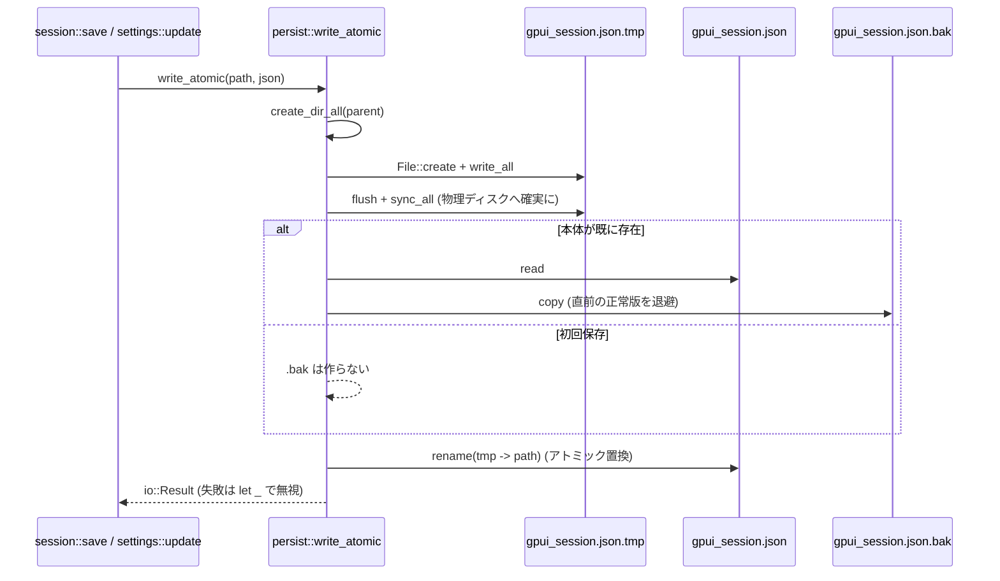
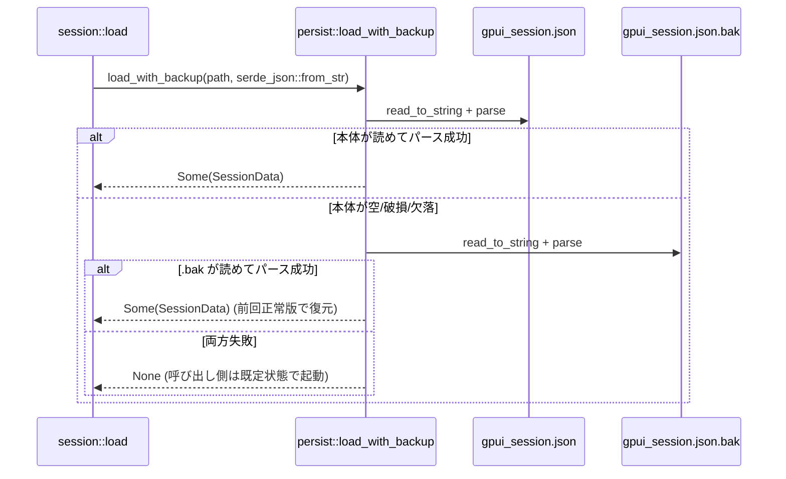
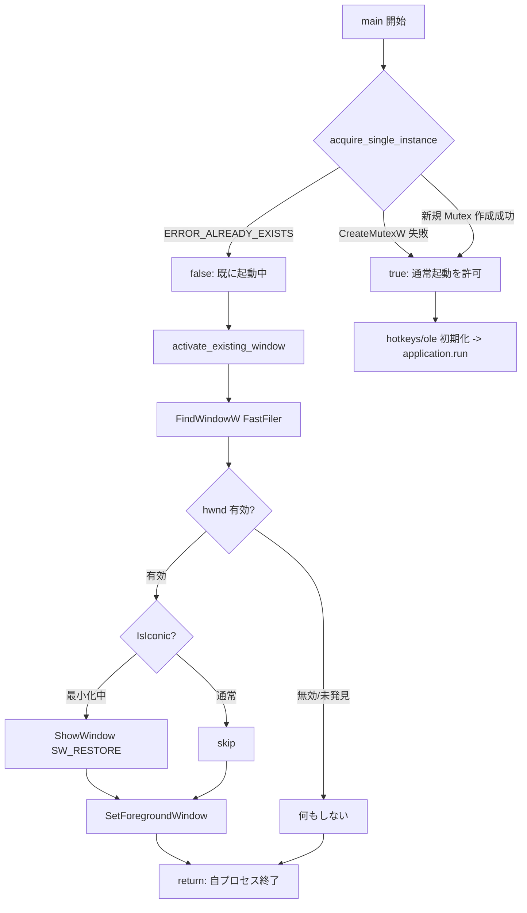

<!-- meta: Persistence & session - persist/session/win32_single_instance -->

# 第11章: 永続化とセッション

本章では、fastfiler がアプリケーションの状態をディスクへ保存し、次回起動時に復元する仕組みを扱う。
対象は大きく三つに分かれる。
一つ目は、クラッシュや電源断に耐える「アトミック書き込み」基盤 (`persist.rs`)。
二つ目は、タブ・分割ペイン構成・各ペインのフォルダを JSON として保存・復元する「セッション」機構 (`session.rs`)。
三つ目は、Win32 の名前付き Mutex によって二重起動を抑止し、既存ウィンドウを前面化する「単一インスタンス」制御 (`win32_single_instance.rs`)。

これら三つは独立した関心事だが、実際には密接に連携する。
セッション保存はアトミック書き込み基盤の上に載っており、単一インスタンス制御はセッション復元の前段 (起動シーケンスの冒頭) で働く。
本章ではコードに即して、それぞれの実装が「何を守ろうとしているのか」「どこまで守れているのか」を順に明らかにする。

## Sources Read
- `crates/fastfiler-gpui/src/persist.rs` (lines 1-129)
- `crates/fastfiler-gpui/src/session.rs` (lines 1-102)
- `crates/fastfiler-gpui/src/win32_single_instance.rs` (lines 1-60)
- `crates/fastfiler-gpui/src/settings_store.rs` (lines 60-112)
- `crates/fastfiler-gpui/src/main.rs` (lines 20-99)
- `crates/fastfiler-gpui/src/app.rs` (lines 198-357, 960-999, 1719-1743)

---

## 11.1 アトミック書き込み基盤 (`persist.rs`)

### 11.1.1 なぜ素の `fs::write` では不足なのか

`persist.rs` の冒頭コメントは、このモジュールが存在する理由を明確に述べている [REF: crates/fastfiler-gpui/src/persist.rs:1-13]。
素の `std::fs::write` は「ファイルを長さ 0 へ切り詰めてから書き直す」という二段階の動作をとる。
このため、書き込みの途中で電源断が起きたり、Windows のライトキャッシュがディスクへフラッシュされる前に異常終了したりすると、0 バイトあるいは途中までしか書かれていない破損ファイルが残る。
そして次回起動時、その破損ファイルのパースに失敗し、タブ構成などの復元ができず、既定状態でアプリが立ち上がってしまう。
これは利用者にとって「前回開いていたタブが全部消えた」という体感不具合に直結する。

この問題に対し、本モジュールは二段構えの防御を行う。
第一に**アトミック書き込み**で、本体ファイルが常に「古い完全版」か「新しい完全版」のどちらかになるよう保証する。
第二に**バックアップとフォールバック**で、置換前の正常版を `.bak` に退避し、読み込み時に本体が壊れていれば `.bak` を試す。
この設計意図はコメントとして明記されている [REF: crates/fastfiler-gpui/src/persist.rs:8-13]。

なお、このモジュールはプロジェクト履歴上、比較的最近に新設されたものである。
コミット `6513d73`「fix(gpui): セッション/設定の保存をクラッシュ安全化」が `persist.rs` を新規追加し、`session.rs` と `settings_store.rs` の保存処理をこの基盤へ置き換えた。
本章タスクが言及する「最近のコミットで保存をクラッシュ安全化した」という記述は、このコミットを指す。
[CONFIDENCE: HIGH] — git log でコミットメッセージとファイル差分 (persist.rs を +129 行で新設) を直接確認した。

### 11.1.2 補助関数 `with_suffix`

一時ファイル名やバックアップ名は、`with_suffix` がパス末尾へ拡張子を**追加**して作る [REF: crates/fastfiler-gpui/src/persist.rs:19-23]。
重要なのは「置換ではなく追加」である点で、`gpui_session.json` は `gpui_session.json.tmp` や `gpui_session.json.bak` になる。
実装は `OsString` を経由しているため、元のパスがどんな拡張子を持っていても末尾に素直に連結される。
これにより、本体・一時ファイル・バックアップが必ず同一ディレクトリ内に並ぶことが保証される。
同一ディレクトリ内であることは、後述する `rename` のアトミック性にとって本質的な前提となる。

### 11.1.3 中核処理 `write_atomic` — tmp + fsync + rename

`write_atomic` は、本章で最も重要な関数である [REF: crates/fastfiler-gpui/src/persist.rs:28-56]。
処理は三つのステップから成る。

```rust
pub fn write_atomic(path: &Path, contents: &str) -> std::io::Result<()> {
    use std::fs;
    use std::io::Write;

    if let Some(dir) = path.parent() {
        fs::create_dir_all(dir)?;
    }

    // 1. 一時ファイルへ書き出し、物理ディスクまで確実にフラッシュする。
    let tmp = with_suffix(path, ".tmp");
    {
        let mut f = fs::File::create(&tmp)?;
        f.write_all(contents.as_bytes())?;
        f.flush()?;
        // OS のライトキャッシュをフラッシュ。これにより電源断後も tmp は
        // 完全な内容で残る (rename 後の本体が空になる事故を防ぐ)。
        f.sync_all()?;
    }

    // 2. 直前の正常版を .bak に退避 (本体置換が万一壊れても復旧できる保険)。
    if path.exists() {
        let _ = fs::copy(path, with_suffix(path, ".bak"));
    }

    // 3. tmp → 本体。同一ディレクトリ内の rename なので OS レベルで
    //    アトミックに置換される (中途半端な状態を経由しない)。
    fs::rename(&tmp, path)
}
```

第一ステップでは、まず `path.parent()` に対し `create_dir_all` を呼んで親ディレクトリを保証する [REF: crates/fastfiler-gpui/src/persist.rs:32-34]。
これにより `%APPDATA%\FastFiler` が未作成でも初回保存が失敗しない。
続いて `*.tmp` ファイルを新規作成し、全内容を `write_all` で書き込む。
ここで決定的に重要なのが `f.sync_all()` の呼び出しである [REF: crates/fastfiler-gpui/src/persist.rs:41-44]。
`flush()` はあくまでアプリケーション側のバッファを OS へ渡すだけで、OS のライトキャッシュは物理ディスクへ落ちていない可能性がある。
`sync_all()` は OS のキャッシュも含めて物理メディアまでフラッシュを要求するため、これを呼んで初めて「電源断後も tmp は完全な内容で残る」ことが期待できる。
このフラッシュを省くと、rename 後の本体がメタデータ上は更新済みでも中身が空、という最悪のケースが起こりうる。
コメントもまさにその事故を防ぐためだと述べている [REF: crates/fastfiler-gpui/src/persist.rs:42-43]。

第二ステップでは、本体が既に存在する場合に限り、それを `.bak` へ複製する [REF: crates/fastfiler-gpui/src/persist.rs:49-51]。
初回保存では本体がまだ無いので何もしない。
複製の戻り値は `let _ =` で握り潰されており、`.bak` 作成の失敗は致命的に扱わない。
これは「`.bak` はあくまで保険であり、本筋のアトミック置換さえ成立すれば最低限のデータ保全は達成される」という割り切りを示す。

第三ステップが `fs::rename(&tmp, path)` である [REF: crates/fastfiler-gpui/src/persist.rs:55]。
同一ボリューム・同一ディレクトリ内の rename は、OS レベルでアトミックな置換として扱われる。
そのため本体は「旧版」から「新版」へ瞬時に切り替わり、観測者から見て中途半端な状態 (途中まで書かれた本体) を経由しない。
`write_atomic` の戻り値はこの `rename` の `io::Result` をそのまま返すので、置換の成否が呼び出し側へ伝わる。
[ASSUMED: Windows の `MoveFileEx` 系セマンティクスにおける同一ボリューム内 rename のアトミック置換性に依拠している。Rust 標準ライブラリの `fs::rename` が Windows でこの保証を提供する点はプラットフォーム依存だが、本コードはその前提で書かれている。]

### 11.1.4 読み込み側 `load_with_backup` — 本体 → `.bak` フォールバック

保存と対をなすのが `load_with_backup` である [REF: crates/fastfiler-gpui/src/persist.rs:62-71]。

```rust
pub fn load_with_backup<T>(path: &Path, parse: impl Fn(&str) -> Option<T>) -> Option<T> {
    for p in [path.to_path_buf(), with_suffix(path, ".bak")] {
        if let Ok(s) = std::fs::read_to_string(&p) {
            if let Some(v) = parse(&s) {
                return Some(v);
            }
        }
    }
    None
}
```

この関数はジェネリックであり、パース処理を呼び出し側から `parse` クロージャとして受け取る。
試行順序は配列リテラル `[本体, .bak]` の順で、本体を先に、ダメなら `.bak` を試す。
「読めない (`read_to_string` が `Err`)」場合と「読めたがパースに失敗した (`parse` が `None`)」場合の両方を、次の候補へ進む条件として扱う。
両方とも失敗すれば最終的に `None` を返す。
この設計により、本体が空・破損していても直前の正常版から復元でき、両方ダメなら呼び出し側が既定値で立ち上がる、という段階的な縮退が成立する。
`parse` を外から渡す形にしているため、`persist` モジュール自身は JSON や serde を一切知らない。
実際のパース (`serde_json::from_str`) はセッション層・設定層がそれぞれ注入する。

### 11.1.5 単体テストが保証している不変条件

`persist.rs` には `#[cfg(test)]` のテスト群があり、上記の不変条件を実コードで検証している。
ラウンドトリップ (書いて読んで同値) の確認 [REF: crates/fastfiler-gpui/src/persist.rs:87-94]、親ディレクトリ自動生成の確認 [REF: crates/fastfiler-gpui/src/persist.rs:96-101]、二回保存後に本体が最新・`.bak` が直前になる確認 [REF: crates/fastfiler-gpui/src/persist.rs:103-114]、そして本体を空にした上で `.bak` から復元できる確認 [REF: crates/fastfiler-gpui/src/persist.rs:116-128] が並ぶ。
特に最後のテストは、本体へ空文字列を書き込んで電源断を模倣し、`parse` が空をパース失敗として扱うことで `.bak` の `good-v1` が返ることを検証している。
これは「破損 → フォールバック」という本章の中心的な振る舞いを、最も直接的に裏付けるテストである。
テスト用作業ディレクトリは `tempfile` クレートに依存せず、`std::env::temp_dir()` とプロセス ID から自前で組み立てている [REF: crates/fastfiler-gpui/src/persist.rs:77-85]。
依存を増やさずに済ませる、という小さな設計判断が読み取れる。

---

## 11.2 セッションの永続化 (`session.rs`)

### 11.2.1 セッションデータの形式 `SessionData`

セッションとして保存される状態は `SessionData` 構造体に集約される [REF: crates/fastfiler-gpui/src/session.rs:15-44]。

```rust
#[derive(Serialize, Deserialize)]
pub struct SessionData {
    pub active: usize,
    #[serde(default = "default_true")]
    pub show_tree: bool,
    #[serde(default = "default_tree_width")]
    pub tree_width: f32,
    #[serde(default = "default_tab_width")]
    pub tab_width: f32,
    #[serde(default)]
    pub window: Option<[f32; 4]>,
    #[serde(default)]
    pub maximized: bool,
    #[serde(default)]
    pub unc_shares: Vec<String>,
    #[serde(default)]
    pub theme: Option<String>,
    #[serde(default)]
    pub locked: Vec<bool>,
    pub tabs: Vec<NodeData>,
}
```

各フィールドの意味はコメントから読み取れる。
`active` はアクティブタブの添字、`show_tree`/`tree_width`/`tab_width` はワークスペースツリーパネルとタブバーの表示状態と幅である。
`window` はウィンドウの位置とサイズ `[x, y, w, h]` で、最大化中でも通常表示 (restore) 時の位置を保持する [REF: crates/fastfiler-gpui/src/session.rs:27-30]。
`maximized` は最大化状態で終了したかを表し、次回起動時に最大化で復元するためのフラグである。
`unc_shares` はワークスペースツリーに登録済みの UNC 共有 (`\\server\share`)、`theme` はテーマ名 (後述の通り互換用に残置)、`locked` は各タブのロック状態 (`tabs` と同じ並び) を表す。
`tabs` が本体で、各タブのペインツリーを `NodeData` のベクタとして保持する。

注目すべきは、ほぼ全フィールドに `#[serde(default)]` または既定値関数が付いている点である [REF: crates/fastfiler-gpui/src/session.rs:18-42]。
これにより、古いバージョンが書いた JSON に新フィールドが欠けていても、デシリアライズが失敗せず既定値で補える。
すなわち**前方・後方互換**を serde の default 機構で吸収する設計である。
既定値は `default_true` が `true`、`default_tree_width` が `220.0`、`default_tab_width` が `200.0` を返す小さな関数として定義される [REF: crates/fastfiler-gpui/src/session.rs:46-56]。
`bool`/`f32` の serde 既定 (`false`/`0.0`) では意味的に不都合なフィールドだけ、専用の既定関数を当てている。
たとえばツリー幅が `0.0` で復元されるとパネルが潰れてしまうため、`220.0` を明示しているわけである。

### 11.2.2 ペインツリーの直列化表現 `NodeData`

ペインの分割構成は再帰的な列挙型 `NodeData` で表現される [REF: crates/fastfiler-gpui/src/session.rs:59-76]。

```rust
#[derive(Serialize, Deserialize)]
#[serde(tag = "type")]
pub enum NodeData {
    Leaf {
        path: String,
        #[serde(default)]
        focused: bool,
        #[serde(default)]
        cols: Option<[f32; 3]>,
    },
    Split {
        dir: String,        // "row" | "column"
        ratios: Vec<f32>,
        children: Vec<NodeData>,
    },
}
```

`#[serde(tag = "type")]` は内部タグ付け (internally tagged) で、JSON 上は `{"type":"Leaf", ...}` / `{"type":"Split", ...}` という形になる。
`Leaf` は単一ペインで、`path` (表示中フォルダ)、`focused` (フォーカス有無)、`cols` (列幅 `[更新日時, サイズ, 種類]` のペイン個別値) を持つ。
`Split` は分割ノードで、`dir` が `"row"`/`"column"` のいずれか、`ratios` が各子の比率、`children` が子ノード列である。
この再帰構造により、任意深さのネストした分割レイアウトを JSON へそのまま落とし込める。
`focused` と `cols` には `#[serde(default)]` が付くため、これらを書かない古い形式の JSON も読める。

### 11.2.3 保存先パスと load / save

保存先は `session_path` が組み立てる [REF: crates/fastfiler-gpui/src/session.rs:78-85]。
環境変数 `APPDATA` を基点に `FastFiler\gpui_session.json` を返す。
`APPDATA` が取れない環境では `None` を返し、保存・読み込みとも黙って諦める設計である。

読み込みは `load` で、`session_path` を得たうえで `persist::load_with_backup` に `serde_json::from_str` を渡す [REF: crates/fastfiler-gpui/src/session.rs:87-91]。
ここで 11.1.4 のフォールバックが効き、本体が壊れていれば `.bak` から復元される。
保存は `save` で、`serde_json::to_string_pretty` で整形 JSON 化したうえで `persist::write_atomic` を呼ぶ [REF: crates/fastfiler-gpui/src/session.rs:93-101]。

```rust
pub fn save(data: &SessionData) {
    let Some(p) = session_path() else {
        return;
    };
    if let Ok(s) = serde_json::to_string_pretty(data) {
        // アトミック書き込み + .bak 退避 (電源断でもタブ情報が消えないように)。
        let _ = crate::persist::write_atomic(&p, &s);
    }
}
```

`save` は戻り値を持たず、`write_atomic` の `Result` も `let _ =` で捨てている。
これはモジュール冒頭コメントの「保存はベストエフォート」「失敗しても呼び出し側は致命的に扱わない想定」という方針と一致する [REF: crates/fastfiler-gpui/src/persist.rs:25-27]。
JSON を `to_string_pretty` で整形しているのは、利用者が手で覗いたり編集したりしうるファイルだからだと考えられる。
[CONFIDENCE: MED] — 整形採用の動機 (可読性のため) はコメントに明示はなく、`to_string_pretty` の選択からの推測である。

### 11.2.4 保存タイミング — デバウンスと終了時フック

`session.rs` のモジュールコメントは保存タイミングを明記する [REF: crates/fastfiler-gpui/src/session.rs:4-10]。
「構成変更後 800ms デバウンス」と「アプリ終了時 (`on_app_quit`)」の二系統である。
そして「クラッシュ・電源断では `on_app_quit` が呼ばれないため、デバウンス保存だけが頼り」と述べる。
ここがアトミック書き込みの必要性と直結する。
終了フックが走らないクラッシュ時には、最後のデバウンス保存が唯一の砦であり、その保存自体が壊れてはならないからだ。

終了時フックは `app.rs` の `register_quit_hook` が `cx.on_app_quit` で登録する [REF: crates/fastfiler-gpui/src/app.rs:330-336]。
クロージャ内で `this.save_session(cx)` を呼び、空の `async {}` を返して `detach` している。
正常終了 (ウィンドウを閉じる等) のときは、これが最終状態を確実に書き出す。

デバウンス側は `schedule_save` が担う [REF: crates/fastfiler-gpui/src/app.rs:983-999]。

```rust
/// 800ms デバウンス付きでセッション保存を予約する。
fn schedule_save(&mut self, cx: &mut Context<Self>) {
    if self.save_pending {
        return;
    }
    self.save_pending = true;
    cx.spawn(async move |this, cx| {
        cx.background_executor()
            .timer(std::time::Duration::from_millis(800))
            .await;
        let _ = this.update(cx, |app, cx| {
            app.save_pending = false;
            app.save_session(cx);
        });
    })
    .detach();
}
```

`save_pending` フラグで多重予約を抑止し、800ms のタイマー後に一度だけ `save_session` を呼ぶ。
構成変更が連続しても、最後の変更から 800ms 静かになって初めて一回保存する、という典型的なデバウンスである。
このメソッドはツリー表示トグルなど状態を変える各操作の末尾から呼ばれ、たとえば `toggle_tree` が `schedule_save(cx)` を呼ぶ [REF: crates/fastfiler-gpui/src/app.rs:972-981]。
コード全体では同種の呼び出しが多数あり、タブ・ペイン操作のたびに保存が予約される。
タイマーは UI スレッドではなく `background_executor` 上で待つため、保存予約が描画をブロックすることはない。

`save_session` は現在の `FastFilerApp` の状態を `SessionData` へ詰め替えて `session::save` を呼ぶ [REF: crates/fastfiler-gpui/src/app.rs:338-357]。
注目すべきは `theme: None` を明示している点で、コメント通りテーマ設定は `gpui_settings.json` へ移行済みであり、`SessionData.theme` は読み込み時の旧形式互換のためにだけ残置されている。
タブのロック状態は `self.tabs.iter().map(|t| t.locked).collect()` で、ペインツリーは `node_data(&t.root, t.focused, cx)` で直列化用の `NodeData` へ変換される。

### 11.2.5 メモリ表現 ⇄ 直列化表現の変換

実行時のペインツリー (`PaneNode`) と保存用 (`NodeData`) の相互変換は二つの関数が担う。
保存方向は `node_data` で、`PaneNode::Leaf` を `NodeData::Leaf` (パス・フォーカス・列幅) へ、`PaneNode::Split` を `NodeData::Split` へ再帰変換する [REF: crates/fastfiler-gpui/src/app.rs:1719-1743]。
`SplitDir::Row`/`Column` をここで文字列 `"row"`/`"column"` へ写しており、`NodeData.dir` が文字列である理由がここにある。
パスは `cur_path().to_string_lossy().to_string()` で取得するため、非 UTF-8 のパスは置換文字へ落ちうる。
[ASK SME] 実運用パスで `to_string_lossy` による情報落ちが問題になるケースがあるか (UNC や特殊文字を含むパスでの往復可逆性) を確認したい。

復元方向は `from_session` と `build_node` が担う [REF: crates/fastfiler-gpui/src/app.rs:198-257]。
`from_session` は `SessionData` を受け取り、まず登録済み UNC 共有をツリーへ復元する。
このとき「サーバが落ちていてもツリー UI は壊れない」とコメントされており、復元は防御的である [REF: crates/fastfiler-gpui/src/app.rs:201-205]。
各タブについて `build_node` でペインツリーを再構築し、`locked` ベクタからロック状態を所属ペインへ反映する。
復元後にタブが一つも無ければ `default_start()` で既定タブを足し、そうでなければ `active` を `tabs.len()-1` で上限クランプする [REF: crates/fastfiler-gpui/src/app.rs:249-253]。
保存された `active` がタブ数と矛盾していても範囲外参照にならない、という安全弁である。

`build_node` は破損データに対する補正の塊である [REF: crates/fastfiler-gpui/src/app.rs:261-327]。
`Leaf` のパスが実在ディレクトリでなければ `default_start()` へ差し替える [REF: crates/fastfiler-gpui/src/app.rs:274-275]。
`Split` の子が 0 個なら 1 ペインの `Leaf` へ縮退させ [REF: crates/fastfiler-gpui/src/app.rs:298-303]、子が 1 個ならその子をそのまま昇格させる [REF: crates/fastfiler-gpui/src/app.rs:304-306]。
比率配列の長さが子数と合わない、あるいは合計が `0.5..=1.5` の範囲外なら、均等割り `1.0/n` へリセットする [REF: crates/fastfiler-gpui/src/app.rs:307-312]。
これらの補正により、たとえ手編集や旧形式由来で多少壊れた JSON でも、UI が破綻せず妥当なレイアウトへ落ち着く。
コメントも「壊れたデータ (存在しないフォルダ / 子 0 の Split / 比率不正) は安全側に補正」と明言している [REF: crates/fastfiler-gpui/src/app.rs:259-260]。

### 11.2.6 起動シーケンスでのセッション復元

`main.rs` の起動処理では、`session::load()` で前回セッションを読み、ウィンドウ境界を組み立てる [REF: crates/fastfiler-gpui/src/main.rs:49-87]。
`window` フィールドは `filter(|[_, _, w, h]| *w >= 400.0 && *h >= 300.0)` で最小サイズを満たすときのみ採用し、そうでなければ中央 1000x660 へフォールバックする [REF: crates/fastfiler-gpui/src/main.rs:73-81]。
`maximized` が真なら `WindowBounds::Maximized(bounds)` で開き、その際 `bounds` は restore 時の位置として使われる [REF: crates/fastfiler-gpui/src/main.rs:82-87]。
ここでセッション機構とウィンドウ管理が接続される。
さらにテーマ名は設定ファイル (`settings.theme`) を優先し、無ければ旧 `saved.theme` を使い、後者だった場合は設定ファイルへ移行保存する [REF: crates/fastfiler-gpui/src/main.rs:57-66]。
これが 11.2.4 で触れた「テーマは settings へ移行済み、session には互換残置」の実際の移行ロジックである。

---

## 11.3 設定の永続化も同じ基盤に載る (`settings_store.rs`)

セッションと並んで、アプリ設定 (テーマ・フォントサイズ・Everything ポート等) も同じ `persist` 基盤を使う。
設定の保存先は `gpui_settings.json` で、やはり `%APPDATA%\FastFiler` 配下に置かれる [REF: crates/fastfiler-gpui/src/settings_store.rs:67-74]。
読み込み `load` は `persist::load_with_backup` に `serde_json::from_str::<AppSettings>` を渡し、本体が壊れていれば `.bak` から復元する [REF: crates/fastfiler-gpui/src/settings_store.rs:82-91]。
失敗時は `unwrap_or_default()` で既定設定へ縮退し、結果をプロセス内の `static` ストアへ格納する。
保存 `update` は、クロージャで設定を変更したスナップショットを取り、`persist::write_atomic` で書き出す [REF: crates/fastfiler-gpui/src/settings_store.rs:98-111]。
セッションが「800ms デバウンス保存」なのに対し、設定は「変更して即保存」である点が対照的である。
設定はユーザーが明示的に操作したときだけ変わるので、デバウンスせず即時に永続化しても書き込み頻度が問題にならない、という判断だと読める。
[CONFIDENCE: HIGH] — 即時保存である事実はコードから明確 (`update` 内で同期的に `write_atomic` を呼ぶ)。動機の解釈部分は [CONFIDENCE: MED]。

このように、`persist` モジュールはセッションと設定の二つのクライアントから共有される横断基盤として機能している。
クラッシュ安全化のコミットが両方を同時に書き換えたのは、この共有構造ゆえである。

---

## 11.4 単一インスタンス制御 (`win32_single_instance.rs`)

### 11.4.1 名前付き Mutex による多重起動判定

二重起動の抑止は Win32 の名前付き Mutex で実現する。
Mutex 名は定数 `MUTEX_NAME` に固定されている [REF: crates/fastfiler-gpui/src/win32_single_instance.rs:16-19]。

```rust
const MUTEX_NAME: &str = "Local\\FastFiler-SingleInstance-Mutex-v1\0";
```

接頭辞 `Local\` が肝で、これは名前空間を「同一ユーザーセッション内」に限定する。
コメントが述べる通り、別ユーザーや別 RDP セッションでは並行起動が許される [REF: crates/fastfiler-gpui/src/win32_single_instance.rs:16-18]。
末尾の `\0` は、後で `encode_utf16` した際に NUL 終端付きのワイド文字列になるよう、文字列リテラル段階で終端を埋め込んでいる。

判定本体は `acquire_single_instance` である [REF: crates/fastfiler-gpui/src/win32_single_instance.rs:30-44]。

```rust
pub fn acquire_single_instance() -> bool {
    let name: Vec<u16> = MUTEX_NAME.encode_utf16().collect();
    unsafe {
        let handle = match CreateMutexW(None, false, PCWSTR(name.as_ptr())) {
            Ok(h) => h,
            Err(_) => return true, // mutex 作成自体に失敗した場合は通常起動を許可
        };
        let already = GetLastError() == ERROR_ALREADY_EXISTS;
        let _keep_alive = handle;
        !already
    }
}
```

`CreateMutexW` で名前付き Mutex を作成し、直後に `GetLastError()` が `ERROR_ALREADY_EXISTS` かを調べる。
同名 Mutex が既に存在すれば「別プロセスが先に起動済み」と判断し、`!already`、つまり `false` を返す。
存在しなければ自分が最初のインスタンスであり `true` を返す。
`CreateMutexW` 自体が失敗した場合は `return true` で通常起動を許す [REF: crates/fastfiler-gpui/src/win32_single_instance.rs:35]。
ここは「単一インスタンス機構が壊れているなら、起動できない方が利用者にとって困る」という安全側 (fail-open) の判断である。

注意すべきは `_keep_alive = handle` の意図である [REF: crates/fastfiler-gpui/src/win32_single_instance.rs:38-41]。
`HANDLE` は `Copy` 型なので Rust の `Drop` は走らず、`CloseHandle` を明示的に呼ばない限り Mutex オブジェクトはプロセス終了まで OS が保持する。
あえて `CloseHandle` を呼ばないのは、閉じると参照カウントが減って他プロセスの `ERROR_ALREADY_EXISTS` 判定に影響しうるからで、プロセスが生きている間 Mutex を握りっぱなしにすることが正しい。
変数名 `_keep_alive` は「明示的に解放しない」という意図を読み手へ伝えるための命名である。
[ASSUMED: プロセス終了時に OS が Mutex ハンドルを自動回収する Windows のセマンティクスに依拠している。明示 `CloseHandle` をしないのは意図的であり、リークではない。]

### 11.4.2 既存ウィンドウの前面化

二重起動を検出して自プロセスを終える前に、既存ウィンドウを前面化するのが `activate_existing_window` である [REF: crates/fastfiler-gpui/src/win32_single_instance.rs:46-60]。

```rust
pub fn activate_existing_window() {
    let title: Vec<u16> = "FastFiler\0".encode_utf16().collect();
    unsafe {
        if let Ok(hwnd) = FindWindowW(PCWSTR::null(), PCWSTR(title.as_ptr())) {
            if !hwnd.is_invalid() {
                if IsIconic(hwnd).as_bool() {
                    let _ = ShowWindow(hwnd, SW_RESTORE);
                }
                let _ = SetForegroundWindow(hwnd);
            }
        }
    }
}
```

`FindWindowW` にウィンドウタイトル `"FastFiler"` を渡して既存ウィンドウのハンドルを探す。
このタイトルは `main.rs` がウィンドウを開く際の `TitlebarOptions { title: Some("FastFiler".into()) }` と対応しており [REF: crates/fastfiler-gpui/src/main.rs:88-97]、検索キーが偶然ではなく意図的に一致させてある。
ハンドルが有効なら、最小化されているか (`IsIconic`) を調べ、最小化中なら `ShowWindow(hwnd, SW_RESTORE)` で元のサイズへ戻し、最後に `SetForegroundWindow` で前面化する。
各 Win32 呼び出しの戻り値は `let _ =` で握り潰しており、「失敗しても黙って無視する」というコメント通りのベストエフォートである [REF: crates/fastfiler-gpui/src/win32_single_instance.rs:46-47]。
利用者の体感としては、起動済みのときにアイコンを再度ダブルクリックすると、新しい窓が増えるのではなく既存窓が前に出てくる、という Windows 標準的な振る舞いになる。
[ASK SME] タイトルベースの `FindWindowW` は、同名タイトルの無関係ウィンドウが存在した場合に誤ヒットしうる。クラス名併用や独自タイトルにしない設計判断は許容範囲か、確認したい。

### 11.4.3 起動シーケンスへの組み込み

これらは `main.rs` の冒頭、他の初期化に先立って呼ばれる [REF: crates/fastfiler-gpui/src/main.rs:28-36]。

```rust
fn main() {
    // 多重起動防止: 既に起動中なら既存ウィンドウを前面化して静かに終了。
    #[cfg(windows)]
    {
        if !win32_single_instance::acquire_single_instance() {
            win32_single_instance::activate_existing_window();
            return;
        }
    }
    // ...続いて hotkeys::load(), ole_dnd::init_ole(), application().run(...)
}
```

`acquire_single_instance()` が `false` なら、`activate_existing_window()` を呼んでから `return` でプロセスを静かに終える。
GUI 初期化 (`application().run`) よりも前にこの判定が走るため、二重起動時はウィンドウもイベントループも作らずに済む。
`#[cfg(windows)]` で囲われているので、この機構は Windows 専用である。
fastfiler 全体が Win32 シェル統合に強く依存していることを踏まえれば、本機能が Windows 限定なのは整合的である。

---

## 11.5 アトミック保存のシーケンス図

`write_atomic` の三ステップを、本体・`.tmp`・`.bak` のディスク上の状態遷移として図示する。



読み込み時のフォールバックは次の通り。



## 11.6 起動時の単一インスタンス・ハンドオフ

二重起動検出から既存ウィンドウ前面化までのフローを図示する。



---

## 11.7 クラッシュ安全性の保証範囲と限界

最後に、本章の三機構が「どこまで守れるか」を整理する。

守れること。
正常終了では `on_app_quit` が最終状態を確実に書き出す。
クラッシュ・電源断では、直近の 800ms デバウンス保存までの状態が、アトミック書き込みのおかげで「完全な旧版か完全な新版」として残る。
本体が万一壊れても `.bak` の直前正常版へフォールバックでき、両方ダメでも `build_node` の防御補正と既定値で UI は破綻せず立ち上がる。
これらは単体テストでも裏付けられている [REF: crates/fastfiler-gpui/src/persist.rs:116-128]。

守りきれないこと。
最後のデバウンス保存 (最大 800ms 前) 以降の構成変更は、クラッシュ時には失われる。
これはデバウンス保存の構造的な限界であり、設計上の許容範囲だと考えられる。
また `sync_all` のフラッシュ保証は OS とドライバの実装に依存し、書き込みキャッシュを持つハードウェア次第では理論上の隙が残りうる。
[CONFIDENCE: MED] — 「最大 800ms 分のロスト」はデバウンス値 800ms から直接導けるが、実機での最悪値はタイマー精度やスケジューリングに左右されるため幅がある。

単一インスタンス制御は、同一ユーザーセッション内の二重起動のみを抑止する。
別ユーザー・別 RDP セッションでは並行起動を許容するのは `Local\` 名前空間による意図的な設計である [REF: crates/fastfiler-gpui/src/win32_single_instance.rs:16-18]。
前面化はタイトル文字列一致に依存するため、堅牢性は中程度であり、ここは 11.4.2 の `[ASK SME]` で挙げた通り確認余地がある。

総じて、本章の三機構は「派手な永続化フレームワークを持ち込まず、std とごく少数の Win32 API だけで、実用上十分なクラッシュ安全性と単一インスタンス性を達成する」という、小さく堅実な設計でまとまっている。

<!-- DETAIL_QUESTIONS
- 1. `write_atomic` は同一ボリューム内 rename のアトミック性を前提とするが、`%APPDATA%` がネットワークドライブ (ローミングプロファイル / リダイレクト) に置かれた場合のアトミック性と sync_all の効きは保証範囲か。SME に確認したい。
- 2. セッション保存のデバウンスが 800ms である根拠 (体感とデータ保全のトレードオフ) は仕様として固定値か、調整余地のあるチューニング値か。
- 3. `node_data` のパス直列化が `to_string_lossy` を使うため、非 UTF-8 / 特殊文字を含むパスで往復可逆性が崩れる可能性がある。これは許容仕様か、それとも将来 OsString ベースへ変えるべき箇所か。
- 4. `activate_existing_window` がウィンドウクラス名ではなくタイトル文字列 "FastFiler" 一致で既存窓を探すのは、同名タイトルの無関係ウィンドウへの誤ヒットを許容する設計判断か。
- 5. `acquire_single_instance` は `CreateMutexW` 失敗時に fail-open (通常起動を許可) する。これはセキュリティ・整合性の観点で許容されるべきデフォルトか、それとも fail-closed が望ましいケースがあるか。
- 6. `.bak` も本体も壊れた場合、現状は「既定状態で起動」へ縮退する。利用者へ「前回状態を復元できなかった」旨を通知する要件はあるか (現状は無言)。
-->
