<!-- meta: Cross-cutting: performance / security / operability -->

# 第12章: 横断的関心事 — 性能・セキュリティ・運用性

この章は、特定のモジュールに閉じない「横断的関心事 (cross-cutting concerns)」を、実コードの根拠とともに整理する。
対象は大きく三つの軸である。

- 性能 (Performance): 大量ファイルの一覧・描画、監視イベントのバースト処理、非同期ジョブ、アイコン取得のコスト。
- セキュリティ (Security): `unsafe` / COM の境界面、ユーザー定義コマンドによる任意コマンド実行、信頼できない入力 (HDROP) の解析。
- 運用性 (Operability): クラッシュ安全な永続化、エラーの可視化、多重起動防止、リソースのライフサイクル管理。

これらは個々の章 (第4章のファイル操作、第5章のシェル統合、第8章のペイン、第11章の永続化) で部分的に触れられているが、本章では「どの設計判断が、どの非機能要件を、どのコードで満たしているか」を一望できる形に束ねる。

この章には専用の inventory が割り当てられていない。
したがって以下の記述はすべて、key_files を直接読み、横断的な観点で再構成した一次情報である。
推論を含む箇所は `[CONFIDENCE]` / `[ASSUMED]` / `[ASK SME]` で明示する。

## Sources Read
- `crates/fastfiler-gpui/src/pane.rs` (lines 1-40, 341-510, 700-729, 2930-3012, 3318-3520, 3704-3798)
- `crates/fastfiler-gpui/src/app.rs` (grep: spawn / watcher / subscription 周辺)
- `crates/fastfiler-gpui/src/persist.rs` (lines 1-129)
- `crates/fastfiler-gpui/src/main.rs` (lines 1-108)
- `crates/fastfiler-gpui/src/win32_single_instance.rs` (lines 1-60)
- `crates/fastfiler-domain/src/user_commands.rs` (lines 1-320, 431-460)
- `crates/fastfiler-domain/src/shell.rs` (lines 1-361)
- `crates/fastfiler-domain/src/ole_dnd.rs` (lines 84-260, 480-615)
- `crates/fastfiler-domain/src/watcher.rs` (lines 1-61)
- `crates/fastfiler-gpui/src/settings_store.rs` / `crates/fastfiler-gpui/src/session.rs` (write_atomic 呼び出し箇所)

---

## 12.1 性能 (Performance)

### 12.1.1 一覧描画の仮想化

ファイラの最大の負荷源は「巨大なディレクトリを一覧表示する」ことである。
本アプリは描画を GPUI の `uniform_list` に委ね、可視範囲の行だけを生成する仮想化描画を採用している。

ペインのファイル一覧も検索結果も、いずれも `uniform_list` で描画される [REF: crates/fastfiler-gpui/src/pane.rs:3495-3520]。
`uniform_list("file-list", count, processor)` の `processor` クロージャは、表示すべき行範囲 `range: Range<usize>` だけを受け取り、その範囲のみ `render_row` を呼ぶ。

```rust
uniform_list(
    "file-list",
    count,
    cx.processor(|this, range: Range<usize>, _w, cx| {
        range.map(|ix| this.render_row(ix, cx)).collect::<Vec<_>>()
    }),
)
.track_scroll(&self.scroll)
.size_full()
```

この構造により、10 万件のフォルダでも実際に要素ツリーへ展開されるのは画面に収まる数十行だけになる。
`count` (= `self.entries.len()`) がいくら大きくても、描画コストは可視行数に比例する。
モジュール冒頭のドキュメントコメントも「描画は GPUI の `uniform_list` で可視範囲のみ仮想化描画」と明記しており、これは設計上の明確な意図である [REF: crates/fastfiler-gpui/src/pane.rs:1-13]。

ただし仮想化されるのは「描画」だけである点に注意したい。
一覧データ `entries: Vec<FileEntry>` と行アイコン `row_icons: Vec<Option<Arc<Image>>>` は全件分がメモリ上に保持される。
ソートも全件に対して行われる (`sort_entries`)。
したがって「描画は O(可視行)」だが「読み込み・ソート・アイコン準備は O(総件数)」であり、超巨大ディレクトリでは `reload` 自体の所要時間が支配的になりうる。

[CONFIDENCE: HIGH] 描画が可視範囲に限定されることはコードから確定できる。
[CONFIDENCE: MED] 「reload 全体は O(N)」は構造からの推論であり、実測値は持っていない。

### 12.1.2 アイコン取得のコスト削減

アイコンは Windows シェルへの問い合わせを伴うため、一行ごとに毎回取得すると重い。
そこで `load_row_icons` は、フォルダは `"d"`、ファイルは拡張子 (`"f:{ext}"`) をキーにした `HashMap` で結果を共有し、domain 呼び出し回数を最小化する [REF: crates/fastfiler-gpui/src/pane.rs:3704-3722]。

```rust
fn load_row_icons(entries: &[FileEntry], dir: &Path) -> Vec<Option<Arc<Image>>> {
    let mut cache: HashMap<String, Option<Arc<Image>>> = HashMap::new();
    entries
        .iter()
        .map(|e| {
            let key = if e.kind == "dir" {
                "d".to_string()
            } else {
                format!("f:{}", e.ext.clone().unwrap_or_default())
            };
            cache.entry(key).or_insert_with(|| load_icon(e, dir)).clone()
        })
        .collect()
}
```

さらに `load_icon` は `system_icon_png(..., ext_only=true)` を使い、実ファイルへアクセスせず拡張子の代表アイコンを得ている [REF: crates/fastfiler-gpui/src/pane.rs:3724-3735]。
これにより「同じ拡張子のファイルが 1000 個あってもシェル問い合わせは 1 回」「アイコン取得のためにファイルを開かない」という二重のコスト削減が効く。
`Arc<Image>` で共有しているので、同一拡張子の行はアイコン実体を 1 つだけ持つ (メモリも節約)。

一方で、このキャッシュは `load_row_icons` のローカル変数であり、`reload` のたびに作り直される [REF: crates/fastfiler-gpui/src/pane.rs:486-488]。
つまりフォルダを開き直すたびに拡張子ごとの取得が再発生する。
プロセス全体で持続するアイコンキャッシュ (LRU 等) は確認できなかった。

[ASSUMED: 拡張子種別はフォルダ内では十数〜数十程度に収まるため、reload ごとの再取得でも実害は小さいという前提]
[ASK SME] 大規模フォルダ往復時のアイコン再取得が体感性能に影響するか、プロセス常駐キャッシュの導入価値があるかは要確認。

### 12.1.3 監視イベントのバースト対策 (デバウンス)

ディレクトリ監視 (`notify` / ReadDirectoryChangesW) は、1 回のファイル操作でも複数イベントを連続発火する。
これを素直に reload へ繋ぐと、コピー中などに毎イベント全件再読込が走り、UI が固まる。

ドメイン側の `WatcherCore` は、同一パスの二重監視を防ぐだけの薄い層で、`NonRecursive` で 1 階層のみ監視する [REF: crates/fastfiler-domain/src/watcher.rs:27-56]。
スロットリングはここでは行わず、UI 層へ生イベントを流す設計である。

実際のバースト吸収は GUI 層で行われる。
`on_domain_event` の `"fs-change"` ハンドラは、`reload_pending` フラグと 150ms タイマで「まとめて 1 回 reload」へ畳み込む [REF: crates/fastfiler-gpui/src/pane.rs:2976-2991]。

```rust
"fs-change" => {
    // notify はバーストするため 150ms デバウンスでまとめて reload。
    if !self.reload_pending {
        self.reload_pending = true;
        cx.spawn(async move |this, cx| {
            cx.background_executor()
                .timer(std::time::Duration::from_millis(150))
                .await;
            let _ = this.update(cx, |pane, cx| {
                pane.reload_pending = false;
                pane.reload(cx, false);
            });
        })
        .detach();
    }
}
```

これはトレイリングではなくリーディング・ウィンドウ型のデバウンスに近い。
最初のイベントで 150ms の窓を開き、その間のイベントはフラグで握りつぶし、窓終了時に 1 回だけ reload する。
`reload(cx, false)` は選択とスクロールを「名前」で復元するため、自動更新でカーソル位置が飛ばない [REF: crates/fastfiler-gpui/src/pane.rs:464-510]。

[CONFIDENCE: HIGH] 150ms 固定デバウンスであることはコードから確定。
[CONFIDENCE: MED] 連続バーストが 150ms を超えて続く場合、窓終了ごとに reload が繰り返される (長大コピー中は複数回 reload)。これがちらつきや負荷になるかは未測定。

### 12.1.4 ブロッキング処理の追い出し (非同期ジョブ)

UI スレッドを止めないために、重い処理・ブロッキング API はワーカースレッドへ追い出される。

ファイルのコピー / 移動は専用スレッドで `JobRegistry::run_copy` / `run_move` を回し、進捗は `sink` 経由でイベントとして UI へ戻す [REF: crates/fastfiler-gpui/src/pane.rs:2941-2959]。
UI 側は `fs:job:progress` を受けてフッタのジョブ状態を更新するだけで、ファイル I/O 自体には関与しない [REF: crates/fastfiler-gpui/src/pane.rs:2992-3011]。

シェル起動 (`ShellExecuteW`) も同様にブロッキング・再入リスクがあるため、`open_in_shell` は `background_executor().spawn` の中で専用 STA スレッドへ委ね、結果 (エラー文字列) だけを UI へ戻す [REF: crates/fastfiler-gpui/src/pane.rs:705-729]。
このコメントは「UI スレッドの update サイクル中に ShellExecuteW を呼ぶと RefCell already borrowed で落ちる」と明記しており、性能と安全性 (再入クラッシュ防止) が同じ判断で結ばれている。

ドメイン側でも、`shell.rs` の `open_with_shell_async` / `launch_with_shell` / `show_properties_async` がいずれも専用 STA スレッドを立てる [REF: crates/fastfiler-domain/src/shell.rs:189-205]。
これは「メッセージポンプを回す Win32 API を UI スレッド上で直接呼ばない」という横断ルールの一貫した適用である。

### 12.1.5 入力サイズの上限 (OOM / フリーズ防止)

性能とセキュリティの境界にあるのが「入力サイズの上限」である。
OLE ドラッグ送信は、件数 `MAX_PATHS = 10_000`、ペイロード `MAX_PAYLOAD_BYTES = 16MiB` の上限を持ち、超過時は `Err` を返して UI に「多すぎます」を出す [REF: crates/fastfiler-domain/src/ole_dnd.rs:484-505]。
コメントも「UI フリーズ・OOM 防止」と目的を明示しており、巨大選択による暴走を構造的に止めている。

---

## 12.2 セキュリティ (Security)

このアプリは Windows シェルと深く統合するため、`unsafe` と COM、そして外部プロセス起動という攻撃面を本質的に抱える。
コードは「危険を承知のうえで、具体的な脅威に対し局所的な防御を入れる」方針で書かれている。

### 12.2.1 任意コマンド実行とインジェクション対策

`user_commands.rs` は `commands.json` に書かれた任意の外部コマンドを右クリックメニューから実行する機能であり、本質的に「任意コマンド実行」である。
脅威は二つある。
一つは攻撃者が制御し得る値 (ファイル名) に含まれるメタ文字によるコマンドインジェクション。
もう一つは検索パス順序を悪用するバイナリプランティング (DLL/EXE すり替え) である。

#### バイナリプランティング対策 (resolve_in_path)

`run_user_command` は、`code` のようなベア名を起動する前に、ドメインの `resolve_in_path` で PATH 上の絶対パスへ解決する [REF: crates/fastfiler-domain/src/user_commands.rs:115-120]。
コメントは「閲覧中フォルダに置かれた悪意ある `code.exe` が検索順序で実行されるのを防ぐ」と明示する。

`resolve_in_path` の肝は、PATH の空エントリ (= Windows ではカレントディレクトリ) を明示的に除外する点である [REF: crates/fastfiler-domain/src/user_commands.rs:229-262]。

```rust
for dir in std::env::split_paths(&path_var) {
    // 空エントリは Windows ではカレントディレクトリを意味する → 除外。
    if dir.as_os_str().is_empty() {
        continue;
    }
    // ... PATHEXT を補って is_file() で実在を確認 ...
}
```

絶対パス・パス区切りを含む `exec` は解決対象外として `None` を返し、元の指定を尊重する。
解決できない場合も `unwrap_or(exec)` で従来動作にフォールバックするため、退行はしない設計である。

#### コマンドインジェクション対策 (cmd_quote / build_shell_command)

`.cmd` / `.bat` を経由する経路では、`cmd.exe` が引数を再解釈するため、`x&calc.exe` のようなファイル名でメタ文字が実行される危険がある (いわゆる BatBadBut クラス)。
これに対し、各トークンを必ずダブルクオートする `cmd_quote` と、行全体をもう一段引用して `raw_arg` で渡す `build_shell_command` で防御している [REF: crates/fastfiler-domain/src/user_commands.rs:183-213]。

```rust
fn cmd_quote(s: &str) -> String {
    format!("\"{}\"", s.replace('"', "\"\""))
}
```

引用符内では `cmd` が `& | < > ^ ( )` をリテラル扱いする、という規約を利用してメタ文字を無害化する [REF: crates/fastfiler-domain/src/user_commands.rs:269-271]。
この防御には専用のリグレッションテストが用意されており、実際の `.bat` を標的に「注入が起きず、かつ引数が壊れず届く」ことを end-to-end で確認している [REF: crates/fastfiler-domain/src/user_commands.rs:431-460]。
セキュリティ上の主張がテストで裏打ちされている点は、信頼性評価において加点要素である。

ただしコメント自身が残存リスクを正直に認めている。
引用符内でも `%VAR%` の環境変数展開だけは起こり得る、という点である [REF: crates/fastfiler-domain/src/user_commands.rs:264-268]。
コメントは「それで起きるのは情報露出程度でコマンド実行には至らない」と評価しているが、これは脅威モデルの線引きそのものなので確認対象とする。

[CONFIDENCE: HIGH] cmd_quote / resolve_in_path の防御ロジックと、それがテストされていることはコードから確定。
[CONFIDENCE: MED] `%VAR%` 展開の影響範囲評価 (情報露出止まり) はコメントの主張であり、私の独立検証ではない。
[ASK SME] `commands.json` 自体は信頼境界の内側 (ユーザーが書く) という前提で良いか。`{paths}` 等に流入するファイル名のみを敵性入力として扱う、という脅威モデルの確認を求める。

### 12.2.2 `unsafe` / COM の境界面

シェル統合とドラッグ&ドロップは、生ポインタと COM オブジェクトを直接触るため `unsafe` の塊である。

`shell.rs` の `shell_context_menu_impl` は `IContextMenu` を取得して `TrackPopupMenuEx` で表示・`InvokeCommand` で実行する完全に `unsafe` な関数である [REF: crates/fastfiler-domain/src/shell.rs:31-119]。
ここでは PIDL を確保するたびに失敗経路で `free_all` を呼び、`DestroyMenu` を必ず通すなど、エラー時のリーク回避がクロージャと early-return の組合せで丁寧に書かれている。
HWND を `isize` で受け取り GUI 非依存を保つ設計もこの関数に現れている。

`ole_dnd.rs` は最も `unsafe` 密度が高い。
受信した `STGMEDIUM` は RAII ガード `StgMediumGuard` で必ず `ReleaseStgMedium` され、解放漏れを型で保証している [REF: crates/fastfiler-domain/src/ole_dnd.rs:167-175]。
送信側 `start_drag` では `CDataObject` の状態を `Arc` で共有し、COM オブジェクトのライフタイムと Rust 側の参照を整合させている [REF: crates/fastfiler-domain/src/ole_dnd.rs:507-543]。

### 12.2.3 信頼できない入力 (HDROP) の防御的解析

外部からドロップされた HDROP は、サイズや形式が信頼できない。
`read_hglobal_dword` は、規約違反・なりすましのドロップ元が 4 バイト未満の `HGLOBAL` を渡してきた場合に範囲外読み取りしないよう、`GlobalSize` を検証してから読む [REF: crates/fastfiler-domain/src/ole_dnd.rs:143-161]。

```rust
// 規約違反の (またはなりすましの) ドロップ先が 4 バイト未満の HGLOBAL を
// 渡してきた場合に範囲外読み取りしないようサイズを検証する。
if GlobalSize(h) < 4 {
    return None;
}
```

これは「外部入力は敵性であり得る」という防御的プログラミングの一例である。
一方、パス列の解析 `parse_paths_w` / `parse_paths_a` は、ダブル NUL 終端を信じて生ポインタを前進させるループであり、終端が欠落した不正バッファに対しては境界保護がない [REF: crates/fastfiler-domain/src/ole_dnd.rs:221-260]。
HDROP の本体は OS (シェル) が構築する前提なので実務上の信頼度は高いが、なりすまし `IDataObject` を完全には想定していない。

[CONFIDENCE: HIGH] `read_hglobal_dword` のサイズ検証が存在することは確定。
[CONFIDENCE: LOW] `parse_paths_w` の終端欠落耐性は「ない」と読めるが、シェル以外が HDROP を供給する経路の有無は未調査。
[ASK SME] DnD の供給元を OS シェルに限定して良いか、それとも任意プロセス由来の `IDataObject` も想定すべきか。

### 12.2.4 パス取り扱いの安全性

パスの扱いにも安全配慮がある。
コピー / 移動ジョブ生成 `build_job_items` は、宛先が転送元自身またはその子孫である場合を除外し、無限再帰コピーを防ぐ [REF: crates/fastfiler-gpui/src/pane.rs:3756-3786]。
判定は Windows のケース非依存性に合わせた `path_starts_with_ci` で行い、`C:\Foo` を `c:\foo\sub` へ落とす取りこぼしを防いでいる [REF: crates/fastfiler-gpui/src/pane.rs:3737-3747]。
これは「データ破壊 (自己再帰でのディスク埋め尽くし)」を防ぐ安全弁である。

### 12.2.5 COM アパートメントとスレッディングの一貫性

`unsafe` / COM を安全に使うには、スレッド・アパートメントの規律が前提になる。
本アプリは「OLE/COM を触る Win32 呼び出しは、必ず STA で初期化したスレッド上で行う」という横断ルールを採る。

起点はプロセス起動時の `init_ole` 呼び出しである。
`main` は UI スレッドで一度だけ `fastfiler_domain::ole_dnd::init_ole()` を呼ぶ [REF: crates/fastfiler-gpui/src/main.rs:41-43]。
`init_ole` は `OleInitialize` を試み、成否を `OLE_AVAILABLE` アトミックに記録する [REF: crates/fastfiler-domain/src/ole_dnd.rs:604-613]。
初期化に失敗 (例: 別アパートメントで既に初期化済みの `RPC_E_CHANGED_MODE`) した場合は `OLE_AVAILABLE` を false のままにし、`start_drag` の呼び出しを抑止する。
つまり「OLE が使えない環境では D&D 送信機能を静かに無効化する」というフェイルセーフが効く。

一方、ワーカースレッドで `ShellExecuteW` / `SHObjectProperties` を呼ぶ経路では、各スレッドが自前で `CoInitializeEx(COINIT_APARTMENTTHREADED | COINIT_DISABLE_OLE1DDE)` を行い、処理後に `CoUninitialize` する [REF: crates/fastfiler-domain/src/shell.rs:306-332]。
これは「シェル拡張へ委譲する API は STA を要求する」という制約への対応であり、`DISABLE_OLE1DDE` で古い DDE 経路を切ることで余計な再入も避けている。

この「UI スレッド = OLE 受信側 / 専用 STA スレッド = シェル起動側」という二層構造は、再入クラッシュ (`RefCell already borrowed`) とアパートメント不整合を同時に避けるための一貫した設計判断である。

[CONFIDENCE: HIGH] STA 初期化と OLE_AVAILABLE によるフェイルセーフはコードから確定。
[CONFIDENCE: MED] アパートメント整合性が全経路で破綻しないことは、各起動点を網羅確認したわけではないため中程度の確信にとどめる。

---

## 12.3 運用性 (Operability)

### 12.3.1 クラッシュ安全な永続化

設定・セッションは電源断や強制終了でも壊れないよう、`persist.rs` の `write_atomic` で保存される [REF: crates/fastfiler-gpui/src/persist.rs:28-56]。
手順は (1) `.tmp` へ書き `sync_all` で物理ディスクまで確実に落とす、(2) 直前の正常版を `.bak` へ退避、(3) `rename` で本体へアトミック置換、の三段である。

```rust
let tmp = with_suffix(path, ".tmp");
{
    let mut f = fs::File::create(&tmp)?;
    f.write_all(contents.as_bytes())?;
    f.flush()?;
    f.sync_all()?;          // 電源断後も tmp は完全な内容で残る
}
if path.exists() {
    let _ = fs::copy(path, with_suffix(path, ".bak"));   // 保険
}
fs::rename(&tmp, path)       // OS レベルでアトミック置換
```

素の `std::fs::write` は「長さ 0 へ切り詰めてから書き直す」ため、書き込み中の電源断で 0 バイトファイルが残り得る。
`write_atomic` はこれを構造的に排除し、本体は常に「古い完全版」か「新しい完全版」のどちらかになる。

読み込み側 `load_with_backup` は、本体 → `.bak` の順にパースを試し、本体が空/破損なら自動的にバックアップへフォールバックする [REF: crates/fastfiler-gpui/src/persist.rs:62-71]。
この往復にはユニットテストが揃っており、「本体が空でも `.bak` から復旧する」ケースまで検証されている [REF: crates/fastfiler-gpui/src/persist.rs:116-128]。

この仕組みは設定 (`settings_store`) とセッション (`session`) の両方で使われている [REF: crates/fastfiler-gpui/src/settings_store.rs:108] [REF: crates/fastfiler-gpui/src/session.rs:99]。
保存はいずれも `let _ =` でベストエフォート扱い (失敗しても致命的にしない) であり、保存失敗がアプリ継続を妨げない設計である。

[CONFIDENCE: HIGH] アトミック書き込み + バックアップ・フォールバックの実装とテストは確定。

### 12.3.2 多重起動防止と既存ウィンドウ前面化

運用上「ダブルクリックで二重起動」は典型的な事故である。
`main` の冒頭で named mutex による多重起動判定を行い、既起動なら既存ウィンドウを前面化して静かに終了する [REF: crates/fastfiler-gpui/src/main.rs:28-36]。

`acquire_single_instance` は `CreateMutexW` でセッション単位 (`Local\`) の mutex を作り、`GetLastError() == ERROR_ALREADY_EXISTS` で先行プロセスの有無を判定する [REF: crates/fastfiler-gpui/src/win32_single_instance.rs:30-44]。
`HANDLE` を意図的に解放せず保持し、プロセス終了まで OS に mutex を握らせる点までコメントで根拠づけられている。

既存ウィンドウの前面化は `FindWindowW(NULL, "FastFiler")` でタイトル一致のウィンドウを探し、最小化されていれば `SW_RESTORE` してから `SetForegroundWindow` する [REF: crates/fastfiler-gpui/src/win32_single_instance.rs:48-60]。
このタイトル `"FastFiler"` は `main` のウィンドウ生成時の `TitlebarOptions.title` と対応しており、コメントもその対応関係を明示している [REF: crates/fastfiler-gpui/src/main.rs:88-96]。

[CONFIDENCE: MED] タイトル文字列一致でウィンドウを探すため、同名タイトルの別アプリや多言語化でタイトルが変わると前面化が外れる可能性がある。
[ASK SME] ウィンドウクラス名での照合へ強化する想定はあるか。

### 12.3.3 エラーの可視化とロギングの不在

エラーは基本的に UI フッタの `status: SharedString` へ日本語メッセージとして反映される。
読み込み失敗は「読み込みエラー: {e}」、シェル起動失敗は「開けません: {e}」、コマンド実行失敗は「コマンド実行に失敗: {e}」のように、操作ごとに個別の文言が `self.status` に書かれ `cx.notify()` で再描画される [REF: crates/fastfiler-gpui/src/pane.rs:492-496]。
ドメイン層のエラーは `AppError` 型に集約され、`{e}` の表示文字列として UI まで運ばれる。

ここで横断的に重要な発見がある。
GPUI 版の本体には、ファイルへ書き出すロギング機構が見当たらない。
`fastfiler.log` という名称は、旧 Tauri 世代の運用前提を述べた `.github/instructions/fastfiler-native.instructions.md` にのみ登場し、現行の GPUI クレートには `tracing` / `env_logger` / `log` 等の導入も、`fastfiler.log` への書き出しも確認できなかった (`crates/fastfiler-gpui/src` 全体の grep で該当なし)。
唯一の診断出力は、デバッグビルド限定の `eprintln!` である (例: DnD 完了時の効果、OleInitialize 失敗時) [REF: crates/fastfiler-domain/src/ole_dnd.rs:546-552]。
これらはリリースビルド (`windows_subsystem = "windows"`、コンソールなし) では事実上どこにも出ない [REF: crates/fastfiler-gpui/src/main.rs:5-6]。

つまり運用面では「ユーザーには status バーで都度通知するが、後から追える永続ログは残らない」状態である。
これは軽量・常駐ファイラとして妥当な割り切りとも読めるが、不具合報告時の再現情報収集という観点では弱点になり得る。

[CONFIDENCE: HIGH] 現行 GPUI コードに永続ログ機構が無く、診断は debug 限定 `eprintln!` のみ、という観察は grep と読解から確定。
[CONFIDENCE: MED] 「`fastfiler.log` は旧世代の遺物」という解釈はドキュメント分布からの推論。
[ASK SME] 永続ログを設けない方針は意図的か、それとも GPUI 移行で未移植のままなのか。仕様として「ログは出さない」を明文化してよいか。

### 12.3.4 リソースのライフサイクルと自動解放

常駐アプリではスレッド・監視ハンドル・チャネルのリークが運用品質を直撃する。
本アプリは Rust の所有権を使い、ペイン破棄を起点に連鎖的に解放する設計を取る。

`PaneView::new` は domain イベントを UI へ流す drain ループを `cx.spawn` で起動し `detach` する [REF: crates/fastfiler-gpui/src/pane.rs:349-359]。
このループは `rx.recv()` が失敗 (送信端が全消失) したら自然終了する。
`PaneView::drop` 時には `watcher` (`Arc<WatcherCore>`) と `sink` が連鎖して落ち、チャネルが閉じ、受信ループも終了する [REF: crates/fastfiler-gpui/src/pane.rs:3320-3326]。
モジュール冒頭のコメントは、これが旧 floem 版の「スレッド/シグナルのリーク (create_signal_from_channel)」を構造的に排除する狙いだと明言している [REF: crates/fastfiler-gpui/src/pane.rs:1-13]。

監視ハンドルも丁寧に扱われる。
フォルダ切替 `open_inner` は、新しい監視を張る前に旧 `watched` を `unwatch` で外し、監視対象を 1 フォルダに保つ [REF: crates/fastfiler-gpui/src/pane.rs:446-460]。
`WatcherCore` 側も同一パスの二重 watch を弾くので、往復ナビゲーションで監視が積み上がらない [REF: crates/fastfiler-domain/src/watcher.rs:28-56]。
生存ペイン数は `PANES_ALIVE` アトミックカウンタで増減され、リーク検知の足掛かりになっている [REF: crates/fastfiler-gpui/src/pane.rs:341-343]。

[CONFIDENCE: HIGH] drop 連鎖によるリーク排除の設計意図と実装はコードとコメントから確定。

### 12.3.5 グレースフルデグラデーション (段階的縮退)

運用性のもう一つの軸は「失敗しても全体が止まらない」ことである。
本アプリは随所で、第一経路が駄目なら第二経路へ落ちる縮退を入れている。

ユーザーコマンド起動は、`launch_with_shell` (ShellExecuteW 経路) が失敗したら `cmd /c` 経由へ自動再試行する [REF: crates/fastfiler-domain/src/user_commands.rs:161-173]。
これは `code` のように実体が `code.cmd` で「見つからない」と返るケースを救済するためで、最終的に両方失敗したときだけエラー文字列を組み立ててユーザーへ返す。
再試行のフォールバック経路でもセキュリティ上の引用 (`cmd_quote` 経由の `build_shell_command`) は維持され、縮退と安全性が両立している。

永続化も同様で、`load_with_backup` は本体破損時に `.bak` へ自動縮退し [REF: crates/fastfiler-gpui/src/persist.rs:62-71]、それも駄目なら `None` を返してアプリは既定状態で起動する。
多重起動防止の `acquire_single_instance` も、`CreateMutexW` 自体が失敗したときは `true` を返して通常起動を許可する [REF: crates/fastfiler-gpui/src/win32_single_instance.rs:33-36] のと同じ思想で、「保護機構の失敗が機能の喪失に直結しない」よう倒している。

この「ベストエフォート + 縮退」の一貫性は、軽量デスクトップアプリとしての堅牢さを支える地味だが重要な性質である。

[CONFIDENCE: HIGH] 各フォールバック経路の存在はコードから確定。
[CONFIDENCE: MED] これらが「設計原則として意図的に統一されている」かどうかは、各所のコメントからの帰納であり、明示的なポリシー文書は未確認。

---

## 12.4 横断マップ: 関心事 → モジュール

以下に、三つの非機能軸が、どのモジュール・どの仕組みに対応するかを構造図として示す。

```mermaid
graph TD
    subgraph Performance
        P1[uniform_list 仮想化描画]
        P2[load_row_icons 拡張子キャッシュ]
        P3[fs-change 150ms デバウンス]
        P4[ジョブ専用スレッド + 進捗イベント]
        P5[MAX_PATHS / MAX_PAYLOAD_BYTES 上限]
    end
    subgraph Security
        S1[resolve_in_path バイナリプランティング防止]
        S2[cmd_quote / build_shell_command 注入防止]
        S3[unsafe COM 境界 IContextMenu / DoDragDrop]
        S4[read_hglobal_dword サイズ検証]
        S5[path_starts_with_ci 自己再帰コピー防止]
    end
    subgraph Operability
        O1[write_atomic + .bak フォールバック]
        O2[named mutex 多重起動防止]
        O3[status バーへのエラー可視化]
        O4[drop 連鎖によるリソース解放]
        O5[永続ログ無し / debug eprintln のみ]
    end

    PANE[pane.rs] --> P1
    PANE --> P2
    PANE --> P3
    PANE --> P4
    PANE --> S5
    PANE --> O3
    PANE --> O4
    OLE[ole_dnd.rs] --> P5
    OLE --> S3
    OLE --> S4
    OLE --> O5
    UC[user_commands.rs] --> S1
    UC --> S2
    SHELL[shell.rs] --> S3
    PERSIST[persist.rs] --> O1
    MAIN[main.rs] --> O2
    SI[win32_single_instance.rs] --> O2
    WATCH[watcher.rs] --> P3
    SETTINGS[settings_store.rs] --> O1
    SESSION[session.rs] --> O1
```



この図は「横断的関心事が単一モジュールに局在せず、pane.rs と ole_dnd.rs に集中的に絡む」ことを可視化している。
特に `pane.rs` は三軸すべてに触れる結節点であり、本アプリで最も非機能要件の密度が高いファイルである。

---

## 12.5 まとめと評価

性能面は「描画は仮想化、重い処理はワーカーへ、バーストはデバウンスで畳む、入力サイズには上限を置く」という王道の組合せで、構造としては健全である。
残課題はアイコンの reload 毎再取得と、巨大ディレクトリでの reload 全体コスト (O(N)) が未測定である点に集約される。

セキュリティ面は、攻撃面 (任意コマンド実行・`unsafe` COM・敵性 HDROP) を正面から抱えつつ、具体的な脅威 (バイナリプランティング、`.bat` 注入、範囲外読み取り、自己再帰コピー) に対して局所防御を入れ、しかもその一部はテストで裏打ちされている。
コメントが残存リスク (`%VAR%` 展開、HDROP 終端欠落) を正直に書いている点は信頼できるが、脅威モデルの線引き (どこを信頼境界とするか) は SME 確認が要る。

運用面は、クラッシュ安全な永続化と多重起動防止という「常駐デスクトップアプリの基礎体力」が押さえられている。
最大の空白は永続ログの不在で、ここは「意図的な割り切り」か「移行で未移植」かを確認し、仕様として明文化すべきである。

[CONFIDENCE: MED] 本章全体は inventory 非依存の横断的再構成であり、個々のコード事実は確定だが、「非機能要件としての網羅性」は私の読解範囲 (key_files) に依存する。第4・5・8・11 章の詳細と突き合わせる前提で読まれたい。

<!-- DETAIL_QUESTIONS
- 1. ロギングは仕様として「永続ログを持たない (status バー通知 + debug eprintln のみ)」で確定してよいか。それとも GPUI 移行で fastfiler.log 相当が未移植なだけで、本来は %APPDATA%\FastFiler\fastfiler.log へ出す要件があるのか。
- 2. ユーザー定義コマンドの脅威モデルを確認したい。commands.json 自体は信頼境界の内側 (ユーザーが記述) とみなし、敵性入力は {paths}/{name} 等へ流入するファイル名のみ、という前提で正しいか。cmd_quote が認める %VAR% 環境変数展開の残存リスクは受容範囲か。
- 3. OLE D&D の受信側 (extract_hdrop_paths / parse_paths_w) は、HDROP の供給元を OS シェルに限定して良いか。なりすまし IDataObject を供給する任意プロセスを脅威に含めるなら、parse_paths_w に終端欠落耐性 (上限長) を入れる必要がある。
- 4. アイコンキャッシュは reload ごとに作り直されプロセス常駐しない。大規模フォルダの往復で体感性能に影響するか、永続 LRU キャッシュ導入の価値があるかを判断したい。
- 5. fs-change デバウンスは 150ms 固定・リーディング窓型で、長大コピー中は窓ごとに reload が繰り返される。この再描画頻度は仕様として許容か、トレイリング型や上限付きスロットルへ変える要件はあるか。
- 6. 多重起動防止はウィンドウ「タイトル」一致 (FindWindowW(NULL, "FastFiler")) に依存する。多言語化や同名タイトル他アプリとの衝突に備え、ウィンドウクラス名照合へ強化する想定はあるか。
-->
