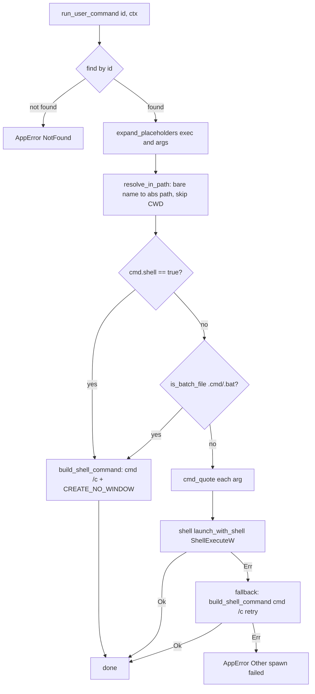
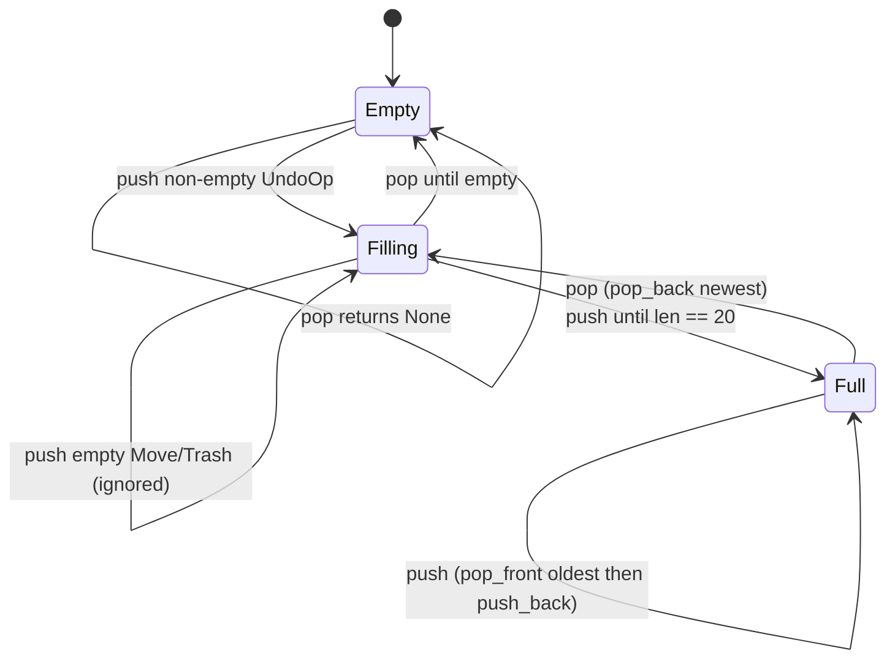

# 第6章: ドメイン層 — 検索・テンプレート・ユーザーコマンド・Undo

## Sources Read
- `crates/fastfiler-domain/src/error.rs` (lines 1-54)
- `crates/fastfiler-domain/src/path_util.rs` (lines 1-110)
- `crates/fastfiler-domain/src/ascii_tree.rs` (lines 1-158)
- `crates/fastfiler-domain/src/search.rs` (lines 1-252)
- `crates/fastfiler-domain/src/everything.rs` (lines 1-139)
- `crates/fastfiler-domain/src/templates.rs` (lines 1-156)
- `crates/fastfiler-domain/src/user_commands.rs` (lines 1-479)
- `crates/fastfiler-domain/src/undo.rs` (lines 1-201)

---

## 6.0 この章の位置づけ

本章が扱うのは `fastfiler-domain` クレートのうち、ファイルシステム I/O や Windows シェル統合よりも一段「上」の **ドメインサービス群** である。
具体的には、エラー型 (`error.rs`)、パスのボリューム判定 (`path_util.rs`)、ASCII ツリー描画 (`ascii_tree.rs`)、ファイル名検索 (`search.rs`)、Everything HTTP クライアント (`everything.rs`)、新規ファイルテンプレート (`templates.rs`)、ユーザー定義コマンド (`user_commands.rs`)、Undo モデル (`undo.rs`) の 8 モジュールである。
これらは UI 層 (`fastfiler-gpui`) からは「純粋なロジック」として呼び出され、副作用 (イベント発火・プロセス起動・ファイル作成) は引数で渡された sink やコンテキストを通じて表に出る構造になっている。
この章では各モジュールの公開サーフェスを列挙するだけでなく、「実際に何をしているか」、とりわけ検索のバックエンド切り替え、ユーザーコマンドのコマンドインジェクション対策、Undo がどう操作を記録し逆再生するかに踏み込む。

設計の通底原則は 2 つある。
1 つは「ロジックは sink / ctx を介して副作用を外へ出す」という Phase 2A の方針で、`search.rs` の `start_with_sink` がその典型である [REF: crates/fastfiler-domain/src/search.rs:56-81]。
もう 1 つは「データ構造と操作だけをドメインに置き、実行は呼び出し側が解釈する」という Undo の方針で、`undo.rs` のモジュールコメントに明記されている [REF: crates/fastfiler-domain/src/undo.rs:11-13]。

---

## 6.1 エラー型 — `error.rs`

このクレート全体のエラー表現は `AppError` という 1 つの enum に集約されている [REF: crates/fastfiler-domain/src/error.rs:4-26]。
`thiserror::Error` を derive しており、各バリアントには `#[error("...")]` で人間可読メッセージが付く。
バリアントは 10 種類で、`Io` は `std::io::Error` からの `#[from]` 変換を持つため `?` 演算子で I/O エラーが自動的に巻き上がる [REF: crates/fastfiler-domain/src/error.rs:6-7]。
その他は `NotFound` / `InvalidPath` / `NotSupported` / `Watch` / `Canceled` / `Win32` / `Parse` / `EnvMissing` / `Other` で、メッセージ部分は大半が `String` を保持する。
例外は `Canceled`(ペイロードなし)と `EnvMissing(&'static str)`(環境変数名を静的文字列で持つ)である [REF: crates/fastfiler-domain/src/error.rs:16-23]。

```rust
#[derive(Error, Debug)]
pub enum AppError {
    #[error("io error: {0}")]
    Io(#[from] std::io::Error),
    #[error("not found: {0}")]
    NotFound(String),
    #[error("invalid path: {0}")]
    InvalidPath(String),
    #[error("not supported: {0}")]
    NotSupported(String),
    #[error("watch error: {0}")]
    Watch(String),
    #[error("canceled")]
    Canceled,
    #[error("win32 error: {0}")]
    Win32(String),
    #[error("parse error: {0}")]
    Parse(String),
    #[error("env var missing: {0}")]
    EnvMissing(&'static str),
    #[error("other: {0}")]
    Other(String),
}
```

`AppError` には 1 つだけメソッド `kind()` がある [REF: crates/fastfiler-domain/src/error.rs:28-44]。
これは各バリアントを `"io"` / `"not_found"` / `"invalid_path"` … のような機械可読タグ文字列へマップするもので、コメントによればフロント側が `error.kind` を見て分岐したい場合に使う想定である。
注目すべきは `Serialize` の実装で、`serde` の derive ではなく手書きしている [REF: crates/fastfiler-domain/src/error.rs:48-52]。
シリアライズ時には enum 構造ではなく `to_string()`(= `Display` 文字列)だけを返す。
コメントには「既存フロント (Tauri invoke().catch(e => string)) との互換のため」と書かれており、過去に Tauri 製フロントが文字列としてエラーを受け取っていた名残を保っていることがわかる [REF: crates/fastfiler-domain/src/error.rs:46-47]。
つまり `kind()` で機械可読タグを取れる能力はあるが、シリアライズ経路ではそのタグは捨てられている。
最後に、結果型のエイリアス `AppResult<T> = Result<T, AppError>` が定義され、本章のほぼ全モジュールがこれを戻り値に使う [REF: crates/fastfiler-domain/src/error.rs:54]。

---

## 6.2 パスのボリューム判定 — `path_util.rs`

`path_util.rs` は Windows パスからボリュームキーを取り出す補助関数を提供する。
このキーはドラッグ&ドロップの既定動作(同一ボリュームなら移動、別ボリュームならコピー)や、跨ぎ判定に使われるとモジュールコメントにある [REF: crates/fastfiler-domain/src/path_util.rs:1-6]。
中核関数 `volume_key` は 4 種類のパス形式を識別する [REF: crates/fastfiler-domain/src/path_util.rs:18-48]。
処理の最初にパス全体を `to_ascii_lowercase` で小文字化し、比較とキー生成を大文字小文字非依存にする [REF: crates/fastfiler-domain/src/path_util.rs:19-22]。

識別の順序が重要である。
まず拡張長パスプレフィックス `\\?\` を剥がし、その後ろが `unc\` で始まれば UNC として `unc_two_segments` に委譲、そうでなくドライブレター形式 (`C:`) なら `c:` を返す [REF: crates/fastfiler-domain/src/path_util.rs:25-35]。
次に通常 UNC `\\server\share\...` を処理し、最後にドライブレター `C:\...` / `C:` を処理する [REF: crates/fastfiler-domain/src/path_util.rs:38-45]。
いずれにも当てはまらない相対パス等は `None` を返し、呼び出し側は「コピーへフォールバック」する想定になっている [REF: crates/fastfiler-domain/src/path_util.rs:43-47]。

UNC の組み立ては `unc_two_segments` が担う [REF: crates/fastfiler-domain/src/path_util.rs:50-59]。
`server\share\...` を `splitn(3, '\\')` で最大 3 分割し、先頭 2 セグメント (server と share) を取り出して `\\server\share` を作る。
どちらかが空なら `None` を返すため、`\\server`(share 欠落)や `\\` は弾かれる。
このガードはテスト `malformed_unc_returns_none` で確認されている [REF: crates/fastfiler-domain/src/path_util.rs:105-109]。
モジュールコメントは既知の制限も率直に述べている。
junction や subst で作られた「論理的には別物理ボリューム」は表面パスからは判別できないため、`volume_key` では区別できないと明記されている [REF: crates/fastfiler-domain/src/path_util.rs:3-5]。

---

## 6.3 ASCII ツリー描画 — `ascii_tree.rs`

`ascii_tree.rs` は選択フォルダの構造を `tree` コマンド風のボックス罫線テキストへ文字列化する [REF: crates/fastfiler-domain/src/ascii_tree.rs:1-8]。
仕様としては「フォルダのみ(ファイルは含まない)」「深さ無制限」「名前順・大文字小文字非依存ソート」「読み取り失敗フォルダには `[アクセス不可]` を 1 行付ける」が宣言されている。
罫線文字は 4 つの定数で定義される: `BRANCH`(├──)、`LAST`(└──)、`VERT`(│ )、`SPACE`(空白 4 つ) [REF: crates/fastfiler-domain/src/ascii_tree.rs:12-15]。

隠し判定 `is_hidden_default` はプラットフォームで分岐する [REF: crates/fastfiler-domain/src/ascii_tree.rs:19-35]。
Windows では `symlink_metadata` を取り `FILE_ATTRIBUTE_HIDDEN`(0x2)ビットを見る。
シンボリックリンク自体の属性を見る(リンク先を辿らない)点が `symlink_metadata` 採用の眼目である。
非 Windows ではドット先頭名を隠しとみなすフォールバックを持つ。

公開エントリは `render_ascii_tree(root, is_hidden)` で、戻り値は `String` である [REF: crates/fastfiler-domain/src/ascii_tree.rs:49-59]。
重要なのは隠し判定を `&dyn Fn(&Path) -> bool` のクロージャとして外から受け取る設計である。
これにより、`show_hidden` 設定が有効なときは「常に false を返すクロージャ」を渡すだけで隠しフォルダも描画でき、ドメイン側は設定値を知らずに済む。
`render_ascii_tree` はまず root のファイル名(取れなければパス全体)を見出し行として出力し、続いて `write_children` を空プレフィックスで呼ぶ。

再帰本体 `write_children` がツリーの罫線を組み立てる [REF: crates/fastfiler-domain/src/ascii_tree.rs:61-82]。
`collect_visible_dirs` が `Err(())` を返した(=ディレクトリ読み取り失敗)場合、現在のプレフィックス + `LAST` + `[アクセス不可]` を 1 行出して打ち切る [REF: crates/fastfiler-domain/src/ascii_tree.rs:64-69]。
正常時は各子について、最後の要素なら `LAST`、それ以外は `BRANCH` を前置し、次段のプレフィックスを「最後なら `SPACE`、そうでなければ `VERT`」で延長して再帰する [REF: crates/fastfiler-domain/src/ascii_tree.rs:72-81]。
これが罫線の連続性(中間要素では縦線を引き継ぎ、末尾要素では空白にする)を生む。

子の収集 `collect_visible_dirs` は `read_dir` の失敗を `Err(())` に潰し、成功時はディレクトリのみを抽出する [REF: crates/fastfiler-domain/src/ascii_tree.rs:84-103]。
`file_type()` がディレクトリでないエントリ、および `is_hidden` クロージャが true を返すパスはスキップする。
最後に `sort_by_key(|a| a.to_lowercase())` で大文字小文字非依存にソートする [REF: crates/fastfiler-domain/src/ascii_tree.rs:101]。
テスト群はこの振る舞いを裏付けており、ファイル除外 (`folders_only_excludes_files`)、罫線使用 (`nested_folders_use_box_drawing`)、隠しフィルタ (`hidden_predicate_filters_dirs`) を検証している [REF: crates/fastfiler-domain/src/ascii_tree.rs:121-157]。

---

## 6.4 検索サービス — `search.rs`

`search.rs` は 2 系統のバックエンドを持つファイル名検索エンジンである。
1 つは `ignore` クレート(gitignore 解釈ベースの再帰ウォーカー)による組み込み検索(builtin)、もう 1 つは voidtools の Everything HTTP Server を使う検索である [REF: crates/fastfiler-domain/src/search.rs:1-4]。

### 6.4.1 データ型

検索結果は 1 ヒットごとに `SearchHit { job_id, path, name, is_dir }` として表現され、`Serialize` 可能で UI へストリーミングされる [REF: crates/fastfiler-domain/src/search.rs:18-24]。
完了通知は `SearchDone` で、`total`(件数)、`canceled`、`backend`("builtin"/"everything")、`fallback`(Everything 失敗で builtin に落ちたか)、`error`(失敗理由)を運ぶ [REF: crates/fastfiler-domain/src/search.rs:26-34]。
この `fallback` と `error` フィールドの存在が、後述する「Everything が失敗したら静かに builtin へ落ちる」設計の証左である。

検索状態は `SearchState` が握る [REF: crates/fastfiler-domain/src/search.rs:36-40]。
`current: Mutex<Option<Arc<AtomicU64>>>` が「現在進行中ジョブのキャンセルフラグ」を、`next_id: AtomicU64` がジョブ ID 採番カウンタを保持する。
検索オプションは `SearchOptions` 構造体で、`case_sensitive` / `use_regex` / `include_hidden` / `max_results` / `backend` / `everything_port` / `everything_scope` を持つ [REF: crates/fastfiler-domain/src/search.rs:42-51]。

### 6.4.2 ジョブ起動とキャンセル

`SearchState::start_with_sink` がジョブを起動する [REF: crates/fastfiler-domain/src/search.rs:56-81]。
パターンが空なら即 `AppError::Other("empty pattern")` を返す [REF: crates/fastfiler-domain/src/search.rs:63-65]。
ジョブ ID は `next_id.fetch_add(1) + 1` で採番される [REF: crates/fastfiler-domain/src/search.rs:66]。
ここが「同時実行は 1 つだけ」というモデルの核心で、新ジョブ開始時に `current` をロックし、もし前ジョブのキャンセルフラグが残っていればそれを `store(1)` で立ててから、自分のフラグに差し替える [REF: crates/fastfiler-domain/src/search.rs:68-74]。
つまり新しい検索を始めると古い検索は自動的にキャンセルされる。
実処理は `std::thread::spawn` でバックグラウンドスレッドに投げ、メインスレッドへは即座に `job_id` を返す [REF: crates/fastfiler-domain/src/search.rs:76-80]。
明示キャンセル `cancel()` は `current` を取り出してフラグを立てるだけである [REF: crates/fastfiler-domain/src/search.rs:83-88]。

### 6.4.3 バックエンド分岐とフォールバック

ワーカー本体 `run_job` がバックエンドを分岐する [REF: crates/fastfiler-domain/src/search.rs:91-178]。
`backend == "everything"` のとき、`everything_scope` が有効なら root をスコープに、無効なら `None` を渡して `everything::query` を呼ぶ [REF: crates/fastfiler-domain/src/search.rs:99-112]。
成功時は各ヒットを `SearchHit` に変換して `search-hit` イベントを emit し、ループ中もキャンセルフラグを監視する [REF: crates/fastfiler-domain/src/search.rs:113-141]。
ここで決定的なのは失敗時の挙動である。
`everything::query` が `Err` を返すと、エラーメッセージを保存したうえで **そのまま `run_builtin` を実行し**、`backend: "builtin"`, `fallback: true`, `error: Some(...)` を載せた `SearchDone` を出す [REF: crates/fastfiler-domain/src/search.rs:143-161]。
ユーザーから見れば「Everything が落ちていても検索は組み込みエンジンで完遂する」という耐障害設計になっている。
`backend` が "everything" でなければ最初から `run_builtin` を実行し、`fallback: false` で終える [REF: crates/fastfiler-domain/src/search.rs:163-178]。

### 6.4.4 組み込みウォーカーとマッチャ

`run_builtin` は `ignore::WalkBuilder` でディレクトリツリーを再帰する [REF: crates/fastfiler-domain/src/search.rs:180-227]。
注目すべきはウォーカーの設定で、`hidden(!opts.include_hidden)` で隠しフィルタを連動させつつ、`ignore(false)` / `git_ignore(false)` / `git_global(false)` / `git_exclude(false)` と **gitignore 系の除外をすべて無効化** している [REF: crates/fastfiler-domain/src/search.rs:189-195]。
ファイルマネージャの検索なので「.gitignore に書かれたファイルも見つけたい」という意図であり、`ignore` クレートを使いつつもその主機能(無視ルール)はオフにしている点が興味深い。
各エントリについてファイル名を取り出し、マッチャ関数 `matcher(&name)` が true のときだけ `search-hit` を emit する [REF: crates/fastfiler-domain/src/search.rs:206-221]。
ヒット数が `max_results` に達するか、キャンセルフラグが立つとループを抜ける [REF: crates/fastfiler-domain/src/search.rs:198-225]。

マッチャ生成 `build_matcher` は 3 つのモードを返すクロージャファクトリである [REF: crates/fastfiler-domain/src/search.rs:229-251]。
正規表現モードでは `regex::RegexBuilder` に `case_insensitive(!case_sensitive)` を設定してビルドし、**ビルドに失敗したら**(不正な正規表現のとき)正規表現を諦めて単純な部分文字列一致(`contains`)へフォールバックする [REF: crates/fastfiler-domain/src/search.rs:234-243]。
非正規表現かつ大小区別ありなら `contains`、大小区別なしなら両辺を小文字化して `contains` する [REF: crates/fastfiler-domain/src/search.rs:244-250]。

```rust
fn build_matcher(
    pattern: &str,
    case_sensitive: bool,
    regex_mode: bool,
) -> Box<dyn Fn(&str) -> bool + Send> {
    if regex_mode {
        let mut builder = regex::RegexBuilder::new(pattern);
        builder.case_insensitive(!case_sensitive);
        match builder.build() {
            Ok(re) => Box::new(move |name| re.is_match(name)),
            Err(_) => {
                let needle = pattern.to_owned();
                Box::new(move |name| name.contains(&needle))
            }
        }
    } else if case_sensitive {
        let needle = pattern.to_owned();
        Box::new(move |name| name.contains(&needle))
    } else {
        let needle = pattern.to_lowercase();
        Box::new(move |name| name.to_lowercase().contains(&needle))
    }
}
```

なお、検索対象は **ファイル名のみ** である点に注意したい。
モジュール冒頭コメントは「検索」と言いつつ、`run_builtin` の実装はエントリ名 (`p.file_name()`) しか照合しておらず、ファイル内容の grep は本モジュールには見当たらない [REF: crates/fastfiler-domain/src/search.rs:206-212]。

---

## 6.5 Everything HTTP クライアント — `everything.rs`

`everything.rs` は voidtools 製 Everything のローカル HTTP Server に問い合わせるクライアントである [REF: crates/fastfiler-domain/src/everything.rs:1-9]。
利用には Everything 側で HTTP Server を有効化する必要があり、既定ポートは 80、エンドポイントは `http://127.0.0.1:<PORT>/?json=1&search=...` である。

JSON 応答は `RawResponse { total_results, results }` と `RawHit` にデシリアライズされる [REF: crates/fastfiler-domain/src/everything.rs:14-32]。
`RawHit` は `type`(file/folder)、`name`、`path`、`size`、`date_modified` を `Option` で持ち、`size` と `date_modified` は `#[allow(dead_code)]` 付きで現状未使用である。
公開結果型は `EverythingHit { name, path, is_dir }`、エラー型は `EverythingError(pub String)` で、`Display` 実装は `"Everything HTTP error: {0}"` を返す [REF: crates/fastfiler-domain/src/everything.rs:34-48]。

中核 `query` 関数はクエリ文字列を組み立てて HTTP GET する [REF: crates/fastfiler-domain/src/everything.rs:58-129]。
スコープ指定があれば末尾のスラッシュ/バックスラッシュを除去したうえで `path:"<scope>" ` を AND として前置し、正規表現モードなら `regex:<query>`、そうでなければ生クエリをそのまま連結する [REF: crates/fastfiler-domain/src/everything.rs:66-79]。
URL には `count`(件数ヒント)、`match_case`、`urlencoding::encode` したクエリを載せる [REF: crates/fastfiler-domain/src/everything.rs:81-87]。
HTTP は `ureq` エージェントで、接続タイムアウト 800ms・全体タイムアウト 8 秒という短めの設定である [REF: crates/fastfiler-domain/src/everything.rs:89-100]。

防御的な処理が 2 箇所ある。
1 つは、`count` はサーバへのヒントに過ぎず信頼できないローカル HTTP が大量ヒットを返しうるため、応答を `truncate(max_results)` で必ず切り詰める点である [REF: crates/fastfiler-domain/src/everything.rs:102-107]。
コメントには「メモリ/UI フラッディングを防ぐ」と明記されている。
もう 1 つはパス結合のロジックで、`path` が空なら `name` 単体、末尾が区切り文字なら単純連結、そうでなければ `\` を挟んで結合する [REF: crates/fastfiler-domain/src/everything.rs:113-124]。
`is_dir` は `type` が `"folder"` のときだけ真になる [REF: crates/fastfiler-domain/src/everything.rs:125]。
最後に軽量な疎通確認 `ping` があり、`count=0&search=`(空検索)を投げて呼び出しが成功するかどうかだけを `bool` で返す(タイムアウトは接続 400ms / 全体 2 秒とさらに短い) [REF: crates/fastfiler-domain/src/everything.rs:132-139]。

---

## 6.6 ファイルテンプレート — `templates.rs`

`templates.rs` は「新規ファイルをテンプレートから作る」機能を提供する [REF: crates/fastfiler-domain/src/templates.rs:1-8]。
テンプレートの置き場所は `%APPDATA%\fastfiler\templates` で、`templates_dir_inner` が `APPDATA` 環境変数を読み(無ければ `AppError::EnvMissing("APPDATA")`)、ディレクトリが無ければ `create_dir_all` で作る [REF: crates/fastfiler-domain/src/templates.rs:22-29]。
公開型 `TemplateInfo` は `name` / `path` / `ext`(小文字・ドットなし)を持つ [REF: crates/fastfiler-domain/src/templates.rs:15-20]。

`list_templates` はテンプレートフォルダ内の **ファイルのみ** を列挙する [REF: crates/fastfiler-domain/src/templates.rs:36-65]。
`read_dir` が失敗した場合は空の Vec を返して握り潰す(エラーにしない)点に注意したい [REF: crates/fastfiler-domain/src/templates.rs:39-42]。
ディレクトリエントリはスキップし、拡張子を小文字化して詰め、最後に名前の小文字で安定ソートする [REF: crates/fastfiler-domain/src/templates.rs:48-64]。

同名衝突の回避は `unique_path` が担う [REF: crates/fastfiler-domain/src/templates.rs:67-93]。
`n == 0` なら素の名前、`n >= 1` なら `base (n+1).ext` の形(例: ` (2)`, ` (3)`)を生成し、存在しないパスが見つかるまでインクリメントする。
無限ループ防止のため `n > 9999` で打ち切ってそのパスを返す [REF: crates/fastfiler-domain/src/templates.rs:82-92]。
ファイル名の分解 `split_base_ext` は最後の `.` で base と ext に分けるが、`idx > 0` のガードがあるため先頭ドット(`.gitignore` のような名前)は拡張子扱いされず全体が base になる [REF: crates/fastfiler-domain/src/templates.rs:95-102]。

書き込み API は 2 つある。
`create_empty_file` は宛先がディレクトリであることを確認し(でなければ `AppError::Other`)、`body` が `Some` かつ非空ならその内容を書き、そうでなければ空ファイルを `File::create` する [REF: crates/fastfiler-domain/src/templates.rs:104-125]。
`create_file_from_template` はテンプレート元 (`src.is_file()`) と宛先 (`dir.is_dir()`) を検証し、ファイル名未指定ならテンプレートのファイル名(取れなければ `"新規ファイル"`)を採用し、`unique_path` で衝突回避したうえで `fs::copy` する [REF: crates/fastfiler-domain/src/templates.rs:127-155]。
どちらも最終的な絶対パス文字列を返す。

---

## 6.7 ユーザー定義コマンド — `user_commands.rs`

本章で最も実装が厚く、セキュリティ上も重要なのが `user_commands.rs` である。
これは `%APPDATA%\fastfiler\commands\commands.json` を読み、右クリックメニューへ任意の外部コマンド項目を追加する機能である [REF: crates/fastfiler-domain/src/user_commands.rs:1-14]。

### 6.7.1 コマンド定義とプレースホルダ

1 つのコマンドは `UserCommand` 構造体で表現される [REF: crates/fastfiler-domain/src/user_commands.rs:22-43]。
フィールドは `id` / `label` / `icon` / `exec` / `args` / `cwd` / `when` / `extensions` / `submenu` / `shell` / `hidden` で、多くが `#[serde(default)]` 付きで省略可能である。
`when` は省略時 `default_when()` により `"any"` になる [REF: crates/fastfiler-domain/src/user_commands.rs:33-34]。

```rust
#[derive(Serialize, Deserialize, Clone, Debug)]
pub struct UserCommand {
    pub id: String,
    pub label: String,
    #[serde(default)]
    pub icon: Option<String>,
    pub exec: String,
    #[serde(default)]
    pub args: Vec<String>,
    #[serde(default)]
    pub cwd: Option<String>,
    #[serde(default = "default_when")]
    pub when: String,
    #[serde(default)]
    pub extensions: Vec<String>,
    #[serde(default)]
    pub submenu: Option<String>,
    #[serde(default)]
    pub shell: bool,
    #[serde(default)]
    pub hidden: bool,
}
```

プレースホルダは 8 種類で、`{path}`(1 件目フルパス)、`{paths}`(全件)、`{name}`(拡張子付き名)、`{stem}`(拡張子なし)、`{ext}`(.xxx)、`{parent}`(親)、`{cwd}`(現ペイン)、`{count}`(件数)である [REF: crates/fastfiler-domain/src/user_commands.rs:4-14]。
展開は `expand_placeholders` が単純な連鎖 `replace` で行う [REF: crates/fastfiler-domain/src/user_commands.rs:273-309]。
`{path}` は 1 件目のフルパス、`{paths}` は各パスを `quote_if_needed` で必要に応じてクオートしてスペース連結したもので埋める [REF: crates/fastfiler-domain/src/user_commands.rs:292-298]。

### 6.7.2 ディレクトリ初期化と読み込み

`commands_dir_inner` はコマンドフォルダを用意し、初回作成時に `commands.json.sample` を書き出す [REF: crates/fastfiler-domain/src/user_commands.rs:49-60]。
このサンプルは末尾の `SAMPLE_JSON` 定数(VSCode・7-Zip・PowerShell・Windows Terminal などの実例入り)で、`when` や `submenu` の使い方をコメントで解説している [REF: crates/fastfiler-domain/src/user_commands.rs:322-409]。
`list_user_commands` は `commands.json` が無ければ空 Vec、あれば JSON をパースし、パース失敗時は `AppError::Parse` を返す [REF: crates/fastfiler-domain/src/user_commands.rs:67-77]。
読み込んだコマンドのうち `hidden == true` のものは除外される [REF: crates/fastfiler-domain/src/user_commands.rs:76]。

### 6.7.3 実行フローとセキュリティ対策

`run_user_command(id, ctx)` が実行の中枢で、`RunCtx { paths, cwd }` を受け取る [REF: crates/fastfiler-domain/src/user_commands.rs:79-85]。
まず `id` でコマンドを引き(無ければ `AppError::NotFound`)、`exec` と各 `args` をプレースホルダ展開する [REF: crates/fastfiler-domain/src/user_commands.rs:85-92]。
引数展開には 2 つの実用的工夫がある。
`"{paths}"` 単独の引数は「1 パス = 1 引数」として展開する(空白区切りの 1 引数に詰めるとクオートが入れ子になり、7z に渡したとき 0 files になる実害があったとコメントにある) [REF: crates/fastfiler-domain/src/user_commands.rs:94-101]。
また、展開後に空になった引数(背景メニューでの `{path}` 等)は除外する(`code ""` のような壊れた起動を避けるため) [REF: crates/fastfiler-domain/src/user_commands.rs:102-108]。

セキュリティ上の核心が `resolve_in_path` である [REF: crates/fastfiler-domain/src/user_commands.rs:229-262]。
`code` のようなベア名(パス区切りを含まない実行ファイル名)は、起動前に **PATH(ただしカレントディレクトリを除外)** で絶対パスへ解決する。
これは閲覧中フォルダに置かれた悪意ある `code.exe` 等が検索順序で実行される「バイナリプランティング」を防ぐためである [REF: crates/fastfiler-domain/src/user_commands.rs:115-120]。
`resolve_in_path` は絶対パスやパス区切りを含む exec には `None` を返し(従来どおり扱う)、`PATHEXT`(既定 `.COM;.EXE;.BAT;.CMD`)を考慮して候補を探すが、**空の PATH エントリ(= Windows ではカレントディレクトリ)は明示的にスキップする** [REF: crates/fastfiler-domain/src/user_commands.rs:242-260]。

起動経路は 3 つに分かれる [REF: crates/fastfiler-domain/src/user_commands.rs:122-173]。
(1) `shell == true` なら `build_shell_command`(`cmd.exe /c`)で起動。
(2) `exec` が `.cmd`/`.bat`(`is_batch_file` で判定)なら、これも `cmd /c` + `CREATE_NO_WINDOW` で不可視に起動する(ShellExecuteW だと毎回コンソールウィンドウが残るため。VSCode の `code` は実体が `code.cmd` でこれに該当) [REF: crates/fastfiler-domain/src/user_commands.rs:134-139]。
(3) それ以外は各引数を `cmd_quote` でダブルクオートしたうえで `shell::launch_with_shell`(ShellExecuteW 経路)に渡し、失敗したら `cmd /c` 経由で再試行する [REF: crates/fastfiler-domain/src/user_commands.rs:149-173]。

コマンドインジェクション対策の要が `build_shell_command` と `cmd_quote` である。
`cmd_quote` は 1 トークンを必ずダブルクオートで囲み、内部の `"` を cmd 規約の `""` にエスケープする [REF: crates/fastfiler-domain/src/user_commands.rs:269-271]。
引用符内では cmd が `& | < > ^ ( )` をリテラル扱いするため、ファイル名由来のメタ文字を無害化できる。

```rust
fn cmd_quote(s: &str) -> String {
    format!("\"{}\"", s.replace('"', "\"\""))
}
```

`build_shell_command` は各トークンを `cmd_quote` で囲んだうえ、`/c` の引用符剥がし規則に合わせて行全体をさらに 1 組の `"` で囲み、Windows では `raw_arg` で Rust の再クオートを回避してそのまま渡す [REF: crates/fastfiler-domain/src/user_commands.rs:183-213]。
さらに `CREATE_NO_WINDOW`(0x08000000)を立てて cmd 自体のコンソールを一瞬も出さない [REF: crates/fastfiler-domain/src/user_commands.rs:200-203]。
この防御は単体テストで裏取りされており、`x&echo PWNED>marker` のような攻撃的ファイル名を `.bat` ツールへ渡しても (1) marker が作られない(注入が起きない)、(2) 引数はリテラルとしてツールに届く、ことを end-to-end で検証している(BatBadBut クラスの最重要ケース) [REF: crates/fastfiler-domain/src/user_commands.rs:427-460]。
なお `quote_if_needed`(`{paths}` 連結用)は `cmd_quote` とは別物で、空なら `""`、空白/タブを含むときだけ `"..."` で囲み内部 `"` を `\"` にエスケープする(Windows 一般のコマンドライン規約寄り) [REF: crates/fastfiler-domain/src/user_commands.rs:311-320]。

---

## 6.8 Undo モデル — `undo.rs`

`undo.rs` は Undo マネージャを提供するが、設計判断が ADR(Architecture Decision Record)番号付きでコメントに明記されている点が特徴的である [REF: crates/fastfiler-domain/src/undo.rs:1-13]。
ADR 0006 により、対象操作は **リネーム / 移動 / ゴミ箱送りの 3 種**、in-memory で N=20、起動間では保持しない。
ADR 0008 により、履歴はアプリ全体で 1 本(グローバル)、バルクは「1 ユーザーアクション = 1 アンドゥ枠」、失敗分は新しい `UndoOp` として積み直し、上書きは絶対にしない(実行側が no-overwrite な逆操作 API を使う)。
そして決定的なのは「このモジュールはデータ構造と stack 操作のみを提供し、逆操作の実行は呼び出し側が取り出した `UndoOp` を解釈して行う」という責務分離である [REF: crates/fastfiler-domain/src/undo.rs:11-13]。

最大履歴長は `MAX_HISTORY: usize = 20` の定数 [REF: crates/fastfiler-domain/src/undo.rs:20-21]。
ゴミ箱送り 1 項目は `TrashedItem` で、`original_path` / `file_name` / `size` / `modified` / `is_dir` / `deleted_at` を持つ [REF: crates/fastfiler-domain/src/undo.rs:25-33]。
これらは復元時の識別キーとして使われる(ADR 0008 S3)。

操作種別は `UndoOp` enum の 3 バリアントで表現される [REF: crates/fastfiler-domain/src/undo.rs:36-47]。
`Rename { from, to }` の Undo は `to → from` への rename(親フォルダは同じ前提)。
`Move { items }` の Undo は各要素を `to → from` へ move back(同名衝突回避でリネームされた場合も `to` は実際の配置先)。
`Trash { items }` の Undo は各要素を `IFileOperation::MoveItems` で元の場所へ戻す。
ここからわかるのは、`UndoOp` は「やり直す方法」ではなく「元に戻す方法を再構成できる情報」を保持しているという点である。

```rust
#[derive(Clone, Debug)]
pub enum UndoOp {
    /// `from` (元の名前) ←→ `to` (変更後)。Undo は `to` → `from` への rename。
    Rename { from: PathBuf, to: PathBuf },
    /// 1 ペースト/1 D&D 等の 1 ユーザーアクションで移動した複数項目。
    /// Undo は各要素を `to` → `from` へ move back する。
    Move { items: Vec<MoveItem> },
    /// ゴミ箱へ送った複数項目。Undo は各要素を元の場所へ戻す。
    Trash { items: Vec<TrashedItem> },
}
```

`MoveItem { from, to }` は移動 1 件の元/先を保持する [REF: crates/fastfiler-domain/src/undo.rs:49-53]。
`impl UndoOp` は表示用の 3 メソッドを持つ [REF: crates/fastfiler-domain/src/undo.rs:55-82]。
`label()` は `"リネーム"` / `"移動"` / `"ゴミ箱送り"` を返す。
`count()` は影響件数(Rename は常に 1、Move/Trash は `items.len()`)を返す。
`representative_path()` はステータスバー表示用の代表パスで、Move/Trash では「先頭要素の戻し先」(Move は `from`、Trash は `original_path`)を返す。

スタック本体 `UndoManager` は `VecDeque<UndoOp>` 1 本で実装される [REF: crates/fastfiler-domain/src/undo.rs:85-95]。
`push` の挙動が ADR を体現している [REF: crates/fastfiler-domain/src/undo.rs:97-109]。
まず空の `Move`/`Trash`(items が空)は積まない(Undo してもすることが無いため)。
次に、スタックが `MAX_HISTORY` に達していたら `pop_front()` で最古を捨ててから `push_back()` する。
これにより容量 20 のリングバッファ的な挙動になる。

```rust
pub fn push(&mut self, op: UndoOp) {
    // 空 items は積まない (push しても Undo 時にすることが無い)
    match &op {
        UndoOp::Move { items } if items.is_empty() => return,
        UndoOp::Trash { items } if items.is_empty() => return,
        _ => {}
    }
    if self.stack.len() == MAX_HISTORY {
        self.stack.pop_front();
    }
    self.stack.push_back(op);
}
```

取り出しは `pop()` が `pop_back()` で末尾(=最新)を返す LIFO である [REF: crates/fastfiler-domain/src/undo.rs:111-114]。
補助に `len()` / `is_empty()` がある [REF: crates/fastfiler-domain/src/undo.rs:116-122]。
テスト群がこの不変条件を固めており、LIFO 順 (`push_and_pop_lifo`)、容量上限で最古が押し出されること (`capacity_capped_at_max_history`)、空バルクが積まれないこと (`empty_bulk_is_not_pushed`)、空 pop が `None` を返すこと (`pop_on_empty_returns_none`) を検証している [REF: crates/fastfiler-domain/src/undo.rs:136-179]。

ここで強調したいのは、`undo.rs` には **実際にファイルを動かすコードが一切無い** ことである。
`pop()` で取り出した `UndoOp` を見て `to → from` の rename を実行したり、ゴミ箱からの復元を呼ぶのは GUI 層(`pane.rs` の `undo_store` 周辺、第8章)の責務である。
ドメイン層は「何を元に戻すべきか」だけを覚え、「どう元に戻すか」は実行側に委ねる、というクリーンな境界が引かれている。

---

## 6.9 ユーザーコマンド実行フロー(Mermaid)



## 6.10 Undo スタックの状態遷移(Mermaid)



---

## 6.11 横断的な観察

検索 (`search.rs`)、テンプレート (`templates.rs`)、ユーザーコマンド (`user_commands.rs`) はいずれも `%APPDATA%\fastfiler\` 配下に設定/データを置く、という共通のレイアウトを持つ。
テンプレートは `templates\`、ユーザーコマンドは `commands\` で、どちらも初回アクセス時に `create_dir_all` で自動生成する [REF: crates/fastfiler-domain/src/templates.rs:22-29] [REF: crates/fastfiler-domain/src/user_commands.rs:49-60]。
`APPDATA` が取れないときは共通して `AppError::EnvMissing("APPDATA")` を返す。

エラーハンドリングの方針は一貫しており、本章のモジュールは戻り値に `AppResult<T>`(= `Result<T, AppError>`)を使う。
ただし「列挙が失敗しても空を返す」という寛容な握り潰し(`list_templates` の `read_dir` 失敗、`ascii_tree` の読み取り失敗を `[アクセス不可]` 行へ)も随所にあり、UI を止めない方向に倒している [REF: crates/fastfiler-domain/src/templates.rs:39-42] [REF: crates/fastfiler-domain/src/ascii_tree.rs:64-69]。

副作用の外出しという点では、`search.rs` の sink 注入と `undo.rs` の「実行は呼び出し側」が両極の好例である。
前者はイベント発火を `Arc<dyn EventSink>` 経由で外に出し、後者はファイル操作そのものを外に出す。
いずれもドメインロジックを純粋に保ち、テスト可能性を高める設計意図が読み取れる。

---

## 6.12 確信度と要確認事項

[CONFIDENCE: HIGH] `error.rs` / `path_util.rs` / `ascii_tree.rs` / `undo.rs` の振る舞いは、本体コードとテストの双方を読んで確認したため確信度が高い。

[CONFIDENCE: HIGH] `search.rs` のバックエンド分岐・自動フォールバック・「新検索が旧検索をキャンセルする」モデルは `run_job` / `start_with_sink` の実装から直接読み取れる [REF: crates/fastfiler-domain/src/search.rs:68-74]。

[CONFIDENCE: HIGH] `user_commands.rs` のインジェクション対策(`cmd_quote` / `resolve_in_path` / `CREATE_NO_WINDOW`)は本体 + 専用テストで裏取りされている。

[CONFIDENCE: MED] 検索が「ファイル名のみ」を対象とする点は `run_builtin` の実装からの推論である。コンテンツ grep の実体は本モジュールに見当たらない。コンテンツ検索が他層にあるのか、未実装/将来機能なのかは要確認 [ASK SME]。

[ASSUMED: `representative_path` や `label`/`count` は GUI のステータスバー/トースト表示専用で、Undo の実行ロジックには関与しないと仮定した。実行側(`pane.rs`)の利用箇所は第8章で確認が必要。]

[ASSUMED: `everything.rs` の `size`/`date_modified` フィールドが `#[allow(dead_code)]` である事実から、Everything 結果はファイラのリスト列(サイズ/更新日時)には反映されず、名前とパスのみが UI に出ると仮定した。]

[ASK SME] `SearchOptions` には拡張子フィルタが無いが、`UserCommand.extensions` は存在する。検索側に拡張子フィルタを設けない判断は意図的か、UI 側でフィルタしているのか。

---

<!-- DETAIL_QUESTIONS
- 1. search.rs のコメントは検索全般を謳うが、run_builtin はファイル名のみ照合している。コンテンツ(本文)検索は別レイヤに存在するのか、それとも未実装の将来機能か。
- 2. Everything バックエンド失敗時の builtin 自動フォールバックは仕様として保証された動作か、それとも実装上の保険か。fallback=true / error=Some(..) を UI はユーザーへ通知するのか、黙って結果だけ見せるのか。
- 3. undo.rs は「失敗分は新しい UndoOp として stack に push し直す」(ADR 0008) とコメントするが、その push-back を行うのは呼び出し側である。部分失敗(バルク移動の一部だけ失敗)時に、成功分を取り除いた残りを正しく再構成する責務の所在を確認したい。
- 4. user_commands の when 値("file"/"folder"/"selection"/"background"/"drop"/"any") によるメニュー出し分けは UI 層(pane.rs)で解釈される。ドメイン側は when を素通しするだけか、フィルタ補助関数を提供すべきか。
- 5. templates.rs の unique_path は n>9999 で諦めて衝突しうるパスを返す。この極端ケースで上書きが起きるリスクは許容範囲か(create_file_from_template は fs::copy で上書きしうる)。
- 6. path_util.volume_key は junction/subst を区別できないと明記されている。D&D の Move/Copy 既定判定でこの制限が実害(別物理ボリュームなのに Move 扱い)になるシナリオは想定済みか。
-->
