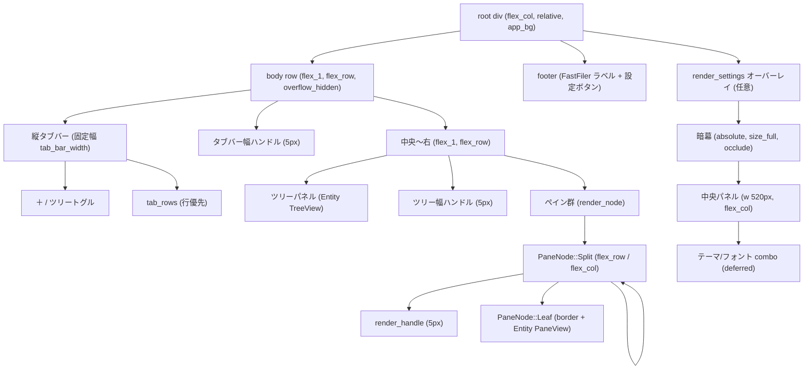

# 第7章: GUI 層 — アプリシェルとレイアウト

## Sources Read
- `crates/fastfiler-gpui/src/main.rs` (lines 1-109)
- `crates/fastfiler-gpui/src/app.rs` (lines 1-200)
- `crates/fastfiler-gpui/src/app.rs` (lines 200-470)
- `crates/fastfiler-gpui/src/app.rs` (lines 469-768)
- `crates/fastfiler-gpui/src/app.rs` (lines 960-1382)
- `crates/fastfiler-gpui/src/app.rs` (lines 1384-1897)

---

## 7.1 この章の対象

この章は、fastfiler の GPUI フロントエンドの「外殻 (アプリシェル)」を扱う。
具体的には、`main.rs` のプロセス起動からウィンドウ生成までのブートストラップと、`app.rs` の `FastFilerApp` が描く最上位のレイアウト/レンダリングツリーである。

`app.rs` は約 1900 行ある大きなファイルで、状態モデル (第3章) や個々のペインの細かな振る舞い (第8章) とも関係する。
本章では、そのうち「シェルとレイアウト」に絞って読む。
すなわち、ウィンドウ・アプリの初期化、`Render for FastFilerApp` の実体、レイアウトを組み立てる builder 群、リサイズハンドルやタブバーの描画、グローバルなアクション/キーバインドとそのルーティング、そして設定オーバーレイ (モーダル) のレイアウトである。
ペイン内部のファイル一覧描画・ドラッグ&ドロップ・コンテキストメニューなどは第8章に譲る。

GPUI のレンダリングモデルは、各フレームで `render` が呼ばれて要素ツリー (`div()` の連鎖) を構築し直す即時モード風の宣言的 UI である。
したがって「レイアウト」とは静的な設定ファイルではなく、`render` が毎回生成する `div()` のツリーそのものを指す。
本章では、その実際のツリーの形を上から下へたどる。

---

## 7.2 プロセス起動とウィンドウブートストラップ (`main.rs`)

エントリポイントは `main()` である [REF: crates/fastfiler-gpui/src/main.rs:28-108]。
リリースビルドではファイル冒頭の `#![cfg_attr(not(debug_assertions), windows_subsystem = "windows")]` でコンソールウィンドウを抑止し、純粋な GUI アプリとして振る舞う [REF: crates/fastfiler-gpui/src/main.rs:5-6]。

`main()` は GPUI のランループに入る前に、いくつかの前処理を順に行う。
第一に、多重起動の防止である [REF: crates/fastfiler-gpui/src/main.rs:29-36]。
`win32_single_instance::acquire_single_instance()` が偽を返したら、既存ウィンドウを前面化して `return` で静かに終了する。
このとき活性化に使うウィンドウタイトル "FastFiler" は、後段の `TitlebarOptions` で設定するタイトルと一致させる必要がある (ソース内コメントが `FindWindowW` との対応を明示している)。

第二に、ホットキー設定の読み込み `hotkeys::load()` である [REF: crates/fastfiler-gpui/src/main.rs:38-39]。
設定ファイルが無ければ既定値で生成される (詳細は第10章)。

第三に、Windows では OLE ドラッグ&ドロップ送信のために `fastfiler_domain::ole_dnd::init_ole()` を UI スレッドで初期化する [REF: crates/fastfiler-gpui/src/main.rs:42-43]。
GPUI 側が既に初期化済みでも参照カウントで安全だ、とコメントされている。

これらが済んだ後で `application().run(|cx: &mut App| { ... })` に入る [REF: crates/fastfiler-gpui/src/main.rs:45-107]。
クロージャの内部が、UI 構築の本体である。

`run` クロージャ内の処理は次の順序を踏む。
まず `text_input::bind_keys(cx)` で、テキスト入力専用 (`"TextInput"` コンテキスト限定) のキーバインドをグローバルに登録する [REF: crates/fastfiler-gpui/src/main.rs:45-47]。
これがアプリ全体で唯一の「`cx` に対するキーバインド登録」であり、コピー/貼り付け/カーソル移動などの編集キーはここで定義される (第9章で詳述)。

次に、前回セッション (`session::load()`) と設定 (`settings_store::load()`) を読み込む [REF: crates/fastfiler-gpui/src/main.rs:49-53]。
テーマは旧バージョンの `session.theme` からの移行を吸収しつつ、ユーザーテーマ (`themes/*.json`) を先に読み込んでから名前で解決する [REF: crates/fastfiler-gpui/src/main.rs:54-66]。
UI フォントサイズとスタイルもここでキャッシュへ反映される [REF: crates/fastfiler-gpui/src/main.rs:67-71]。

ウィンドウの位置/サイズは、保存値があればそれを使い、無ければ画面中央に 1000×660 で開く [REF: crates/fastfiler-gpui/src/main.rs:73-81]。
保存値には最小サイズのフィルタ (`w >= 400.0 && h >= 300.0`) がかかっており、壊れた極小サイズで復元されない安全策が入っている。
最大化で終了していた場合は `WindowBounds::Maximized(bounds)` で復元し、そうでなければ `WindowBounds::Windowed(bounds)` を使う [REF: crates/fastfiler-gpui/src/main.rs:82-87]。

最後に `cx.open_window(...)` を呼んでウィンドウを開く [REF: crates/fastfiler-gpui/src/main.rs:88-105]。
`WindowOptions` には復元した `window_bounds` と、タイトル "FastFiler" を持つ `TitlebarOptions` を渡す。
ウィンドウのルートビューは、セッションの有無で分岐する。

```rust
cx.open_window(
    WindowOptions {
        window_bounds: Some(window_bounds),
        // タイトルは多重起動防止の FindWindowW ("FastFiler") とも対応。
        titlebar: Some(TitlebarOptions {
            title: Some("FastFiler".into()),
            ..Default::default()
        }),
        ..Default::default()
    },
    |_window, cx| {
        cx.new(|cx| match saved {
            Some(data) => FastFilerApp::from_session(data, cx),
            None => FastFilerApp::new(default_start(), cx),
        })
    },
)
.expect("ウィンドウ生成に失敗");
cx.activate(true);
```

保存済みデータがあれば `FastFilerApp::from_session` で復元し、無ければ `FastFilerApp::new(default_start())` で新規起動する [REF: crates/fastfiler-gpui/src/main.rs:98-105]。
`default_start()` はユーザープロファイル (`fastfiler_domain::fs::home_dir()`)、取得失敗時は `C:\` を返すヘルパで、`app.rs` 末尾に定義されている [REF: crates/fastfiler-gpui/src/app.rs:1893-1896]。
最後に `cx.activate(true)` で前面化する。

このブートストラップで重要なのは、ウィンドウのルートビューがただ一つの `FastFilerApp` エンティティだという点だ。
タブもペインもツリーも設定画面も、すべてこの単一ルートビューの `render` が組み立てるサブツリーとして表現される。
GPUI には OS ネイティブのメニューバーやツールバーの仕組みもあるが、fastfiler はそれらを使わず、すべて自前の `div()` ツリーで描いている。
[CONFIDENCE: HIGH] — `main.rs` 全体と `app.rs` の `Render` 実装を読んだ範囲で、OS メニュー API の呼び出しは見当たらない。

---

## 7.3 シェルの状態: `FastFilerApp` 構造体

レイアウトを理解するには、ルートビューが保持する状態を先に押さえておくとよい。
`FastFilerApp` 構造体はシェルの状態を一手に持つ [REF: crates/fastfiler-gpui/src/app.rs:116-151]。

主要フィールドは以下である。
`tabs: Vec<TabState>` が全タブ、`active: usize` がアクティブタブのインデックスである [REF: crates/fastfiler-gpui/src/app.rs:117-118]。
`tree: Entity<TreeView>` がワークスペースツリー (ドライブ起点) で、`show_tree: bool` で表示/非表示を切り替える [REF: crates/fastfiler-gpui/src/app.rs:123-126]。
`tree_width` と `tab_width` はそれぞれツリーパネル幅とタブバー幅で、ドラッグで変更され保存される [REF: crates/fastfiler-gpui/src/app.rs:127-129]。
`window_bounds: Option<[f32; 4]>` と `window_maximized: bool` は、`render` のたびに `window.window_bounds()` から取得して保存に使うウィンドウ位置である [REF: crates/fastfiler-gpui/src/app.rs:130-134]。
`pending_focus: Option<EntityId>` は「次の `render` でこのペインへキーボードフォーカスを移す」という予約フラグで、F6 やタブ切替で使われる [REF: crates/fastfiler-gpui/src/app.rs:135-136]。
`settings_open: Option<Entity<TextInput>>` は設定オーバーレイの開閉状態を兼ね、`Some` のときだけ設定画面が描かれる [REF: crates/fastfiler-gpui/src/app.rs:139-144]。

各タブの状態は `TabState` が持つ [REF: crates/fastfiler-gpui/src/app.rs:85-93]。
`root: PaneNode` がそのタブのペイン配置を表す BSP ツリー、`focused: Option<EntityId>` がフォーカス中ペイン、`subs` が各ペインのイベント購読、`locked: bool` がタブのロック状態である。

`PaneNode` は二分空間分割 (BSP) のツリーで、葉 (`Leaf`) が一つの `Entity<PaneView>`、節 (`Split`) が方向・比率・子を持つ [REF: crates/fastfiler-gpui/src/app.rs:72-82]。

```rust
enum PaneNode {
    Leaf(Entity<PaneView>),
    Split {
        /// リサイズドラッグの対象特定用の安定 id。
        id: u64,
        dir: SplitDir,
        /// 各 child の比率 (合計 1.0)。
        ratios: Vec<f32>,
        children: Vec<PaneNode>,
    },
}
```

このツリーが、後述する `render_node` の再帰描画の入力になる。
`Split` の `id` はリサイズドラッグの対象を一意に特定するための安定 ID で、`FastFilerApp::next_split_id` から採番される [REF: crates/fastfiler-gpui/src/app.rs:119-119]。
このように、シェルの状態は「タブの列」「各タブのペイン木」「ツリー幅/タブ幅などのクローム寸法」「フォーカス予約」「設定オーバーレイ」の五層に整理できる。

---

## 7.4 最上位レイアウトツリー (`Render for FastFilerApp`)

`render` の本体は `impl Render for FastFilerApp` にある [REF: crates/fastfiler-gpui/src/app.rs:1384-1698]。
この関数は、毎フレーム以下の順で動く。

まず冒頭で、`pending_focus` に予約があればそのペインの `focus_handle` を `focus` してフォーカスを移す [REF: crates/fastfiler-gpui/src/app.rs:1386-1396]。
これが F6 巡回やタブ切替の「キーボードフォーカス追従」を実現する仕掛けである。
GPUI では `render` の中でしか `window` 経由の `focus` を安定して呼べないため、状態フラグ経由で遅延実行する設計になっている。
[CONFIDENCE: MED] — フォーカス実行を `render` 内で行う意図はコメントから読み取れるが、GPUI の制約そのものはコード外の事情。[ASK SME]

次に、ウィンドウ位置/サイズを記録する [REF: crates/fastfiler-gpui/src/app.rs:1398-1422]。
ここで `window.bounds()` ではなく `window.window_bounds()` を使う理由がコメントに詳しい。
後者は `GetWindowPlacement` 由来で、復元時の `WindowBounds::Windowed` と逆変換の関係にあり、「起動のたびにタイトルバー高の半分ずつ下へずれる」問題を避けられるという。
変化があれば `schedule_save` で保存を予約するが、初回 (`first`) は保存しない [REF: crates/fastfiler-gpui/src/app.rs:1414-1421]。

その後、タブ見出し、設定スナップショット、タブバー幅などを計算してから、レイアウト本体を組み立てる。
最上位のコンテナは縦方向の flex で、上から「本体行」「フッター」「設定オーバーレイ (任意)」の三つを子に持つ [REF: crates/fastfiler-gpui/src/app.rs:1596-1698]。

```rust
div()
    .flex()
    .flex_col()
    .size_full()
    .relative()
    .bg(th().app_bg)
    // UI フォント (設定)。テキストスタイルスタックで全子孫へ継承される。
    .text_size(px(theme::font_px()))
    .when_some(
        settings.font_family.clone().map(SharedString::from),
        |d, f| d.font_family(f),
    )
    .child(
        div().flex_1().flex().flex_row().overflow_hidden()
        // ... 本体行 (タブバー | ハンドル | (ツリー | ハンドル | ペイン群))
    )
    .child(footer)
    // 設定画面 (開いている時のみ)
    .children(self.render_settings(cx))
```

ルート `div()` には `.relative()` が付いている [REF: crates/fastfiler-gpui/src/app.rs:1600-1600]。
これは、後述の設定オーバーレイが `.absolute()` でルート全体を覆うための座標基準になる。
また `.text_size(px(theme::font_px()))` と `.font_family(...)` をルートに適用することで、UI フォントの大きさと書体が deferred 描画のメニューを含む全子孫へテキストスタイルスタックで継承される [REF: crates/fastfiler-gpui/src/app.rs:1602-1608]。

本体行 (`flex_1` の横方向 flex) は、左から順に次の三要素を並べる [REF: crates/fastfiler-gpui/src/app.rs:1609-1693]。

1. 縦タブバー (固定幅 `tab_bar_width`) [REF: crates/fastfiler-gpui/src/app.rs:1618-1663]
2. タブバー幅リサイズハンドル (幅 5px) [REF: crates/fastfiler-gpui/src/app.rs:1665-1675]
3. 中央〜右の領域 (`flex_1`): ツリーパネル + ツリー幅ハンドル + ペイン群 [REF: crates/fastfiler-gpui/src/app.rs:1677-1693]

本体行には `.on_drag_move(...)` で `DraggedTabBarHandle` のドラッグ移動が紐づいており、タブバー幅ハンドルをドラッグするとこの行コンテナの bounds 起点で幅が算出される [REF: crates/fastfiler-gpui/src/app.rs:1612-1616]。
中央〜右の領域にも同様に `DraggedTreeHandle` のドラッグ移動が紐づく [REF: crates/fastfiler-gpui/src/app.rs:1684-1689]。
このように「ドラッグ対象 (ハンドル) は子要素」「ドラッグ移動の受け手 (`on_drag_move`) は親コンテナ」という分離が、GPUI のドラッグ機構の使い方の核心である (7.6 で詳述)。

ツリーパネルは `show_tree` が真のときだけ描かれ、固定幅 (`self.tree_width`)・`flex_shrink_0` の `div()` の中に `Entity<TreeView>` を抱える [REF: crates/fastfiler-gpui/src/app.rs:1537-1548]。
ツリー幅ハンドルも同条件で描かれ、幅 5px・カーソル `col_resize` で、`DraggedTreeHandle` のドラッグを開始する [REF: crates/fastfiler-gpui/src/app.rs:1549-1563]。

---

## 7.5 縦タブバーのレイアウトと描画

fastfiler のタブは画面上端ではなく左端に縦並びになる、いわゆる縦タブである。
タブ見出しは `render` 冒頭で `titles` として収集され ((index, タイトル, ロック中か) の組)、各タブを `tab_items` へ変換する [REF: crates/fastfiler-gpui/src/app.rs:1426-1511]。

各タブ要素は、左側のタイトルチップと右端のコーナーアイコンの横並びである。
コーナーは、ロック中なら 🔒 (中ボタンクリックで解除)、通常は × (閉じる) を出す [REF: crates/fastfiler-gpui/src/app.rs:1447-1471]。
タイトルチップ自体は 1 行固定 (`.truncate()`) で、アクティブタブは `th().sel_bg`、非アクティブは `th().header_bg` の背景色になる [REF: crates/fastfiler-gpui/src/app.rs:1478-1491]。

タブには複数のマウス操作が結びついている。
左クリックで `select_tab`、中ボタンクリックで `toggle_tab_lock`、そしてドラッグ&ドロップによる並べ替えである [REF: crates/fastfiler-gpui/src/app.rs:1492-1507]。
並べ替えは `.on_drag(DraggedTab { ix: i }, ...)` でドラッグを開始し、ドラッグ中は `TabDragPreview` という小さなチップを描画する [REF: crates/fastfiler-gpui/src/app.rs:1500-1507]。
`TabDragPreview` 自体も独立した `Render` 実装を持ち、角丸・アクセント枠・タイトル文字のチップとして描かれる [REF: crates/fastfiler-gpui/src/app.rs:55-69]。
ドロップ先タブの `.on_drop(...)` が `move_tab(d.ix, i)` を呼び、ドラッグ元 index からドロップ先 index へタブを移動する。

タブは設定で 1〜4 列に並べられる。
`tab_cols` は設定の `tab_columns` を 1..=4 にクランプした値で、`tab_bar_width` は 1 列あたり最低 80px を確保する [REF: crates/fastfiler-gpui/src/app.rs:1437-1439]。
`tab_items` は行優先 (1,2 / 3,4 / …) で列数ぶんずつ行へ詰められ、足りない末尾は空きスロット (`div().flex_1()`) で埋められる [REF: crates/fastfiler-gpui/src/app.rs:1513-1532]。

```rust
// 行優先でタブを列数ぶんずつ並べる (足りない末尾は空きスロットで埋める)。
let mut tab_rows: Vec<AnyElement> = Vec::new();
{
    let mut iter = tab_items.into_iter();
    loop {
        let row_items: Vec<_> = iter.by_ref().take(tab_cols).collect();
        if row_items.is_empty() {
            break;
        }
        let pad = tab_cols - row_items.len();
        let mut row = div().flex().flex_row().gap_1();
        for it in row_items {
            row = row.child(div().flex_1().min_w_0().child(it));
        }
        for _ in 0..pad {
            row = row.child(div().flex_1());
        }
        tab_rows.push(row.into_any_element());
    }
}
```

タブバーの最上段には、新規タブ追加ボタン「＋」と (設定で表示可能なら) ツリートグルボタン「ツリー」が並ぶ [REF: crates/fastfiler-gpui/src/app.rs:1627-1660]。
「＋」は `add_tab`、「ツリー」は `toggle_tree` を呼ぶ。
`add_tab` はアクティブタブのフォーカスペインの現在地を起点フォルダにして新タブを開く [REF: crates/fastfiler-gpui/src/app.rs:1056-1064]。
ツリートグルは設定で非表示にもできる (`show_tree_button`)。

`select_tab` はアクティブインデックスを切り替え、`pending_focus` に切替先タブのフォーカスペインを書き込み、保存とツリー追従を行う [REF: crates/fastfiler-gpui/src/app.rs:1099-1108]。
`move_tab` は from → to へタブを移動し、`active` の追従も調整する (移動方向に応じて active を増減) [REF: crates/fastfiler-gpui/src/app.rs:1183-1198]。
`close_tab` は最後の 1 枚とロック中タブを保護しつつ `TabState` を `Vec::remove` で落とし、タブ内の全 `Entity<PaneView>` と購読を連鎖 drop させる [REF: crates/fastfiler-gpui/src/app.rs:1066-1081]。

---

## 7.6 リサイズハンドルとドラッグ機構

fastfiler のシェルには三種類のリサイズハンドルがある。
タブバー幅、ツリーパネル幅、そしてペイン分割境界である。
いずれも GPUI 標準のドラッグ機構 (`on_drag` + `on_drag_move`) で実装されている [REF: crates/fastfiler-gpui/src/app.rs:6-10]。

仕組みはこうだ。
ハンドル要素に `.on_drag(ペイロード, ...)` を付けてドラッグを開始し、ドラッグ中の移動イベントは親コンテナの `.on_drag_move(...)` が `DragMoveEvent<ペイロード>` として受け取る。
`DragMoveEvent` には listener 要素 (親コンテナ) の実寸 `bounds` が乗っているため、マウス位置から比率/幅への変換が直接できる。
ソース冒頭のコメントが zed の `split_editor_view.rs` を参考にしたと明記している [REF: crates/fastfiler-gpui/src/app.rs:7-10]。

ツリー幅ハンドルのドラッグ移動は `on_tree_handle_drag` が処理し、`(マウス x − コンテナ origin x)` をそのまま幅にして 120..=480 px にクランプする [REF: crates/fastfiler-gpui/src/app.rs:1163-1168]。
タブバー幅ハンドルは `on_tab_bar_handle_drag` が同様に処理し、100..=600 px にクランプする [REF: crates/fastfiler-gpui/src/app.rs:1171-1180]。
どちらのハンドルも、ドラッグ中のプレビューは空要素 `cx.new(|_| Empty)` を返すだけで、見た目のゴーストを出さない [REF: crates/fastfiler-gpui/src/app.rs:1549-1563]。

ペイン分割境界のハンドルは `render_handle` が生成する [REF: crates/fastfiler-gpui/src/app.rs:1702-1716]。

```rust
fn render_handle(split_id: u64, ix: usize, dir: SplitDir) -> AnyElement {
    let base = div()
        .id(SharedString::from(format!("rh-{split_id}-{ix}")))
        .flex_shrink_0()
        .bg(th().handle_bg)
        .hover(|s| s.bg(th().handle_hover))
        .on_drag(DraggedHandle { split_id, ix }, |_, _, _, cx| {
            cx.new(|_| Empty)
        });
    match dir {
        SplitDir::Row => base.w(px(5.0)).h_full().cursor_col_resize(),
        SplitDir::Column => base.h(px(5.0)).w_full().cursor_row_resize(),
    }
    .into_any_element()
}
```

ハンドルのペイロード `DraggedHandle` は `split_id` と境界インデックス `ix` を持つ [REF: crates/fastfiler-gpui/src/app.rs:36-41]。
方向が `Row` なら縦線状 (幅 5px・横カーソル)、`Column` なら横線状 (高さ 5px・縦カーソル) になる。

実際のリサイズ計算は `on_handle_drag` が担う [REF: crates/fastfiler-gpui/src/app.rs:1275-1320]。
ネストした split の親コンテナにもイベントが届くため、ペイロードの `split_id` が自分宛てのときだけ処理する [REF: crates/fastfiler-gpui/src/app.rs:1286-1297]。
コンテナの実寸 bounds とマウス位置から境界の目標位置 `t`(0..1) を求め、`MIN_PANE_PX`(80px) を下限にクランプして境界両側の比率を更新する [REF: crates/fastfiler-gpui/src/app.rs:1302-1319]。
`MIN_PANE_PX` は「リサイズ時にこれ未満へは縮めない」最小ペインサイズである [REF: crates/fastfiler-gpui/src/app.rs:33-34]。
更新後は `cx.notify()` で再描画を促し、`schedule_save` で保存を予約する。

---

## 7.7 ペインツリーの再帰描画 (`render_node`)

本体行の右端「ペイン群」は、アクティブタブのルート `PaneNode` を `render_node` で再帰描画した結果である [REF: crates/fastfiler-gpui/src/app.rs:1534-1534]。
`render_node` は `PaneNode` の種類で分岐する [REF: crates/fastfiler-gpui/src/app.rs:1324-1381]。

```rust
fn render_node(
    &self,
    node: &PaneNode,
    focused: Option<EntityId>,
    cx: &Context<Self>,
) -> AnyElement {
    match node {
        PaneNode::Leaf(pane) => {
            let is_focused = focused == Some(pane.entity_id());
            div()
                .size_full()
                .border_1()
                .border_color(if is_focused { th().accent } else { th().border_dim })
                .child(pane.clone())
                .into_any_element()
        }
        PaneNode::Split { id, dir, ratios, children } => {
            let sid = *id;
            let mut container = div()
                .id(SharedString::from(format!("split-{sid}")))
                .flex()
                .size_full()
                .on_drag_move(cx.listener(
                    move |this, e: &DragMoveEvent<DraggedHandle>, _w, cx| {
                        this.on_handle_drag(sid, e, cx);
                    },
                ));
            container = match dir {
                SplitDir::Row => container.flex_row(),
                SplitDir::Column => container.flex_col(),
            };
            for (i, child) in children.iter().enumerate() {
                if i > 0 {
                    container = container.child(render_handle(sid, i - 1, *dir));
                }
                let ratio = ratios.get(i).copied().unwrap_or(1.0);
                container = container.child(
                    div()
                        .flex_grow(ratio)
                        .flex_basis(px(0.))
                        .overflow_hidden()
                        .child(self.render_node(child, focused, cx)),
                );
            }
            container.into_any_element()
        }
    }
}
```

葉 (`Leaf`) は、フォーカス中なら `th().accent`、そうでなければ `th().border_dim` の枠線を持つ `div()` で、子に `pane.clone()` (= `Entity<PaneView>`) を抱える [REF: crates/fastfiler-gpui/src/app.rs:1331-1343]。
フォーカス枠は、複数ペインに分割したときどれがアクティブかを視覚的に示す。

節 (`Split`) は、方向に応じて `flex_row` / `flex_col` のコンテナになり、子の間にだけリサイズハンドルを挟む (`if i > 0`) [REF: crates/fastfiler-gpui/src/app.rs:1344-1378]。
各子は `flex_grow(ratio)` と `flex_basis(px(0.))` で比率配分される。
比率を flexbox の `flex-grow` に写像することで、CSS のフレックス伸長を使って分割比を実現している点が要点である。
そして節コンテナ自身に `.on_drag_move(...)` を付け、`sid` をキャプチャして「自分宛て」のドラッグだけを `on_handle_drag` に渡す [REF: crates/fastfiler-gpui/src/app.rs:1356-1360]。
ハンドルは子、ドラッグ移動の受け手は親、という 7.6 の構図がここでも繰り返される。

ペインツリーを操作する純関数群も `app.rs` の末尾にまとまっている。
`find_pane` (ID で葉を探す)、`first_pane` (先頭の葉)、`count_leaves` (葉数) [REF: crates/fastfiler-gpui/src/app.rs:1747-1766]。
`collect_pane_entities` (全ペイン収集) と `collect_leaves` (ツリー順に葉 ID 収集、F6 巡回用) [REF: crates/fastfiler-gpui/src/app.rs:1768-1790]。
`split_node` (葉を 2 分割へ置換) と `remove_node` (葉を削除して単独化した Split を畳む) [REF: crates/fastfiler-gpui/src/app.rs:1811-1890]。
これらが、後述するアクションのツリー操作を支える。
セッション保存用の `node_data` も、このツリーを再帰的に `NodeData` へ写す [REF: crates/fastfiler-gpui/src/app.rs:1718-1743]。

---

## 7.8 グローバルアクションとイベントルーティング

fastfiler のシェルは、キーバインドを直接ハンドルするのではなく、ペインからの「イベント」を購読してアクションへ変換する設計になっている。
キー入力の一次受けは各 `PaneView` 側 (第8章) で行われ、シェルが必要とする操作は `PaneEvent` として `emit` される。

`make_pane` が新ペインを生成し、`PaneEvent` の購読 (`cx.subscribe`) と変化観測 (`cx.observe`) を張る [REF: crates/fastfiler-gpui/src/app.rs:1002-1038]。
購読ハンドラが、シェルのグローバルアクションのルーティング表になっている。

```rust
let ev = cx.subscribe(&pane, |this, emitter, event: &PaneEvent, cx| {
    let id = emitter.entity_id();
    match event {
        PaneEvent::Activated => {
            // どのペインの操作でも、他ペインのメニュー/チューザーを閉じる。
            this.close_other_menus(Some(id), cx);
            this.set_focus(id, cx);
        }
        PaneEvent::SplitRequested(dir) => this.split_pane(id, *dir, cx),
        PaneEvent::CloseRequested => this.close_pane(id, cx),
        PaneEvent::FocusNextPane => this.cycle_focus(cx),
        PaneEvent::SwitchTab(delta) => this.switch_tab_relative(*delta, cx),
        // ロック中タブでの移動要求 → 新しいタブで開く。
        PaneEvent::OpenInNewTab(path) => this.add_tab_at(path.clone(), cx),
    }
});
```

各分岐の意味は次の通り [REF: crates/fastfiler-gpui/src/app.rs:1007-1022]。
`Activated` はペインがアクティブになったときで、他ペインの開きっぱなしメニューを閉じてフォーカスを移す。
`SplitRequested(dir)` は `split_pane` でツリーを分割する [REF: crates/fastfiler-gpui/src/app.rs:1231-1253]。
`CloseRequested` は `close_pane` でペインを閉じる (タブ内最後の 1 枚は残す) [REF: crates/fastfiler-gpui/src/app.rs:1255-1271]。
`FocusNextPane` は `cycle_focus` でアクティブタブ内の次ペインへフォーカスを巡回する (F6) [REF: crates/fastfiler-gpui/src/app.rs:1121-1139]。
`SwitchTab(delta)` は `switch_tab_relative` でタブを相対移動する (Ctrl+Tab / Ctrl+Shift+Tab) [REF: crates/fastfiler-gpui/src/app.rs:1110-1118]。
`OpenInNewTab(path)` は、ロック中タブでの移動要求を新タブで開く。

このイベント駆動の利点は、ペインの分割や削除が `Entity<PaneView>` の生成/解放と直結する点だ。
`split_pane` は新ペインの購読を `subs` に挿入し、`close_pane` は `subs.remove(&target)` で購読を drop する [REF: crates/fastfiler-gpui/src/app.rs:1262-1270]。
購読が落ちると `Entity<PaneView>` への参照も無くなり、ペイン内の watcher や spawn ループまで連鎖解放される (`app.rs` 冒頭のメモリ目標のコメントが明示) [REF: crates/fastfiler-gpui/src/app.rs:11-14]。

ワークスペースツリーからの操作も同じ枠組みで処理される。
`make_tree` が `TreeView` を生成し `TreeEvent` を購読する [REF: crates/fastfiler-gpui/src/app.rs:155-167]。
`TreeEvent::OpenDir(path)` ならメニューを閉じてフォーカスペインで開き、`TreeEvent::UncChanged` ならセッション保存を予約する。

`cx.observe` の方は、ペイン内の変化 (フォルダ移動など) を観測してタブ見出しを更新し、UNC パスを開いたらツリーへ自動登録し、`reveal_in_tree` でツリーを追従させる [REF: crates/fastfiler-gpui/src/app.rs:1025-1036]。

ペイン分割の `split_pane` は、新ペインを分割元と同じフォルダで開き、`split_node` がツリーの該当葉を 2 分割へ置き換える [REF: crates/fastfiler-gpui/src/app.rs:1231-1252]。
ロック中タブ内で分割した新ペインはロックを引き継ぐ。
`close_pane` は `leaf_count() <= 1` のとき何もせず、タブ内に必ず 1 枚はペインを残す [REF: crates/fastfiler-gpui/src/app.rs:1259-1261]。

---

## 7.9 キーバインドとフォーカス

シェル自身がグローバルなキーバインドを `cx` へ登録する箇所は、`main.rs` の `text_input::bind_keys(cx)` だけである [REF: crates/fastfiler-gpui/src/main.rs:45-47]。
これは `"TextInput"` コンテキスト限定のバインドで、シェル全体の操作キー (分割・タブ切替・F6 など) は GPUI のアクション機構ではなく、各ペインのキーハンドラ → `PaneEvent` 経由で配線されている。
[CONFIDENCE: HIGH] — `app.rs` 内に `on_action` の登録は存在せず、グローバルキーは見当たらない。`on_key_down` は設定オーバーレイの 1 箇所のみ (7.10)。

シェルが直接 `on_key_down` を持つのは設定オーバーレイだけである [REF: crates/fastfiler-gpui/src/app.rs:734-740]。
ここでは Escape で閉じ、Enter で Everything ポートを適用する。

フォーカス移動は前述の `pending_focus` 経由で `render` の冒頭に集約される [REF: crates/fastfiler-gpui/src/app.rs:1386-1396]。
`cycle_focus` (F6) や `select_tab` がフォーカス先を `pending_focus` に書き込み、次の `render` で実際の `focus` が走る [REF: crates/fastfiler-gpui/src/app.rs:1099-1108]。
`cycle_focus` はアクティブタブの葉をツリー順に集め、現在フォーカスの次の葉へ循環させる [REF: crates/fastfiler-gpui/src/app.rs:1121-1139]。
`set_focus` はクリックなどでアクティブ化されたペインを記録し、必要ならツリーを追従させる [REF: crates/fastfiler-gpui/src/app.rs:1206-1214]。

---

## 7.10 設定オーバーレイ (モーダル) のレイアウト

設定画面は別ウィンドウではなく、ルートビューの上に重ねるモーダルオーバーレイである。
`render` の末尾で `self.render_settings(cx)` を `.children(...)` で差し込むが、これは `settings_open` が `None` なら `None` を返すので、開いている時だけ描画される [REF: crates/fastfiler-gpui/src/app.rs:1696-1697]。

`render_settings` は冒頭で `self.settings_open.as_ref()?` を行い、未オープンなら早期 `None` で抜ける [REF: crates/fastfiler-gpui/src/app.rs:469-470]。
オーバーレイの外殻は、ルート全体を覆う半透明レイヤである [REF: crates/fastfiler-gpui/src/app.rs:722-747]。

```rust
div()
    .absolute()
    .top_0()
    .left_0()
    .size_full()
    .occlude()
    .flex()
    .items_center()
    .justify_center()
    .bg(th().overlay_bg)
    .track_focus(&self.settings_focus)
    .on_key_down(cx.listener(|this, ev: &KeyDownEvent, _w, cx| {
        match ev.keystroke.key.as_str() {
            "escape" => this.close_settings(cx),
            "enter" => this.apply_settings_port(cx),
            _ => {}
        }
    }))
    .on_mouse_down(
        MouseButton::Left,
        cx.listener(|this, _e: &MouseDownEvent, _w, cx| {
            this.close_settings(cx);
            cx.stop_propagation();
        }),
    )
    .child(/* 中央のパネル本体 */)
```

レイアウト上の要点を挙げる。
`.absolute().top_0().left_0().size_full()` でルート (`.relative()`) に対して全面を覆い、`.occlude()` で背後の要素へのクリックを遮断する [REF: crates/fastfiler-gpui/src/app.rs:723-728]。
`.bg(th().overlay_bg)` が半透明の暗幕、`.items_center().justify_center()` でパネルを画面中央に置く [REF: crates/fastfiler-gpui/src/app.rs:729-732]。
`.track_focus(&self.settings_focus)` で専用フォーカスを掴み、Escape/Enter を受ける [REF: crates/fastfiler-gpui/src/app.rs:733-740]。
暗幕の左クリックは `close_settings` で閉じるが、中央パネル側は `.occlude()` と「クリックで `stop_propagation`」を持つので、パネル内クリックでは閉じない [REF: crates/fastfiler-gpui/src/app.rs:741-751]。
これは典型的な「背景クリックで閉じる/本体クリックは無視する」モーダルの実装である。

中央パネル本体は幅 520px の縦 flex で、設定項目を上から積む [REF: crates/fastfiler-gpui/src/app.rs:748-768]。
内部にはテーマ選択コンボボックス、スタイルプリセットボタン、フォントサイズステッパー、フォントファミリーコンボ、タブ列数ボタンなどが並ぶ。
テーマ/フォントのコンボボックスは `.when(self.theme_menu_open, ...)` でドロップダウンを `deferred(...)` 描画する [REF: crates/fastfiler-gpui/src/app.rs:497-540]。
`deferred` は、絶対配置のドロップダウンを他要素より前面に重ねるための GPUI の仕組みである。
ドロップダウン自体も `.occlude().absolute().top(px(32.0))` で、コンボボックス直下に重なる [REF: crates/fastfiler-gpui/src/app.rs:520-539]。

設定を開く/閉じる入口は `open_settings` / `close_settings` である [REF: crates/fastfiler-gpui/src/app.rs:361-383]。
`open_settings` は Everything ポートを初期値にした `TextInput` を生成し、`settings_focus` にフォーカスを移す。
このオーバーレイは、フッター右端の「⚙ 設定」ボタンの `on_click` から呼ばれる [REF: crates/fastfiler-gpui/src/app.rs:1580-1593]。

設定オーバーレイは、シェルが「自前で描く第二のレイヤ」を持つことの好例である。
OS のダイアログを使わず、同じ `div()` ツリーの中に絶対配置でモーダルを差し込むことで、テーマやフォント設定の即時プレビュー (変更が背後の本体にも即反映) が成立している。
[ASSUMED: 即時プレビューは `set_theme`/`set_font_size` が全ビューを再描画する作りから推測] [REF: crates/fastfiler-gpui/src/app.rs:426-428]

---

## 7.11 フッターとウィンドウ位置の保存

最上位コンテナの第二の子はフッターである [REF: crates/fastfiler-gpui/src/app.rs:1567-1594]。
フッターは横並びで、左に "FastFiler" ラベル、間に `flex_1` のスペーサ、右端に「⚙ 設定」ボタンを置く。
高さは `theme::bar_h()`、上辺に区切り線 (`border_t_1`) を持つ、いわばステータスバー兼ツールバーである。

シェルの状態変化は、ほぼすべて `schedule_save` を通じてセッションへ保存される [REF: crates/fastfiler-gpui/src/app.rs:984-999]。
`schedule_save` は `save_pending` フラグでデバウンスし、800ms のタイマー後に一度だけ `save_session` を呼ぶ [REF: crates/fastfiler-gpui/src/app.rs:984-998]。
これにより、ドラッグリサイズのように `render` が毎フレーム保存を要求しても、ディスク書き込みは間引かれる。

`save_session` は、アクティブタブ、ツリー表示、ツリー幅/タブ幅、ウィンドウ位置/最大化、UNC 共有、各タブのロックとペインツリーを `SessionData` へ詰めて `session::save` に渡す [REF: crates/fastfiler-gpui/src/app.rs:339-356]。
アプリ終了時には `register_quit_hook` が `cx.on_app_quit` で `save_session` を確実に呼ぶ [REF: crates/fastfiler-gpui/src/app.rs:330-336]。
このため、ウィンドウのサイズや分割レイアウトは終了時に保存され、次回起動で `from_session` により復元される [REF: crates/fastfiler-gpui/src/app.rs:199-257]。

---

## 7.12 レイアウトツリー (コンポーネント図)

最上位の `render` が組み立てる要素ツリーを構造図にすると次のようになる。



---

## 7.13 まとめと未確定点

シェルの構造は次のように要約できる。
ルートビューは単一の `FastFilerApp` で、その `render` が「本体行 (タブバー | ハンドル | ツリー | ハンドル | ペイン群)」「フッター」「設定オーバーレイ」の三層を縦に積む。
ペイン配置は BSP ツリー `PaneNode` を `render_node` が再帰描画し、分割比は flexbox の `flex_grow` に写像される。
リサイズは「ハンドル=子 / `on_drag_move`=親」の GPUI ドラッグ機構で実装される。
グローバルアクションは `PaneEvent` / `TreeEvent` の購読として配線され、ペインの生成・解放がメモリ解放と直結する。
キーバインドは `text_input::bind_keys` (編集系) と設定オーバーレイの `on_key_down` のみが直接登録で、シェル操作キーはイベント経由である。

[CONFIDENCE: HIGH] レイアウトツリーの構成と各 builder の役割。`render` 本体と builder 群を直接読んで確認した。
[CONFIDENCE: MED] `pending_focus` を `render` 冒頭で消化する設計が GPUI の制約由来かどうか。コメントの示唆に基づく推測。[ASK SME]
[CONFIDENCE: MED] `window.window_bounds()` を使う理由 (タイトルバー高ずれ回避) は妥当だが、GPUI/Win32 の実挙動はコード外。[ASK SME]
[ASSUMED: 設定オーバーレイのテーマ即時プレビューは `set_theme` が全ペインを再描画する実装に依存] — 全ビュー再描画の具体は第10章のテーマ章で要確認。

<!-- DETAIL_QUESTIONS
- 1. シェルの操作キー (分割・F6・Ctrl+Tab 等) はすべて PaneView 側のキーハンドラ経由で PaneEvent として上がってくる設計だが、これは「ペインにフォーカスが無いと一切のシェル操作キーが効かない」ことを意味するか。意図的な仕様か、それともグローバルアクション登録を後で足す予定の暫定か。
- 2. `pending_focus` を render の冒頭で消化する遅延フォーカス方式は、F6/タブ切替の度に必ず 1 フレーム遅れてフォーカスが移ることを意味する。これは仕様上許容範囲か、それとも GPUI の API 制約への回避策か (即時 focus が望ましいか)。
- 3. ウィンドウ位置保存で `window.window_bounds()` (GetWindowPlacement 由来) を採用したのは「起動毎にタイトルバー高の半分ずつ下へずれる」既知バグの回避とコメントにあるが、この挙動は GPUI のどのバージョン/プラットフォームで再現したものか。将来 GPUI 側が修正したら `bounds()` へ戻すべきか。
- 4. リサイズハンドル幅は 3 種すべてハードコードで 5px、最小ペインは MIN_PANE_PX=80px。これらはテーマやスタイルプリセット (モダン/シャープ/ソフト) に追随させるべき設定値か、固定で良いか。
- 5. 設定オーバーレイはモーダルだが、背景クリックで閉じる一方 Esc/Enter も受ける。ポート未確定 (Enter 未押下) のまま背景クリックで閉じた場合、入力値は破棄される仕様で良いか (close_settings は everything_status をクリアするのみ)。
-->
