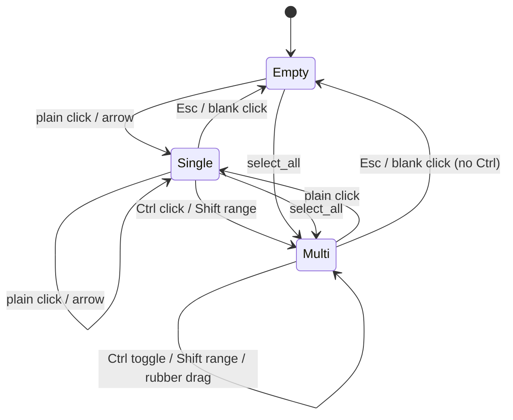
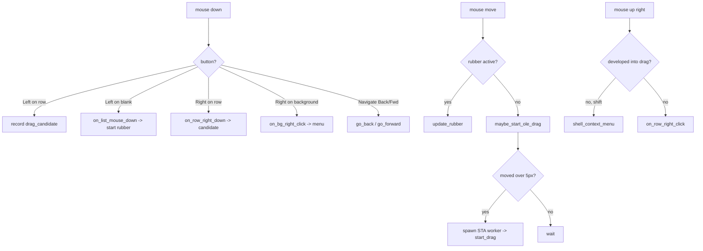

# 第8章: GUI 層 — ペイン

## Sources Read
- `crates/fastfiler-gpui/src/pane.rs` (lines 1-401)
- `crates/fastfiler-gpui/src/pane.rs` (lines 403-1138)
- `crates/fastfiler-gpui/src/pane.rs` (lines 1139-2013)
- `crates/fastfiler-gpui/src/pane.rs` (lines 2015-2960)
- `crates/fastfiler-gpui/src/pane.rs` (lines 2962-3326)
- `crates/fastfiler-gpui/src/pane.rs` (lines 3328-3884)
- `crates/fastfiler-gpui/src/hotkeys.rs` (lines 17-90)
- `crates/fastfiler-gpui/src/theme.rs` (lines 596-643)

読み込んだ範囲の内訳: `pane.rs` はモジュール冒頭・型定義群・`PaneView` 構造体と `new`（1-401）、ナビゲーション・`reload`・選択モデル・キー処理・モーダル・アドレスバー（403-1138）、検索・右クリックメニュー・サブメニュー描画（1139-2013）、行クリック・ラバーバンド・OLE ドラッグ・ドロップ振り分け・転送（2015-2960）、ドメインイベント受信・`render_row`・`header_cell`・`Drop`（2962-3326）、`Render::render` 本体・`load_row_icons`・`build_job_items`・整形ヘルパ（3328-3884）。補助として `hotkeys.rs` の `HotAction` 列挙と既定キーバインド表、`theme.rs` の `row_h`/`header_h`/`font_px` 等の寸法関数を参照した。

## この章で扱うもの

ペインは fastfiler の UI の中心である。
1 つのフォルダの内容を一覧表示し、選択、キーボード操作、マウス操作、コンテキストメニュー、ドラッグ&ドロップ、アドレスバー、ソート、列幅調整をすべて引き受ける。
これらはすべて `crates/fastfiler-gpui/src/pane.rs` の 1 ファイルに収まっており、その実体は単一の構造体 `PaneView` と、その `Render` 実装である [REF: crates/fastfiler-gpui/src/pane.rs:262-332]。

モジュール冒頭のドキュメントコメントは、この設計の狙いを明示している。
一覧、アイコン、監視、ファイル操作は GUI 非依存の `fastfiler-domain` を無改造で再利用し、描画は GPUI の `uniform_list` で可視範囲だけを仮想化する [REF: crates/fastfiler-gpui/src/pane.rs:1-12]。
状態は単一の `Entity<PaneView>` に集約し、更新は `cx.notify()` の 1 ルートへ統一する。
ファイル監視 (watcher) は `EventSink` から async-channel を経て `cx.spawn` の受信ループへ橋渡しし、`PaneView` が drop されると送信端が落ちて受信ループが終わるよう構成されている。

本章では、この `PaneView` が抱える状態を起点に、選択モデル、入力処理、ドラッグ&ドロップ、メニュー、描画の順に、実際のコードが何をしているかを追う。

## PaneView が保持する状態

`PaneView` のフィールドは、表示状態と操作状態と外部連携の 3 群に分けて読むと理解しやすい [REF: crates/fastfiler-gpui/src/pane.rs:262-332]。

表示状態は、現在のフォルダ `cur_path`、その内容 `entries: Vec<FileEntry>`、各行のアイコン `row_icons`、ソート列 `sort_col` と昇降 `sort_asc`、固定 3 列の幅 `col_widths: [f32; 3]`、フッタ文言 `status` である。
`entries` と `row_icons` は同じ添字で対応し、行 `ix` のアイコンは `row_icons[ix]` で引ける。

操作状態は選択モデルが中核を占める。
キーボードの現在位置 `cursor: Option<usize>`、複数選択の集合 `selected: BTreeSet<usize>`、Shift 範囲選択の起点 `anchor: Option<usize>` の 3 つが、エクスプローラのフォーカス項目と選択範囲に相当する [REF: crates/fastfiler-gpui/src/pane.rs:267-271]。
集合に `BTreeSet` を選んでいるのは、選択を昇順で走査でき、ラバーバンドや範囲選択での区間挿入と相性がよいからである [CONFIDENCE: HIGH]。

操作の一時状態は、必要なときだけ `Some` になる任意項目として並ぶ。
入力モーダル `modal`、右クリックメニュー `context_menu`、検索バー `search_ui`、アドレスバー編集 `path_edit`、OLE ドラッグの開始候補 `drag_candidate`、ラバーバンド `rubber`、右ボタン D&D のドロップチューザー `drop_menu`、同名衝突の確認 `pending_transfer` がそれである [REF: crates/fastfiler-gpui/src/pane.rs:293-318]。
これらはどれも開いていなければ `None` であり、描画側はその有無でオーバーレイを出し分ける。

外部連携は、監視コア `watcher`、イベント送出口 `sink`、現在 watch 中のパス `watched`、コピー/移動ジョブのレジストリ `jobs`、進捗表示 `job_status`、実行中ジョブ id `active_job` である [REF: crates/fastfiler-gpui/src/pane.rs:320-331]。
ナビゲーション履歴 `history_back` と `history_fwd` もここに含まれ、戻ると進むを支える。

`PaneView::new` は生存カウンタ `PANES_ALIVE` を 1 増やし、`ChannelSink` を生成して受信端 `rx` を `cx.spawn` の drain ループへ渡す [REF: crates/fastfiler-gpui/src/pane.rs:342-359]。
このループは `rx.recv().await` でドメインイベントを待ち、届くたびに `on_domain_event` を呼ぶ。
`this.update` が `Err` を返したら、エンティティが既に drop 済みなので `break` する。
この 1 本のループが、別スレッド由来のすべての非同期通知 (監視、ジョブ進捗、検索ヒット、OLE ドラッグ完了) を UI スレッドへ集約する経路になっている。

## 選択モデル

選択操作は 3 つの基本関数に分解されている。
プレーンクリックや通常のキー移動は `select_only` が担い、`cursor` と `anchor` を `ix` に置き、`selected` を `ix` 単独にする [REF: crates/fastfiler-gpui/src/pane.rs:647-653]。
Ctrl+クリックは `toggle_select` が `selected` の中の `ix` を反転させ、`cursor` と `anchor` を `ix` に動かす。
Shift は `select_range_from_anchor` が `anchor` から `ix` までを区間として再構築する。

```rust
/// Ctrl+クリック: ix の選択をトグル。
fn toggle_select(&mut self, ix: usize) {
    if !self.selected.remove(&ix) {
        self.selected.insert(ix);
    }
    self.cursor = Some(ix);
    self.anchor = Some(ix);
}

/// Shift: anchor〜ix の範囲選択 (置換)。
fn select_range_from_anchor(&mut self, ix: usize) {
    let a = self.anchor.unwrap_or(ix);
    let (s, e) = if a <= ix { (a, ix) } else { (ix, a) };
    self.selected = (s..=e).collect();
    self.cursor = Some(ix);
}
```

範囲選択が `anchor` を起点に毎回作り直す点が、エクスプローラと同じ挙動を生む。
Shift+下を繰り返すと、起点は固定されたまま終端だけが伸び縮みし、途中で逆向きに動かしても矛盾しない。
`select_range_from_anchor` は `selected` を区間で丸ごと置換するため、それ以前の選択は範囲外であれば消える [CONFIDENCE: HIGH]。

`select_all` は Ctrl+A に対応し、`entries` が空でなければ全添字を選択して `anchor` を 0 に置く [REF: crates/fastfiler-gpui/src/pane.rs:672-682]。
選択中の項目をファイル操作へ渡すときは `selected_paths` が、`selected` の各添字を `entries` 経由でフルパスへ変換する [REF: crates/fastfiler-gpui/src/pane.rs:685-691]。

選択モデルの状態遷移は、入力の種別ごとに次のように整理できる。



カーソル移動 `move_cursor` は、現在位置に `delta` を足して 0 から末尾の範囲へ clamp し、`extend` が真なら範囲選択、偽なら単一選択にしてから、その行へスクロールする [REF: crates/fastfiler-gpui/src/pane.rs:841-855]。
PageUp と PageDown は `delta` を ±10 として同じ経路を通る。
Home と End は `jump_to` が担当し、こちらも `extend` で範囲か単一かを切り替える [REF: crates/fastfiler-gpui/src/pane.rs:858-868]。

選択を名前で保持して復元する仕掛けが `reload` にある [REF: crates/fastfiler-gpui/src/pane.rs:464-519]。
`reset_view` が偽のとき、再読込の前にカーソルと選択を添字ではなく「名前」で記憶する。
監視による自動更新で並び順や件数が変わっても、同じ名前の項目を選び直すことで選択が飛ばないようにしている。
`reset_view` が真のとき (ユーザーがフォルダを移動したとき) は、カーソルと選択を破棄して先頭へスクロールする。

## キーボード入力の経路

キー入力は `on_key` に集約され、状態の優先順位に従って処理される [REF: crates/fastfiler-gpui/src/pane.rs:870-941]。
冒頭の一連のガードが重要である。
モーダル表示中は Enter と Esc だけを処理し、それ以外のキー (Delete など) の誤爆を防ぐ。
コンテキストメニュー、ドロップチューザー、衝突確認、アドレスバー編集、検索バーも、それぞれ開いている間は Esc を中心とした最小限のキーだけを受け、残りは早期 return する。
つまりオーバーレイが 1 つでも開いていれば、一覧へのキー操作は届かない。

オーバーレイが何もないときに限り、Esc は選択とカーソルの解除へ進む [REF: crates/fastfiler-gpui/src/pane.rs:932-941]。
ただしその手前に、実行中のコピー/移動ジョブがあれば Esc をキャンセル要求に振り向ける分岐が置かれている [REF: crates/fastfiler-gpui/src/pane.rs:926-930]。

コマンド系のキーは固定ではなく、設定可能なホットキーである。
`hotkeys::lookup(ks)` がキーストロークを `HotAction` へ引き当て、`match` で各操作へ分配する [REF: crates/fastfiler-gpui/src/pane.rs:943-971]。
`HotAction` の既定割り当ては別モジュールの表にあり、Open は Enter、Rename は F2、NewFolder は F7、NewFile は F8、Search は Ctrl+F、Undo は Ctrl+Z のように定義されている [REF: crates/fastfiler-gpui/src/hotkeys.rs:39-58]。
NextPane (F6)、NextTab (Ctrl+Tab)、PrevTab (Ctrl+Shift+Tab)、Back (Alt+左)、Forward (Alt+右) は、ペイン単体では処理せず `cx.emit` でコンテナ (タブ) へイベントを送る。

矢印キーと PageUp/PageDown、Home/End はホットキー表に載せず、`on_key` の末尾で固定処理する [REF: crates/fastfiler-gpui/src/pane.rs:973-987]。
ここでだけ Shift 修飾を見て、`move_cursor` や `jump_to` に範囲拡張を伝える。

## マウスのクリックと行の活性化

行のクリックは `on_row_click` が受ける [REF: crates/fastfiler-gpui/src/pane.rs:2015-2052]。
最初にキーボードフォーカスをペインへ戻し、コンテナへ `PaneEvent::Activated` を送る。
ダブルクリック (`click_count() > 1`) なら単一選択にしてから、フォルダなら `navigate`、ファイルなら `open_in_shell` で開く。
シングルクリックでは修飾キーを見て、Ctrl は `toggle_select`、Shift は `select_range_from_anchor`、無修飾は `select_only` を呼ぶ。

カーソル項目を開く `activate_selected` は Enter に対応し、フォルダなら移動、ファイルなら既定アプリ起動へ分岐する [REF: crates/fastfiler-gpui/src/pane.rs:694-703]。
ファイル起動の `open_in_shell` は、専用の STA スレッドで `ShellExecuteW` 相当を実行する [REF: crates/fastfiler-gpui/src/pane.rs:705-729]。
これは関連付け先 (Office の DDE など) がメッセージポンプを回し、UI スレッドの更新サイクル中に呼ぶと App の RefCell が二重借用されて落ちるためで、結果だけを `status` へ反映する [CONFIDENCE: HIGH]。

ナビゲーションは履歴管理付きで一段の関数に分かれている。
`navigate` は移動前の `cur_path` を `history_back` へ積み、`history_fwd` を消してから `open_inner` を呼ぶ [REF: crates/fastfiler-gpui/src/pane.rs:405-416]。
タブロック中は移動せず、`PaneEvent::OpenInNewTab` を送って新しいタブで開くよう依頼する。
`go_back` と `go_forward` は履歴スタックを互いに移し替えながら開き直す。
`open_inner` は旧 watch を外して新 watch を張り、`reload` を呼ぶ [REF: crates/fastfiler-gpui/src/pane.rs:446-460]。

## ラバーバンド (矩形) 選択

一覧の空白部分で左ボタンを押してドラッグすると、矩形に重なる行が範囲選択される。
一覧は `uniform_list` で仮想化されているため、行の DOM から位置を得るのではなく、ウィンドウ座標から行の添字を逆算する。
その鍵が `row_at_y` である [REF: crates/fastfiler-gpui/src/pane.rs:2061-2076]。
行高は固定 (`theme::row_h`) で、ビューポート上端と縦スクロール量はスクロールハンドルの内部状態 (`base_handle.bounds()` と `offset()`) から取れる。
ウィンドウ座標 `y` から上端とスクロール量を引いてコンテンツ座標へ直し、行高で割れば添字になる。

押下時の入口は `on_list_mouse_down` である [REF: crates/fastfiler-gpui/src/pane.rs:2081-2106]。
モーダルやメニューが開いていれば何もしない。
`row_at_y` が `Some` を返す (行の上) なら、ここでは何もせず行ハンドラ側へ任せる。
空白なら Ctrl の有無で additive を決め、Ctrl ありなら既存選択を `base` に退避し、Ctrl なしなら選択を即解除する。
そのうえで `rubber` を `origin` と `current` を押下位置にして開始する。
Ctrl なしの空白押下が選択解除を兼ねている点に注意したい。

ドラッグ追従は `update_rubber` が担う [REF: crates/fastfiler-gpui/src/pane.rs:2109-2145]。
矩形の縦範囲を `origin.y` と現在 `pos.y` の小さい側と大きい側で囲み、それぞれをコンテンツ座標へ直して先頭行と末尾行を求め、その区間を選択集合へ挿入する。

```rust
let oy = origin_y / px(1.0);
let py = pos.y / px(1.0);
let ty = top / px(1.0);
let off = offset_y / px(1.0);
// ウィンドウ座標 y → 一覧コンテンツ座標 (offset は下スクロールで負)。
let to_content = |wy: f32| wy - ty - off;
let first = (to_content(oy.min(py)).max(0.0) / row_h) as usize;
let last = (to_content(oy.max(py)).max(0.0) / row_h) as usize;
for ix in first..=last.min(len - 1) {
    sel.insert(ix);
}
```

additive のときは `base` を初期値にして既存選択へ足し込み、そうでなければ空から作る。
カーソルは選択集合の末尾 (`next_back`) に置く。
横方向の座標は判定に使わず、縦の重なりだけで行を拾う。
これはファイル一覧が縦 1 列に並ぶため、矩形の横幅は選択結果に影響しないからである [CONFIDENCE: HIGH]。

矩形の見た目は `render_rubber` が描く [REF: crates/fastfiler-gpui/src/pane.rs:2150-2176]。
幅と高さがともに 2px 未満なら、単なるクリックとみなして矩形を描かない。
描くときは一覧コンテナの原点を基準に絶対配置し、半透明の塗りとアクセント枠を重ねる。

## ドラッグ&ドロップの開始

行を左ボタンで押すと、まず `render_row` 内のハンドラが OLE ドラッグの開始候補を記録する [REF: crates/fastfiler-gpui/src/pane.rs:3207-3218]。

```rust
.on_mouse_down(
    MouseButton::Left,
    cx.listener(move |this, ev: &MouseDownEvent, _w, _cx| {
        this.drag_candidate = Some(DragCand {
            pos: ev.position,
            paths: drag_paths.clone(),
            right: false,
            row_ix: ix,
            shift: false,
        });
    }),
)
```

`drag_paths` は、押した行が選択内なら選択全体、選択外なら単一になるよう `render_row` の冒頭で決めてある [REF: crates/fastfiler-gpui/src/pane.rs:3138-3148]。
この時点ではまだドラッグは始まらない。
発動の判定はペイン全域の `on_mouse_move` から呼ばれる `maybe_start_ole_drag` が行う [REF: crates/fastfiler-gpui/src/pane.rs:2309-2389]。

`maybe_start_ole_drag` は、候補のボタンが今も押されているかを確認し、押下位置からの移動量が縦横どちらも 5px 未満なら何もせず待つ [REF: crates/fastfiler-gpui/src/pane.rs:2322-2326]。
5px を超えたら候補を取り出し、`SELF_DROP` を偽、`RIGHT_DRAG` をボタン種別に応じて立て、専用の STA ワーカースレッドを起こす。

```rust
let dx = (ev.position.x - cand.pos.x) / px(1.0);
let dy = (ev.position.y - cand.pos.y) / px(1.0);
if dx.abs() < 5.0 && dy.abs() < 5.0 {
    return;
}
// ...
let ui_tid = unsafe { windows::Win32::System::Threading::GetCurrentThreadId() };
std::thread::spawn(move || {
    use windows::Win32::System::Threading::{AttachThreadInput, GetCurrentThreadId};
    ole_dnd::init_ole();
    let worker_tid = unsafe { GetCurrentThreadId() };
    let attached = unsafe { AttachThreadInput(worker_tid, ui_tid, true) }.as_bool();
    let req = DragRequest { /* paths, preferred, button */ };
    let outcome = ole_dnd::start_drag(req);
    // ...
    sink.emit_json("ole-drag-done", payload);
    ole_dnd::shutdown_ole();
});
```

別スレッドにする理由がコメントに明記されている [REF: crates/fastfiler-gpui/src/pane.rs:2302-2308]。
`DoDragDrop` はブロッキングであり、内部でメッセージポンプを回す。
UI スレッドで呼ぶと wndproc が gpui の App の RefCell を再借用して panic する。
そこで専用 STA ワーカーで `start_drag` を実行し、結果は既存の sink チャネル経由で `ole-drag-done` として UI へ戻す。

ワーカーが UI スレッドの入力状態を共有するために `AttachThreadInput` を使う点も実装上の要である [REF: crates/fastfiler-gpui/src/pane.rs:2338-2350]。
これを接続しないと、`DoDragDrop` が「ボタンは押されていない」と誤判定して即終了する。
ドラッグ終了後は接続を解除する。
`start_drag` の結果は Move、Copy、Cancel/None、Error のいずれかに分類され、JSON ペイロードに詰めて送り返す。

## ドラッグ&ドロップの完了処理

ワーカーから戻る `ole-drag-done` は `on_ole_drag_done` が後始末する [REF: crates/fastfiler-gpui/src/pane.rs:2716-2789]。
最初に `RIGHT_DRAG` を倒し、`SELF_DROP` が立っていれば (自アプリ内へのドロップなら) 何もせず返す。
内部ドロップは受け手側 (`on_drop`) で既に転送を実行済みだからである。

外部 (Explorer やブラウザ) へのドロップで結果が move のときは、元の削除をやや慎重に扱う [REF: crates/fastfiler-gpui/src/pane.rs:2732-2773]。
`delete_source` は、ドロップ先が PerformedDropEffect=MOVE を明示したときだけ真になる。
パスごとに、元が既に存在しなければ「ドロップ先が移動済み」、`delete_source` が真なら「ごみ箱送り対象」、それ以外は「コピー扱いで元を残す」と分類する。
元の削除は完全削除ではなくごみ箱送り (FOF_ALLOWUNDO) で行い、判定を誤っても復元できる安全側に倒している [CONFIDENCE: HIGH]。

## ドロップを受け取る側

ペインがドロップ先になる経路は 3 か所ある。
行のフォルダ、行の左端ガター、ペイン背景である。
いずれも GPUI の `ExternalPaths` を受け、共通の `dispatch_external_drop` へ流す [REF: crates/fastfiler-gpui/src/pane.rs:2263-2284]。
この関数は、まず `SELF_DROP` を立てて OLE 完了側の元削除を抑止し、右ボタン D&D なら `open_drop_menu` でチューザーを出し、左ボタンなら修飾キー準拠で即実行する。

修飾キーの読み取りは `drop_effect_override` が `ole_dnd::drop_modifiers` を通して物理キー状態 (GetKeyState) を直接見る [REF: crates/fastfiler-gpui/src/pane.rs:2291-2300]。
`window.modifiers()` を使わない理由は、外部からのドラッグ中はキーボードフォーカスが相手側にあり、修飾キーが更新されないからである。
Ctrl ならコピー、Shift なら移動、なしなら既定に従う。

既定効果は `drop_paths_into` がエクスプローラ準拠で決める [REF: crates/fastfiler-gpui/src/pane.rs:2233-2256]。
強制効果が無指定のとき、元と宛先のボリュームキーを比べ、同一ボリュームなら移動、異なれば コピーにする。
そのうえで `build_job_items` がコピー/移動ジョブを組み立てる。

`build_job_items` には安全弁が 2 つ入っている [REF: crates/fastfiler-gpui/src/pane.rs:3756-3786]。

```rust
let from = Path::new(p);
// 自分自身 / その子孫への転送は無限再帰になるため除外 (ケース非依存)。
if path_starts_with_ci(dst_dir, from) {
    return None;
}
let to = dst_dir.join(&name);
if to.as_path() == from {
    // 宛先が元と同一フォルダ。移動は no-op、コピーはその場複製。
    if is_move {
        return None;
    }
    return Some(JobItem {
        from: p.clone(),
        to: unique_dest(&to).to_string_lossy().to_string(),
    });
}
```

宛先が元自身またはその子孫なら、フォルダを自分の中へ無限再帰コピーする事故を防ぐため除外する。
比較はケース非依存の `path_starts_with_ci` で行う。
これは Windows のパスがケース非依存である一方、`Path::starts_with` がケース区別ありのため、`C:\Foo` を `c:\foo\sub` へ落としたときの取りこぼしを防ぐ目的である [REF: crates/fastfiler-gpui/src/pane.rs:3744-3747]。
宛先が元と同一フォルダなら、移動は no-op として捨て、コピーは `unique_dest` で連番名を付けたその場複製にする。

転送はすべて `run_transfer` を通る [REF: crates/fastfiler-gpui/src/pane.rs:2793-2815]。
宛先に同名が既にあれば、確認待ち `pending_transfer` を立てて衝突モーダルを出す。
衝突がなければ即 `run_transfer_now` へ進む。
モーダルの選択は `resolve_transfer` が受け、上書きならそのまま、別名なら衝突分だけ `unique_dest` で振り替えてから実行する [REF: crates/fastfiler-gpui/src/pane.rs:2819-2842]。
`run_transfer_now` はジョブ id を採番し、移動なら Undo 候補を `pending_move_undo` に記録してから、別スレッドで `run_move` か `run_copy` を起動する [REF: crates/fastfiler-gpui/src/pane.rs:2926-2960]。

## コンテキストメニュー

行や背景の右クリックでメニューが開く。
行の右ボタン押下はまず `on_row_right_down` が候補を記録し、ドラッグに発展するかどうかは離したとき (`on_right_up`) に決まる [REF: crates/fastfiler-gpui/src/pane.rs:2393-2436]。
動かず離した場合、Shift 押下なら Windows 標準のシェルメニュー (`shell_context_menu`)、それ以外なら自前メニュー (`on_row_right_click`) を出す。
行を右クリックしたとき、選択外の行なら単一選択へ切り替え、選択内ならカーソルだけ更新して複数対象の操作を許す [REF: crates/fastfiler-gpui/src/pane.rs:1367-1373]。

メニュー内容の組み立ては `open_menu` が行う [REF: crates/fastfiler-gpui/src/pane.rs:1279-1344]。
クリップボードに貼り付け可能なファイルがあるか、テンプレート一覧 (先頭 20 件)、ユーザーコマンド (commands.json) を取得する。
ユーザーコマンドは行メニューと背景メニューで絞り込みが異なる [REF: crates/fastfiler-gpui/src/pane.rs:1295-1333]。
行メニューでは `when` (file / dir / selection / any) と `extensions` で選択対象に合うものだけを通し、背景メニューでは選択非依存の any と background だけを通す。

メニューの描画は `render_context_menu` が行う [REF: crates/fastfiler-gpui/src/pane.rs:1835-1962]。
行メニューには開く、コピー、切り取り、貼り付け、名前の変更、削除、プロパティが並び、背景メニューには貼り付け、更新、新しいフォルダ、設定が並ぶ。
全体は画面全面の透明オーバーレイで包み、メニュー外のクリック (左右どちらでも) で閉じる [REF: crates/fastfiler-gpui/src/pane.rs:1915-1938]。
メニュー本体は `deferred` と `anchored` で右クリック位置に配置し、`snap_to_window_with_margin` で画面端からはみ出さないよう寄せる。

サブメニューは 2 系統ある。
固定サブメニュー (新しいファイル、設定) は `submenu_parent` が、ユーザーコマンドのグループは `user_cmd_items` と `user_group_parent` が再帰的に木を組む [REF: crates/fastfiler-gpui/src/pane.rs:1700-1731]。
ユーザーコマンドのグループ化では、各コマンドの `submenu` 文字列を `parse_group` が「/」区切りで最大 3 階層へ分解しておき、同じ接頭辞を持つコマンドを 1 つの親項目に畳む [REF: crates/fastfiler-gpui/src/pane.rs:190-201]。
サブメニューの展開方向は、メニュー位置と推定高さから画面端を判定し、下にはみ出すなら上方向、右にはみ出すなら左方向へ倒す [REF: crates/fastfiler-gpui/src/pane.rs:1571-1574]。

右ボタン D&D のチューザーは別系統の `render_drop_menu` が描く [REF: crates/fastfiler-gpui/src/pane.rs:2645-2674]。
「ここにコピー」「ここに移動」「キャンセル」に加え、`when: "drop"` のユーザーコマンドをグループ木として並べる。
チューザーからの選択は `drop_menu_action` が受け、移動かコピーかに応じて `run_transfer` へ進む [REF: crates/fastfiler-gpui/src/pane.rs:2473-2484]。

## アドレスバーと検索

アドレスバーは通常クリック可能なパス表示で、クリックすると入力欄へ変わる。
`start_path_edit` は `TextInput` を生成して現在パスを全選択状態で入れ、フォーカスを移す [REF: crates/fastfiler-gpui/src/pane.rs:1092-1109]。
ここで `cx.on_blur` を購読し、入力欄がフォーカスを失ったら編集を破棄する。
Esc と違い、blur ではフォーカスをペインへ奪い返さず、ユーザーがクリックした先を尊重する。
Enter は `commit_path_edit` が受け、入力が実在フォルダなら `navigate`、なければ `status` にエラーを出す [REF: crates/fastfiler-gpui/src/pane.rs:1111-1129]。

検索は Ctrl+F で開く `search_ui` のバーから行う [REF: crates/fastfiler-gpui/src/pane.rs:1141-1205]。
バーを開いただけでは一覧表示のままで、Enter で `start_search` を呼んで初めて結果リストへ切り替わる。
検索は Everything (HTTP) が応答すればそれを使い、不達なら内蔵検索へ自動フォールバックする。
結果は別スレッドから `search-hit` イベントで 1 件ずつ届き、`search-done` で件数とバックエンド名が確定する [REF: crates/fastfiler-gpui/src/pane.rs:3013-3071]。

## ソートと列幅

ソートは固定 4 列 (名前、更新日時、サイズ、種類) で、見出しのクリックで切り替わる。
`header_cell` は現在のソート列に昇降矢印を付け、クリックで `set_sort` を呼ぶ [REF: crates/fastfiler-gpui/src/pane.rs:3304-3317]。
`set_sort` は同じ列を再クリックしたら昇降を反転し、別の列なら昇順で切り替えてから再読込する [REF: crates/fastfiler-gpui/src/pane.rs:574-582]。
実際の並べ替えは `sort_entries` が行い、フォルダを常に先頭へ集めてから選択列で比較する [REF: crates/fastfiler-gpui/src/pane.rs:522-543]。
名前と種類は小文字化して比較し、種類は拡張子が同じなら名前で二次ソートする。

固定 3 列の幅は見出しの仕切りドラッグで変えられる。
各列の左端に幅 6px の `cursor_col_resize` ハンドルを置き、`on_drag` で `ColHandle` をドラッグペイロードにする [REF: crates/fastfiler-gpui/src/pane.rs:3424-3437]。
追従は `on_col_handle_drag` がペイン全域で受ける [REF: crates/fastfiler-gpui/src/pane.rs:548-572]。
ここで重要なのは、`ColHandle` がドラッグ元ペインの id を持ち、`on_drag_move` が全ペインで発火しても自分のドラッグだけを処理する点である。
複数ペインが互いの右端基準で幅を書き換え合うと幅が暴れるため、それを避けている [CONFIDENCE: HIGH]。
幅はペイン右端から各列の右端を逆算して求め、40px から 400px へ clamp する。
列幅はセッションにペイン単位で保存・復元される (`col_widths` / `set_col_widths`) [REF: crates/fastfiler-gpui/src/pane.rs:630-638]。

## 描画の全体構成

`Render::render` がペイン全体を組み立てる [REF: crates/fastfiler-gpui/src/pane.rs:3328-3701]。
初回描画でキーボードフォーカスをペインへ移し、以降は `focused_once` で一度きりにする。
上から、パスバー (戻る/進むはボタン非表示で、上へ移動、アドレス、分割、閉じる)、検索バー (表示中のみ)、列見出し (検索中は非表示)、一覧コンテナ、フッタ (ステータスと選択数) の順に縦へ積む。
さらに最前面のオーバーレイとして、入力モーダル、右クリックメニュー、ドロップチューザー、衝突確認モーダルを、開いているものだけ重ねる [REF: crates/fastfiler-gpui/src/pane.rs:3693-3700]。

一覧は通常も検索結果も `uniform_list` で仮想化描画する [REF: crates/fastfiler-gpui/src/pane.rs:3496-3520]。
通常一覧は `render_row` を可視範囲分だけ呼び、`track_scroll` でスクロールハンドルに結びつける。
このスクロールハンドルこそ、ラバーバンドと `row_at_y` が座標逆算に使う情報源である。

`render_row` が 1 行を組む [REF: crates/fastfiler-gpui/src/pane.rs:3110-3301]。
選択とカーソルの組み合わせで背景色を 4 段階に分け、選択かつカーソルが最も明るい。
アイコンは取得できれば実アイコン、失敗時は種別アクセントの代替矩形にする [REF: crates/fastfiler-gpui/src/pane.rs:3164-3175]。
行には左クリック (選択)、右ボタン押下 (D&D/メニュー候補)、左ボタン押下 (D&D 候補) のハンドラを付ける。
左端には幅 10px の薄いドロップ帯を絶対配置で重ね、ここへ落とすと行のサブフォルダではなく現在フォルダへ転送する逃げ場を作っている [REF: crates/fastfiler-gpui/src/pane.rs:3271-3284]。
フォルダ行自体もドロップ先になり、その行のフォルダへ転送する [REF: crates/fastfiler-gpui/src/pane.rs:3287-3300]。

ペイン全体の `div` には、キー入力、左クリックの activate、背景右クリック、マウスの戻る/進むボタン、ドロップ受け入れ、マウス移動 (ラバーバンド追従か OLE ドラッグ開始判定)、左右のマウスアップ、列ハンドルのドラッグ追従が束ねられている [REF: crates/fastfiler-gpui/src/pane.rs:3536-3597]。
マウス移動のハンドラが、ラバーバンド中なら `update_rubber`、そうでなければ `maybe_start_ole_drag` へ分岐する 1 点で、矩形選択とドラッグ開始が排他に切り替わる [REF: crates/fastfiler-gpui/src/pane.rs:3571-3577]。

ポインタ入力の振り分けは、ボタンと文脈で次のように分かれる。



## ドメインイベントとライフサイクル

別スレッド由来の通知はすべて `on_domain_event` が UI スレッド上で捌く [REF: crates/fastfiler-gpui/src/pane.rs:2973-3107]。
`ole-drag-done` は D&D 完了、`fs-change` は監視通知、`fs:job:progress` と `fs:job:done` はコピー/移動ジョブ、`search-hit` と `search-done` は検索結果に対応する。
監視通知はバーストするため、150ms のデバウンスでまとめて `reload` する [REF: crates/fastfiler-gpui/src/pane.rs:2976-2991]。
ジョブ完了 (`fs:job:done`) では、移動ジョブが全件成功かつ非キャンセルのときだけ Undo 履歴へ push する [REF: crates/fastfiler-gpui/src/pane.rs:3072-3105]。
ジョブはアイテム別の成否を返さないため、部分成功を Undo 対象にしない安全側の判断である [ASSUMED: ジョブ層 (file_jobs) が成否をアイテム単位で返さない前提でこの実装になっている]。

ライフサイクルの締めくくりが `Drop` 実装である [REF: crates/fastfiler-gpui/src/pane.rs:3320-3326]。
`PaneView` が落ちると `watcher` と `sink` が連鎖して落ち、チャネルが閉じて `cx.spawn` の受信ループが終了する。
`PANES_ALIVE` を 1 減らすことで、タブやペインを閉じたあと生存数がベースラインへ戻るかを観測できる。
モジュール冒頭が述べる floem 版のスレッド/シグナルリーク問題を、この構造で排除している [REF: crates/fastfiler-gpui/src/pane.rs:4-9]。

## まだ確認しきれていない点

`row_at_y` と `update_rubber` はスクロールハンドルの内部フィールド `self.scroll.0.borrow()` に直接触れている [REF: crates/fastfiler-gpui/src/pane.rs:2066-2069]。
これは GPUI の `UniformListScrollHandle` のタプル要素 0 への依存であり、GPUI のバージョン更新で内部構造が変わると壊れる可能性がある [CONFIDENCE: MED] [ASK SME]。

行高が固定であることが、座標逆算の前提になっている。
`theme::row_h` が状況によって可変になることはない、という前提でラバーバンドの添字計算が成り立つ [ASSUMED: row_h は実行時に一定]。

メニューのサブメニュー展開方向の判定 (`open_up` / `open_left`) は、行数とフォントサイズからの高さ見積もりに基づく [REF: crates/fastfiler-gpui/src/pane.rs:1838-1864]。
この見積もり係数 (1 行をフォント×1.75、区切り 9px など) がテーマや DPI の変化に対してどこまで正確かは、実機での確認が要る [CONFIDENCE: LOW] [ASK SME]。

<!-- DETAIL_QUESTIONS
- 1. ラバーバンド選択の行判定は縦の重なりだけを使い横幅を無視している (update_rubber)。これは「ファイル一覧は常に縦1列」という UI 仕様として固定なのか、それとも将来のアイコン/グリッド表示で見直す前提の暫定実装か。
- 2. 外部 D&D の move で delete_source が偽のとき元を残し「添付 (コピー)」と表示する (on_ole_drag_done)。この「移動を要求したのに元が残る」挙動は仕様上の正式な振る舞いか、データ損失回避のための保守的な妥協か。
- 3. ドロップの既定効果は「同一ボリューム=移動 / 異ボリューム=コピー」とボリュームキー比較で決めている (drop_paths_into)。UNC パスやマウントポイントをまたぐ場合の volume_key の同一判定は、仕様として期待どおりか。
- 4. ユーザーコマンドのサブメニューは最大 3 階層 (MENU_MAX_DEPTH) かつ最大 50 件 (MENU_MAX_USER_CMDS) に制限される。この上限は確定仕様か、それとも実装上の安全弁で変更余地があるか。
- 5. Undo は移動ジョブが全件成功したときだけ履歴へ push し、部分成功は記録しない (on_domain_event の fs:job:done)。部分成功時に「成功した分だけ戻せない」ことは許容仕様か、ジョブ層がアイテム別成否を返せば改善すべき制約か。
- 6. row_at_y と update_rubber と render_rubber が UniformListScrollHandle の内部タプル (self.scroll.0) に直接アクセスしている。これは GPUI の公開 API に昇格させるべき依存か、当面は内部依存のままで許容する判断か。
-->
