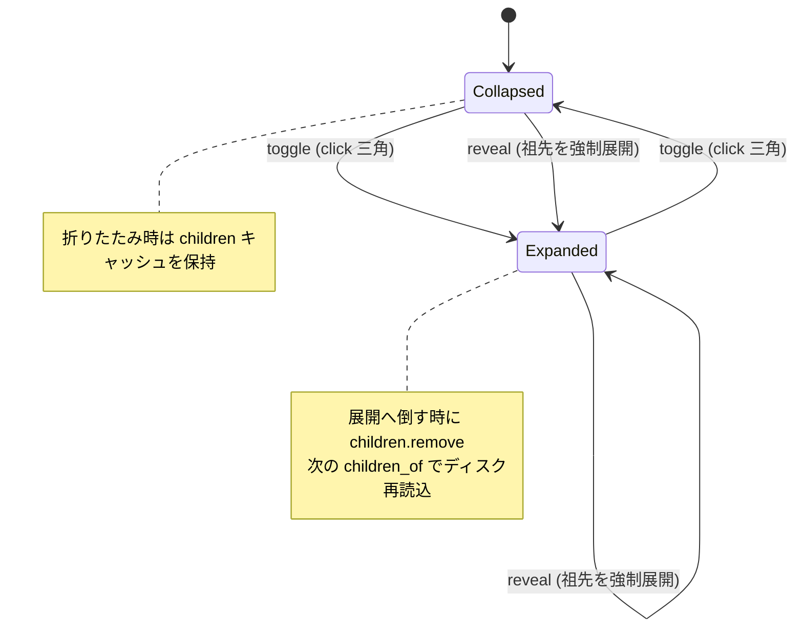
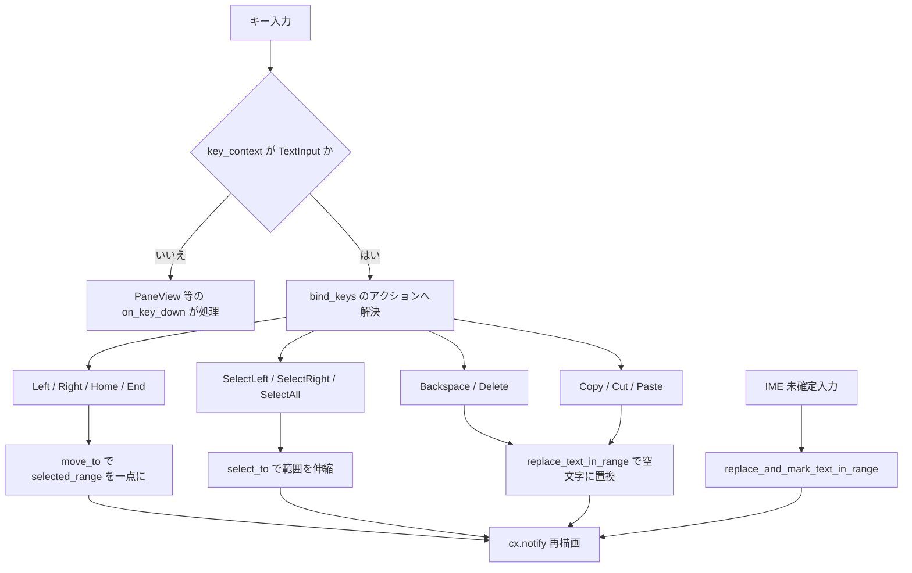

# 第9章: GUI 層 — ワークスペースツリーとテキスト入力

本章では、fastfiler の GUI 層 (`fastfiler-gpui`) のうち、左側のワークスペースツリーパネルを実装する `tree.rs` と、リネーム・新規作成・アドレスバー・検索ボックスで共有される単一行テキスト入力ウィジェット `text_input.rs` の 2 つのウィジェットを扱う。
いずれも GPUI のリアクティブなエンティティ (`Entity<T>`) として実装され、`Render` トレイトで描画され、`Context<Self>` を通じて自身の状態を更新する。
本章のねらいは、これらのウィジェットが「実際に」どのような状態を保持し、どのイベントでどう書き換わるのかを、フレームワークの一般論ではなくコードに即して記述することにある。

## Sources Read
- `crates/fastfiler-gpui/src/tree.rs` (lines 1-418)
- `crates/fastfiler-gpui/src/text_input.rs` (lines 1-681)
- `crates/fastfiler-gpui/src/app.rs` (lines 30-50, 123-210, 340-395, 950-1035, 1155-1165)
- `crates/fastfiler-gpui/src/pane.rs` (lines 40-55, 305-310, 900-915, 1020-1180, 3335-3360)
- `crates/fastfiler-gpui/src/main.rs` (lines 15, 46-47)

---

## 9.1 章の全体像 — 2 つの独立したウィジェット

この章で扱う 2 ファイルは、責務がまったく異なる独立したウィジェットである。

`tree.rs` は「どこを開くか」を選ばせるナビゲーション用のツリーパネルであり、ドライブを起点にフォルダのみを階層表示する。
ファイルそのものは表示せず、フォルダ名のクリックでイベントを発行して、開く処理自体はコンテナ (`FastFilerApp`) 側に委譲する。

`text_input.rs` は「文字列を入力させる」ための再利用可能なウィジェットであり、リネーム・新規作成ダイアログ・アドレスバー直接編集・検索ボックスのすべてで同じ実装が使われる。
GPUI には標準のテキスト入力フィールドが存在しないため、公式サンプル `vendor/crates/gpui/examples/input.rs` を移植したものだとファイル冒頭のコメントが明言している [REF: crates/fastfiler-gpui/src/text_input.rs:1-9]。

両者に共通するのは、状態を構造体フィールドとして持ち、イベントハンドラ内で `cx.notify()` を呼んで再描画を促すという GPUI の典型的なリアクティブパターンに従っている点である。
ただし「実装の重さ」は対照的で、ツリー側は素直な `div()` の組み合わせで描画するのに対し、テキスト入力側は IME 対応のために `Element` トレイトを手実装してカーソルや選択範囲を自前で描く低レベルなコードになっている。

---

## 9.2 TreeView の状態モデル

`TreeView` は次のフィールドを持つ [REF: crates/fastfiler-gpui/src/tree.rs:42-55]。

```rust
pub struct TreeView {
    /// (ドライブパス "C:\", 表示名)
    drives: Vec<(String, String)>,
    /// 登録済み UNC share (`\\server\share`)。ペインで UNC を開くと自動登録・永続化。
    unc_shares: Vec<String>,
    expanded: HashSet<PathBuf>,
    /// 子フォルダ名のキャッシュ (展開時に取得、再展開で読み直し)。
    children: HashMap<PathBuf, Vec<String>>,
    /// 表示用の平坦化リスト。
    items: Vec<TreeItem>,
    /// 追従ハイライト中のパス (reveal で設定)。
    selected: Option<PathBuf>,
    scroll: UniformListScrollHandle,
}
```

ここで設計の要点は、「展開状態」と「表示リスト」を別フィールドとして分離していることである。

`expanded` は展開中のフォルダのパス集合を `HashSet<PathBuf>` として保持する真の状態であり、これが正本 (source of truth) である。
`items` はその展開状態とドライブ一覧から毎回計算で導出される派生データであり、画面に出ている各行 1 つ 1 つを表す。

1 行を表す `TreeItem` は、パス・表示名・深さ (インデント計算用)・展開フラグ・サーバノードか否か、という 5 つのフィールドを持つ [REF: crates/fastfiler-gpui/src/tree.rs:33-40]。
`expanded: bool` は `TreeItem` にも複製されているが、これは描画時に三角マークの向き (▼/▶) を決めるためのスナップショットであり、状態の正本はあくまで `TreeView::expanded` の方である。

`children` は、フォルダパスからその直下のフォルダ名一覧へのキャッシュである。
これにより、一度展開したフォルダを再描画するたびにディスクを叩かずに済む。

`selected` は「いま追従ハイライトしている行」を表し、後述する `reveal` でのみ設定される。
注意すべきは、これがユーザーのクリック選択ではなく、ペイン側のカレントフォルダにツリーを追従させるためのハイライトだという点である [CONFIDENCE: HIGH]。

`drives` の各要素は「ドライブのルートパス」と「表示名」のタプルである [REF: crates/fastfiler-gpui/src/tree.rs:402-417]。
表示名はボリュームラベルがあれば `"ラベル (C:)"` の形式、なければドライブレターそのままとなる。

---

## 9.3 表示リストの再構築 — rebuild と push_item

`rebuild` は、`drives` と `unc_shares` と `expanded` という現在の状態から、平坦化された表示リスト `items` を一から作り直す中核メソッドである [REF: crates/fastfiler-gpui/src/tree.rs:125-151]。

処理の流れはまず、各ドライブをルートノード (depth=0) として `push_item` で積む。
次に UNC share をサーバごとにグルーピングして積む。
このとき同じサーバが連続する間は 1 つの「サーバノード」を先頭にコンテナとして 1 回だけ挿入し (depth=0)、各 share はその下 (depth=1) に通常ノードとして積む。

サーバノードは実在するファイルシステム上のパスではない、純粋な見出し用のコンテナである点が特徴的である。
そのため `is_server: true` のフラグを立て、後述の描画で特別扱いされる。

`push_item` が遅延読み込みと再帰展開の心臓部である [REF: crates/fastfiler-gpui/src/tree.rs:153-168]。

```rust
fn push_item(&mut self, items: &mut Vec<TreeItem>, path: PathBuf, name: String, depth: usize) {
    let expanded = self.expanded.contains(&path);
    items.push(TreeItem {
        path: path.clone(),
        name,
        depth,
        expanded,
        is_server: false,
    });
    if expanded {
        for child in self.children_of(&path) {
            let cpath = path.join(&child);
            self.push_item(items, cpath, child, depth + 1);
        }
    }
}
```

このメソッドは、自分自身を `items` に積んだあと、`expanded` 集合に含まれているフォルダについてのみ、子フォルダを取得して再帰的に `push_item` を呼ぶ。
つまり折りたたまれているノードの子は `items` にも展開されず、まさに「展開されている枝だけ」を深さ優先で平坦化していく。
これが遅延読み込み (lazy loading) の実体であり、すべてのフォルダを事前に走査するわけではない。

`rebuild` は状態を変えるあらゆる操作のあとに呼ばれる共通の再計算ステップであり、`toggle`・`reveal`・`refresh`・`register_unc`・`remove_server`・`set_unc_shares` のいずれもが最後に `rebuild` を通る。

---

## 9.4 遅延読み込みとキャッシュ — children_of と toggle

`children_of` は、フォルダの直下のフォルダ名一覧をキャッシュ付きで返す [REF: crates/fastfiler-gpui/src/tree.rs:113-122]。

```rust
fn children_of(&mut self, path: &PathBuf) -> Vec<String> {
    if let Some(c) = self.children.get(path) {
        return c.clone();
    }
    let names: Vec<String> = fs::list_dirs(path.to_string_lossy().to_string(), Some(false))
        .map(|v| v.into_iter().map(|e| e.name).collect())
        .unwrap_or_default();
    self.children.insert(path.clone(), names.clone());
    names
}
```

キャッシュにヒットすればそれを複製して返し、なければドメイン層の `fs::list_dirs` を呼んでフォルダのみを取得する。
`list_dirs` の第 2 引数 `Some(false)` は「隠しフォルダを含めない」という意味だと推測される [ASSUMED: ドメイン層 fs.rs の list_dirs シグネチャから、第2引数は include_hidden のフラグと解釈した] [ASK SME]。
取得失敗時 (アクセス拒否など) は `unwrap_or_default()` で空リストになり、エラーにはならず単に子のないノードとして扱われる [CONFIDENCE: HIGH]。

`toggle` は展開トグルである [REF: crates/fastfiler-gpui/src/tree.rs:170-182]。
`expanded.remove(&path)` の戻り値で「すでに展開されていたか」を判定し、展開されていなければ挿入する。
ここで重要なのは、展開する側に倒れたとき `self.children.remove(&path)` でキャッシュを破棄している点である。
コメントが「開くたびに子を読み直す (外部変更を拾う)」と明言しているとおり、これは展開操作を外部のファイルシステム変更を取り込む契機として使う意図的な設計である。
最後に `rebuild` と `cx.notify()` を呼んで再描画する。

折りたたみ時はキャッシュを消さないため、再び展開すると `children_of` がキャッシュにヒットして即座に表示できる、という非対称な挙動になる点に注意したい [CONFIDENCE: HIGH]。

ツリーの展開・折りたたみの状態遷移を図示すると次のようになる。



---

## 9.5 reveal — ペインへの追従

`reveal` は、指定パスの祖先を順に展開し、その行を選択ハイライトして中央へスクロールする [REF: crates/fastfiler-gpui/src/tree.rs:188-241]。
これはタブ切替やペインのフォルダ移動に対してツリーを追従させるためのメソッドである。

アルゴリズムは祖先チェーン方式を採る。
まず `target.ancestors()` でルートから target までの祖先チェーンを構築し、逆順にして空要素を除去する。
次にルートノード (ドライブまたは UNC share) を、大文字小文字と末尾バックスラッシュを無視した比較で解決する。
ルートが見つからなければ何もせず戻る。

ルートが決まったら、チェーンを 1 段ずつ下りながら各段の親を `expanded` に挿入し、`children_of` で子名を取得して目的の名前を大文字小文字無視で探す。
コメントが述べるとおり、子に見つからない階層 (隠しフォルダなど) に当たったら、そこで `break` して「辿れた最深の祖先」で止める設計である。

最後に `rebuild` してから、平坦化済みの `items` の中で目的パスに一致しサーバノードでない行を線形探索し、見つかれば `selected` を設定し `scroll.scroll_to_item(ix, ScrollStrategy::Center)` で中央スクロールする [REF: crates/fastfiler-gpui/src/tree.rs:231-240]。
パス照合がすべて大文字小文字無視 (`to_ascii_lowercase`) で行われているのは、Windows のファイルシステムが大文字小文字を区別しないことへの対応である [CONFIDENCE: HIGH]。

呼び出し側を確認すると、`FastFilerApp` がフォーカスペインのカレントパスを引数に `self.tree.update(cx, |t, cx| t.reveal(&path, cx))` を呼んでいる [REF: crates/fastfiler-gpui/src/app.rs:1159]。

---

## 9.6 UNC share の登録と解除

ツリーのルートはローカルドライブだけでなく、ネットワーク共有 (UNC) も扱う。
`register_unc` は、ペインで `\\server\share\...` のような UNC パスを開いたときに、その `\\server\share` 部分を抽出して登録する [REF: crates/fastfiler-gpui/src/tree.rs:86-99]。

```rust
pub fn register_unc(&mut self, path: &std::path::Path, cx: &mut Context<Self>) -> bool {
    let Some(share) = unc_share_of(path) else {
        return false;
    };
    if self.unc_shares.contains(&share) {
        return false;
    }
    self.unc_shares.push(share);
    self.unc_shares.sort();
    self.rebuild();
    cx.notify();
    cx.emit(TreeEvent::UncChanged);
    true
}
```

UNC でなければ・すでに登録済みなら `false` を返して何もしない。
新規なら追加してソートし、`rebuild` と再描画を行い、さらに `TreeEvent::UncChanged` を emit する。
このイベントは `FastFilerApp` 側で受けてセッション保存 (`schedule_save`) のトリガーになる [REF: crates/fastfiler-gpui/src/app.rs:157-165]。
つまり「一度開いた UNC 共有が、次回起動時もツリーに残る」という永続化が、このイベント連鎖で実現されている。

`remove_server` はサーバノードの右クリックで、そのサーバに属する share をまとめて登録解除する [REF: crates/fastfiler-gpui/src/tree.rs:102-111]。
`\\server\` を接頭辞に持つ share を `retain` で全削除し、件数が変わったときだけ `rebuild` と `UncChanged` emit を行う。

UNC 文字列の解析は 2 つの純粋関数が担う。
`split_unc` は `\\server\share` を `(server, share)` に分解する [REF: crates/fastfiler-gpui/src/tree.rs:377-386]。
`unc_share_of` は任意のパスから先頭の `\\server\share` プレフィックスだけを抽出する [REF: crates/fastfiler-gpui/src/tree.rs:389-399]。
どちらもサーバ名・共有名のどちらかが空なら `None` を返す防御的な実装になっている。

セッション復元側の入口は `set_unc_shares` で、保存済みの share 一覧を受け取り、ソートして重複排除したうえで `rebuild` する [REF: crates/fastfiler-gpui/src/tree.rs:73-78]。
`FastFilerApp` の初期化で `data.unc_shares` が空でなければこれが呼ばれる [REF: crates/fastfiler-gpui/src/app.rs:202-204]。

---

## 9.7 行の描画 — render_item

`render_item` は 1 行を `AnyElement` として組み立てる [REF: crates/fastfiler-gpui/src/tree.rs:251-324]。
この関数は分岐により 2 種類の行を生成する。

サーバノード (`is_server`) の場合は、三角マークも展開トグルも持たない見出し行を返す [REF: crates/fastfiler-gpui/src/tree.rs:255-274]。
クリックでフォルダを開く機能はなく、代わりに `MouseButton::Right` の `on_mouse_down` で `remove_server` を呼ぶ。
これはコメントの「クリック無効・右クリックで削除」という仕様どおりである。

通常ノードの場合は、インデント・三角マーク・名前の 3 要素で構成される [REF: crates/fastfiler-gpui/src/tree.rs:277-323]。
インデントは `px(6.0 + item.depth as f32 * 14.0)` で深さに比例して計算される。
三角マークは `item.expanded` に応じて `"▼"` か `"▶"` を出し、クリックで `this.toggle(ix, cx)` を呼ぶ。
名前部分のクリックは展開ではなく `cx.emit(TreeEvent::OpenDir(path.clone()))` を発行し、開く責務をコンテナへ委譲する。
`selected` に一致する行は選択背景色 (`th().sel_bg`) でハイライトされる。

ここで「展開トグル (三角)」と「フォルダを開く (名前)」がクリック領域として明確に分離されているのが UI 設計上の要点である [CONFIDENCE: HIGH]。
三角を押しても開かず、名前を押しても展開状態は変わらない。

---

## 9.8 仮想化描画とイベント発行

`Render` 実装では、ヘッダ (「ツリー」ラベルと再読込ボタン ⟳) と、本体の仮想化リストを縦に並べる [REF: crates/fastfiler-gpui/src/tree.rs:327-373]。

本体は GPUI の `uniform_list` を使う [REF: crates/fastfiler-gpui/src/tree.rs:360-371]。

```rust
uniform_list(
    "ws-tree",
    count,
    cx.processor(|this, range: Range<usize>, _w, cx| {
        range.map(|ix| this.render_item(ix, cx)).collect::<Vec<_>>()
    }),
)
.track_scroll(&self.scroll)
```

`uniform_list` は表示範囲 (`Range<usize>`) に入った行だけを `render_item` で生成する仮想化リストであり、全ノードを毎フレーム描画するわけではない。
`track_scroll(&self.scroll)` でスクロールハンドルを結びつけることで、`reveal` の `scroll_to_item` が機能する。
ヘッダの ⟳ ボタンは `refresh` を呼び、ドライブ一覧と子キャッシュをまるごと更新する [REF: crates/fastfiler-gpui/src/tree.rs:244-249]。

`TreeView` が外部へ伝えるイベントは `TreeEvent` の 2 種類のみである [REF: crates/fastfiler-gpui/src/tree.rs:23-28]。
`OpenDir(PathBuf)` は「このフォルダをフォーカスペインで開いてほしい」、`UncChanged` は「UNC 登録が変わったのでセッション保存してほしい」を意味する。
`EventEmitter<TreeEvent>` を実装することで、コンテナが `cx.subscribe` で購読できる [REF: crates/fastfiler-gpui/src/tree.rs:30]。
`FastFilerApp::make_tree` がこの購読を張り、`OpenDir` を `open_in_focused_pane` に橋渡ししている [REF: crates/fastfiler-gpui/src/app.rs:155-167]。

---

## 9.9 ツリーへのファイルドロップに関する事実確認

本章の調査依頼には「tree.rs のノードへのドラッグ&ドロップ」が含まれていたが、`tree.rs` の現状の実装にはツリーノードを**ドロップ先**とする処理は存在しない。
`render_item` のノードに付いているマウス系ハンドラは、名前の `on_click` (OpenDir 発行)・三角の `on_click` (toggle)・サーバ行の右クリック (削除) の 3 つだけであり、`on_drop` や `DragMoveEvent` の受け口は無い [REF: crates/fastfiler-gpui/src/tree.rs:251-324]。

紛らわしいことに `app.rs` には `DraggedTreeHandle` という型が存在するが、これはツリーノードではなく「ワークスペースツリーパネルの幅」をドラッグで変えるためのペイロードである [REF: crates/fastfiler-gpui/src/app.rs:43-44]。
したがって「ツリーノードにファイルをドロップして移動・コピーする」機能は、少なくとも `tree.rs` 単体では未実装と判断する [CONFIDENCE: HIGH]。
ファイルのドラッグ&ドロップによる移動・コピーは、第8章で扱うペイン (`pane.rs`) 側のリスト行に対して実装されているものであり、ツリー側ではない [ASSUMED: pane.rs に SELF_DROP / DropMenu 等のドロップ関連型が集中していることから推定] [ASK SME]。

---

## 9.10 TextInput の状態モデルとキーバインド

ここからは `text_input.rs` を扱う。
`TextInput` のフィールドは次のとおりである [REF: crates/fastfiler-gpui/src/text_input.rs:62-72]。

```rust
pub struct TextInput {
    pub(crate) focus_handle: FocusHandle,
    content: SharedString,
    placeholder: SharedString,
    selected_range: Range<usize>,
    selection_reversed: bool,
    marked_range: Option<Range<usize>>,
    last_layout: Option<ShapedLine>,
    last_bounds: Option<Bounds<Pixels>>,
    is_selecting: bool,
}
```

各フィールドの役割を押さえておく。
`content` が編集中の文字列、`placeholder` が空のときに薄く出すプレースホルダである。
`selected_range` はバイトオフセット (UTF-8) の範囲で、カーソル位置はこの範囲が空のときの一点として表現される。
`selection_reversed` は選択をどちら向きに伸ばしたかを記録し、カーソルが範囲の先頭側にあるか末尾側にあるかを決める。
`marked_range` は IME の未確定文字列 (composition) の範囲であり、IME 対応の核心となる。
`last_layout` と `last_bounds` は直近に描画したテキストのレイアウトと矩形で、マウス位置から文字オフセットを逆算するためのキャッシュである。
`is_selecting` はマウスドラッグ中かどうかのフラグである。

キーバインドは `bind_keys` がアプリ起動時に 1 回だけ登録する [REF: crates/fastfiler-gpui/src/text_input.rs:44-60]。

```rust
pub fn bind_keys(cx: &mut App) {
    const CTX: Option<&str> = Some("TextInput");
    cx.bind_keys([
        KeyBinding::new("backspace", Backspace, CTX),
        KeyBinding::new("delete", Delete, CTX),
        KeyBinding::new("left", Left, CTX),
        KeyBinding::new("right", Right, CTX),
        KeyBinding::new("shift-left", SelectLeft, CTX),
        KeyBinding::new("shift-right", SelectRight, CTX),
        KeyBinding::new("ctrl-a", SelectAll, CTX),
        KeyBinding::new("ctrl-v", Paste, CTX),
        KeyBinding::new("ctrl-c", Copy, CTX),
        KeyBinding::new("ctrl-x", Cut, CTX),
        KeyBinding::new("home", Home, CTX),
        KeyBinding::new("end", End, CTX),
    ]);
}
```

ここで決定的に重要なのが第 3 引数の `CTX = Some("TextInput")` である。
これらのキーバインドは `"TextInput"` というキーコンテキスト限定で登録される。
そのため、入力欄がフォーカスされ `key_context("TextInput")` が有効な間だけバインドが効く [REF: crates/fastfiler-gpui/src/text_input.rs:634-639]。
ファイル冒頭のコメントが述べるとおり、これにより PaneView 側の生キー処理 (`on_key_down`) と干渉しない設計になっている。
実際 `main.rs` の起動シーケンスで `text_input::bind_keys(cx)` が 1 回呼ばれている [REF: crates/fastfiler-gpui/src/main.rs:46-47]。

これらの「アクション」(`Backspace` など) は `actions!` マクロで `text_input` 名前空間に定義されている [REF: crates/fastfiler-gpui/src/text_input.rs:24-41]。
キー入力からアクション、アクションからハンドラへのディスパッチの流れを図にすると次のようになる。



---

## 9.11 カーソル移動と選択範囲

カーソル移動は `move_to` と `select_to` の 2 つのプリミティブに集約される。

`move_to(offset)` は選択を破棄してカーソルを一点に置く [REF: crates/fastfiler-gpui/src/text_input.rs:225-228]。
`selected_range = offset..offset` とすることで「空の選択 = カーソル」を表現する。

`cursor_offset` は現在のカーソルバイト位置を返す [REF: crates/fastfiler-gpui/src/text_input.rs:230-236]。
`selection_reversed` が真なら範囲の先頭、偽なら範囲の末尾を返す。
これは選択を Shift+矢印で左右どちらに伸ばしたかを正しく扱うための仕掛けである。

`select_to(offset)` は選択範囲を伸縮させる [REF: crates/fastfiler-gpui/src/text_input.rs:256-267]。

```rust
fn select_to(&mut self, offset: usize, cx: &mut Context<Self>) {
    if self.selection_reversed {
        self.selected_range.start = offset
    } else {
        self.selected_range.end = offset
    };
    if self.selected_range.end < self.selected_range.start {
        self.selection_reversed = !self.selection_reversed;
        self.selected_range = self.selected_range.end..self.selected_range.start;
    }
    cx.notify()
}
```

伸ばす端 (start か end) を `selection_reversed` で切り替え、もし end が start を追い越したら反転フラグをトグルして範囲を正規化する。
これにより、選択方向が左右で入れ替わってもつねに `start <= end` の不変条件が保たれる。

矢印キーのハンドラはこれらを組み合わせて作られている。
`left` は、選択が空ならカーソルを 1 グラフェム前へ、選択があるなら範囲の先頭へ畳む [REF: crates/fastfiler-gpui/src/text_input.rs:108-114]。
`right` はその対称で、空なら 1 グラフェム後ろへ、選択があるなら末尾へ畳む [REF: crates/fastfiler-gpui/src/text_input.rs:116-122]。
`select_left` / `select_right` は `select_to` を使って範囲を伸ばす [REF: crates/fastfiler-gpui/src/text_input.rs:124-130]。
`select_all` は `move_to(0)` してから `select_to(content.len())` で全選択する [REF: crates/fastfiler-gpui/src/text_input.rs:132-135]。
`home` / `end` はそれぞれ先頭・末尾へカーソルを移す [REF: crates/fastfiler-gpui/src/text_input.rs:137-143]。

「1 文字」の単位はバイトでもコードポイントでもなくグラフェムクラスタである点に注意したい。
`previous_boundary` / `next_boundary` は `unicode_segmentation` の `grapheme_indices(true)` を使って、現在オフセットの前後のグラフェム境界を探す [REF: crates/fastfiler-gpui/src/text_input.rs:307-320]。
これにより、結合文字や絵文字を含む文字列でもカーソルが文字の途中で止まらない。

---

## 9.12 文字の挿入と削除

文字列の編集はすべて `replace_text_in_range` に集約される [REF: crates/fastfiler-gpui/src/text_input.rs:362-381]。

```rust
fn replace_text_in_range(
    &mut self,
    range_utf16: Option<Range<usize>>,
    new_text: &str,
    _: &mut Window,
    cx: &mut Context<Self>,
) {
    let range = range_utf16
        .as_ref()
        .map(|range_utf16| self.range_from_utf16(range_utf16))
        .or(self.marked_range.clone())
        .unwrap_or(self.selected_range.clone());

    self.content =
        (self.content[0..range.start].to_owned() + new_text + &self.content[range.end..])
            .into();
    self.selected_range = range.start + new_text.len()..range.start + new_text.len();
    self.marked_range.take();
    cx.notify();
}
```

置換対象の範囲は、引数で渡されればそれ (UTF-16→UTF-8 変換後)、なければ IME の `marked_range`、それも無ければ現在の選択範囲、という優先順で決まる。
置換後はカーソルを挿入文字列の末尾に移し、`marked_range` をクリアする。
通常の文字入力では、GPUI が `replace_text_in_range(None, "入力文字", ..)` を呼ぶことで、選択範囲を入力文字で置き換える形になる [CONFIDENCE: MED]。

`backspace` は、選択が空ならまず 1 グラフェム前まで `select_to` で選択を広げてから、空文字で置換することで削除を実現する [REF: crates/fastfiler-gpui/src/text_input.rs:145-155]。
注目すべきは、カーソルが先頭にあって削除すべき文字が無い場合 (`cursor_offset() == prev`) に `window.play_system_bell()` を鳴らして早期 return する点である。
`delete` はその対称で、後ろ方向に同じことを行う [REF: crates/fastfiler-gpui/src/text_input.rs:157-167]。
削除を「選択してから空置換」に還元しているため、削除ロジックが置換ロジックと一本化されているのがこの設計の妙である。

`set_text_and_select` は外部から内容と選択範囲をまとめて設定する公開 API である [REF: crates/fastfiler-gpui/src/text_input.rs:94-106]。
渡された選択範囲を `content.len()` でクランプしてから設定するため、範囲外を渡しても安全である。
リネームダイアログがファイル名 (拡張子を除く部分) をあらかじめ選択状態にするのにこれを使う。

---

## 9.13 クリップボード操作

コピー・カット・ペーストはいずれも GPUI の `App` 経由でシステムクリップボードを使う。

`copy` は、選択が空でなければ選択部分の文字列を `ClipboardItem::new_string` で書き込む [REF: crates/fastfiler-gpui/src/text_input.rs:209-215]。
`cut` はコピーと同じ書き込みをしたあと、空文字置換で選択を削除する [REF: crates/fastfiler-gpui/src/text_input.rs:216-223]。

`paste` はクリップボードから文字列を読み、`replace_text_in_range` で貼り付ける [REF: crates/fastfiler-gpui/src/text_input.rs:203-207]。
このとき `text.replace("\n", " ")` で改行をスペースに潰しているのが単一行入力ウィジェットらしい処理である。
複数行をコピーして貼り付けても 1 行に収まるため、ファイル名やパスの入力欄として破綻しない。

---

## 9.14 マウスによるカーソル配置と範囲選択

マウス操作は 3 つのハンドラで構成される。

`on_mouse_down` は `is_selecting = true` にしたうえで、Shift 併用なら `select_to`、単独クリックなら `move_to` でカーソルを置く [REF: crates/fastfiler-gpui/src/text_input.rs:169-182]。
`on_mouse_move` はドラッグ中 (`is_selecting`) のときだけ `select_to` で選択を伸ばす [REF: crates/fastfiler-gpui/src/text_input.rs:188-192]。
`on_mouse_up` は `is_selecting = false` でドラッグを終える [REF: crates/fastfiler-gpui/src/text_input.rs:184-186]。

マウス座標から文字オフセットへの変換は `index_for_mouse_position` が担う [REF: crates/fastfiler-gpui/src/text_input.rs:238-254]。
直近の描画で保存した `last_bounds` と `last_layout` を使い、Y がバウンズの上なら 0、下なら末尾、範囲内なら `line.closest_index_for_x` で X 座標に最も近い文字位置を返す。
このため、レイアウト情報が描画されていない初回などは安全に 0 を返す。

---

## 9.15 IME 対応 — EntityInputHandler

このウィジェットが「公式サンプルの移植」であり、わざわざ低レベルに書かれている最大の理由が IME 対応である。
`EntityInputHandler` トレイトの実装が、OS の IME とウィジェットの橋渡しを行う [REF: crates/fastfiler-gpui/src/text_input.rs:323-448]。

IME はテキストを UTF-16 オフセットで扱うため、内部の UTF-8 オフセットとの相互変換が必要になる。
`offset_from_utf16` と `offset_to_utf16` が、文字ごとに `len_utf16()` と `len_utf8()` を積算しながらこの変換を行う [REF: crates/fastfiler-gpui/src/text_input.rs:269-297]。
`range_from_utf16` / `range_to_utf16` はそれを範囲に適用したラッパである [REF: crates/fastfiler-gpui/src/text_input.rs:299-305]。

`replace_and_mark_text_in_range` が IME の未確定変換を受け取るハンドラである [REF: crates/fastfiler-gpui/src/text_input.rs:383-412]。
ここでは置換と同時に、新テキストが空でなければその範囲を `marked_range` として記録する。
この `marked_range` が後述の描画で下線付きで表示され、変換中の文字列であることをユーザーに示す。
確定すると `replace_text_in_range` が呼ばれて `marked_range` がクリアされる、という流れになる [CONFIDENCE: MED] [ASK SME]。

その他、`text_for_range` は指定範囲の文字列を返し [REF: crates/fastfiler-gpui/src/text_input.rs:324-334]、`selected_text_range` は現在の選択を UTF-16 で返し [REF: crates/fastfiler-gpui/src/text_input.rs:336-346]、`bounds_for_range` は IME 変換ウィンドウを出す位置を返す [REF: crates/fastfiler-gpui/src/text_input.rs:414-433]。
`character_index_for_point` は逆にスクリーン座標から文字インデックスを返す [REF: crates/fastfiler-gpui/src/text_input.rs:435-447]。

---

## 9.16 カスタム Element による低レベル描画

テキスト・カーソル・選択ハイライトの実描画は `TextElement` が `Element` トレイトを手実装して行う [REF: crates/fastfiler-gpui/src/text_input.rs:468-632]。
これは GPUI の標準 `div()` ではカーソル点滅や選択矩形を描けないためで、`request_layout` → `prepaint` → `paint` の 3 フェーズを自前で実装している。

`prepaint` がレイアウト計算の中心である [REF: crates/fastfiler-gpui/src/text_input.rs:493-589]。
ここで `content` が空なら placeholder を薄色で表示するテキストを決め、`marked_range` があればその区間に下線を引く `TextRun` を 3 分割で組み立てる [REF: crates/fastfiler-gpui/src/text_input.rs:522-547]。
`window.text_system().shape_line(...)` で行を整形 (シェイピング) し、`ShapedLine` を得る。
選択が空ならカーソル (幅 2px の塗り矩形)、空でなければ選択範囲の半透明ハイライト矩形を、`x_for_index` で算出した X 座標から作る [REF: crates/fastfiler-gpui/src/text_input.rs:554-583]。

`paint` が実際の描画とイベントハンドラの設置を行う [REF: crates/fastfiler-gpui/src/text_input.rs:591-631]。
`window.handle_input` で `ElementInputHandler` を設置して IME 入力を受け付け、選択矩形・行・カーソルの順に描く。
カーソルはフォーカスがある場合 (`focus_handle.is_focused(window)`) のみ描かれる。
最後に整形済みの行とバウンズを `last_layout` / `last_bounds` に書き戻し、これが次フレームのマウス座標逆算 (9.14) に使われる [REF: crates/fastfiler-gpui/src/text_input.rs:627-630]。

`Render` 実装はこの `TextElement` を `div()` の中に収め、`key_context("TextInput")` を設定し、9.10 のアクション群と 9.14 のマウスハンドラを `on_action` / `on_mouse_*` で結線する [REF: crates/fastfiler-gpui/src/text_input.rs:634-674]。
枠線・角丸・背景・行高・フォントサイズはテーマ (`th()` / `theme::`) から取得され、設定フォントサイズに追従する。
`Focusable` 実装は単に `focus_handle` を複製して返す [REF: crates/fastfiler-gpui/src/text_input.rs:676-680]。

---

## 9.17 TextInput の呼び出し側 — 1 つの実装を 4 用途で共有

`TextInput` は単独では完結せず、各ダイアログが `Entity<TextInput>` を生成して内部に保持する形で再利用される。

アドレスバーの直接編集は `PaneView::start_path_edit` が担う [REF: crates/fastfiler-gpui/src/pane.rs:1092-1109]。
`TextInput::new` を作り、現在パス文字列を全選択状態でセットし、`on_blur` 購読でフォーカスが外れたら編集を破棄する。
Enter で `commit_path_edit`、Esc で `cancel_path_edit` に分岐するが、これらのキーは PaneView 側の `on_key_down` が `path_edit.is_some()` を見て処理する [REF: crates/fastfiler-gpui/src/pane.rs:906-911]。
入力欄自身は文字編集だけを担い、確定/取消というアプリ固有の意味付けは呼び出し側が与える、という責務分担が読み取れる [CONFIDENCE: HIGH]。

同様に、リネーム・新規作成は `ModalState` が `Entity<TextInput>` を抱え [REF: crates/fastfiler-gpui/src/pane.rs:50-55]、検索ボックスは `SearchUi` が抱え [REF: crates/fastfiler-gpui/src/pane.rs:84-85]、設定ダイアログのポート入力は `FastFilerApp` が抱える [REF: crates/fastfiler-gpui/src/app.rs:362-365]。
いずれも `set_text_and_select` で初期値を入れ、確定時に `read(cx).text().trim()` で文字列を取り出すという同じ使い方をする。
このように、カーソル・選択・IME・クリップボードといった共通の入力ロジックを 1 ファイルに閉じ込め、4 つの用途で共有しているのが `text_input.rs` の設計意図である [CONFIDENCE: HIGH]。

---

## まとめ

`tree.rs` は「展開状態 (`expanded`) を正本とし、毎回 `rebuild` で平坦化リストを導出し、`uniform_list` で仮想化描画する」という導出型のリアクティブ設計である。
遅延読み込みは `push_item` が展開済みノードの子だけを再帰展開することで実現され、`toggle` 時のキャッシュ破棄で外部変更を取り込む。
ツリーは開く責務を持たず、`TreeEvent::OpenDir` を emit してコンテナに委ねる。
ツリーノードへのファイルドロップは未実装である。

`text_input.rs` は GPUI 標準にない単一行入力を、`Element` 手実装と `EntityInputHandler` による IME 対応込みで提供する再利用部品である。
編集はすべて `replace_text_in_range` に、移動は `move_to` / `select_to` に還元され、グラフェム単位・UTF-16 変換・反転選択といった細部までサンプル移植元の作法を保っている。

<!-- DETAIL_QUESTIONS
- 1. tree.rs の children_of が呼ぶ fs::list_dirs の第2引数 Some(false) は「隠しフォルダを含めない」の意味で確定か。ドメイン層 fs.rs の list_dirs シグネチャ (include_hidden?) を SME に確認したい。
- 2. ツリーノードへのファイルのドラッグ&ドロップ (移動/コピー) は仕様として「ツリーには無く、ペインのリスト行にのみ存在する」で正しいか。将来ツリーノードをドロップ先にする計画はあるか。
- 3. reveal が「辿れない隠しフォルダ階層で最深祖先に止める」挙動は仕様上意図されたものか、それとも単なる実装上の制約 (隠しフォルダを children に含めないため) か。
- 4. UNC サーバノードはローカルドライブと違い「展開トグルを持たない見出し」だが、サーバ配下に複数 share がある場合のソート順・グルーピングは仕様で規定されているか。
- 5. TextInput の paste が改行をスペースに置換する挙動は、すべての用途 (リネーム/検索/アドレスバー) で望ましいか。検索ボックスで改行を含むクエリを貼る要件は無いか。
- 6. IME 未確定 (marked_range) の確定タイミングと、確定後に selected_range をどこへ置くかの仕様 (replace_and_mark_text_in_range の new_selected_range 計算) は移植元のまま据え置きで問題ないか。
-->
