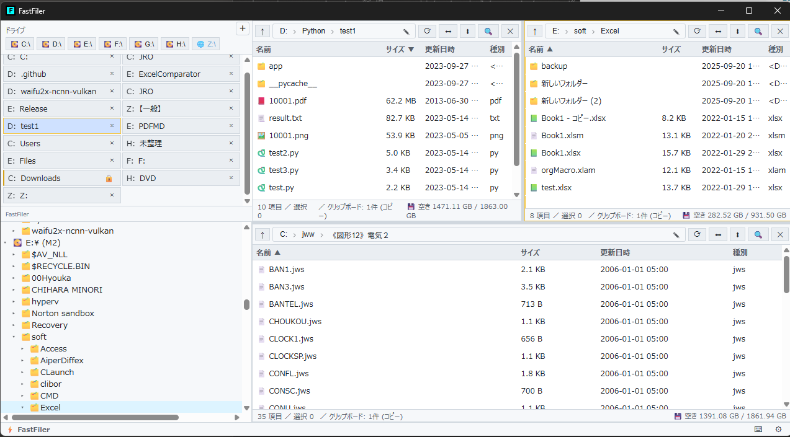

# FastFiler

縦タブ（列数指定可）+ 任意分割ペイン + ペイン連動を備えた **Windows 向け高速ファイラ**。
Tauri 2 + Solid.js + Rust。アニメーションは全面廃止。

Windowsのエクスプローラが遅くて仕方なかったから、とりあえずAIに作ってもらった次第。
As/Rさんのエクスプローラつかってたけど、バチバチ高速化と、フォルダペイン分割がみつけられなかったのと。
AIの進化によって、できた次第。




- 詳細設計: [`doc/plan.md`](./doc/plan.md)
- **使い方ガイド**: [`doc/USAGE.md`](./doc/USAGE.md)（操作・ホットキー・連動・プラグイン等を網羅）
- **ビルド & インストール**: [`doc/BUILD.md`](./doc/BUILD.md)（必要環境・開発起動・リリース手順）

## ディレクトリ構成

```
E:\temp\Files\
├ doc\plan.md             # 全体計画
├ doc\USAGE.md            # 使い方ガイド
├ doc\plugins-sample\     # サンプルプラグイン
├ mock\                   # 旧 UI モック（参照用）
├ src\                    # フロントエンド (Solid + TS)
│  ├ App.tsx, main.tsx, store.ts, fs.ts, types.ts, plugin-host.ts
│  └ components\          # VerticalTabs / PaneTree / FileList / SettingsDialog /
│                         # ContextMenu / Thumbnail / PreviewPane / SearchPanel /
│                         # PluginPanel / ToastContainer / WorkspaceTreePanel
└ src-tauri\              # Rust バックエンド
   ├ Cargo.toml, tauri.conf.json, build.rs
   ├ capabilities\default.json
   └ src\
      ├ main.rs, lib.rs, error.rs
      ├ fs_service.rs    # 列挙 / stat / drives
      ├ file_ops.rs      # copy/move/rename/delete + ゴミ箱 (IFileOperation)
      ├ watcher.rs       # notify ベース監視
      ├ shell.rs         # ShellExecute / Reveal / プロパティ
      ├ thumbnail.rs     # IShellItemImageFactory + LRU + キャッシュ
      ├ preview.rs       # テキスト/バイナリプレビュー
      ├ search.rs        # ignore + ストリーミング配信
      └ plugin.rs        # manifest 読込 + capability ブリッジ
```

## 計画と実装状況

| Phase | 内容 | 状態 |
|---|---|---|
| 0 | Tauri 2 + Solid + TS scaffold | ✅ 完了 |
| 1 | FsService（列挙/監視/基本操作）+ ドライブ列挙 | ✅ |
| 2-a | 縦タブ列数指定 | ✅ |
| 2-b | ペイン任意分割 | ✅ |
| 2-c | LinkBus 連動（path/selection/scroll/sort） | ✅ |
| 3 | ファイル操作 / ゴミ箱 / 右クリック / D&D / Reveal / プロパティ | ✅ |
| 4 | サムネイル / プレビュー | ✅ |
| 5 | 検索 (ignore + ストリーミング) | ✅ |
| 6 | WebView プラグイン基盤 (capability) | ✅ |
| 7 | 設定ダイアログ / ホットキー / README | ✅ |
| v1.1 | Everything HTTP 検索バックエンド | ✅ |
| v1.2 | Ctrl+F フォーカス / タブ循環 / ペイン状態クリア | ✅ |
| v1.3 | タブのマウスドラッグ並べ替え | ✅ |
| v1.4 | ワークスペース配置切替 / ツリーパネル / サイドバー幅ドラッグ | ✅ |
| v1.5 | テーマ切替 (system/light/dark) / ペイン名 / ドライブ一覧 | ✅ |
| v1.6 | 単一インスタンス起動 / Ctrl+F フォーカス制御修正 | ✅ |
| v1.7 | プラグインパネル幅ドラッグ準備 / バグ修正 | ✅ |
| v2.0 | プラグイン強化 (capability 追加 / SDK / コンテキストメニュー / トースト / KV ストレージ / パネル幅可変) | ✅ |
| v2.1 | フォーカスペイン追従ツリー / 自動スクロール / pane-focused 表示 | ✅ |
| v2.2 | ネットワークドライブ対応 (種別アイコン / UNC ツールチップ / `\\server\share` 直接アクセス / breadcrumbs と祖先展開の UNC 化) | ✅ |
| v3.0 | ドック式ペイン配置 (タブ/ツリーを 左/右/上/下/非表示 に独立ドック / 同位置スタック設定) | ✅ |
| 将来 | USN ジャーナル / コード署名 / フロート (マルチウィンドウ) | ⬜ |
| v4.0 | ネイティブ IContextMenu (Shift+右クリック) / OLE D&D 受信 / Alt+Drag drag-out | ✅ |
| v4.1 | エクスプローラ→ペインのフォルダ行 D&D (行レベルターゲット / ホバーハイライト) / OLE ドロップ完成 (Undo・通知・リフレッシュ対応) | ✅ |
| v4.2 | FastFiler→エクスプローラへのクリップボード連携 (Ctrl+C/X で CF_HDROP 書き込み→エクスプローラで Ctrl+V 可) / 通知エリア統合 (ジョブ進捗・トーストの重なり解消) | ✅ |
| v1.8 | D&D サブシステム再構成 (`src/dnd/` 機能分割 / pointer 自前エンジンによる内部 D&D / ドライブ判定で move↔copy 自動切替 / `Ctrl` 強制コピー / `Shift` で OS ドラッグアウト) / 非表示落ち UI (ペイン名 / 連動 / 右下トースト / ツリー切替ボタン) のコード本削除 | ✅ |

## モック

旧 UI モックは `mock/` 内に残しています。`cd mock; npm run dev` でブラウザ単体で起動可能です。
